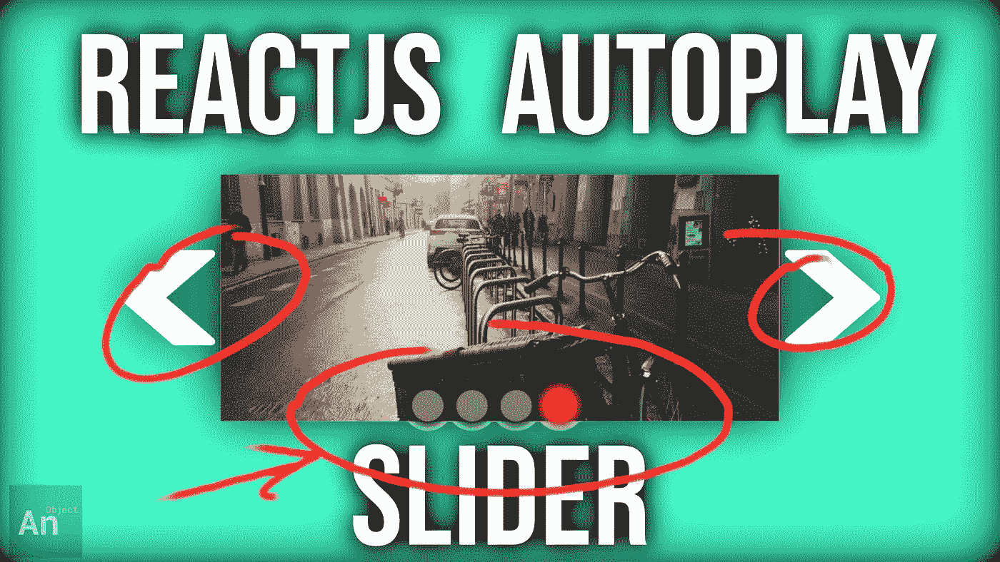
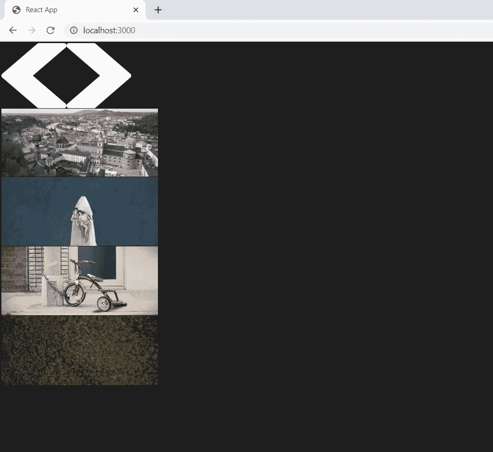
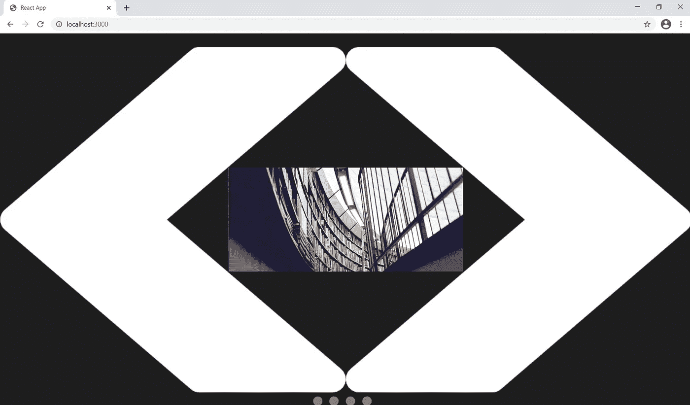
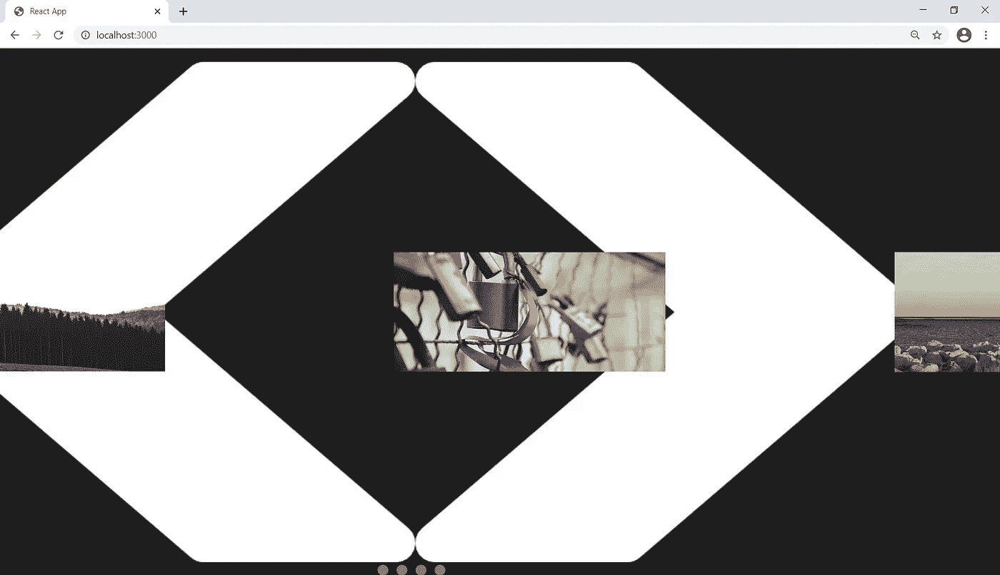
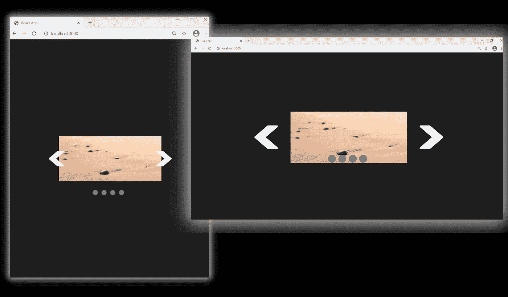
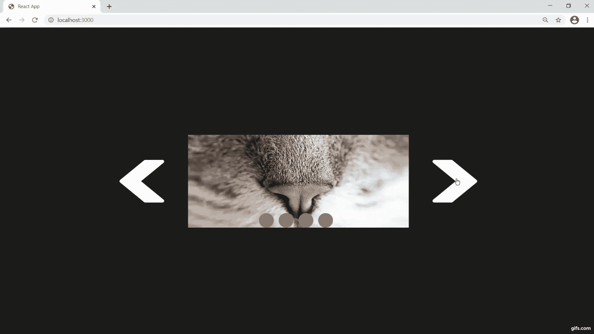
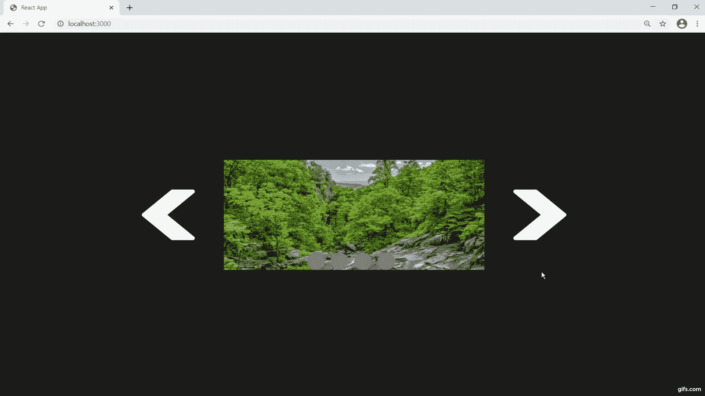
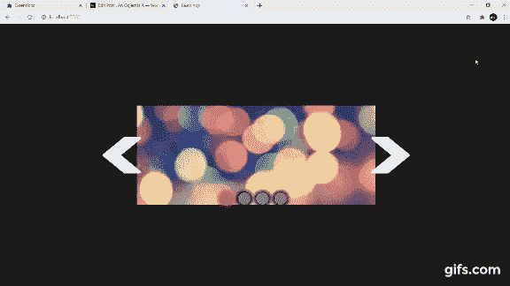

# 在 React 中创建图像幻灯片

> 原文：<https://javascript.plainenglish.io/create-a-react-js-slideshow-1b2f5bfb0ee6?source=collection_archive---------5----------------------->

## 响应式、自动播放、手动导航按钮

我们将构建一个具有自动播放功能和手动导航按钮的 React 图像滑块。我们不会使用任何外部库；所有原生 JSX，CSS，JavaScript。



# 我们将从把所有的元素放在屏幕上开始。

我们需要两个组件: **Deck.js** 和 **Card.js**

**我们有 6 个元素需要处理:**

*   在**deck . js**1。一个 **img** ，我们将使用它作为向右移动(IMG)
    2 的按钮。一个 **img** ，我们将使用它作为向左移动(IMG)
    3 的按钮。一个**观察口** (DIV)
    4。一个**图片容器** (DIV)
    5。一个 **DIV** 来装我们的**单选**按钮(DIV)
*   在 **Card.js** 中
    6。一个“**卡**”，我们将使用它来保存图像(DIV)
    7。实际**形象** (IMG)



## 现在我们需要在屏幕上居中显示所有内容。

我们将使用**绝对位置**和**变换**的组合。



## 现在一切都居中了，我们需要从左到右排列卡片。

我们编写了一个简单的函数来确定我们的卡片组中的**中间的卡片**，并将中间左边的卡片移到左边，将中间右边的卡片移到右边。

```
order_cards = () => {
  let counter_for_right = 1,
      counter_for_left = this.middle_card_by_index; for (let i = 0; i < this.images.children.length; i++) {
    this.images.children[i].style.transitionDuration = '0.0s'; if (i < this.middle_card_by_index) {
      this.images.children[i].style.left = `-${(counter_for_left * 
                        this.new_width) - (this.new_width / 2)}px`;
      counter_for_left--;
    } else if (i > this.middle_card_by_index) {
      this.images.children[i].style.left = `${(counter_for_right * 
                       this.new_width) + (this.new_width / 2)}px`;
      counter_for_right++;
    } else {
      this.images.children[i].style.left = `${this.new_width / 
                                                             2}px`;
    }
  }
}
```



# 让我们讨论响应。

为了让我们的传送带响应，我们需要根据**百分比**而不是硬像素单位来调整**视口**的大小。

所以我们将只选择 **50%** 并根据用户浏览器窗口的宽度计算一个硬**像素**计数；然后我们将在**调整窗口事件监听器**中运行这段代码。

```
window.addEventListener(‘resize’, () => {
 img_width_as_percentage = 50;
 // img_width_as_percentage = window.innerWidth < 768 ? 100 : img_width_as_percentage;this.new_width =
 /Android|webOS|iPhone|iPad|iPod|BlackBerry|IEMobile|Opera Mini/i.test(navigator.userAgent) ?
 (img_width_as_percentage / 100) * window.screen.width :
 (img_width_as_percentage / 100) * window.innerWidth;this.view_port.style.width = `${this.new_width}px`;this.order_cards();
});
```

**我们还根据视窗和窗口宽度调整了左&右按钮和“单选”按钮的大小。**

## 现在我们有了调整大小的代码，每次我们调整浏览器窗口的大小时，我们的旋转木马也会调整大小。



# 我们手头有 3 个大任务

1.  按钮导航
2.  **无线电**导航
3.  自动播放功能

## 所有导航的基础是这段代码:

```
for (let i = 0; i < this.images.children.length; i++) {
  this.images.children[i].style.transitionDuration = ‘0.0s’; const updated_position = this.last_positions[i] + /* some difference */; this.images.children[i].style.left = `${updated_position}px`;
  this.last_positions[i] = updated_position;
}
```

## 它是这样说的:

获取所有图像的当前位置…

> 它们在 X 轴的什么位置？

…添加一些**差异**，这将使它们移动到新的位置。

我们有一个 **last_positions** 数组来跟踪我们的图像在屏幕上的位置。

# 让我们编写按钮导航的代码

很简单。

我们将图像向左或向右移动**一整张卡宽**。
这就使得我们的**差**简单的等于一张牌的宽度。

```
this.images.children[i].style.transitionDuration = ‘0.0s’;const updated_position = this.last_positions[i] + this.new_width;this.images.children[i].style.left = `${updated_position}px`;
this.last_positions[i] = updated_position;
```



# 让我们给无线电导航编码

很简单。

我们计算用户点击了哪个"**单选按钮**。

做一点计算来决定向左或向右移动多少像素。
那就是我们的**区别**。

```
let new_card = null;for (let i = 0; i < this.images.children.length; i++) {
  if (event.target === this.selection_buttons_container.children[i]) 
    new_card = i;
}for (let i = 0; i < this.images.children.length; i++) {
  const updated_position = this.last_positions[i] + 
            ((this.current_card — new_card) * this.new_width); this.images.children[i].style.transitionDuration = ‘0.0s’;
  this.images.children[i].style.left = `${updated_position}px`;
  this.last_positions[i] = updated_position;
}
```



# 让我们来处理自动播放

## 逻辑很简单。

只需将我们的 **next** 按钮导航逻辑放在一个 **setInterval()** 函数中。

```
this.autoplay_timeout_id = setTimeout(() => {
  this.autoplay_interval_id = setInterval(() => {
    for (let i = 0; i < this.images.children.length; i++) {
      this.images.children[i].style.transitionDuration = ‘0.0s’; const updated_position = this.last_positions[i] — 
                                                  this.new_width; this.images.children[i].style.left = `${updated_position}px`;
      this.last_positions[i] = updated_position;
    } this.current_card = (this.current_card ===    
           this.number_of_cards_by_index) ? 0 : ++this.current_card;
  }, 1100);
}, 1200);
```



# 这个项目有更多的细微差别

你可以在这里得到源文件[，你也可以跟随下面的视频教程。](https://github.com/an-object-is-a/reactjs-autoplay-slideshow)

如果你想要更深入的指导，请查看我在 YouTube 上的完整视频教程， [**一个对象是一个**](https://www.youtube.com/c/anobjectisa) 。

一定要在 [**Instagram**](https://www.instagram.com/an_object_is_a/) 和 [**Twitter**](https://twitter.com/anobjectisa1) 上关注我们，跟上我们最新的 **Web 开发教程**。

一定要在 [**Instagram**](https://www.instagram.com/an_object_is_a/) 和 [**Twitter**](https://twitter.com/anobjectisa1) 上关注我们，及时了解我们最新的 **Web 开发教程**。