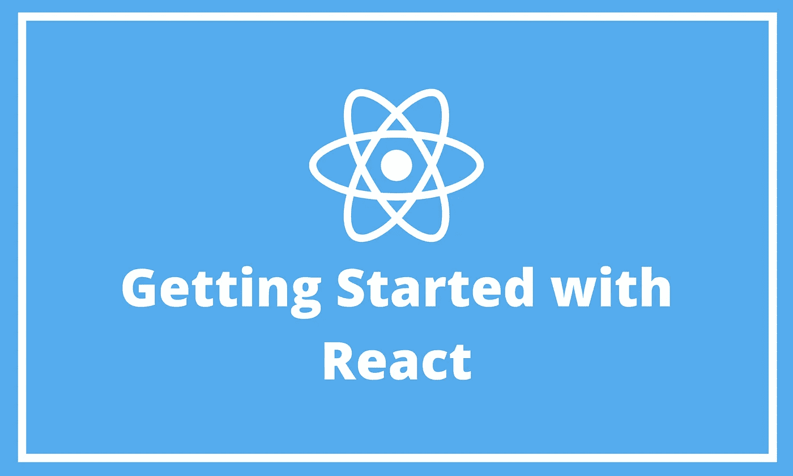

# 从头开始创建 React 项目

> 原文：<https://javascript.plainenglish.io/create-a-react-project-from-scratch-d7e6927944aa?source=collection_archive---------15----------------------->

## React 入门



React 是构建 Web 应用程序最流行的 JavaScript 前端框架之一。脸书在 2013 年对其进行了开源，一个大型开发者社区兴奋地迎接了它。

在开始使用 react 之前，您已经熟悉了 web 开发的基础知识:HTML、CSS 和 JavaScript。HTML 和 CSS 通常用于放置设计和创建页面。JavaScript 正在编写我们在 react 中使用的库的脚本。

# 环境设置

在开始使用 react 之前，首先需要确保设置是可用的。需要确保您安装了 Node.js，您可以通过执行以下命令来检查最新版本:

```
$ node -version
```

如果没有，可以从[https://nodejs.org/](https://nodejs.org/)下载 Node.js，要安装 React 开发的代码编辑器。所以你可以从 https://code.visualstudio.com 的 T2 下载 Visual Studio 代码。

# 创建 React 项目

建立新 React 项目的最简单方法之一是使用 create-react-app 脚本。您可以使用 *npx* 命令来执行这个脚本。

```
$ npx create-react-app test
```


通过键入以下内容进入新创建的项目文件夹:

```
$ cd test
```

从项目文件夹中，通过以下方式启动 Visual Studio 代码:

```
$ code
```

# 探索初始项目结构

这是 Visual Studio 代码中的一个新项目文件夹。


所有的项目依赖关系都存储在这个文件夹中

**public:** 该文件夹包含 web 应用程序的静态资产

src: 这是包含 React 应用程序的 JavaScript 实现的文件夹

# 运行开发 Web 服务器

运行开发 web 服务器是通过以下方式执行启动脚本来完成的:

```
$ npm start
```

这将为您提供以下输出:


浏览器会自动打开，URL[http://localhost:3000](http://localhost:3000)打开。


# 运行测试

初始的 react 项目默认在 src/App.test.js 中包含一些基本的单元测试用例。这些测试可以使用以下方法来执行:

```
$ npm run test
```


# 为生产构建应用程序

构建生产就绪的应用程序。这表明 react 应用程序已经构建好了，并且结果已经放在项目的 build 文件夹中。以下命令用于执行生产构建:

```
$ npm run build
```


就是这样；您已经成功创建了一个新的 React 项目。我将在接下来的文章中讨论更多关于 React 的内容。

感谢您的阅读！

*更多内容请看*[*plain English . io*](http://plainenglish.io/)