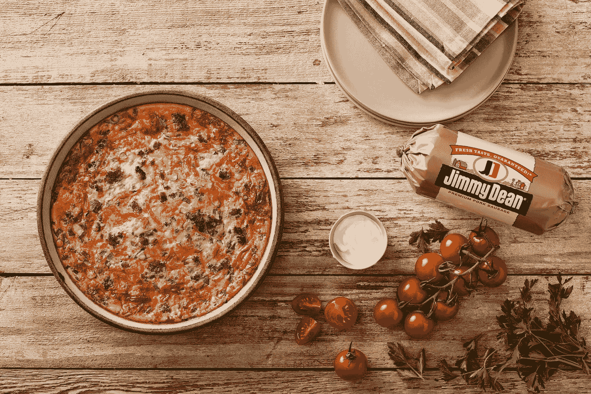

# 用 Vue 3 和 JavaScript 创建一个食谱应用程序

> 原文：<https://javascript.plainenglish.io/create-a-recipe-app-with-vue-3-and-javascript-867e5c6e00ed?source=collection_archive---------24----------------------->



Photo by [Jimmy Dean](https://unsplash.com/@jimmydean?utm_source=medium&utm_medium=referral) on [Unsplash](https://unsplash.com?utm_source=medium&utm_medium=referral)

Vue 3 是易于使用的 Vue JavaScript 框架的最新版本，让我们可以创建前端应用程序。

在本文中，我们将看看如何用 Vue 3 和 JavaScript 创建一个食谱应用程序。

# 创建项目

我们可以用 Vue CLI 创建 Vue 项目。

要安装它，我们运行:

```
npm install -g @vue/cli
```

与 NPM 或:

```
yarn global add @vue/cli
```

用纱线。

然后我们运行:

```
vue create recipe-app
```

并选择所有默认选项来创建项目。

我们还需要`uuid`包来为我们的待办事项生成唯一的 id。

为此，我们运行:

```
npm i uuid
```

# 创建食谱应用程序

为了创建食谱应用程序，我们编写:

```
<template>
  <form @submit.prevent="addRecipe">
    <div>
      <label>name</label>
      <input v-model="recipe.name" />
    </div>
    <div>
      <label>ingredients</label>
      <textarea v-model="recipe.ingredients"></textarea>
    </div>
    <div>
      <label>steps</label>
      <textarea v-model="recipe.steps"></textarea>
    </div>
    <button type="submit">add recipe</button>
  </form>
  <div v-for="(r, index) of recipes" :key="r.id">
    <h1>{{ r.name }}</h1>
    <h2>ingredients</h2>
    <div class="content">{{ r.ingredients }}</div>
    <h2>steps</h2>
    <div class="content">{{ r.steps }}</div>
    <button type="button" @click="deleteRecipe(index)">delete</button>
  </div>
</template><script>
import { v4 as uuidv4 } from "uuid";
export default {
  name: "App",
  data() {
    return {
      recipe: {
        name: "",
        ingredients: "",
        steps: "",
      },
      recipes: [],
    };
  },
  computed: {
    formValid() {
      const { name, ingredients, steps } = this.recipe;
      return name && ingredients && steps;
    },
  },
  methods: {
    addRecipe() {
      if (!this.formValid) {
        return;
      }
      this.recipes.push({
        id: uuidv4(),
        ...this.recipe,
      });
    },
    deleteRecipe(index) {
      this.recipes.splice(index, 1);
    },
  },
};
</script><style scoped>
.content {
  white-space: pre-wrap;
}
</style>
```

在模板中，我们有一个包含名称、成分和步骤字段的表单。

我们用`v-model`将输入到 input 或 textarea 中的值绑定到反应属性。

`@submit`指令让我们在点击 add recipe 按钮时提交表单。

`prevent`让我们在客户端而不是服务器端提交表单。

在那下面，我们有 div 来呈现添加了`v-for`的食谱。

我们必须将`key`道具设置为唯一的 ID，这样 Vue 3 就可以识别渲染的项目。

在 div 内部，我们显示添加的内容，以及一个按钮，当我们单击它来删除一个条目时，这个按钮会调用`deleteRecipe`。

在脚本标签中，我们有`data`方法，它返回我们使用的反应属性。

`formValid` reactive 属性检查每个字段是否都已填写。

`addRecipe`方法检查`formValid`的 reactive 属性，查看表单是否有效。

如果要向`recipes`数组添加一个条目，我们就调用`push`。

`uuidv4`函数为条目生成一个唯一的 ID。

`deleteRecipe`方法调用`splice`来删除具有给定索引的条目。

在 style 标签中，我们应用了`white-space: pre-wrap;`来保留给定类的 div 中的空白。

# 结论

我们可以使用 Vue 3 和 JavaScript 轻松创建一个食谱应用程序。

喜欢这篇文章吗？如果有，通过 [**订阅我们的 YouTube 频道**](https://www.youtube.com/channel/UCtipWUghju290NWcn8jhyAw?sub_confirmation=true) **获取更多类似内容！**

*更多内容请看*[***plain English . io***](https://plainenglish.io/)