# 使用 Express、PostgreSQL、TypeOrm 和 TypeScript 创建 Rest API

> 原文：<https://javascript.plainenglish.io/create-a-rest-api-with-express-postgresql-typeorm-and-typescript-ac42a20b66c7?source=collection_archive---------0----------------------->

## 如何使用 Express framework、PostgreSQL 和用 TypeScript 编码创建一个简单的 Rest API

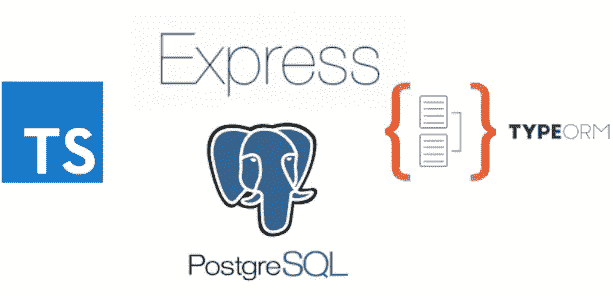

Create a Rest API with Express, PostgreSQL, TypeOrm, and TypeScript.

# 先决条件

请确保您的操作系统和 [docker](https://www.docker.com/get-started) 上安装了 [Node.js](https://nodejs.org/) ( > = 10.13.0)。

# 初始化项目

我们需要创建我们的项目，首先创建博客目录。

```
mkdir blog
```

稍后，转到博客目录并初始化项目。

```
cd blognpm init
```

最后一个命令将创建一个 **package.json** 文件，其目的是处理我们项目中安装的所有依赖项的历史。

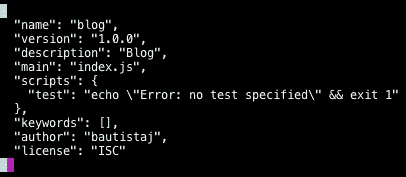

package.json

# 安装依赖项

对于我们的 API Rest，我们需要下一个依赖项，express，pg，TypeOrm，typescript。

安装依赖项开发依赖项。

```
npm install typescript @types/express @types/node --save-dev
```

我们将只使用最后的依赖来开发我们的 API。

现在，安装我们将在生产环境中使用的依赖项。

```
npm install express pg typeorm
```

[**express**](https://www.npmjs.com/package/express) :这是一个 NodeJS 的 web 应用框架。

[**pg**](https://www.npmjs.com/package/pg):**它是 NodeJS 模块的集合，用于与您的 PostgreSQL 数据库接口。**

**[**Typescript**](https://www.npmjs.com/package/typescript) :这是一种面向应用级 JavaScript 的语言，这个模块帮助我们为 JavaScript 添加可选类型，支持面向任何浏览器的大型 JavaScript 应用的工具。**

**[**typeorm**](https://www.npmjs.com/package/typeorm) :这是一个运行在 Node JS 中的 orm，可以使用 TypeScript 和 JavaScript (ES5，ES6，ES7，ES8)。**

**这些包帮助我们定义 express 和 NodeJS 的类型。**

**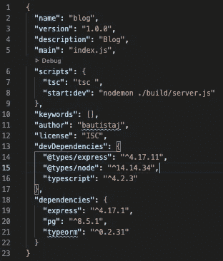**

**packahe.json file with our dependencies.**

# **配置 TypeScript**

**首先，我们需要在 **package.json** 文件中添加一个命令来执行 **typescript** 模块的命令。在脚本部分添加下一行。**

```
“tsc”: “tsc “
```

**现在，我们将在项目中配置 TypeScript，执行以下命令:**

```
npm run tsc -- --init
```

**最后一个命令生成 **tsctsconfig.json** ，这个文件表明我们将要使用 TypeScript。该文件包含 TypeScript 转换的工作设置。**

**在该文件中，我们添加了下面几行，这些行帮助我们配置构建目录和根目录。**

```
“outDir”: “./build”, 
“rootDirs”: [“./src”],
```

****rootDirs** :此配置列表组合代表项目。**

****outDir** :这一行重定向编译文件的输出。**

# **配置我们的服务器**

**我们将创建 **src** 目录和 **server.ts** 文件。**

```
mkdir src
cd src
touch server.ts 
```

**一旦创建了我们的 sever.ts 文件，我们将创建一个名为 Server 的类以及构造函数、配置、路由和启动方法。**

**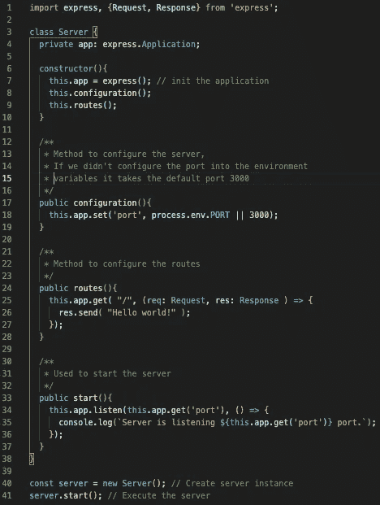**

**Basic server configuration.**

**一旦创建了类和方法，执行下面的命令将我们的类型脚本代码转换成 JavaScript。**

```
npm run tsc
```

**记住 **tsctsconfig.json** 配置，JavaScript 文件将生成到构建目录中。**

**现在，用下一个命令启动服务器。**

```
node ./build/server.js
```

**之后。尝试进入下一个链接 [http://localhost:3000/](http://localhost:3000/) 。**

## **创建控制器**

**在这个 API 示例中，我们将使用控制器来处理路由，我们需要创建控制器目录和 post.controller.ts 文件。**

**在这个控制器中，我们将处理 CRUD 的方法。**

**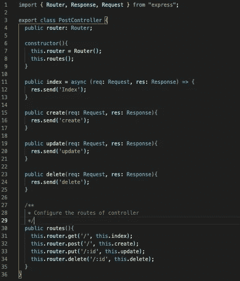**

**Example of controller file.**

**现在，在我们的类服务器中，我们需要导入控制器并配置新的路由。**

**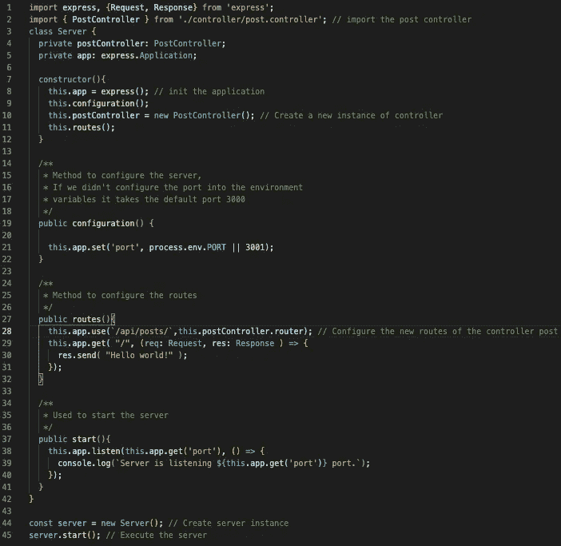**

**Server with the post controller configuration.**

**接下来，执行下面的命令:**

```
npm run tsc
node ./build/server.js
```

**并尝试访问 post 控制器的新路由。[http://localhost:3001/API/posts](http://localhost:3001/api/posts)**

**如果你想证明 post 控制器的所有方法，使用 [postman](https://www.postman.com/) 。**

## **创建服务**

**在某些情况下，我们需要从不同的地方获取数据，因此数据库或另一个 API，为此，我们需要在一个独占文件中处理这个操作。在本练习中，我们将使用服务来处理这些任务。**

**创建名为 services 的新目录和文件 post.service.ts。**

**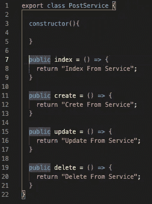**

**Example of post-service file.**

**将新服务导入控制器文件并执行每个方法。**

**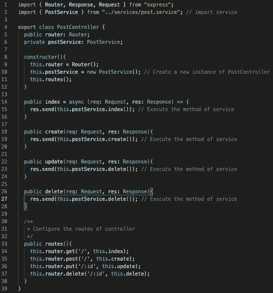**

**Now, in the controller, we execute the method from service.**

**现在执行命令来解释我们的代码并启动服务器。**

```
npm run tsc
node ./build/server.js
```

**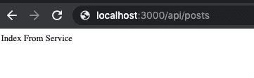**

**Now you get the message from the post-service.**

**在下一节中，我们将配置数据库并执行一些查询。**

# **创建数据库**

**在本练习中，我们将使用 docker 容器，您可以在[文档](https://docs.docker.com/get-docker/)中获得一些关于如何安装 Docker 的信息。**

**安装 Docker 后，运行下一个命令:**

```
docker run -d -p 5433:5432 — name blog -e POSTGRES_USER=blog -e POSTGRES_PASSWORD=blog — mount src=db-blog,dst=/var/lib/postgresql/data postgres
```

**标志-d 表示容器将在后台以分离模式执行。**

**标志-p 5433:5432 指定容器将配置端口 5432，我们可以从 localhost 用 5444 访问它。**

**— name **blog** 指定我们的容器的名称。**

**在-e POSTGRES_PASSWORD=password 行中，我们指定了一个环境变量 POSTGRES_PASSWORD。**

**您可以使用 [PgAdmin](https://www.pgadmin.org/) 来验证容器是否正确启动。**

**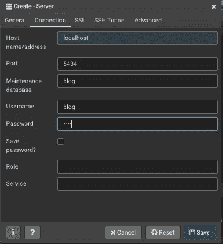**

**Start session in our database.**

# **配置数据库连接**

**在本节中，我们将使用 [typeorm](https://typeorm.io/#/) 来配置与 API 的数据库连接。**

## **创建连接**

**在服务器文件中，我们从 TypeOrm 导入 createConnection 函数，在本节中我们使用异步函数，所以如果你想了解更多关于这个主题的信息，请访问[文档](https://developer.mozilla.org/es/docs/Web/JavaScript/Reference/Statements/async_function)。**

**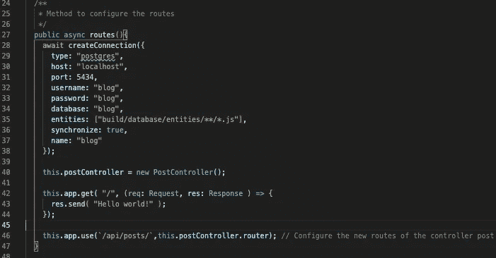**

**Database configuration.**

**最后一张图显示了如何创建一个新的连接，它需要数据库的类型，端口，主机，用户名，密码，数据库名称。方法 **createConnection** 是从 TypeOrm 模块导入的。**

**我们的方法数据库配置将执行到 routes 方法中，并等待连接完成。在开始路由配置之前，连接是很重要的。**

**如果你想了解更多关于创建连接的不同方法，请访问 typeorm 的文档。**

## **创建实体**

**好了，我们有了数据库连接，所以下一步是配置应用程序的实体。根据 TypeOrm 的文档，实体是一个映射到数据库表的类，您可以使用 annotation @Entity()定义一个实体。**

**如果你记得，在数据库的配置中我们有这些行实体**:[" build/database/entities/* */*。js"]** ，所以我们需要创建目录 **src/database/entities** ，，这个目录将包含我们的实体。**

**创建一个名为 PostEntity 的类，在这个类中，我们定义了我们的表格帖子。**

**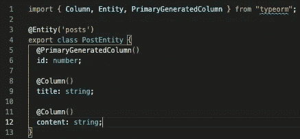**

**Post entity example.**

**@PrimaryGeneratedColumn()生成一个主列，其值将自动生成，而@Column()定义我们数据库中的一列。**

## **创建自定义存储库**

**我们需要做的所有操作都将在存储库文件中完成，在该文件中，我们连接到一个特定的表并执行一些操作，如更新、创建、删除和其他 DML 操作。**

**创建 **src/repository** 目录和一个名为 post.repository.ts 的文件，并创建类 PostRepository，如下所示。**

**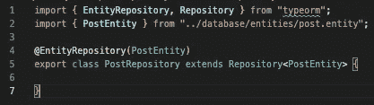**

**Example of a repository with TypeOrm.**

**PostRepository 类从 Repository 类扩展而来，这个类让我们可以处理我们的实体对象。查找实体、插入、更新、删除等，而@EntityRepository()用于将一个类声明为自定义存储库。**

# **将服务与存储库集成**

**现在我们有了完成 API 所必需的一切，我们有了控制器、服务和存储库，在这一部分我们集成了所有的组件。**

**首先，我们将把 PostRepository 导入到类 PostService 中，并用 TypeOrm 模块中的一些命令初始化这个存储库。我们将使用的方法是 getConnection()这个方法帮助我们获得一个特定的连接，例如，我们的连接被称为 **blog** 和 getCustomRepository()获得自定义存储库，例如 **PostRepository** ，一旦初始化服务，我们就可以执行一些方法，例如，find()，这个方法将所有注册检索到表 posts 中。**

**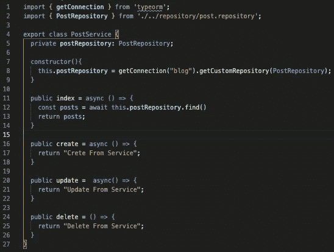**

**Implementation of PostRepository.**

**现在翻译代码并启动服务器。**

```
npm run tsc
node ./build/server.js
```

**在 posts 表中插入一些数据，就可以访问下一个 URL[http://localhost:3000/API/posts](http://localhost:3001/api/posts)并获取数据。**

**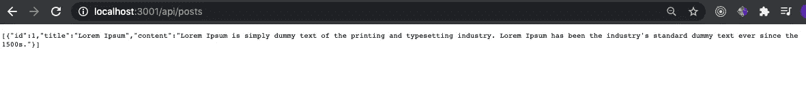**

**Get data from database with our API.**

**现在，我们实现了创建、更新和删除方法，这需要更新控制器和服务。**

**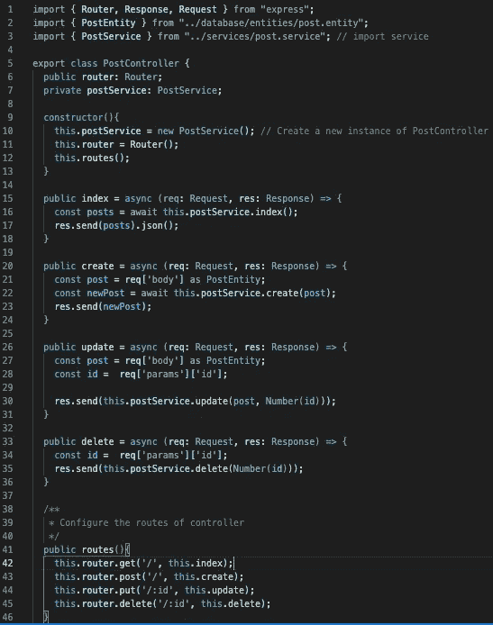**

**Post Controller.**

**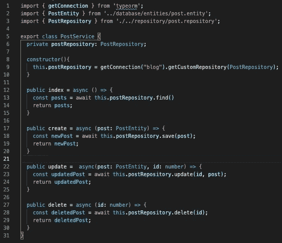**

**Post-service.**

**现在你可以用 Postman 编译测试 API 的代码。**

**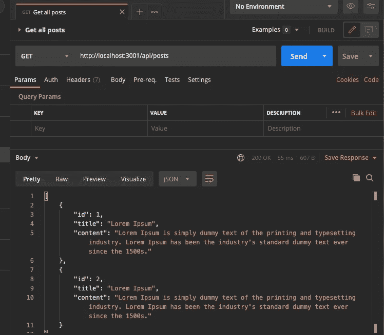**

**Get all posts.**

**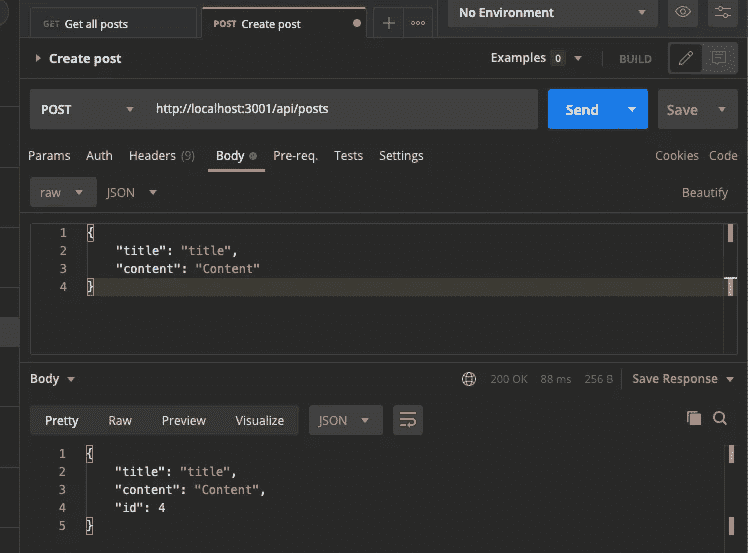**

**Creta a post.**

**至此，我们完成了练习，但是你可以在 [GitHub](https://github.com/bautistaj/expressApi) 上看到完整的代码。**

# **结论**

**让我们来看看我们学到了什么。**

*   **如何用 express 创建单个 Rest API？**
*   **typescript 的配置。**
*   **Typeform 的配置。**
*   **如何配置控制器、服务和存储库。**
*   **如何配置 PostgreSQL Docker 容器？**

**首先感谢阅读，希望这个小教程能帮到你。**

**最亲切的问候。**