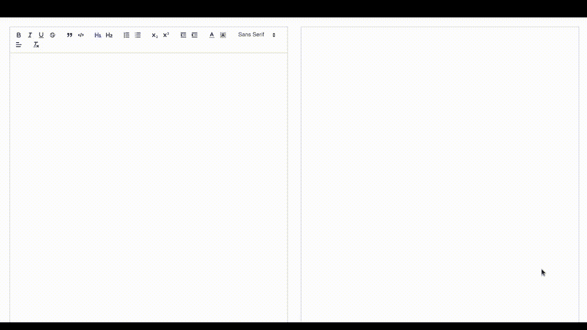
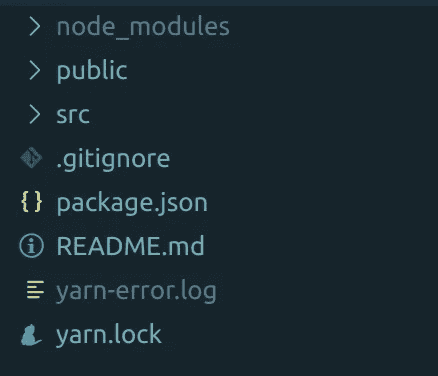
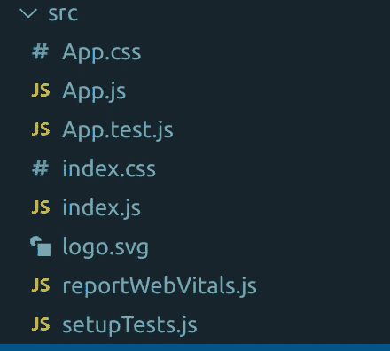
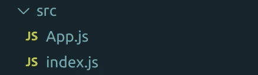
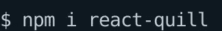
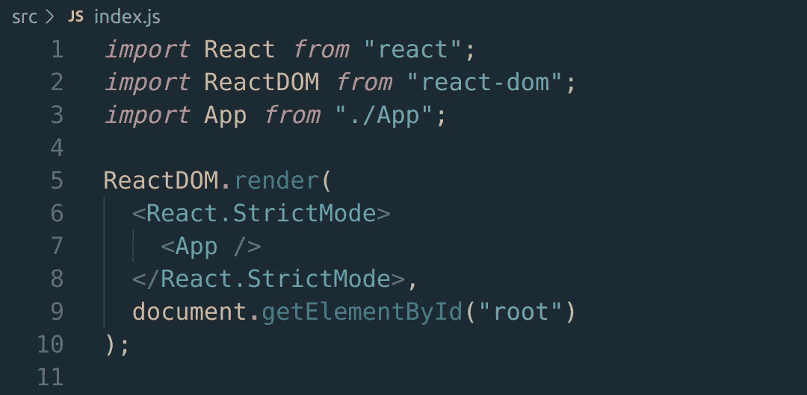
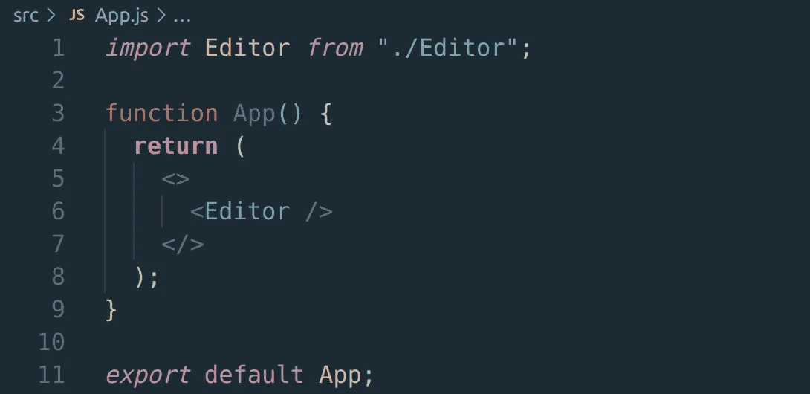

# 使用 React 创建富文本编辑器

> 原文：<https://javascript.plainenglish.io/create-a-rich-text-editor-with-react-d41e38d43dc6?source=collection_archive---------5----------------------->

在本文中，我们将使用 React 和 Quill 创建一个富文本编辑器。我们的文本编辑器将能够添加不同的标题，为文本提供不同的颜色，添加下标和上标，缩进或取消缩进文本，等等。要阅读本文，您需要对 React 有一个基本的了解。

这是我们的应用程序的外观:

那么，我们开始吧。

让我们跳过终端，编写以下命令:

这应该使我们的文件结构类似于这样:

在这之后，让我们删除一些在 *src* 目录中的文件。目前，我们的文件结构可能如下所示:

下面删除 **App.css** 、 **App.test.js** 、 **index.css** 、 **logo.svg** 、 **reportWebVitals.js** 和 **setupTests.js** 。这应该使我们的 *src* 目录的文件结构看起来像这样:

现在让我们安装我们需要的软件包。为此，让我们跳过终端，编写以下命令:

现在我们已经安装了 react-quill，让我们打开 **index.js** 文件。我们的 **index.js** 文件应该是这样的:

这里没什么特别的。我们刚刚从这个文件中删除了几行代码。这只是基本的反应。现在让我们打开名为 **App.js** 的文件。我们的 **App.js** 文件应该是这样的:

如您所见，我们已经在第 1 行从 **Editor.js** 文件导入了`Editor`。然后我们在第 6 行的`App`函数中渲染它。然后，我们出口了`App`。现在让我们在 *src* 目录下创建一个名为 **Editor.js** 的文件，并在该文件中写入以下代码行:

在第 23 行，我们定义了函数`Editor`。从第 31 行到第 48 行，我们渲染了两个`ReactQuill`组件，它们是我们在第 2 行导入的。我们的第一个`ReactQuill`组件充当编辑器，而第二个`ReactQuill`组件充当预览。让我们首先讨论第二个`ReactQuill`组件(第 42 到 47 行)。我们已经在`ReactQuill`组件中设置了`modules`道具。我们已经在`modules`中将`toolbar`选项设置为`null`。这样，就不会出现工具栏。在第 44 行，我们将`value` prop 设置为`value`，这是我们在第 24 行设置的状态。同样的`value`被`ReactQuill`用来显示在编辑器上输入的内容。在第 45 行，我们已经为组件设置了样式。在第 46 行，我们已经将`readOnly`设置为`true`。通过设置`readOnly`为真，我们使`ReactQuill`组件不可编辑。

从第 33 行到第 40 行，我们已经创建了编辑器。在第 34 行，我们已经将`theme`设置为`"snow"`。为了让`"snow"`主题工作，我们需要为它导入 CSS 文件，我们在第 3 行已经做了。在第 35 行，我们将编辑器的`value`道具设置为`value`。在第 36 行，我们已经将`onChange`设置为`setValue`。在第 38 行，我们已经设置了编辑器的样式。在第 39 行，我们给编辑器添加了一个`ref`，也就是`editorRef`。我们已经在第 25 行设置了`editorRef`。在第 37 行，我们将第 5 行创建的`modules`设置为`modules`常量。`modules`包含`toolbar`选项。我们向`toolbar`数组添加了多个选项。顾名思义，这个`toolbar`数组帮助我们添加工具栏。我们在工具栏中添加了不同的选项。所有这些都是不言自明的。如果你想了解更多关于工具栏选项的信息，你可以看看[文档的这一部分](https://quilljs.com/docs/modules/toolbar/)。

注意，我们已经使用`console.log`在第 27 和 29 行记录了`value`和`editorRef.current.editor.getContents()`。这是因为我只是想向您展示如何在服务器上存储数据。您可以选择`value`或`editorRef.current.editor.getContents()`方法在服务器上存储您的数据。

至此，我们已经创建了一个富文本编辑器。

*更多内容请看*[*plain English . io*](http://plainenglish.io/)