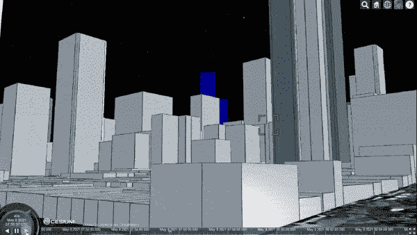

# 用 JavaScript 从头开始创建一个完整的卫星跟踪器

> 原文：<https://javascript.plainenglish.io/create-a-satellite-tracker-completely-in-javascript-9bc1ca61f6aa?source=collection_archive---------8----------------------->


本教程将带你了解如何创建一个 web 应用程序，实时可视化任何卫星的位置，如国际空间站。

我们将从头开始，使用真正的火箭科学家会使用的相同技术！

1.  我们将看看从哪里获得政府发布的关于单个卫星的数据，称为**双线元素集**，或 TLE 的。
2.  我们将使用[卫星-js](https://github.com/shashwatak/satellite-js) 来预测卫星的轨道(这是火箭科学的一部分)。
3.  我们将使用 [CesiumJS](https://github.com/CesiumGS/cesium#readme) 来可视化结果，但是您可以使用任何可以接收经度、纬度和高度的库/引擎。

下面是最终结果的预览。

这是国际空间站的路径，速度加快了 40 倍。要**实时查看其当前位置**，点击时钟轮左上角的时钟图标。

这里有一个[到应用](https://satellite-viewer.glitch.me/)的直接链接。以及毛刺上的[源代码。](https://glitch.com/edit/#!/satellite-viewer)

# 1-获取卫星的双线元素集

双线元素集(TLE)是一种描述绕地球运行的物体运动的数据格式。它是由北美防空司令部(NORAD)创建的。你可以[在这里阅读更多关于它和它的历史。](https://celestrak.com/columns/v04n03/)

给定轨道的描述，我们可以预测它在任何时刻的位置(这是下面的第二步)。

**这意味着大多数“实时”卫星追踪器并不像在地图上追踪送货车那样实时**。那些跟踪太空中物体的人将经常获得最新的 TLE(定期更新),并使用它来预测物体现在的位置，而不是依赖于不断接收位置更新。

我们在哪里得到 TLE 的？没有一个全球性的官方登记册。无论是谁拥有卫星并对其进行监控，都有责任为全球空间社区的利益更新和发布 TLE(除非它是一颗间谍卫星)。

我们可以在[太空跟踪](https://www.space-track.org)上找到这些 TLE，这是一个由美国太空司令部运行的注册表。

另一个来源是 T.S. Kelso 博士维护的 CeleStrak 清单。

我们将使用 CeleStrak，因为它不需要登录。要找到国际空间站的 TLE，点击[空间站](https://celestrak.com/NORAD/elements/stations.txt)链接。

第一个是国际空间站的 TLE:

```
ISS (ZARYA)             
1 25544U 98067A   21122.75616700  .00027980  00000-0  51432-3 0  9994
2 25544  51.6442 207.4449 0002769 310.1189 193.6568 15.48993527281553
```

这些数字的含义在 T.S. Kelso 博士的一栏的表 1 中列出。其中大部分是卫星的标识符和元数据，比如卫星发射的时间。

你可以找到气象卫星、GPS 卫星甚至 SpaceX 的 Starlink 星座的 TLE 格式。

# 2 —预测卫星轨道

既然你已经知道如何获得你感兴趣的物体的 TLE，下一步就是把它转换成一个时间位置。

为此，我们将使用 [satellite-js](https://github.com/shashwatak/satellite-js) 。

包括来自 CDN 的库:

然后把 TLE 传给它，一次:

现在我们有了卫星当前的位置，`new Date()`。

这个位置是模拟卫星运动的特定模型的结果。这个模型叫做 SGP4/SDP4。所有 TLE 都采用这种特定模型。

如果你想知道这个模型的准确性，简短的回答是，[这取决于](https://celestrak.com/columns/v04n05/#FAQ06)。

> *双线元素集的精度取决于许多因素。这些因素包括使用的特定传感器和收集的数据量，以及轨道类型和空间环境条件。不幸的是，由于这些因素因每个元素集而异，所以准确性也不同。虽然 NORAD 已经试验了将预测质量结合到元素集中的方法，但是这些方法中没有一个被证明是成功的。*

# 3 —可视化结果

现在，我们有办法在任何给定时间获取任何卫星的位置。我们可以穿越到未来的时间来制作它的路径动画，这将在下一步中进行。

首先，让我们看看如何使用 CesiumJS 可视化空间中的单个点。

我们从 CDN 加载库:

并创建一个容器元素:

然后我们初始化查看器。这里我们传递一些额外的选项来禁用需要访问令牌的功能:

最后，我们将卫星位置想象成空间中的一个红点:

关于 Glitch 参见 simple.html[该步骤的完整源代码。](https://glitch.com/edit/#!/satellite-viewer?path=simple.html)

# 4-动画显示路径

为了动画化路径，我们只需要在未来采样更多的位置。CesiumJS 有一种内置的方法可以在这些样本之间进行插值。

这个设置有点冗长。[你可以在 Glitch](https://glitch.com/edit/#!/satellite-viewer?path=index.html%3A6%3A82) 上看到完整代码。重要的概念描述如下。

我们创建一个`SampledPositionProperty`。这是一个随时间推移保存位置样本并将在它们之间进行插值的对象:

我们遍历所有想要获取的样本，对于每个样本，我们构造一个时间对象(在 CesiumJS 中称为`JulianDate`)和一个位置，并将其作为样本添加:

最后，我们将这个`positionsOverTime`对象传递给我们。

该点将随着底部时间轴的移动而移动。要将摄像机连接到移动点，我们需要:

# 结论

我希望你喜欢学习一点关于建造卫星追踪器的知识。这个主题还有很多我们没有触及的内容，比如 TLE 中的参数到底是什么意思？它们多久更新一次？它们是如何更新的？

我不知道，但我发现知道这种数据以什么格式发布以及在哪里获得它真的很有力量，而且非常令人惊讶的是，我们可以用 JavaScript 直接在浏览器中完成所有这些工作！

现在我们可以这样做了，这里有几个有趣的想法可以探索:

**可视化多个卫星**，就像整个 Starlink 星座。灵感来自 [Celestrak 的查看器](https://celestrak.com/cesium/orbit-viz.php?tle=/pub/TLE/catalog.txt&satcat=/pub/satcat.txt&referenceFrame=1)，它显示了目录中的每颗卫星。也许想象一下 Starlink 卫星的数量是如何随着时间的推移而增长的？

**或者模拟从街面看上去的样子**。也许添加建筑物/高程数据来找到城市中看卫星的最佳位置？

在 Glitch 源代码的[street-level.html](https://glitch.com/edit/#!/satellite-viewer?path=street-level.html%3A1%3A0)中有一个这样的原型。演示:[https://satellite-viewer.glitch.me/street-level.html](https://satellite-viewer.glitch.me/street-level.html)。



另见[詹姆斯·达皮尼安的“今晚看卫星”](https://james.darpinian.com/satellites/)应用，该应用结合了 CesiumJS 和谷歌街景。

使用合适比例的 3D 模型而不是点也可能很有趣，并且可以真实地感受到卫星在太空中相互之间有多近。

感谢阅读！如果你觉得这很有帮助，请在 Twitter @Omar4ur 上关注我，查看我的更多作品。否则，你也可以在这里找到我。

*更多内容尽在*[*plain English . io*](http://plainenglish.io/)