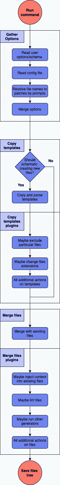

# 使用 Schematics 创建可扩展 CLI

> 原文：<https://javascript.plainenglish.io/create-a-scalable-cli-using-schematics-ad0d07c950cb?source=collection_archive---------9----------------------->

## react Angular CLI 的等价物，用 RxJS 和 Ramda 以函数方式编写

Photo by [Ben Allan](https://medium.com/personal-growth/8-traits-of-emotionally-intelligent-people-5f8ae400e151) on [Unsplash](https://unsplash.com/)

在 Angular 生态系统中，我一直欣赏的一点是它丰富而直观的 CLI。开发人员可以通过一个 shell 命令轻松创建新的组件和模块。这就是我们为 React 应用架构选择 Angular Schematics 的原因。本文将介绍如何以最具伸缩性的方式实现新的 CLI。

Angular Schematics

如果您想通过直观的示例了解 Schematics essentials 的更多信息，以及我们为什么选择编写自己的 CLI，请熟悉本文[。我也鼓励你在继续学习之前，回顾一下关于创建你自己的原理图的文章，比如](https://medium.com/javascript-in-plain-english/increase-velocity-with-angular-schematics-cc276a7849ac)[这个](https://medium.com/rocket-fuel/angular-schematics-simple-schematic-76be2aa72850)。

# 功能

单个**原理图**被认为是角度原理图项目的最小构建模块。该实体负责元素创建，例如

*   成分
*   钩
*   希腊奥委会（Hellenic Olympic Committee)
*   途径

它还生成所有相关的文件(测试、CSS、故事书、类型等。).

为了生成输出文件，原理图执行几个步骤:

*   从文件中读取通用配置
*   从提示或 CLI 参数中读取特定元素的用户输入
*   使用从用户输入和配置中解析的变量复制和处理模板
*   将代码注入现有文件
*   解析文件

如您所见，这里有几个不同的操作。对于更复杂的生成器，比如创建一组负责一个业务领域的组件，示意图就变成了一个非常大的模块。

幸运的是，Angular Schematics 允许使用**[external schematic()](https://github.com/angular/angular-cli/blob/e262c1bae66a86bb6ff8eee0136823e2e7267a44/packages/angular_devkit/schematics/src/rules/schematic.ts#L22)函数以编程方式运行其他生成器。这可能用于委托某些操作，比如将组件重新导出到帮助器原理图。**

# **体系结构**

**申请流程分为 3 个部分:**

*   ****收集选项****
*   ****复制模板****
*   ****合并文件****

**每个阶段都会带来一些挑战，需要采取不同的方法。接下来的段落将描述如何使用嵌入式 Schematics 实用程序和外部库处理特定阶段。**

## **示意流程**

**为了增加原理图的可伸缩性和可读性，使用了函数式编程风格。每个复合动作组成如下:**

*   **`chain()` 方法提供的有角示意图将几个**规则**挤成一个**
*   **由 [RxJS](https://rxjs-dev.firebaseapp.com/guide/overview) 提供的`pipe()`封装异步动作(如附加提示)**
*   **由 [Ramda](https://ramdajs.com/) 提供`pipe()`来包装同步动作(例如使用角度示意图**树**对象方法)**

**规则是在**树**和 **SchematicContext** 对象上执行的同步或异步操作。需要规则来返回一个对象树，不需要其他任何东西。这有助于使用管道作为规则映射到管道上一元函数的输出。**

**基于此，一个**规则**可能是:**

*   **一个 curried 函数，返回一个带有树对象的可观察对象(这个 CLI 中的大多数操作都需要包装在这个风格中)**
*   **一个[嵌入式实用程序](https://github.com/angular/angular-cli/tree/master/packages/angular_devkit/schematics/src/rules)，比如 forEach()，它允许针对树中的特定文件运行函数**

**RxJS 和 Ramda pipe 将返回一个根据应用规则的结果执行的定制函数。**

**我在这里准备了一些示例函数[。下面是整个流程图，包括为我们的动作管道提供输入的规则执行。](https://gist.github.com/radekwarisch/7c2e329673a407752a420714ca0fcb7a)**

****

**Full flow of performed actions**

## **主文件**

**运行 CLI 命令时执行的函数使用函数组合以**声明方式**实现应用流程。**

## **收集选项**

**创建新元素所需的数据在**配置文件**中定义，其中包括模板和文件创建的默认路径，以及来自命令行参数或提示的**用户输入**。**

**负责选项收集的逻辑还提示用户共享附加信息。例如，用于在树中查找匹配结果的文件名，让用户选择他们的目标。这避免了没完没了地输入又长又难记的完整路径。这需要自定义提示实现，因为 Angular Schematic 在运行生成器代码之前只处理 schema.json 文件中定义的用户输入。为此，我们的 CLI 使用 [Inquirer.js](https://github.com/SBoudrias/Inquirer.js) 。**

**因为我们的规则为我们的操作提供输入，所以用 Inquier.js 创建的提示在输入被传递到函数链之前收集并转换输入。这是一种链接任意数量的数据收集和验证步骤的非常精简的方式。**

**当 CLI 代码通过改变共享对象来传递输入时，就创建了一个合适的包装器。**

## **复制模板**

**流水线的这一阶段负责使用 Angular Schematics 函数来加载、解析模板并将模板移动到所需的目录中。然后这些动作被`apply()`包装。 [EJS 模板](https://ejs.co/)用提供的变量处理。然后经过解析的模板被包含在可变输入中。**

**为了允许有条件的文件创建(例如，故事书或测试文件可能被排除)，我们使用 [externalSchematic()](https://github.com/angular/angular-cli/blob/e262c1bae66a86bb6ff8eee0136823e2e7267a44/packages/angular_devkit/schematics/src/rules/schematic.ts#L22) 作为插件实现了文件排除。解析 EJS 扩展时执行了类似的步骤。**

## **合并文件**

**最后一步将创建和解析的模板与当前文件系统合并。这包括定义[合并策略](https://github.com/angular/angular-cli/blob/36a28e52266938d4e87a9065b54ee605d932e835/packages/angular_devkit/schematics/src/tree/interface.ts#L12)。如果你希望用户在覆盖现有文件之前确认，不要使用`MergeStrategy.Overwrite`策略。**

**最后一步，我们使用一个外部生成器来 lint 和美化输出文件。使用外部生成器促进了重用，并保持了职责边界的完整性。**

# **例子**

**我们的原理图 CLI 提供了与[角度 CLI](https://cli.angular.io/) 等效的反应。要求开发人员输入组件(名称、道具等。)，剩下的由生成器代码处理。这有助于确保我们的设计模式和测试需求得到严格遵守。它还减少了样板文件，从而提高了每个团队成员的绩效。**

**React component generation**

**下面是一个生成组件的示例:**

**太神奇了。通过结合功能编程和角度原理图的灵活性，我们能够生成所有的应用功能。我们还可以提高代码的可测试性和重用性，在多个团队中产生全新的自动化工具。**

# **未来**

**代码搭建将成为前端和后端技术的一部分，作为减少错误和提高速度的一种方式。在前端世界中，有许多新兴技术结合了脚手架和人工智能，以创建基于设计或简单草图的应用程序。它们可能标志着网络发展的未来。你可以在这里找到一个有趣的例子。**

# **结论**

**感谢您的阅读。我希望你会觉得这很鼓舞人心。**

**我们将很快发布我们的 CLI，敬请关注！**