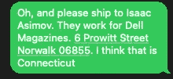
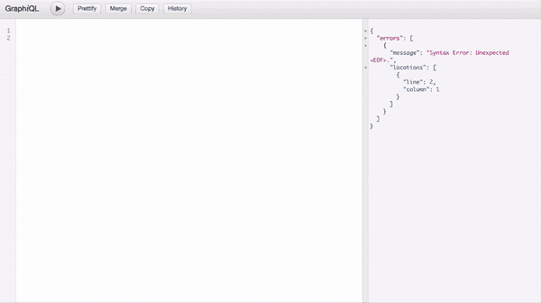
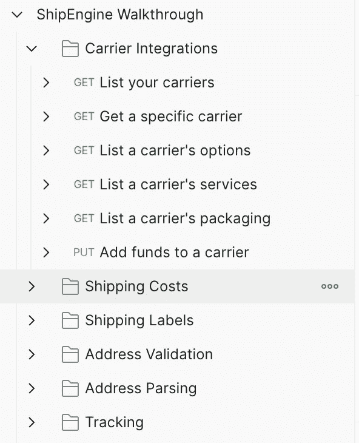

# 使用 ShipEngine API 通过 SMS 创建运输标签

> 原文：<https://javascript.plainenglish.io/create-a-shipping-label-via-sms-837de3f8522e?source=collection_archive---------8----------------------->

Photo by Matt-Ridley via Unsplash

这是我非常喜欢的一个项目的概述，我很高兴分享一些我在这个过程中学到的很酷的东西。

这不像你在我的其他博客文章中可能会发现的那样是一步一步的走，堆栈太大了，每一步都值得更多的关注，而不是我一次阅读就能带来的。相反，我将触及一些亮点和我在构建期间学到的经验教训。

如果你有问题，发现一个错误，或者只是想说声嗨，请在评论中告诉我，我很乐意收到你的来信。

尽情享受吧！

*想自己试试吗？随意在*[*GitHub*](https://github.com/Josh-Gotro/ShipE)*上克隆项目。*

## 它是做什么的？

用例非常简单。用户发送包含一些地址信息的 SMS。该应用程序为该地址创建一个运输标签，并通过短信回复一个链接和一个跟踪号码。

## 堆栈:

*   节点. js
*   表达
*   MongoDB
*   猫鼬

*奖励:*

*   反应/阿波罗

## API:

*   [船舶引擎](https://www.shipengine.com/docs/getting-started/)
*   [普利沃](https://www.plivo.com/docs/sms/api/overview/)

## 工作流程

让我们一步步来看一个成功的工作流程:

首先，用户向与该应用相关联的号码发送短信。 [Plivo 的 webhook](https://www.plivo.com/docs/sms/use-cases/receive-sms/node#api-create-a-express-server-for-incoming-sms) 将其传递到`/sms`端点，在这里`text`和`from-number`被保存到变量中。

我们将`text`发送到 [ShipEngine 的](https://www.shipengine.com/docs/addresses/parse/) `[/recognize](https://www.shipengine.com/docs/addresses/parse/)`自然语言解析器，解析器识别地址并将其格式化为一个漂亮的对象返回。

然后，地址对象被发送到 [ShipEngine 的](https://www.shipengine.com/docs/addresses/validation/) `[/validate](https://www.shipengine.com/docs/addresses/validation/)`，它会填充任何缺失的数据，将其规范化并作为对象返回。这个经过*验证的地址被发送到 MongoDB，MongoDB 返回一个保存到变量中的`Address ID`。

我们还将经过验证的地址发送到 [ShipEngine 的](https://www.shipengine.com/docs/labels/create-a-label/) `[/labels](https://www.shipengine.com/docs/labels/create-a-label/)`以及一些* *硬编码的信息，以创建一个运输标签，该标签作为一个对象返回。来自`label`对象的关键变量和`Address ID`一起被发送到 MongoDB。

最后，从对象中提取标签 pdf URL 和跟踪号，并使用 Plivo SDK 通过 SMS 返回给客户

***维奥拉！***

*/*如果地址未通过验证，将向用户发送回复，让他们知道并分享一些错误细节。*

*/* *送货地址、包裹尺寸/重量详细信息和承运人信息都是硬编码的。*

## 承诺处理

这个应用程序需要连续发出几个 HTTP 请求，每个请求都依赖于前一个请求返回的数据。JavaScript 是同步的，但是在这种情况下，我们需要它是异步的。

输入承诺处理。

我学会了一种处理承诺的模式，这种模式让我更容易理解和使用。

这里我们可以看到两个链接的函数，每个都是一个 HTTP 请求:

`validateAddress`依赖来自`parseAddress`的结果，后者返回下一个函数需要的结果，依此类推…

通过向父函数添加`async`，我们告诉 JavaScript 异步运行这个函数。一旦我们将`await`添加到任何内部函数调用中，它们将在移动到下一行之前完全解析。

多酷啊！

**文本的转换:**

现在我们知道了如何将所有这些请求链接在一起，让我们更仔细地看看 SMS 文本在通过 ShipEngine 的端点时是如何转换的。

我们从一条自然语言短信开始，我们将它分离成一个字符串并保存到一个变量中。我们将它传递给 ShipEngine `/recognize`端点进行解析。

SMS Text sent to ShipEngine’s language parser, `/recognize`.

作为回报，我们收到这个格式化的地址。我们将这个对象保存到一个变量中，并将其发送到 ShipEngine 的`/validate`端点。

Ship Engine returns a nicely formatted object.

作为回报，我们得到两个地址。`original_address`保持输入的地址，尽管有一些修正。例如，如果输入的文本不包含邮政编码，但包含地址的其余部分，那么它会很聪明地为我们添加邮政编码。

为了一致性，`matched_address`对字段进行标准化。例如，“Street”变成了“ST ”,邮政编码更新为完整的九位数字。这减少了错误，使其成为真正的增值。

/validate returns an Original and Matched object for verified addresses.

这也很好，因为最终结果返回的对象在保存到数据库之前几乎不需要修改。我可以花更少的时间编写重复的规范化函数。

## 使用 GraphQL

这是我第一次为数据库创建非 REST API，所以我非常依赖于官方的 GraphQL 文档，比如 [Express](https://graphql.org/graphql-js/running-an-express-graphql-server/) 和 [React](https://www.apollographql.com/docs/react/) 。请务必查看任何其他指南的出版日期，GraphQL 自 2012 年就已问世！

我的外卖…？GraphQL 既强大又有趣。

以下是我喜欢的:

*   所有请求都发送到您选择的同一个端点。
*   你只要求你需要的信息。
*   请求和变异的格式类似于对象。
*   GraphiQL 让测试变得异常简单。

GraphiQL in action

注意左边正在构建的请求。注意到输入变量时的自动完成功能了吗？🎸注意到通过红色小曲线的 IDE 风格的错误处理了吗？😎查看右边的完整结果。我喜欢它。

我在 GraphiQL 中测试了我所有的请求和变化，然后将它们直接复制/粘贴到我的代码中。

## 船舶引擎 API

[ShipEngine 的文档](https://www.shipengine.com/docs/getting-started/)让人印象深刻。它们是开发人员友好的，在简单解释概念的同时保持简洁和可读性之间找到了一个很好的平衡。

沙盒 API 可以免费使用，设置也很快。你可以从 Github 获取[代码样本](https://github.com/ShipEngine/code-samples)，并在你自己的环境中练习。

我最喜欢的部分是[邮差系列](https://www.shipengine.com/docs/postman/)。他们所有的 API 调用都是用 Postman 预先编写好的，随时可以测试。你所要做的就是输入你的测试 API 密匙。试试吧，以后谢我。

Postman bundled walkthrough

所有这些意味着在我的代码中实现 ShipEngine 很容易。我发现错误处理很有帮助，只是遇到一个不明确的错误。端点很快回复了我的请求。

## 普利沃 API

坦白说，我很了解普利沃的文件，因为我为他们工作。这意味着我知道它们是详细的和维护的。另外，有大量的指南可以帮助你开始使用 [Node.js](https://www.plivo.com/docs/sms/) ，以及[发送](https://www.plivo.com/docs/sms/use-cases/send-an-sms/node/)和[接收](https://www.plivo.com/docs/sms/use-cases/receive-sms/node#api-outline)短信。

注册需要一个公司电子邮件地址，在您购买点数之前，您只能向可以接收身份验证短信的号码发送短信。试用帐户是免费的，包括一些测试信用。

一旦你在 Plivo 的网站上设置好了，在你的项目中实现 SMS 再简单不过了。这是发送短信的样子:

## React 应用？

你可能已经注意到我在堆栈中包含了一个 React 应用程序，但是我直到这篇博文的最后才提到它。

虽然这个用例没有要求，但我觉得为了更全面地理解 GraphQL，构建是很重要的。所以，React 和 Apollo 都完全实现了。(Apollo 帮助 React 管理本地和远程数据)

在其当前状态下，前端简单地列出数据库中的所有标签，并带有查看其相应地址的选项。除了这些查询之外，我还添加了一些用于添加新地址和标签的查询。

我甚至对它们进行了测试，确保结果在 DOM 中更新，而无需刷新。这意味着这个应用程序只需一个表单就可以从数据库中添加或删除项目。

## 下一步是什么？

这种概念验证已经准备好成长。

也许它会变成一个完整的聊天机器人，处理更详细的请求。

也许在 React 应用程序中，SMS 会实时填充，以便您可以实时回复客户，回答开箱即用的问题。

从 [GitHub](https://github.com/Josh-Gotro/ShipE) 上的存储库中克隆项目，然后进行破解。请在评论中分享其他想法。我很想收到你的来信！

谢谢大家！

查看我的其他一些故事； [*在你的 Rails 项目中使用 Ngrok*](https://medium.com/swlh/use-ngrok-in-your-rails-project-398004195110)*，或者* [*创建 React App 而不创建-react-app*](/a-guide-to-creating-a-react-app-without-create-react-app-5337c5ac2ea0) *。在 joshuagauthreaux@gmail.com 或通过*[*joshgotro.com*](https://www.joshgotro.com/)*联系我。*

*更多内容请看*[*plain English . io*](http://plainenglish.io/)

**编辑:更新了承诺处理部分以使用最新模式，并更新了工作流部分以使其更加清晰。