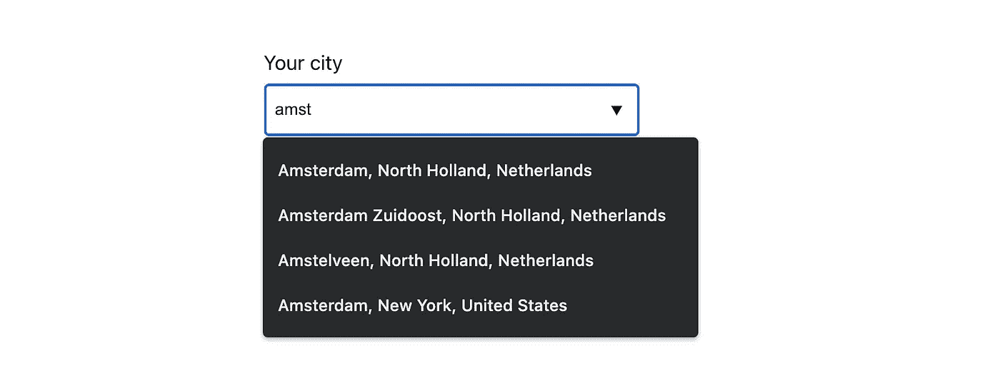
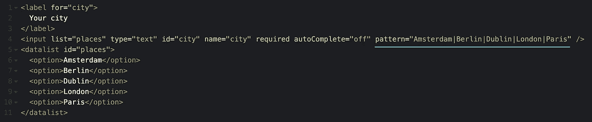

# 在 React 中创建一个简单的城市自动完成字段

> 原文：<https://javascript.plainenglish.io/create-a-simple-city-autocomplete-field-in-react-f7675d249c74?source=collection_archive---------2----------------------->

## 如何在 React 中创建一个简单的城市自动完成字段

The autocomplete function we will create

最近，我想实现一个功能，你可以要求纹身艺术家来你的城市。我们如何解决这个问题？我们需要这种格式一致的“城市数据”，以便能够统计向德国柏林等地发出了多少请求。我们需要的是一个 API，可以提供所有的城市，让用户可以选择他们的城市。由于世界上所有的城市会形成一个非常长的下拉列表，我们需要让用户能够搜索这个城市列表，换句话说，我们需要一个自动完成功能。

>[跳到 React 实现](#5057)

## 自动完成功能

我们可以使用一个 NPM 包来为我们的字段添加自动完成功能，但是我们真的需要一个吗？我隐约记得有一种本地方法可以使用一个`input`字段和一个`datalist`元素来创建一个自动完成字段。让我们来看看:

Native HTML autocomplete functionality

正如你在上面的例子中看到的，我们可以通过给输入一个等于`datalist`元素的`id`的`list property`来将一个`datalist` 元素连接到一个`input`字段。当用户开始在我们的输入字段中输入时，给定的选项被过滤，我们的输入字段就像一个选择框。我们已经建立了一个自动完成功能！

还有一个问题需要解决:我们不希望用户输入我们提供的选项之外的值。再一次，本地 HTML 拯救了我们。

We can restrict the input value by using a pattern on an input field.

通过向输入字段添加一个`pattern property`，我们限制了用户可以提交的允许值。有了这个，我们就可以继续前进了。

## API

在寻找一个合适的 API 时，我偶然发现了 Mapbox。正如他们的文档中所描述的，他们提供了一个获取城市(或者他们所说的地方)的端点。当玩[这个演示](https://docs.mapbox.com/search-playground/#{%22url%22:%22%22,%22index%22:%22mapbox.places%22,%22approx%22:true,%22staging%22:false,%22onCountry%22:true,%22onWorldview%22:true,%22onType%22:true,%22onProximity%22:true,%22onBBOX%22:true,%22onLimit%22:true,%22onLanguage%22:true,%22countries%22:[],%22worldviews%22:[],%22proximity%22:%22%22,%22typeToggle%22:{%22country%22:false,%22region%22:false,%22district%22:false,%22postcode%22:false,%22locality%22:false,%22place%22:false,%22neighborhood%22:false,%22address%22:false,%22poi%22:false},%22types%22:[],%22bbox%22:%22%22,%22limit%22:%22%22,%22autocomplete%22:true,%22languages%22:[],%22languageStrict%22:false,%22onDebug%22:false,%22selectedLayer%22:%22%22,%22debugClick%22:{},%22localsearch%22:false,%22query%22:%22%22})时，它变得更加清晰，这就是我们正在寻找的。幸运的是，Mapbox 提供了一个慷慨的免费层。
要使用 Mapbox，您需要[注册](https://www.mapbox.com/signup)并创建您的个人 API 密钥。我们将在我们的。env 文件来获取城市。

## 我们城市自动完成的 React 实现

事不宜迟，让我们看一下代码，然后一起浏览一下。

cityAutocomplete.js

在 render 方法中，您将认识到我们前面描述的本机 HTML 自动完成功能。让我们放大功能。

首先是我们的`input`领域。在改变时，调用`handleCityChange`函数。这个函数使用输入字段的值来异步调用`fetchPlace`函数。让我们看看我们的 fetchPlace 函数:

fetchPlace.js

在我们的 fetchPlace 函数中，我们使用输入值将其插入到地理编码 Api 端点中(这是我从他们的演示中获得的)。我们还提供存储在环境变量中的访问令牌。

回到我们的`handleCityChange`函数。当调用成功时，我们可以从结果的`features`属性中提取我们的城市名称。在将这些数据存储到我们的`autocompleteCities`状态之前，我们确保`features` prop 不是 *falsy* ，并且我们检查该值是否已经在我们的`autocompleteCities`状态中。我们这样做是为了防止当用户选择一个触发 onChange 事件的选项时，自动完成功能再次打开。最后，我们通过将它存储在我们的`autocompleteErr`状态中来处理任何可能来自 api 调用的错误。

现在我们已经在 de `autocompleteCities` state 中存储了我们的城市名称，我们可以在输入字段中添加它，用管道分隔，作为一种模式。这将限制我们的输入字段中允许的值。我们还使用我们的`autocompleteCities`状态来生成数据表中的选项。

就是这样，我们已经创建了一个简单的自动完成功能来轻松地选择您的城市。🎉

你可以在 GitHub 上查看完整的源代码[。](https://github.com/wendydek/citysearch)

最后，如果你对“请求纹身师到我的城市”功能感兴趣，我需要这个功能的原因。你可以在这里查看:[https://www . winkt . io/tattoo-artist/happy fishhead # city request](https://www.winkt.io/tattoo-artist/happyfishhead#cityrequest)

*更多内容看* [***说白了. io***](http://plainenglish.io/)