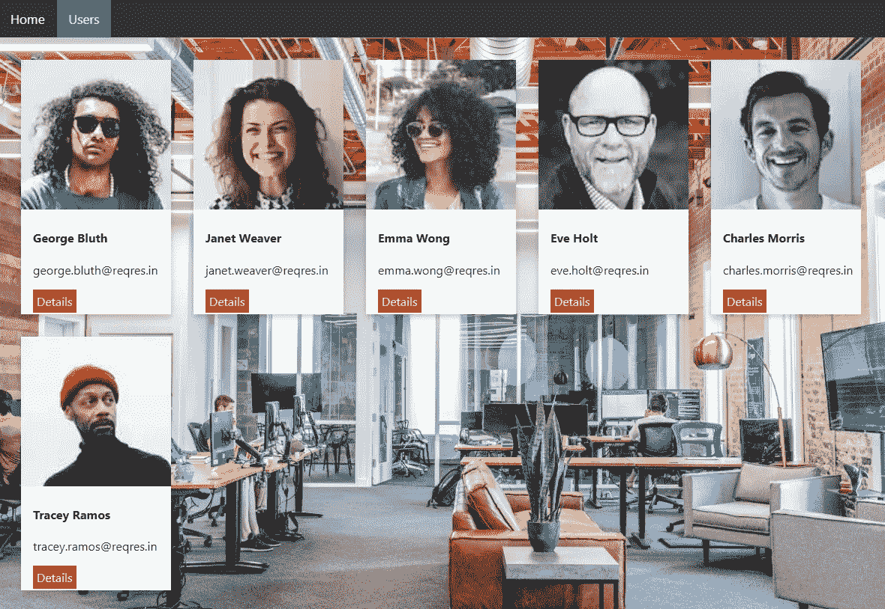
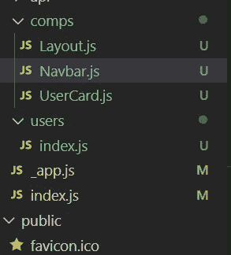

# 创建一个简单的 NextJS 用户列表应用程序第 1 部分—用 Next.js 创建布局

> 原文：<https://javascript.plainenglish.io/create-a-simple-nextjs-users-list-app-part-i-286060ea06c6?source=collection_archive---------13----------------------->

## 使用 NextJS 和 Bootstrap 创建这个应用程序

在这个 Next.js 系列中，我们将创建一个 Next.js 应用程序，它从远程 API 获取用户。



A simple users list app with NextJS

源代码和免费 Udemy 课程:

[](https://app.gumroad.com/ckmobile) [## Ckmobile

### 教 JavaScript，React，NodeJS，React Native，Firebase，MongoDB，GraphQL，Strapi。关注我们:YouTube…

app.gumroad.com](https://app.gumroad.com/ckmobile) 

在这一部分，我们只是创建一个导航栏，然后我们让它在每一页的顶部都有一个导航栏。

## 创建 nextJS 应用程序

首先，我们进入要构建应用程序的文件夹，并键入以下命令。

```
npx create-next-app
```

## 创建组件

在“comps”文件夹下创建 Layout.js 和 Navbar.js。



在“样式”文件夹下创建 Navbar.module.css

在 CSS 文件中，我们添加了以下内容。我们主要是去除链接的下划线样式，当链接处于活动状态时，它会有一个绿色的背景色和白色的文字。如果你把鼠标放在它上面，它会有一个浅灰色的背景颜色和黑色的文字。

```
.topnav {overflow: hidden;background-color: #333;}.topnav a {float: left;color: #f2f2f2;text-align: center;padding: 14px 16px;text-decoration: none;font-size: 17px;}.topnav a:hover {background-color: #ddd;color: black;}.topnav a.active {background-color: #04AA6D;color: white;}
```

然后回到 Navbar.js，导入 Navbar.module.css，

```
import styles from '../../styles/Navbar.module.css'const Navbar = () => {return (<div className="topnav"><a className="active" href="/">Home</a><a href="/users">Users</a></div>);}export default Navbar;
```

在 Layout.js 中，

```
import Navbar from "./Navbar";const Layout = ({children}) => {return (<div><Navbar/>{children}</div>);}export default Layout;
```

要使用布局，我们需要转到 _app.js，然后使用<layout>包装所有组件。</layout>

```
import '../styles/globals.css'import Layout from './comps/Layout'function MyApp({ Component, pageProps }) {return (<Layout><Component {...pageProps} /></Layout>)}export default MyApp
```

## 创建用户页面

在我们测试布局是否工作之前，我们必须创建用户页面。

在“页面”下创建一个用户文件夹。然后在这个文件夹下，创建“index.js”

```
const Users = () => {return (<div >Users</div>);}export default Users;
```

## 测试布局

现在无论我们去“http://localhost:3000”还是“http://localhost:3000/users”。两者顶部都有导航条。

关注我们: [Gumroad 课程](https://app.gumroad.com/ckmobile)， [YouTube](https://www.youtube.com/channel/UCu4-4FnutvSHVo9WHvq80Ww?sub_confirmation=1) ， [Medium](https://ckmobile.medium.com/) ， [Udemy](https://www.udemy.com/user/cyruschan2/) ， [Linkedin](https://www.linkedin.com/company/ckmobi/) ， [Twitter](https://twitter.com/ckmobilejavasc1) ， [Instagram](https://www.instagram.com/ckmobile8050)

**加入代销商赚钱**

[https://ckmobile.gumroad.com/affiliates](https://ckmobile.gumroad.com/affiliates)

*更多内容看* [***说白了***](http://plainenglish.io/)