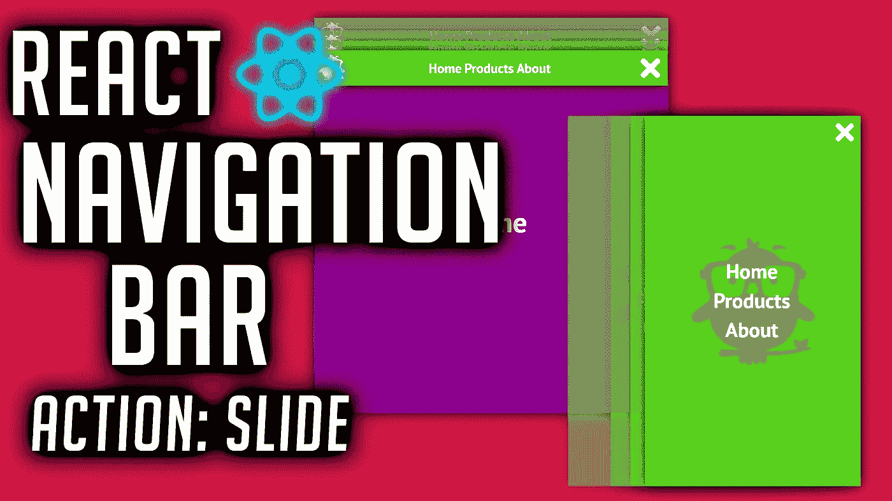
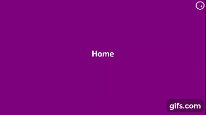
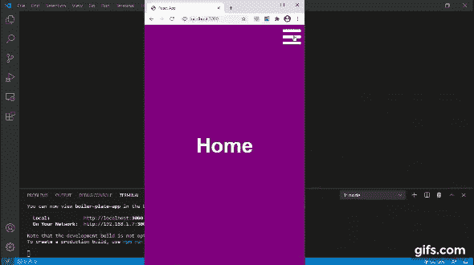

# 创建一个滑动的反应导航栏

> 原文：<https://javascript.plainenglish.io/create-a-sliding-react-navigation-bar-441168bca19?source=collection_archive---------4----------------------->

## 反应武器库的一个基本组成部分



让我们把组件的框架写出来。我们将在这个项目中使用 react-router-dom 和字体 awesome。

```
<div className=”nav_bar”> <div className=”icon_container menu_switch”> </div> <div className={`nav_container`}> <div className=”icon_container logo”> </div> <ul className=”menu_items”> </ul> </div></div>
```

我们为我们的**打开/关闭菜单按钮**、一个**标志**和带有不同页面链接的**菜单准备了一个位置。**

# **打开和关闭菜单**

当用户点击我们的菜单按钮时，我们将根据菜单的当前状态打开或关闭菜单。

我们将有一个名为 **showMenu** 的状态来管理它。

```
const [showMenu, setShowMenu] = useState(false);function switch_menu() { setShowMenu(!showMenu);
}
```

当 **showMenu** 为**真**时，我们将附加一个 **CSS 类**来触发一个转换。

```
<div className={`nav_container ${showMenu ? ‘menu_active’ : null}`}> <div className=”icon_container logo”> <i className=”fab fa-earlybirds” /> </div> <ul className=”menu_items”> <li> <Link to=”/” onClick={switch_menu}>Home</Link> </li> <li> <Link to=”/products” onClick={switch_menu}>Products</Link> </li> <li> <Link to=”/about” onClick={switch_menu}>About</Link> </li> </ul></div>
```

**注意我们如何使用字符串模板将 menu_active 类包含在 DIV 的类名中。**

我们在屏幕外开始菜单:

```
.nav_container { transform: translateY(-100%);}
```

当我们“**激活**菜单时，我们只需将它转换回默认位置。

```
.menu_active { opacity: 1; transform: translate(0%, 0%);}
```



实际的链接来自于 **react-router-dom** 中的**链接**元素。

```
<Link to=”/” onClick={switch_menu}>Home</Link><Link to=”/products” onClick={switch_menu}>Products</Link><Link to=”/about” onClick={switch_menu}>About</Link>
```

## **手机版**

手机版非常简单。

我们赋予导航栏新的维度。

我们没有在页面顶部占据一个 80px 的横条，而是让它占据整个页面。

```
.nav_bar { width: 100vw; height: 100vh;}
```

该条以完全相同的逻辑制作动画，但不是在 Y 轴**上滑动，而是在 X 轴**上滑动。



你可以在这里 找到源文件 [**。**](https://github.com/an-object-is-a/react-nav-bar-01-basic)

所有图标均来自 [**字体牛逼**](https://fontawesome.com/) 。

如果你想要更深入的指导，请查看我在 YouTube 上的完整视频教程， [**一个对象是一个**](https://www.youtube.com/c/anobjectisa) 。

一定要在 [**Instagram**](https://www.instagram.com/an_object_is_a/) 和 [**Twitter**](https://twitter.com/anobjectisa1) 上关注我们，及时了解我们最新的 **Web 开发教程**。

## **React 导航栏教程(幻灯片)**