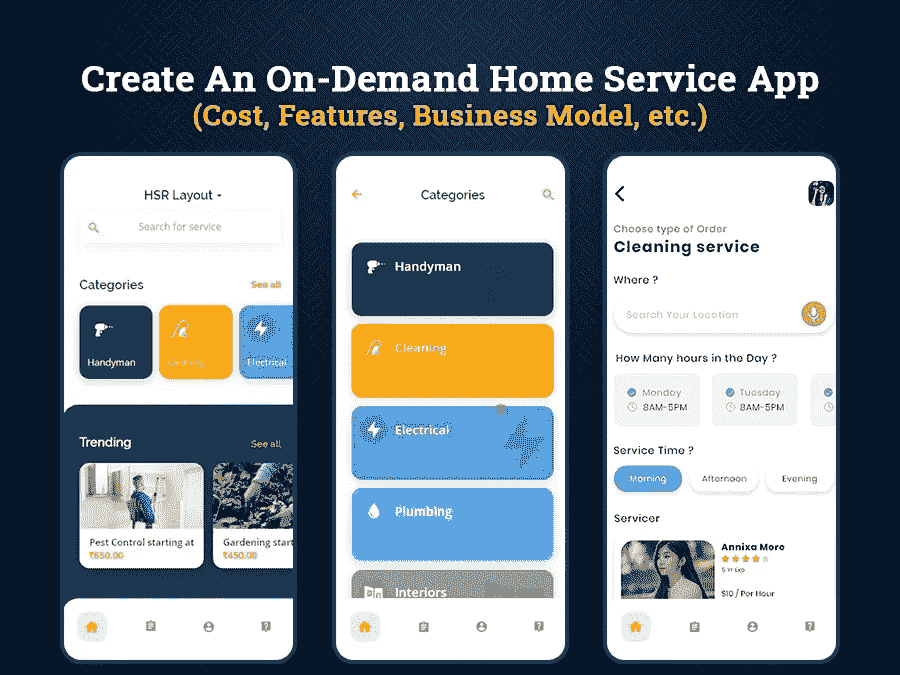

# 创建一个按需家庭服务应用程序需要多少成本

> 原文：<https://javascript.plainenglish.io/create-a-successful-on-demand-home-service-app-c0160816d4e1?source=collection_archive---------13----------------------->

## 创建按需家庭服务应用程序(成本、功能、商业模式等。)

在这个快节奏的生活中，人们没有时间坐下来放松和恢复活力，家庭琐事总是留在他们的待办事项清单上。想象一下，在办公室度过漫长忙碌的一周后，你愿意在周末做所有的家务吗？

别担心，这就是按需家庭服务应用程序脱颖而出，成为您的完整解决方案的原因。

正如许多其他按需服务应用程序(如送餐、杂货配送、出租车预订、沙龙管理等)正在迅速改变传统行业，并为他们提供将业务提升到新高度的机会，同样，家庭服务应用程序正在成为企业家以收入为中心的商业模式，因为它们已经成为现代生活方式的迫切需求。

在这种快节奏的生活中，维护所有家务并保持电器平稳运行可能是一项令人疲惫的任务。这就是为什么随着时间的推移，对管理所有家庭服务的应用程序的需求正在淹没市场，这是一种人们发现自己很难找到可以轻松满足他们需求的正确提供商的情况。

冷静点。有很多像 UrbanClap 这样的平台可以让你的梦想成真，并通过仔细审查的方式将专家送到你家门口来提供服务。在冠状病毒时代，每个人都害怕欢迎任何陌生人来到他们的家中，像 UrbanClap 这样的按需家庭服务应用程序可以确保他们的专家在访问服务地点时进行温度测试、消毒，并遵循所有政府指示。

家庭服务应用程序是最具创新性的方法之一，可以提供洗衣、家庭清洁、家电维修、电脑维修、管道维修、木工、汽车和自行车服务、搬运和存储、家庭整理、宠物护理、害虫控制、家庭粉刷等服务。所有这些都可以通过点击应用程序来管理。

不幸的是，计划开发这种一体化应用的企业会遇到这样一个问题:“开发一个按需家庭服务应用要花多少钱？”

如果你希望这个问题有一个简单的答案，根据你选择开发的应用程序类型，你通常会花费 20，000 美元到 50，000 美元以上。开发的总成本可能会有很大差异，这取决于各种因素，包括应用程序的复杂性、功能、开发团队、目标受众、操作平台等。

> **但是在你评估这些因素之前，让我们先了解一下开发一个按需家庭服务 app 的这些参数:**

*   *投资按需家庭服务应用值得吗？*
*   *通过按需家居服务应用，你能提供什么样的服务？*
*   *将你的按需应用创意转化为成功的商业应用的策略。*
*   *如何搭建一个随需应变的家庭服务 app 及其成本。*
*   *你可以在家庭服务应用中列出的最佳功能。*
*   *做一个家庭服务 app 总体要花多少钱？*
*   *结论:如何制作最好的应用程序来发展您的业务*

## 你为什么应该投资按需家庭服务应用？

随着互联网时代的到来，数字化浪潮发生了巨大变化，企业之间的竞争使它们更难生存。随着生活变得越来越快，在家里轻松访问服务的需求变得越来越普遍，因此，按需家庭服务应用程序将是企业的下一件大事，这一点不会错。

优步的 UrbanClap 就是一个很好的例子，他们利用这种商业理念，通过雇佣合适的工人从事合适的工作来获取利润。

按需上门服务曾经是一种奢侈品，现在在世界各个角落都变成了必需品。让我们来看看显示家庭服务如何继续徘徊的统计数据。

**美国家政服务市场飞速发展**

*   [根据研究](https://locus.sh/resources/top-trends-for-on-demand-home-services-market/)，2020-24 年间，全球在线按需服务市场将增长至 15，748.6 亿美元。
*   美国按需家庭服务行业目前价值 6000 亿美元，但在疫情期间表现出稳定增长，预计到 2021 年 CAGR 将增长 49%。
*   需求最大的家庭服务是家庭清洁、修理、沙龙和美容护理、管道和电气服务。
*   [根据市场分析](https://locus.sh/resources/top-trends-for-on-demand-home-services-market/)，排名靠前的家庭服务市场有 Yelp、TaskRabbit、亚马逊家庭服务、UrbanClap 等等。
*   [根据](https://locus.sh/resources/top-trends-for-on-demand-home-services-market/)的一项调查，46%的美国消费者更喜欢通过电子邮件、在线平台或移动应用程序安排约会，而只有 38%的家庭服务中小企业提供数字自我安排。
*   80%的客户认为公司提供的体验与其产品和服务一样重要。由于卫生和安全，专业家庭服务甚至在冠状病毒中也占据了中心位置。

**简而言之:**总结所有的数字和统计数据，可以公平地说，按需家庭服务应用市场前景光明，并将在未来几年保持需求。所以 [**雇佣一个应用开发者**](https://www.xicom.ae/solutions/hire-developers/) 并在这类应用上投资是一个值得的决定。但这就结束了你能构建什么类型的家庭服务应用的问题。

> 让我们在下一节找到这个问题的答案…

## 你可以通过按需家庭服务应用程序提供什么样的服务？

无论你是一家新兴企业还是领先品牌，都属于开发家庭服务应用程序的同一计划，但你可以构建什么类型的应用程序是一个关键的决定。

因此，这个问题可以归结为一些你可以转化为成功解决方案的百万美元应用创意。

> 让我们了解一下您可以通过按需家庭服务应用程序提供的服务类型:

> **家庭清洁和维修服务**

*   管道和电工
*   喷泉修复
*   洗衣机
*   木工
*   电视和冰箱
*   深度家庭清洁

> **辅导和教学服务**

*   在线辅导
*   家庭教师
*   英语教师
*   数学导师
*   商业导师
*   学科导师

> **包装和搬运物品**

*   带着包装工和搬运工回家
*   害虫防治
*   沙发移位
*   厨房移位
*   地毯清洁和移位
*   浴室清洁
*   水箱清洗

> **家居室内设计**

*   壁纸
*   模块化厨房
*   建筑师
*   闭路电视摄像机安装
*   画家

> **健康与福利**

*   营养学家
*   瑜伽教练
*   健身教练
*   身体健康
*   物理疗法

> **沙龙和美容服务**

*   矿泉疗养地
*   按摩疗法
*   指甲延伸
*   美容
*   染发

构建一个家庭服务应用程序的平均成本将在 20，000 美元到 25，000 美元以上。此外，无论你决定将什么类别整合到你的应用程序中，你所需要的就是 [**雇佣移动应用程序开发者**](https://www.xicom.ae/services/mobile-app-developers/) 来轻松地将你的商业想法转化为完美的解决方案。

但问题是他们如何帮助你获得业务竞争优势？他们遵循什么策略来制作一个成功的应用程序？我们来了解一下！

# 将你的按需应用创意转化为成功的商业应用的策略

各种按需服务提供公司鼓励企业家按需提供他们的商品和服务，以满足生活方式不断变化的需求。毫无疑问，优步 UrbanClap 的成功故事已经影响了许多公司进入点播行业并变得有竞争力。但事实是，建立正确的应用程序来推动您的订单是一个巨大的挑战，你需要在进入这个领域时面对。

> 因此，这里有几个关键策略，可以帮助你将业务发展成为顶级家庭服务应用:

## 策略 1 —确定客户的需求

想象一下，如果你不知道谁将是你的最终用户，他们的需求是什么，你将在什么基础上开发一个应用程序？用户分析是开始使用你的应用并相应地整合服务的理想方式。所以你应该从弄清楚一个问题开始，这个应用程序可以帮助你满足目标受众的需求。

*   人们怎么会喜欢那样？
*   你真的会满足他们的需求吗？
*   人们会希望机械师在家门口吗？
*   人们会喜欢获得沙龙服务吗？
*   用户会更喜欢从 app 上聘请家教吗？

定性和定量分析将帮助您决定所有此类问题的答案，并帮助您了解您想要构建什么类型的应用程序。如果你觉得很难理解应该从哪里以及如何开始调查，那么你也可以指定一个 [**应用程序开发公司**](https://www.xicom.ae/services/mobile-app-development/) ，因为他们是专家，非常了解市场情况。

## 策略 2——了解行业参与者

了解竞争对手将有助于你了解市场的最新趋势、特点和服务。向竞争对手学习将有助于你为用户提供更好的服务，并使你能够保持健康的竞争。你所需要的只是从某些竞争较少的商品和服务开始。其次，搜索你的竞争对手需要的产品和服务。尝试寻找突破，给你的客户一些新的、创新的东西，而这些是你的竞争对手没有提供给他们的。你的随需应变软件将为用户提供一些很棒的东西来访问和使用。

## 策略# 3——了解主要参与者的特性和功能

这真的很难理解。在你雇佣一个移动应用程序开发者并期望他们开发一个只有一堆功能的应用程序之前，你需要知道这些按需应用程序到底是如何工作的…

他们有关键的部分，如你的客户、供应商和管理团队，他们从后端操作和跟踪一切。

例如，UrbanClap 是一个面向用户的一体化解决方案，但实际上，它与提供服务的人和为他们提供适当供应的供应商密切相关。还有人从后端管理一切。还有一些客户或人们实际上正在寻找他们在应用程序上提供的服务。

开发一个点播应用程序可能会很复杂，因为它有所有这些不同的参与者。

## 策略 4——质量就是一切

虽然有各种公司提供按需家庭服务应用程序，但只有少数几家取得了成功。原因是，他们提供的产品和服务的质量实际上是在谈论应用程序。无论你在市场营销上投入了多少，如果没有一个高质量的产品或服务，那都是白费力气。

## 策略 5——聪明地设计你的应用

UX/用户界面设计是你的应用程序的心脏和灵魂。无论你提供什么样的服务，如果你的应用程序缺少用户友好的界面，那么它就不会在商店里显示出任何成功。一个提供搜索过滤器的应用程序，只需要有限的步骤来评估你想要的产品似乎是理想的。确保消费者和用户能够快速识别和订购他们在你的应用中寻找的产品，以提供出色的用户体验。

一般来说，按需应用的开发和成功交付从来都不是一件容易的事情。由于它包括大量的工作来完成应用程序和创建端到端的方法，因此，随着 [**软件开发公司**](https://www.xicom.ae/) 和所有这些最佳战略，你需要了解正确的开发流程。正确的知识和经验是非常重要的，以便理想地完成业务应用程序。

> 所以让我们来了解一下 2022 年如何开发一款致胜的家政服务 app

# 如何构建按需家庭服务应用程序及其成本

如果你已经被制作一个按需家政服务 app 的概念所影响，并在寻找 app 开发所涉及的步骤及其大概的开发成本，那么继续阅读。

在这里，我们开始…

## 第一步:市场调研是关键！

通常，复杂的应用程序开发需要 30 到 60 个小时到 80 多个小时，因此许多企业忽略了这一步，直接进入开发流程。然而，他们往往忽略了一个事实，即对市场的深入分析将有助于你为你的应用确定更好的范围和机会。因此，您对市场的广泛研究必须包括以下问题:

*   谁会是你的竞争对手？
*   你计划采取什么策略来获得对竞争对手的优势？
*   他们的卖点和失败之处是什么？
*   他们的客户在社交媒体上的反馈和评论是什么？
*   你独特的卖点是什么？

为了让您更轻松地完成这项任务，值得 [**聘请应用程序开发人员**](https://www.xicom.ae/solutions/hire-developers/) 进行市场分析，并进一步指导您在进行投资之前应该评估哪些其他重要参数。通常，应用程序开发的这个阶段将花费 1000 到 1200 美元，甚至可能高达 1500 美元。

## 第 2 步:决定目标应用平台:安卓、iOS 还是混合？

按需家庭服务应用程序开发的成本因您选择启动应用程序的平台而异。

本机应用程序是需要专用平台的重型应用程序的理想选择。而混合应用是满足这两种平台(安卓/iOS)日益增长的需求的完美选择。对于那些需要快速升级并在多个平台上办公而无需投资高额预算的人来说，这是一个理想的选择。

由于跨平台应用程序是用单个代码库构建的，可以在多个平台上运行，而且成本比本地应用程序开发低 40%，因此跨平台应用程序开发解决方案的需求越来越大。

雇佣应用程序开发人员的成本在很大程度上取决于您为应用程序选择的跨平台框架。由于 flute 和 reactor Native 是跨平台应用开发领域最大的巨头，您可以以 20 到 25 美元/小时的价格雇佣 flute 专家，而 reactor Native 应用开发人员的价格为 22 到 35 美元/小时。

## 第 3 步:选择最佳的应用赚钱策略

投资或构建这样一个不会给你带来任何收入的昂贵应用程序是没有意义的。虽然有各种应用赚钱策略，但家庭服务应用，你可以通过简单的销售服务从应用中直接获得收入。

但是，即使向客户收取了服务费用，您也可以向使用您的平台推广其服务的品牌收取服务费用。根据您的移动应用产品，您可以选择最适合您市场的产品。

**第 4 步:应用开发团队**

一个应用程序有不同的开发阶段，每个阶段都需要专业知识来使其处理完美无缺。因此，以下是您在构建按需应用程序时通常需要的专家团队:

*   商业分析师
*   项目管理人
*   后端开发人员:每小时费用在 15 到 25 美元之间+
*   前端开发人员:15 到 35 美元+
*   UX/用户界面设计师:15 美元以上到 20 美元以上
*   质量保证工程师:$15 到$22+

## 第 5 步:测试并启动应用程序

在要求 [**移动应用开发公司**](https://www.xicom.ae/services/mobile-app-development/) 直接发布一个应用之前，让他们在多个平台上运行来发现错误和问题是值得的。对于多个应用程序测试，质量保证工程师将使用各种工具来确保应用程序在应用程序商店顺利发布。

通常，应用程序开发的这一阶段需要的时间最少，大约 30 到 80 多个小时，这取决于应用程序的复杂程度。

现在你知道了按需家庭服务应用的基本开发生命周期。但是，如果你注意到我们已经错过了应用程序开发的主要部分，实际上增加了功能。是的，它的特性和功能…

## 你可以在家庭服务应用中列出的最佳功能

在您开始讨论您可以在应用程序中列出的特性和功能之前，有必要了解一下按需上门服务应用程序由三个面板支持——面向客户、面向供应商和面向管理员。

> 我们来详细了解一下…

> ***面向客户的特性列表***

**简易搜索选项:**在你的应用中使用搜索过滤器将确保用户导航便捷。这将有助于用户轻松找到想要的产品，并确保更好的用户体验和服务满意度。

**简单的服务安排:**在你的应用程序中添加一个日历，根据用户的方便或他们的可用性显示不同的预订时段。该应用程序应该包含一个选项，用户可以提前一周预订他们的服务。

**推送批准通知:**一旦登记了用户的服务请求，服务提供商将发送批准通知以确认服务。

**多种支付方式:**确保您拥有最简单、最容易、最方便、最可靠的支付方式。为此，您需要提供多种支付方式，如信用卡/借记卡、现金服务、钱包支付等。

**评论和评分:**一旦用户访问你的服务，要求他们在应用上留下评分或评论，以增加你的应用的信任度。

**帮助和支持:**为了方便用户使用该应用程序，需要为用户提供一个名为“客户支持和帮助”的特殊窗口。为此，你也可以使用聊天机器人，确保 24*7 客户支持的应用程序。

> ***服务提供商功能列表***

**简易注册:**确保你的应用程序为供应商提供简单、快速、简易的注册。一旦供应商提供了他们的详细信息，他们的注册过程将立即获得批准，并允许他们开始使用服务。

**实时要求:**你对用户查询的反应速度是当今市场的关键。快速的通知和警报将帮助您增强用户体验。

**接受或拒绝订单:**一旦用户提出请求，服务提供商将根据资源的可用性决定是接受还是拒绝该请求。

**与客户进行应用内聊天:**由于隐私或安全问题，用户有时会对自己的个人联系号码犹豫不决。因此，供应商可以利用应用内聊天功能来联系他们的客户。

> ***特性-管理员列表***

有吸引力的仪表板:管理面板应该有一个交互式仪表板，从那里他们可以很容易地跟踪，监测和控制应用程序的中心。你可以 [**雇佣一个应用开发者**](https://www.xicom.ae/solutions/hire-developers/) 让访问变得非常简单。

**管理和验证服务提供商:**为了避免你的应用程序中出现任何欺诈或漏洞，你需要一个超级管理员来验证供应商，然后再将他们列入应用程序。虽然可以手动验证单个简档，但是在进入注册过程之前，需要验证各种服务提供者的简档。

**管理支付:**支付问题不应复杂化。由于你通过多个平台获得支付，你必须在一开始就注意清楚佣金，所以重要的是要有一个后端流程，保持一切清晰、透明和安全。

**评论管理:**服务评论和评级在赢得用户信任方面起着至关重要的作用。因此，根据评论，可以将你的应用程序分为表现最好的和表现不好的，并允许用户在未来做出更好的决定。

**分析:**这将为你的业务提供急需的洞察力。这些见解和统计数据将让您了解您的业务绩效、哪些服务产生了更多收入，以及可以带来哪些必要的改进。

# 做一个家政服务 App 总体要花多少钱？

说到最重要的问题，构建一个按需家庭服务应用程序的超额成本是多少？嗯，即使是业界最好的应用程序开发人员也会给你一个大概的估计，从 15，000 美元到 50，000 美元+不等。但是你们中的许多人想知道为什么费用之间有巨大的差距？这个预算的分解是什么？

说实话，没有一个独立的解决方案可以满足所有的业务需求，因此，根据需求的不同，创建一个按需应用程序的成本也不同。从你选择开发应用的技术到你为项目雇佣的专家团队，从应用的特性和功能到复杂性，有很多因素会影响应用的开发成本。

但是，在计算应用程序开发的最终成本时，您需要关注两件主要事情，开发总时间和应用程序开发人员的每小时成本。开发人员的小时工资是全球变化的。

在美国和欧洲等国家，每小时的工资是 200 到 150 美元。而在印度和阿联酋，家庭服务应用程序的开发成本约为每小时 15 至 20 美元，与其他任何地区相比，这确实很便宜。

# 结论:如何做出最好的 App 来增长你的业务？

最后，希望雇佣一个按需家庭服务应用程序开发人员来创建您的服务应用程序？在为你的项目雇佣一家 [**移动应用开发公司**](https://www.xicom.ae/services/mobile-app-development/) 之前，请记住，像 UrbanClap、TaskRabbit 或 Handyman 这样的家庭服务应用已经在市场上蓬勃发展。所以，确保你通过合法的市场调查雇佣了最好的应用开发者。考虑适当的功能，然后进行营销活动，使你的应用程序成功。

如果您仍有疑问，请向我们的专家提出疑问，他们将为您提供最佳解决方案。

*更多内容尽在*[*plain English . io*](http://plainenglish.io/)