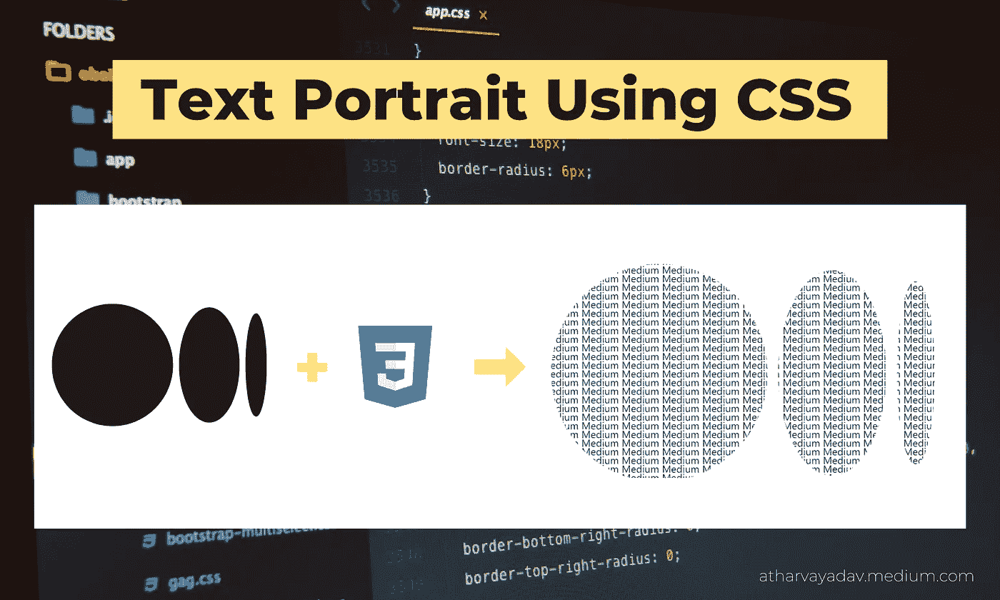
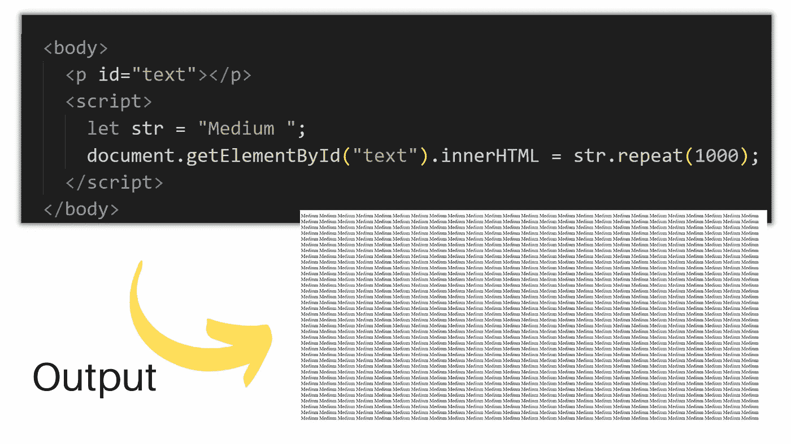
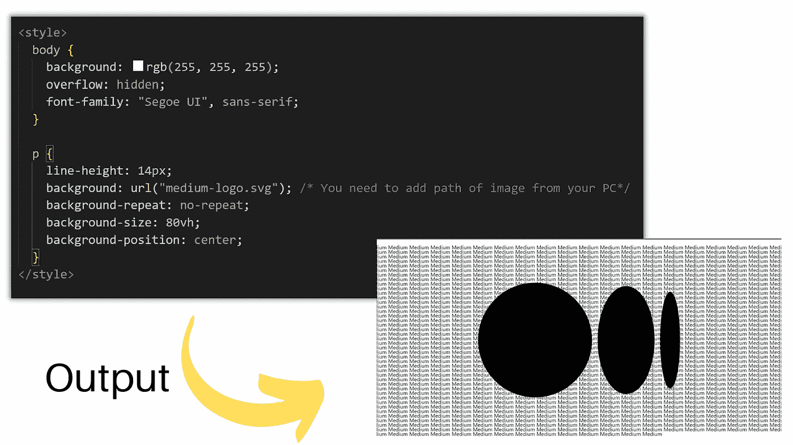
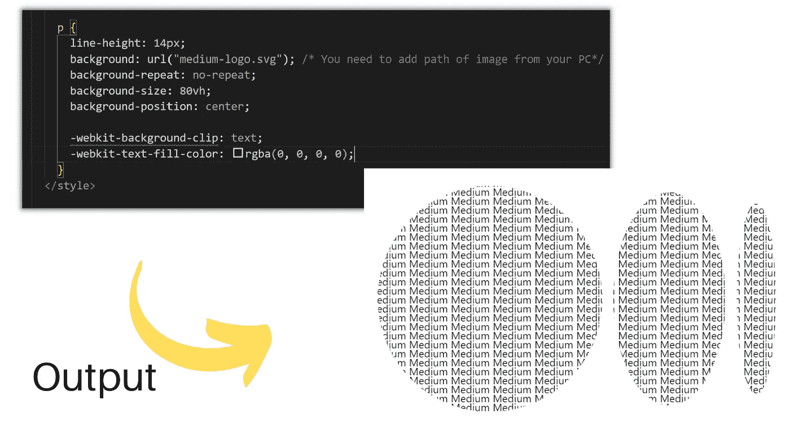
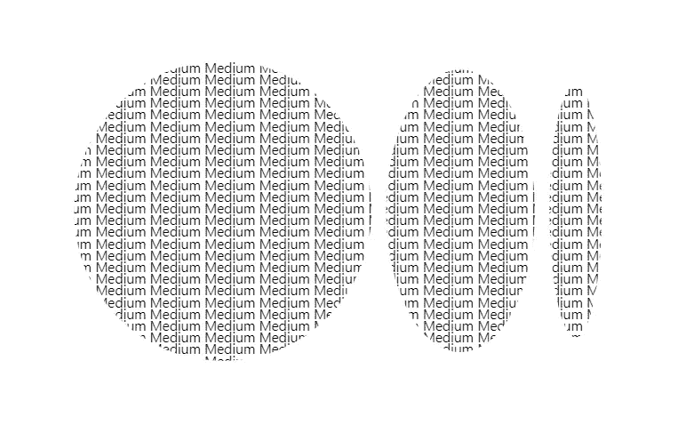

# 使用 CSS | Web Development 创建文本肖像

> 原文：<https://javascript.plainenglish.io/create-a-text-portrait-using-css-be4a4a1c2a83?source=collection_archive---------2----------------------->


Photo by [KOBU Agency](https://unsplash.com/@kobuagency?utm_source=medium&utm_medium=referral) on [Unsplash](https://unsplash.com?utm_source=medium&utm_medium=referral)

前端设计部分最关键的是 CSS。您可以使用几行 CSS 创建各种设计和图像操作。在这篇文章中，让我们看看如何使用几行 CSS 来生成文字肖像。



Create a Text Portrait using CSS

下面是获得想要的文字肖像所需的步骤。

# 步骤 1:设置 HTML

创建一个文档并用大量文本填充它，这样你的网页就充满了文本。如果你想要任意的文本，使用 HTML 中的 *lorem* 属性。但是如果你想让一个特定的单词重复出现，使用如下所示的 [JavaScript repeat()函数](https://developer.mozilla.org/en-US/docs/Web/JavaScript/Reference/Global_Objects/String/repeat)。



# 步骤 2:设置背景图片(使用 CSS)

在设置背景图像时，

1.  使用 CSS `URL()`函数设置背景图像。
2.  添加等于`no-repeat`的`background-repeat`以避免图像重复。
3.  把你的图像放在中间
4.  减少行间的空间以获得更好的视觉效果。



# 步骤 3:在图像上剪切文本

我们可以看到文本的一部分被图像所覆盖，但是我们希望在图像上剪切文本，而剩余的文本应该是透明的。为此，我们将使用`-WebKit-text-fill-color.`

我们需要剪辑我们的文本，以便图像的背景与前景文本一起绘制。为了让它看得见，我们使用了`background -WebKit-text-fill-color.`

```
-webkit-background-clip: text;
-webkit-text-fill-color: rgba(0, 0, 0, 0);
```

之后，根据你的选择，对字体、背景尺寸做一些修改，就这样，你的文字肖像就做好了。结果您将看到这种类型的输出。



## 以下是最终输出:



final output

## **完整代码:**

## **看看它是如何工作的:**

# 结论:

所以，这就是所有关于使用 CSS 的文字肖像。希望这篇文章能帮助你清楚地了解 CSS 属性。

如果您发现这很有帮助，请考虑与可能需要它的其他开发人员分享。您也可以在下面的评论框中告诉我们您的意见和建议。

如果你对开发、编程和技术感兴趣，[订阅我的时事通讯](https://atharvayadav.medium.com/subscribe)将我的文章直接发送到你的邮箱。

*更多内容请看*[*plain English . io*](http://plainenglish.io/)