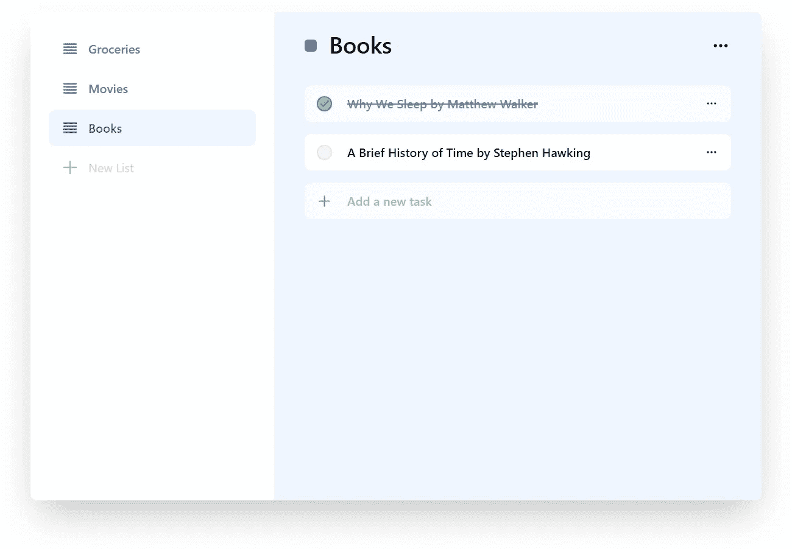
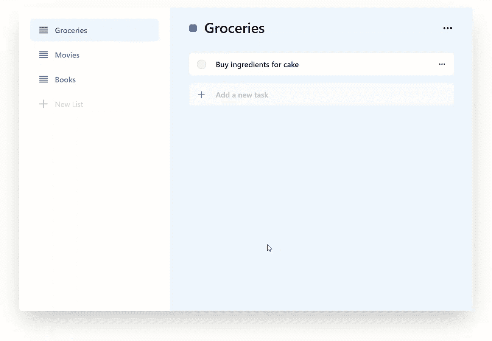
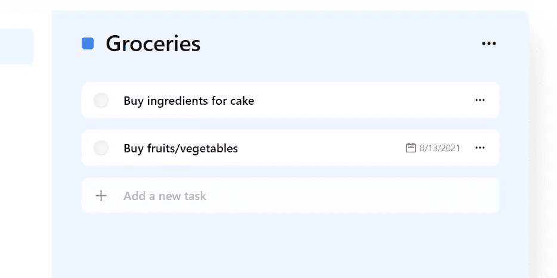
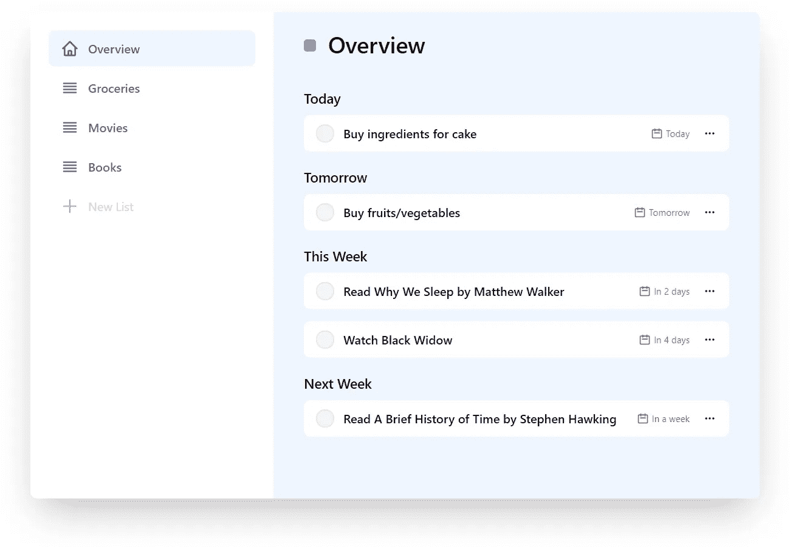
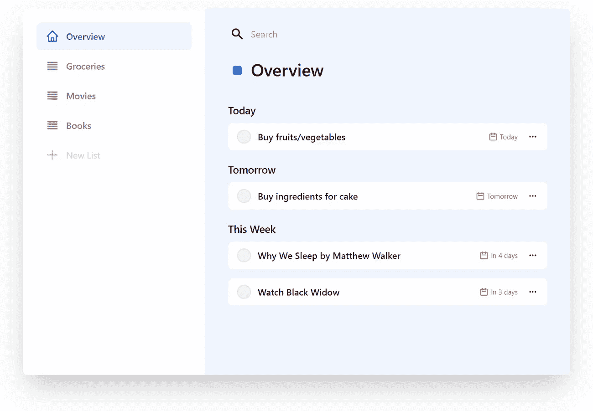
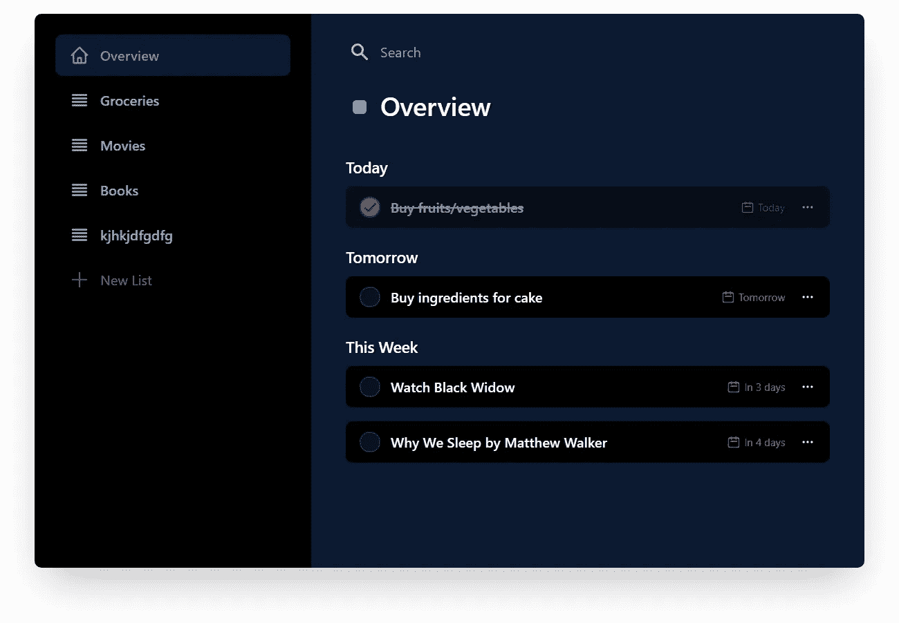
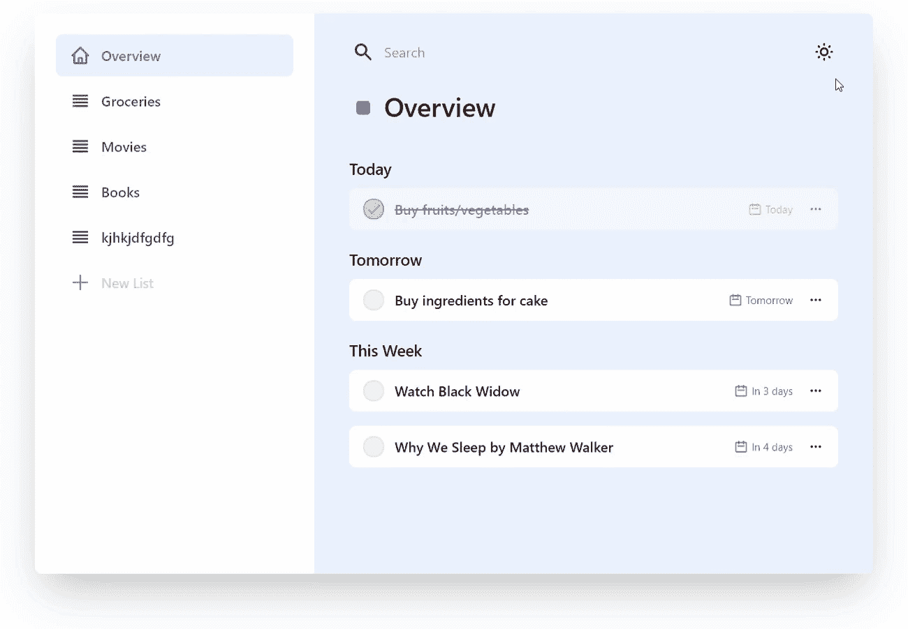

# 在 React With localStorage 中创建待办事项应用程序

> 原文：<https://javascript.plainenglish.io/create-a-to-do-app-in-react-with-localstorage-5408d5c9d6f5?source=collection_archive---------7----------------------->

## 使用 React 和 Tailwind CSS


Photo by [Nubelson Fernandes](https://unsplash.com/@nublson?utm_source=medium&utm_medium=referral) on [Unsplash](https://unsplash.com?utm_source=medium&utm_medium=referral)

在本文中，我们将创建一个 web 待办事项应用程序，它可以保存在浏览器的本地存储上。我们将使用 React 作为用户界面。

我一直避免学习 React，直到最近。了解了一点之后，我真的很喜欢它。所以，我决定做些回应。

我们将从一个**工作原型**开始，然后我们将创建一个应用程序的实体模型**设计**，最后，我们将**添加一些功能**。

# 工作原型

## 唯一 id

在整个应用程序的开发过程中，我们必须为一些组件分配唯一的 id。为此，我们将使用`uuid` npm 包。我们使用`npm install uuid`安装它并导入它`import {v4 as uuid} from 'uuid';`，然后调用`uuid()`函数来获得一个唯一的 ID/key。

## 列表

在我们的待办事项应用程序中，我们应该能够创建列表。我们将把列表保存在一个数组中，该数组在 ReactJS 应用程序中定义为一个状态。

```
const [lists, setLists] = React.useState([]);
```

为了添加或删除列表，我们将在我们的`App`中定义两个函数:

我们将把这两个函数作为属性传递给任何需要添加或删除列表的组件。

我们将定义一个`Lists`组件，它将显示一个列表列表(带有一个删除按钮)和一个“添加新列表”表单。

`Lists`组件获取`lists`数组作为属性，并在呈现函数中遍历它。

为了处理新列表的删除和添加，我们必须在组件中定义两个函数。

要删除列表，我们定义以下处理函数:

```
function removeListHandler(id) {
  props.onRemoveList(id);
}
```

要添加一个列表，我们首先要获取输入表单的值。我们将使用 React 的`useRef`函数。我们必须在我们的`Lists`组件中添加以下代码行:

```
const newListTitleRef = React.useRef();
```

并将该属性添加到输入中:

```
<input
  type="text"
  placeholder="New List"
  **ref={newListTitleRef}**
/>
```

为了检索输入的值并添加新列表，我们使用:

```
function addListHandler(e) {
  // Prevent browser submit refresh
  e.preventDefault();
  // Create a new list
  const list = {
    id: uuid(), // with a random unique ID
    title: **newListTitleRef.current.value** };
  // Add the list
  props.onAddList(list);
  // Empty the input
  newListTitleRef.current.value = "";
 }
```

我们的`Lists.js`文件变成如下:

要使用我们的`App.js`中的组件，我们只需使用:

```
<Lists data={lists} onAddList={addList} onRemoveList={removeList} />
```

到目前为止，我们的应用程序是这样的。

现在，我们将添加页面到我们的列表，并使它们可点击。为此，我们将使用`react-router-dom`包(`npm install react-router-dom`)。

我们将定义一个将`list`作为属性并显示其标题的`LisrPage`组件。

在我们的`app.js`文件中，我们需要导入路由器模块。

```
import {
  BrowserRouter as Router,
  Switch,
  Route
} from "react-router-dom";
```

然后，在 render 函数中，我们将所有内容包装在一个`Router`中，并为每个列表添加一个`Route`组件。我们将使用`list.id`作为路径。我们还为主页添加了一个`Route`。

在`Lists.js`文件上，我们将用链接到列表页面的`Link`来替换列表标题文本。当然我们要从`react-router-dom`导入`Link`。

```
// We replace this
<span>{list.title}</span>// With this
<Link key={list.id} to={"/" + list.id}>{list.title}</Link>
```

每当我们在 React 中呈现一个列表时，我们必须为每个元素使用一个惟一的 ID，因此有了`key={list-id}`部分。

我们得到了我们想要的结果:

## 任务

对于任务，我们将使用链表数据结构。也就是说，我们将拥有一个列表列表和一个任务列表。每个任务都通过包含其所属列表 ID 的属性链接到一个列表。

我们定义了一组任务以及添加或删除任务的函数。

我们将这些功能传递给`ListPage`组件。

```
<ListPage list={list} tasks={tasks} onRemoveTask={removeTask} onAddTask={addTask} />
```

我们将定义一个`Task`组件:

在`ListPage.js`文件中，我们过滤`tasks`数组以获得属于当前列表的任务。

```
const tasks = props.tasks.filter((task) => task.list === props.list.id);
```

在列表页面标题`h3`下面，我们添加了以下几行:

我们用与`addListHandler`相同的方式实现`addTaskHandler`功能。

结果:

我们将为列表和任务添加一个编辑机制。要编辑列表标题:

并在`app.js`中定义`editList`:

我们对任务做同样的事情，除了我们还增加了检查/取消检查任务的可能性。我们得到以下结果:

# 视觉设计

现在，我们的应用程序是功能性的，我们可以在视觉方面工作。最初，我想使用像`bootstrap`或`material-ui`这样提供 React 组件的框架。但是我一路上发现`**tailwind-css**`。这太神奇了！就像写 CSS 却没有实际写一样。

我首先在[顺风游戏](https://play.tailwindcss.com/BMG5AEO57A)上创建了一个模型。(图标来自 [Heroicons](https://heroicons.com/) )当感觉足够好的时候，我安装了`tailwin-css`，虽然这个过程不是那么容易，但是对于最新的方法，检查[用 Create React App 安装 Tailwind CSS——Tailwind CSS](https://tailwindcss.com/docs/guides/create-react-app)。



Design mockup

你可以在[顺风游戏(tailwindcss.com)](https://play.tailwindcss.com/i6YGy4mxaK)找到原型的来源。

然后，我在 React 中实现了这个设计。我为菜单切换和模态添加了组件。我们现在有了一个好看的待办事项应用程序:



Functional to-do app

## 局部存储器

为了保存我们的任务，我们将使用`window.localStorage`。我们使用这些方法来设置或获取值:

```
storage.setItem(key, val);
const val = storage.getItem(key);
```

在我们的`App`函数之前，我们应该添加下面几行来从`localStorage`中获取数据，如果它存在并且有效的话:

在我们的`App`函数开始时，我们将`tasks`和`lists`的值设置为来自`localStorage`的值。并增加了保存功能。我们将`setLists`重命名为`setListState`，并定义`setLists`来设置`lists`状态并保存到`localStorage`。通过这种方式，我们不必更改代码中的任何其他内容:

# 丰富

## 任务截止日期

通过向任务字典添加一个属性，我们可以很容易地为任务添加一个截止日期。目前，任务定义如下:

```
{
    id: "40929342-c52e-405c-a57e-bf08c7a517e8",
    isDone: false,
    text: "Buy ingredients for cake",
    list: "bdc6ce25-909d-43fe-af25-68a0077325a7",
}
```

我们可以添加一个名为`dueDate`的新属性，并为其分配一个`new Date()`。如果任务有 dueDate，我们将更新`Task.js`文件来输出它。



Added due date

我们可以编写自己的函数，根据离截止日期还有多长时间来输出一个字符串，从而使日期更易于阅读。

或者，我们可以使用像`dayjs`这样的库来做这件事。

现在，我们必须在添加任务时添加添加截止日期的选项。我们将编辑`ListPage.js`文件。

我们将为到期日定义一个参考和州:

```
const [newTaskDate, setNewTaskDate] = React.useState(null);
const newTaskDateRef = React.useRef();
```

并在返回函数中添加以下行:

现在，我们需要更改 addTask 处理程序:

我将在`Task.js`文件夹中使用相同的代码(一种),以允许编辑现有任务的截止日期。

结果:


Added due dates for tasks

## 概览选项卡

我们可以添加一个新的菜单项，按截止日期显示任务。我们通过在`pages`文件夹中创建一个新的`Overview.js`文件来做到这一点。

我们将根据任务的截止日期对其进行筛选和排序:

我在`heplers/dueDate.js`中定义了检查日期的函数。

然后，我们为上面定义的每个数组呈现任务:

结果:



Overview tab

## 搜索

我们将在顶部添加一个搜索栏，我们可以在那里搜索任务。我们将定义一个`Search`组件如下:

搜索时，我们使用`useHistory()`和`history.push()`将 URL 设置为`/search/[QUERY]`。

然后我们定义一个`SearchPage`来显示结果。我们将使用来自`react-router-dom` : `const {query} = useParams()`的`useParam()` 来获取查询。然后，我们过滤`tasks`以得到那些`includes(query.trim())`(我们去除了尾随空格)。我们还将字符串转换成小写，这样搜索就不区分大小写了。

然后，在`Router`中我们会添加一个新的`Route`。注意`:query`部分。

```
<Route key="search" **path="/search/*:query*"**>
  <SearchPage
    tasks={tasks}
    onEditTask={editTask}
    onRemoveTask={removeTask}
  />
</Route>
```



Search feature

## 黑暗模式

这大概是我等不及的部分。在`tailwind-css`中，您可以将关键字`dark:`添加到一个类的开头，然后添加一个黑暗模式的类。我对应用程序中的所有类名都这样做了。当添加一个`.dark`类到根(HTML)时，我们得到:



Darkmode enabled

太好了！现在，让我们为我们的黑暗模式添加一个开关。为此，我们必须创建自己的钩子。

然后，要使用它，我们只需将它导入到`App`中，并将其赋给一个常量。

```
import useDarkMode from "./helpers/useDarkMode";...const [theme, setTheme] = useDarkMode(localData.theme);
```

要创建切换:



Darkmode toggle

这是我的第一个 ReactJs 项目，我对此非常满意。ReactJs 是一个如此神奇的工具。

如果您有任何建议，请留下回复。

## 试映

【https://bilhim.github.io/react-todo-app/】

## 源代码

[https://github.com/BilHim/react-todo-app](https://github.com/BilHim/react-todo-app)