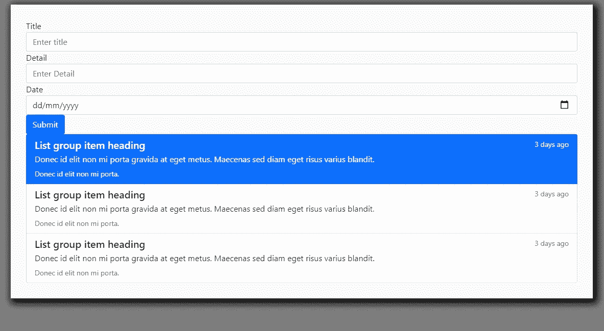

# 用 GraphQL，React，MongoDB 和 Apollo 创建一个 Todo App(客户端)

> 原文：<https://javascript.plainenglish.io/create-a-todo-app-with-graphql-react-mongodb-and-apollo-client-side-8a946d869014?source=collection_archive---------5----------------------->

## 了解如何在 React 应用程序中使用变异和查询

[在前一篇文章](/create-a-todo-app-with-graphql-react-mongodb-and-apollo-server-side-292ce42b9eea)中，我们已经创建了服务器端。

在本文中，我们将构建客户端并执行 CRUD 操作。

[第一部分:用 GraphQL、React、MongoDB 和 Apollo(服务器端)创建一个 Todo 应用](/create-a-todo-app-with-graphql-react-mongodb-and-apollo-server-side-292ce42b9eea)

[第二部分:用 GraphQL、React、MongoDB 和 Apollo(客户端)创建一个 Todo 应用](https://ckmobile.medium.com/create-a-todo-app-with-graphql-react-mongodb-and-apollo-client-side-8a946d869014)


源代码:

[](https://ckmobile.gumroad.com/l/graphql-apollo-mongodb-todo-app) [## 用 React GraphQL MongoDB 和 Apollo 创建一个 Todo 应用程序

### 为什么选择 GraphQL？GraphQL 使我们能够通过一个查询得到我们想要东西。例如，我们通常获取一个对象数组…

ckmobile.gumroad.com](https://ckmobile.gumroad.com/l/graphql-apollo-mongodb-todo-app) 

首先，我们创建一个名为“client”的文件夹，并通过输入“client folder”将其作为一个 React。然后打字

```
npm i create-react-app .
```

删除不必要的文件。


## 添加引导程序并添加表单

要使用引导程序，我们需要将 CDN 添加到公共文件夹的 index.html 中。

```
<link href="https://cdn.jsdelivr.net/npm/bootstrap@5.1.0/dist/css/bootstrap.min.css" rel="stylesheet" integrity="sha384-KyZXEAg3QhqLMpG8r+8fhAXLRk2vvoC2f3B09zVXn8CA5QIVfZOJ3BCsw2P0p/We" crossorigin="anonymous">
```

[我们转到引导表单文档并复制表单示例。](https://getbootstrap.com/docs/4.0/components/forms/)

在 App.js 中，删除小标签，删除标签，id 并将所有输入类型更改为文本。改变输入类型为日期为日期。

```
function App() {return (<div className="container"><form><div className="form-group"><label>Title</label><input type="text" className="form-control" placeholder="Enter title" /></div><div className="form-group"><label>Detail</label><input type="text" className="form-control" placeholder="Enter Detail" /></div><div className="form-group"><label >Date</label><input type="date" className="form-control" placeholder="Password" /></div><button type="submit" className="btn btn-primary">Submit</button></form></div>);}export default App;
```


# 添加自定义 CSS

创建名为 App.css 的文件

```
body{background-color: gray;;}.todobox{margin-top: 10px;padding:30px;background-color: #fafafa;-webkit-box-shadow: 5px 5px 15px 5px #000000;box-shadow: 5px 5px 15px 5px #000000;}
```

转到 App.js，导入 App.css，添加 todobox 样式。

```
**import './App.css';**function App() {return (<div className="container **todobox**"><form><div className="form-group"><label>Title</label><input type="text" className="form-control" placeholder="Enter title" /></div><div className="form-group"><label>Detail</label><input type="text" className="form-control" placeholder="Enter Detail" /></div><div className="form-group"><label >Date</label><input type="date" className="form-control" placeholder="Password" /></div><button type="submit" className="btn btn-primary">Submit</button></form></div>);}export default App;
```


# 添加列表组

[现在，我们需要将列表组添加到 App.js 中](https://getbootstrap.com/docs/4.0/components/list-group/)

```
import './App.css';function App() {return (<div className="container todobox"><form><div className="form-group"><label>Title</label><input type="text" className="form-control" placeholder="Enter title" /></div><div className="form-group"><label>Detail</label><input type="text" className="form-control" placeholder="Enter Detail" /></div><div className="form-group"><label >Date</label><input type="date" className="form-control" placeholder="Password" /></div><button type="submit" className="btn btn-primary">Submit</button></form><div className="list-group"><a href="#" className="list-group-item list-group-item-action flex-column align-items-start active"><div className="d-flex w-100 justify-content-between"><h5 className="mb-1">List group item heading</h5><small>3 days ago</small></div><p className="mb-1">Donec id elit non mi porta gravida at eget metus. Maecenas sed diam eget risus varius blandit.</p><small>Donec id elit non mi porta.</small></a><a href="#" className="list-group-item list-group-item-action flex-column align-items-start"><div className="d-flex w-100 justify-content-between"><h5 className="mb-1">List group item heading</h5><small className="text-muted">3 days ago</small></div><p className="mb-1">Donec id elit non mi porta gravida at eget metus. Maecenas sed diam eget risus varius blandit.</p><small className="text-muted">Donec id elit non mi porta.</small></a><a href="#" className="list-group-item list-group-item-action flex-column align-items-start"><div className="d-flex w-100 justify-content-between"><h5 className="mb-1">List group item heading</h5><small className="text-muted">3 days ago</small></div><p className="mb-1">Donec id elit non mi porta gravida at eget metus. Maecenas sed diam eget risus varius blandit.</p><small className="text-muted">Donec id elit non mi porta.</small></a></div></div>);}export default App;
```



我们可以看到输入框、提交按钮和列表组粘在一起。因此，我们需要为每个输入字段添加下边距，并为列表组添加上边距。

[添加删除图标](https://icons.getbootstrap.com/icons/trash/)，同时准备标题、细节和日期的占位符。

```
import './App.css';function App() {return (<div className="container todobox"><form>**<div className="form-group mb-3">**<label>Title</label><input type="text" className="form-control" placeholder="Enter title" /></div>**<div className="form-group mb-3">**<label>Detail</label><input type="text" className="form-control" placeholder="Enter Detail" /></div>**<div className="form-group mb-3">**<label >Date</label><input type="date" className="form-control" placeholder="Password" /></div><button type="submit" className="btn btn-primary">Submit</button></form><div className="list-group **mt-4**"><a href="#" className="list-group-item list-group-item-action flex-column align-items-start "><div className="d-flex w-100 justify-content-between"><h5 className="mb-1">Todo title</h5><small>todo date</small></div><p className="mb-1">Todo detail Todo detail Todo detail Todo detail. </p><small><svg  width="16" height="16" fill="currentColor" class="bi bi-trash" viewBox="0 0 16 16"><path d="M5.5 5.5A.5.5 0 0 1 6 6v6a.5.5 0 0 1-1 0V6a.5.5 0 0 1 .5-.5zm2.5 0a.5.5 0 0 1 .5.5v6a.5.5 0 0 1-1 0V6a.5.5 0 0 1 .5-.5zm3 .5a.5.5 0 0 0-1 0v6a.5.5 0 0 0 1 0V6z" /><path fill-rule="evenodd" d="M14.5 3a1 1 0 0 1-1 1H13v9a2 2 0 0 1-2 2H5a2 2 0 0 1-2-2V4h-.5a1 1 0 0 1-1-1V2a1 1 0 0 1 1-1H6a1 1 0 0 1 1-1h2a1 1 0 0 1 1 1h3.5a1 1 0 0 1 1 1v1zM4.118 4 4 4.059V13a1 1 0 0 0 1 1h6a1 1 0 0 0 1-1V4.059L11.882 4H4.118zM2.5 3V2h11v1h-11z" /></svg></small></a><a href="#" className="list-group-item list-group-item-action flex-column align-items-start "><div className="d-flex w-100 justify-content-between"><h5 className="mb-1">**Todo title**</h5><small>**todo date**</small></div><p className="mb-1">**Todo detail Todo detail Todo detail Todo detail**. </p><small>**<svg  width="16" height="16" fill="currentColor" class="bi bi-trash" viewBox="0 0 16 16">****<path d="M5.5 5.5A.5.5 0 0 1 6 6v6a.5.5 0 0 1-1 0V6a.5.5 0 0 1 .5-.5zm2.5 0a.5.5 0 0 1 .5.5v6a.5.5 0 0 1-1 0V6a.5.5 0 0 1 .5-.5zm3 .5a.5.5 0 0 0-1 0v6a.5.5 0 0 0 1 0V6z" />****<path fill-rule="evenodd" d="M14.5 3a1 1 0 0 1-1 1H13v9a2 2 0 0 1-2 2H5a2 2 0 0 1-2-2V4h-.5a1 1 0 0 1-1-1V2a1 1 0 0 1 1-1H6a1 1 0 0 1 1-1h2a1 1 0 0 1 1 1h3.5a1 1 0 0 1 1 1v1zM4.118 4 4 4.059V13a1 1 0 0 0 1 1h6a1 1 0 0 0 1-1V4.059L11.882 4H4.118zM2.5 3V2h11v1h-11z" />****</svg>**</small></a></div></div>);}export default App;
```

## 导入 Apollo 客户端和 GraphQL

转到终端，在客户端文件夹内。

```
npm install @apollo/client graphql
```

index.js 内部

```
import React from 'react';import ReactDOM from 'react-dom';import App from './App';**import { ApolloClient, InMemoryCache, ApolloProvider } from "@apollo/client"****const client = new ApolloClient({****uri: 'http://localhost:5000/graphql',****cache: new InMemoryCache()****})**ReactDOM.render(<ApolloProvider client={client}><App /></ApolloProvider>,document.getElementById('root'));
```

启动 Node.js 服务器，并启动 React 应用程序。应该不会出现错误。

## 创建一个 GraphQL 文件夹

创建 graphQL 文件夹，并在该文件夹中创建 Mutation.js 和 Query.js。

```
import { gql } from '@apollo/client';export const GET_TODOS = gql`{getTodos{idtitledetaildate}}`
```

在 App.js 中，从 apollo 客户端导入 useQuery，并从 Query.js 导入 GET_TODOS

然后我们 console.log('data '，data)看看数据能不能取回来。

```
import './App.css';**import { GET_TODOS } from './graphql/Query';****import { useQuery, useMutation } from '@apollo/client'**function App() {**const { loading, error, data } = useQuery(GET_TODOS);****console.log('data', data)**return (<div className="container todobox">
```


The data displayed in the console

## 渲染 todos

导入时刻，因为我们需要呈现日期

我们还添加了两个 if 子句来检查是否有加载和错误情况

如果没有问题，它将呈现数据。getTodos，我们将显示标题，细节和日期。我们将使用时刻来格式化日期

```
function App() {const { loading, error, data } = useQuery(GET_TODOS);console.log('data', data)**if (loading) return <p>loading...</p>****if (error) return <p>{error.message}</p>**return (<div className="container todobox"><form><div className="form-group mb-3"><label>Title</label><input type="text" className="form-control" placeholder="Enter title" /></div><div className="form-group mb-3"><label>Detail</label><input type="text" className="form-control" placeholder="Enter Detail" /></div><div className="form-group mb-3"><label >Date</label><input type="date" className="form-control" placeholder="Password" /></div><button type="submit" className="btn btn-primary">Submit</button></form><div className="list-group mt-4">{data?.getTodos.map(todo => (<a href="#" className="list-group-item list-group-item-action flex-column align-items-start "><div className="d-flex w-100 justify-content-between">**<h5 className="mb-1">{todo.title}</h5>****<small>{moment(todo.date).format("MMM Do YY")}</small>**</div>**<p className="mb-1">{todo.detail} </p>**<small><svg  width="16" height="16" fill="currentColor" className="bi bi-trash" viewBox="0 0 16 16"><path d="M5.5 5.5A.5.5 0 0 1 6 6v6a.5.5 0 0 1-1 0V6a.5.5 0 0 1 .5-.5zm2.5 0a.5.5 0 0 1 .5.5v6a.5.5 0 0 1-1 0V6a.5.5 0 0 1 .5-.5zm3 .5a.5.5 0 0 0-1 0v6a.5.5 0 0 0 1 0V6z" /><path fillRule="evenodd" d="M14.5 3a1 1 0 0 1-1 1H13v9a2 2 0 0 1-2 2H5a2 2 0 0 1-2-2V4h-.5a1 1 0 0 1-1-1V2a1 1 0 0 1 1-1H6a1 1 0 0 1 1-1h2a1 1 0 0 1 1 1h3.5a1 1 0 0 1 1 1v1zM4.118 4 4 4.059V13a1 1 0 0 0 1 1h6a1 1 0 0 0 1-1V4.059L11.882 4H4.118zM2.5 3V2h11v1h-11z" /></svg></small></a>))}</div></div>);}export default App;
```

## 将输入表单和列表项提取到组件

创建一个组件文件夹。在组件文件夹中，我们添加了 AddTodo.js 和 Todo.js

在 AddTodo.js 下

```
import React from 'react'const AddTodos = () => {return (<form><div className="form-group mb-3"><label>Title</label><input type="text" className="form-control" placeholder="Enter title" /></div><div className="form-group mb-3"><label>Detail</label><input type="text" className="form-control" placeholder="Enter Detail" /></div><div className="form-group mb-3"><label >Date</label><input type="date" className="form-control" placeholder="Password" /></div><button type="submit" className="btn btn-primary">Submit</button></form>)}export default AddTodos
```

在 Todo.js 下，我们从 moment 导入 moment。移除 App.js 中的力矩，因为我们不需要 App.js 中的力矩

现在我们析构道具来获得标题、细节和日期。

```
import React from 'react'import moment from 'moment';const Todo = (**{ title, detail, date }**) => {return (<a href="#" className="list-group-item list-group-item-action flex-column align-items-start "><div className="d-flex w-100 justify-content-between">**<h5 className="mb-1">{title}</h5>****<small>{moment(date).format("MMM Do YY")}</small>**</div>**<p className="mb-1">{detail} </p>**<small><svg  width="16" height="16" fill="currentColor" className="bi bi-trash" viewBox="0 0 16 16"><path d="M5.5 5.5A.5.5 0 0 1 6 6v6a.5.5 0 0 1-1 0V6a.5.5 0 0 1 .5-.5zm2.5 0a.5.5 0 0 1 .5.5v6a.5.5 0 0 1-1 0V6a.5.5 0 0 1 .5-.5zm3 .5a.5.5 0 0 0-1 0v6a.5.5 0 0 0 1 0V6z" /><path fillRule="evenodd" d="M14.5 3a1 1 0 0 1-1 1H13v9a2 2 0 0 1-2 2H5a2 2 0 0 1-2-2V4h-.5a1 1 0 0 1-1-1V2a1 1 0 0 1 1-1H6a1 1 0 0 1 1-1h2a1 1 0 0 1 1 1h3.5a1 1 0 0 1 1 1v1zM4.118 4 4 4.059V13a1 1 0 0 0 1 1h6a1 1 0 0 0 1-1V4.059L11.882 4H4.118zM2.5 3V2h11v1h-11z" /></svg></small></a>)}export default Todo
```

Inside App.js

```
import './App.css';import { GET_TODOS } from './graphql/Query';import { useQuery, useMutation } from '@apollo/client'import AddTodos from './components/AddTodos';import Todo from './components/Todo';function App() {const { loading, error, data } = useQuery(GET_TODOS);console.log('data', data)if (loading) return <p>loading...</p>if (error) return <p>{error.message}</p>return (<div className="container todobox"><AddTodos /><div className="list-group mt-4">{data?.getTodos.map(todo => (<Todo key={todo.id}title={todo.title}detail={todo.detail}date={todo.date}/>))}</div></div>);}export default App;
```

现在，如果一切正常，网络应该像以前一样没有任何错误。

## 创建待办事项

转到 Mutation.js

```
import { gql } from '@apollo/client'export const ADD_TODO = gql`mutation addTodo($title:String,$detail:String,$date:Date){addTodo(title:$title,detail:$detail,date:$date){idtitledetaildate}}`
```

转到 AddTodo.js，导入 useMutation，然后从 ADD_TODO 获取 AddTodo。

创建 onSubmit 函数，从 e.target.elements 中析构标题、细节和日期。

添加标题等于 title.value、细节等于 detail.value、日期等于 date.value 的 todo。添加 todo 后，使用 refetch 查询来重新提取最新的 todo 列表。

```
import React, {useState} from 'react';import { useMutation } from '@apollo/client';import { ADD_TODO } from '../graphql/Mutation';import { GET_TODOS } from '../graphql/Query';const AddTodos = () => {
  const [todo, setTodo] = useState({title: '',detail: '',date: ''})const [addTodo] = useMutation(ADD_TODO)const onSubmit = e => {e.preventDefault();addTodo({variables: {title: todo.title,detail: todo.detail,date: todo.date},refetchQueries: [{ query: GET_TODOS }]})}return (<form onSubmit={onSubmit}><div className="form-group mb-3"><label>Title</label><input type="text" name="title" className="form-control" placeholder="Enter title"value={todo.title}onChange={e => setTodo({ ...todo, title: e.target.value })}/></div><div className="form-group mb-3"><label>Detail</label><input type="text" name="detail" className="form-control" placeholder="Enter Detail"value={todo.detail}onChange={e => setTodo({ ...todo, detail: e.target.value })}/></div><div className="form-group mb-3"><label >Date{moment(todo.date).format('yyyy-MM-DD')}</label><input type="date" name="date" className="form-control"value={moment(todo.date).format('yyyy-MM-DD')}onChange={e => setTodo({ ...todo, date: e.target.value })}/></div><button type="submit" className="btn btn-primary">Submit</button></form>)}export default AddTodos
```

如果我们输入标题、细节和日期，它将显示在列表中


如果我们忘记了输入标题，您将看到以下错误。


输入 if 子句检查标题是否有值。如果没有输入值，则提示消息“请输入标题”。

```
const onSubmit = e => {e.preventDefault();const { title, detail, date } = e.target.elements;if (!title.value) {alert('Please enter a title')}addTodo({variables: {title: title.value,detail: detail.value,date: date.value},refetchQueries: [{ query: GET_TODOS }]})}
```

## 删除特定的待办事项

首先，我们需要去 Mutation.js

```
export const DELETE_TODO = gql`mutation deleteTodo($id: ID) {deleteTodo(id: $id)}`;
```

然后我们转到组件 Todo.js，导入 useMutation，从 Mutation.js 导入 DELETE_TODO，从 Query.js 导入 GET_TODOS。

获取 deleteTodo，然后在我们的“removeTodo”函数中使用它。

在我们移除特定的 todo 之后，我们重新获取最新的 todos 数组。

在我们完成“removeTodo”函数后，我们希望将它绑定到删除按钮。但是在继续之前，我们需要将 id 属性添加到 Todo 组件中。

```
data?.getTodos.map(todo => (<Todo key={todo.id}**id={todo.id}**title={todo.title}detail={todo.detail}date={todo.date}/>)
```

现在我们可以将它绑定到垃圾桶图标。

```
<small onClick={()=>removeTodo(id)}import React from 'react'import moment from 'moment';**import { useMutation } from '@apollo/client';****import { DELETE_TODO } from '../graphql/Mutation';****import { GET_TODOS } from '../graphql/Query';**const Todo = ({ **id**,title, detail, date }) => {console.log('id',id)const [deleteTodo ] = useMutation(DELETE_TODO);const removeTodo=(id)=>{console.log('delete id',id)deleteTodo({variables:{id:id} ,refetchQueries: [{ query: GET_TODOS }]})}return (<a href="#" className="list-group-item list-group-item-action flex-column align-items-start "><div className="d-flex w-100 justify-content-between"><h5 className="mb-1">{title}</h5><small>{moment(date).format("MMM Do YY")}</small></div><p className="mb-1">{detail} </p><small onClick={()=>removeTodo(id)}><svg  width="16" height="16" fill="currentColor" className="bi bi-trash" viewBox="0 0 16 16"><path d="M5.5 5.5A.5.5 0 0 1 6 6v6a.5.5 0 0 1-1 0V6a.5.5 0 0 1 .5-.5zm2.5 0a.5.5 0 0 1 .5.5v6a.5.5 0 0 1-1 0V6a.5.5 0 0 1 .5-.5zm3 .5a.5.5 0 0 0-1 0v6a.5.5 0 0 0 1 0V6z" /><path fillRule="evenodd" d="M14.5 3a1 1 0 0 1-1 1H13v9a2 2 0 0 1-2 2H5a2 2 0 0 1-2-2V4h-.5a1 1 0 0 1-1-1V2a1 1 0 0 1 1-1H6a1 1 0 0 1 1-1h2a1 1 0 0 1 1 1h3.5a1 1 0 0 1 1 1v1zM4.118 4 4 4.059V13a1 1 0 0 0 1 1h6a1 1 0 0 0 1-1V4.059L11.882 4H4.118zM2.5 3V2h11v1h-11z" /></svg></small></a>)}export default Todo
```


## 检测是否处于编辑模式

我们需要从“react”导入 useEffect。

```
useEffect(() => {const checkIfClickedOutside = e => {if (!inputAreaRef.current.contains(e.target)) {console.log('outside input area')// setselectedId(0)} else {console.log('inside input area')}}document.addEventListener("mousedown", checkIfClickedOutside)return () => {// Cleanup the event listenerdocument.removeEventListener("mousedown", checkIfClickedOutside)}}, [])
```

将 inputAreaRef 绑定到表单

```
<form onSubmit={onSubmit} ref={inputAreaRef}><div className="form-group mb-3"><label>Title</label><input type="text" name="title" className="form-control" placeholder="Enter title" /></div><div className="form-group mb-3"><label>Detail</label><input type="text" name="detail" className="form-control" placeholder="Enter Detail" /></div><div className="form-group mb-3"><label >Date</label><input type="date" name="date" className="form-control" placeholder="Password" /></div><button type="submit" className="btn btn-primary">Submit</button></form>
```

当点击输入区域时，你应该在控制台内看到“内部输入区域”,当点击其他区域时，你应该看到“外部输入区域”。


## 使用 TodoContext 存储所选的 Id

在“src”文件夹中创建 TodoContext.js

```
import {createContext} from 'react';export const TodoContext = createContext(null)
```

转到 App.js

导入 TodoContext 和 useState

```
import {TodoContext} from './TodoContext';import { useState } from 'react';
```

设置 selectedId 的默认值为 0。然后我们使用 TodoContext。提供者包装整个应用程序，传递 selectedId 和 setselectedId。

```
function App() {const { loading, error, data } = useQuery(GET_TODOS);console.log('data', data)**const [selectedId, setselectedId] = useState(0)**if (loading) return <p>loading...</p>if (error) return <p>{error.message}</p>return (**<TodoContext.Provider value={{selectedId,setselectedId}}>**<div className="container todobox"><AddTodos /><div className="list-group mt-4">{data?.getTodos.map(todo => (<Todo key={todo.id}id={todo.id}title={todo.title}detail={todo.detail}date={todo.date}/>))}</div></div>**</TodoContext.Provider>**);}export default App;
```

现在，无论是在 AddTodos 组件还是 Todo 组件，我们都可以获得 selectedId 值。

位于 AddTodos component.js

```
import React, { useContext, useEffect, useRef } from 'react';import { useMutation } from '@apollo/client';import { ADD_TODO } from '../graphql/Mutation';import { GET_TODOS } from '../graphql/Query';**import { TodoContext } from '../TodoContext';**const AddTodos = () => {**const { selectedId, setselectedId } = useContext(TodoContext)**const [addTodo] = useMutation(ADD_TODO)const inputAreaRef = useRef();<h5 className="mb-1">{title} | {selectedId}</h5>
```

在 Todos component.js 上，

```
import React, { useContext } from 'react'import moment from 'moment';import { useMutation } from '@apollo/client';import { DELETE_TODO } from '../graphql/Mutation';import { GET_TODOS } from '../graphql/Query';**import { TodoContext } from '../TodoContext';**const Todo = ({ id,title, detail, date }) => {**const { selectedId, setselectedId } = useContext(TodoContext)**const [deleteTodo ] = useMutation(DELETE_TODO);<button type="submit" className="btn btn-primary">Submit | {selectedId}</button>
```


## 更改用户界面并依赖于选定的 ID

现在我们要用 selectedID 的值来改变 UI，如果值为 0，那么按钮文本为“Submit”，否则为“Update”。

在 AddTodos.js 中，我们检查用户是否在输入区域外单击，我们将 selectedId 设置为 0。

```
useEffect(() => {const checkIfClickedOutside = e => {if (!inputAreaRef.current.contains(e.target)) {console.log('outside input area')setselectedId(0)} else {console.log('inside input area')}}document.addEventListener("mousedown", checkIfClickedOutside)return () => {// Cleanup the event listenerdocument.removeEventListener("mousedown", checkIfClickedOutside)}}, [])<form onSubmit={onSubmit} ref={inputAreaRef}><div className="form-group mb-3"><label>Title</label><input type="text" name="title" className="form-control" placeholder="Enter title" /></div><div className="form-group mb-3"><label>Detail</label><input type="text" name="detail" className="form-control" placeholder="Enter Detail" /></div><div className="form-group mb-3"><label >Date</label><input type="date" name="date" className="form-control" placeholder="Password" /></div>**<button type="submit" className="btn btn-primary">{(selectedId==0)?'Add':'Update'}</button>**</form>)
```

在 Todos.js 里面，

当用户单击列表项时，它会将 selectedId 设置为该 todo。

```
**<a onClick={()=>setselectedId(id)}**href="#" className="list-group-item list-group-item-action flex-column align-items-start "><div className="d-flex w-100 justify-content-between"><h5 className="mb-1">{title} | {selectedId}</h5><small>{moment(date).format("MMM Do YY")}</small></div><p className="mb-1">{detail} </p><small onClick={()=>removeTodo(id)}><svg  width="16" height="16" fill="currentColor" className="bi bi-trash" viewBox="0 0 16 16"><path d="M5.5 5.5A.5.5 0 0 1 6 6v6a.5.5 0 0 1-1 0V6a.5.5 0 0 1 .5-.5zm2.5 0a.5.5 0 0 1 .5.5v6a.5.5 0 0 1-1 0V6a.5.5 0 0 1 .5-.5zm3 .5a.5.5 0 0 0-1 0v6a.5.5 0 0 0 1 0V6z" /><path fillRule="evenodd" d="M14.5 3a1 1 0 0 1-1 1H13v9a2 2 0 0 1-2 2H5a2 2 0 0 1-2-2V4h-.5a1 1 0 0 1-1-1V2a1 1 0 0 1 1-1H6a1 1 0 0 1 1-1h2a1 1 0 0 1 1 1h3.5a1 1 0 0 1 1 1v1zM4.118 4 4 4.059V13a1 1 0 0 0 1 1h6a1 1 0 0 0 1-1V4.059L11.882 4H4.118zM2.5 3V2h11v1h-11z" /></svg></small></a>
```

## 创建更新功能

在 Mutation.js 中，创建一个常量 UPDATE_TODO

```
export const UPDATE_TODO = gql`mutation updateTodo($id:String,$title:String,$detail:String,$date:Date){updateTodo(id:$id,title:$title,detail:$detail,date:$date){idtitledetaildate}}
```

转到 AddTodos.js，从突变导入 UPDATE_TODO

```
import { ADD_TODO, UPDATE_TODO } from '../graphql/Mutation';
```

从 UPDATE_TODO 中获取 updateTodo

```
const [updateTodo] = useMutation(UPDATE_TODO)
```

然后，我们将修改添加到 onSubmit 函数中，如果 selectedId 等于 0，则意味着它正在提交新的 todo，因此我们使用 addTodo 变异，否则我们使用 updateTodo 变异。

```
const onSubmit = e => {e.preventDefault();const { title, detail, date } = e.target.elements;if (!title.value) {alert('Please enter a title')}if (selectedId == 0) {addTodo({variables: {title: title.value,detail: detail.value,date: date.value},refetchQueries: [{ query: GET_TODOS }]})} else {updateTodo({variables: {id: selectedId,title: title.value,detail: detail.value,date: date.value},refetchQueries: [{ query: GET_TODOS }]})}}
```

如果我们测试它，在我们点击一个 todo 之后，然后如果我们在输入域中输入一些东西，它将更新那个特定的 todo。

## 获取单个待办事项

现在，您可以看到，如果我们单击列表项，我们希望该 todo 的值应该显示在输入框中，所以现在我们希望获得特定 todo 的值

在 Query.js 创建一个 getTodo 查询。

```
export const GET_TODO = gql`query getTodo($id:ID){getTodo(id:$id){idtitledetaildate}}`
```

我们创建一个名为“todo”的状态来存储该 todo 的值。

```
const [todo, setTodo] = useState({title: '',detail: '',date: ''})
```

在 AddTodo.js 中，使用 useMutation 提取 updateTodo。获得数据后，我们将 todo 设置为 data.getTodo。

```
const { loading, error, data } = useQuery(GET_TODO, {variables: { id: selectedId }, onCompleted: (data) => setTodo(data.getTodo)});
```

在表单中，

```
return (<form onSubmit={onSubmit} ref={inputAreaRef}><pre>{JSON.stringify(todo)}</pre><p>{moment(todo.date).format('yyyy-MM-DD')}</p><div className="form-group mb-3"><label>Title</label><input type="text" name="title" className="form-control" placeholder="Enter title"**value={todo.title}****onChange={e => setTodo({ ...todo, title: e.target.value })}**/></div><div className="form-group mb-3"><label>Detail</label><input type="text" name="detail" className="form-control" placeholder="Enter Detail"**value={todo.detail}****onChange={e => setTodo({ ...todo, detail: e.target.value })}**/></div><div className="form-group mb-3"><label >Date{moment(todo.date).format('yyyy-MM-DD')}</label><input type="date" name="date" className="form-control"**value={moment(todo.date).format('yyyy-MM-DD')}****onChange={e => setTodo({ ...todo, date: e.target.value })}**/></div><button type="submit" className="btn btn-primary">{(selectedId == 0) ? 'Add' : 'Update'}</button></form>
```

如果不在编辑模式下，我们也想清除所有的东西。所以在 useEffect 中，如果用户在输入区域之外点击。我们将把 todo 的所有属性重置为空字符串。

```
useEffect(() => {const checkIfClickedOutside = e => {if (!inputAreaRef.current.contains(e.target)) {console.log('outside input area')setselectedId(0)setTodo({title: '',detail: '',date: ''})} else {console.log('inside input area')}}document.addEventListener("mousedown", checkIfClickedOutside)return () => {// Cleanup the event listenerdocument.removeEventListener("mousedown", checkIfClickedOutside)}}, [])
```


example of showing the value when clicking on one of the item.

关注我们: [Gumroad 课程](https://app.gumroad.com/ckmobile)， [YouTube](https://www.youtube.com/channel/UCu4-4FnutvSHVo9WHvq80Ww?sub_confirmation=1) ， [Medium](https://ckmobile.medium.com/) ， [Udemy](https://www.udemy.com/user/cyruschan2/) ， [Linkedin](https://www.linkedin.com/company/ckmobi/) ， [Twitter](https://twitter.com/ckmobilejavasc1) ， [Instagram](https://www.instagram.com/ckmobile8050) ， [JPEX](https://jp-ex.io/register?code=S6Gcvun6)