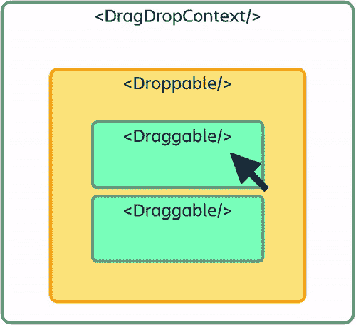
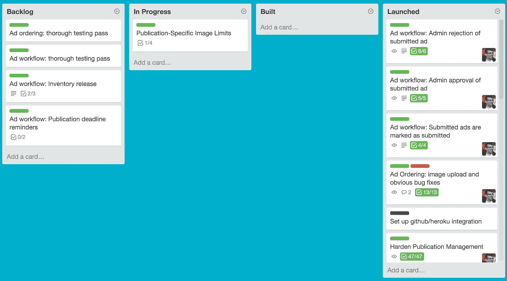
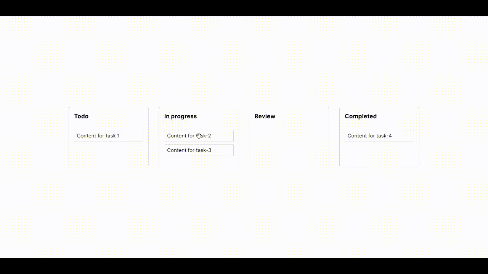

# 使用 React 创建 JIRA/特雷罗克隆体

> 原文：<https://javascript.plainenglish.io/create-a-trello-clone-with-react-6eca324f155a?source=collection_archive---------0----------------------->


如果你曾经在大型 IT 公司工作过，我相信你一定遇到过像 JIRA 或特雷罗这样的项目管理工具。这些工具利用[看板](https://en.wikipedia.org/wiki/Kanban_(development))来创建工作流，将复杂的任务分解成单个的、更易管理的块。这些方法提高了效率和生产力，也使每个人都容易有效地协作。

在这篇博文中，我们将使用 React 构建类似的东西。

## 设置

如标题所述，在本教程中，我们将使用**反应堆**。在一个空文件夹中创建一个新的 react 项目。

```
npx create-react-app react-kanban
```

创建项目后，在目录中安装这些依赖项。

```
npm i react-beautiful-dnd styled-components
```

[**React beautiful dnd**](https://www.npmjs.com/package/react-beautiful-dnd)是一个令人惊叹的库，可以让你用最少的代码创建**拖放**列表。它有很多特性，是一个全面的健壮的库，如果你想自己从头开始创建一个拖放列表，它可以消除很多顾虑。

[**样式化组件**](https://styled-components.com/) 是一个**‘CSS-in-JS’**库，允许您在组件文件中添加样式。因为它是 JS 内部的 CSS，所以您可以使用模板字符串有条件地样式化您的组件。
(你不需要特别使用这个库，你可以使用任何你喜欢的样式模式。)

在开始编写代码之前，让我们简要地浏览一下这个库的核心组件。



DragDropContext 组件是根容器，它基本上封装了您希望启用拖放功能的应用程序部分。

**drop able**顾名思义，就是一个部件可以掉落的块。

一个**可拖动的**块可以四处拖动。

这三个组件有它们自己的一套规则和属性，当我们在应用程序中创建它们时，我们需要遵守这些规则和属性。

# 步骤 1:创建一个 DragDropContext

因为本教程主要关注如何构建拖放列表，所以我们不会涉及任何数据库或 API 调用。相反，我们将简单地为这个例子创建一个**虚拟数据集**对象。这个对象应该给你在使用这个库时如何设置你自己的数据结构的要点。

在根目录下创建一个名为 **dataset.js** 的文件，复制下面的代码。

```
const dataset = {
  tasks: {
    "task-1": { id: "task-1", content: "Content for task 1" },
    "task-2": { id: "task-2", content: "Content for task-2" },
    "task-3": { id: "task-3", content: "Content for task-3" },
    "task-4": { id: "task-4", content: "Content for task-4" }
  },
  columns: {
    "column-1": { id: "column-1", title: "Todo", taskIds: ['task-1']},
    "column-2": { id: "column-2", title: "In progress", taskIds: ['task-2', 'task-3'] },
    "column-3": { id: "column-3", title: "Review", taskIds: [] },
    "column-4": { id: "column-4", title: "Completed", taskIds: ["task-4"] }
},columnOrder: ["column-1", "column-2", "column-3", "column-4"]}export default dataset
```

我们的数据集是一个简单的对象，有三个属性。

**任务:我们列表中的单个任务项**
每个项都有一个 id 和一些文本内容。

**列** : **将包含任务的不同列** 每列都有一个 id、一个标题和它将包含的任务 id 列表。

**ColumnOrder:列最初放置的顺序**



如果你看这个截屏，我们有 4 列，有一些**预定义的顺序**。这些列有自己的一组任务，可以从一列拖到另一列。

打开 App.js 文件，并将其替换为以下代码。

App.js

我们已经在这里导入了我们的数据集。我们还从 react-beautiful-dnd 导入了 **DragDropContext** 和**drop able**。

在我们的组件中，我们首先在 useState 钩子中初始化数据集。

我们示例中的 **DragDropContext** 将是主容器。该组件需要一个名为 **onDragEnd** 的强制事件，每当**一个可拖动对象完成将**从一点拖动到另一点时，该事件就会被触发。我们将在下一步定义这个方法。

**drop able**是 DragDropContext 中的一个容器，它将保存我们所有的列。

*   我们给它一个**dropbableid**prop，它基本上充当可丢弃对象的唯一标识符。
*   一个**方向**道具可以让你在那个特定的方向拖放元素。所以对于列，我们想要水平地拖动它们**。**
*   ****类型**道具描述了我们可投放的类型。该块的可删除类型将是**列**。稍后我们将把**任务**作为另一个可删除的类型。**

**在这个 Droppable 中，我们将有一个返回 React 组件的函数。(这就是可拖放和可拖动 API 的工作方式，它们**都期望一个函数返回一个 React 组件**，作为子组件。)这个函数得到两个参数，**提供**和**快照。****

****容器**组件，是我们使用样式化组件创建的组件。它只是我们的列的一个 **flex 容器**。**

**它接受一些道具**

*   ****provided . inner ref**:
    为了使 droppable 正常工作，您必须将 **provided.innerRef** 绑定到 ReactElement 中尽可能高的 DOM 节点。我们这样做是为了避免使用 ReactDOM 查找 DOM 节点。**
*   ****provided . dropbableprops:**
    这是一个对象，它包含需要应用到可拖放元素的属性。它需要应用到你应用 **provided.innerRef** 的同一个元素。**

**在容器内部，我们映射来自数据集中的 **columnOrder** 数组，并返回一个 **Column** 组件(我们将在后面创建它)以及一组属性: **key** (列 id)、 **column** (来自数据集的列数据)、 **tasks** (来自数据集的任务数据)、 **index** 。**

**最后，在底部，我们提供了一个**占位符。**用于在拖动过程中根据需要在 Droppable 中创建空间。当用户在不是主列表的列表上拖动时，需要这个空间。请确保将占位符放在您提供了引用的组件内。**

**在继续创建列组件之前，我们将在 App 组件中定义 **onDragEnd** 方法。**

**这可能看起来有点复杂，但实际上并不复杂。我们将一个接一个地检查每个街区。
作为论证我们得到一个**结果**对象。这个结果对象有不同的属性，我们将从这些属性中使用**目的地**、**源**、**类型**和 **draggableId** 。**

**我们先检查到**看看是否有目的地**。如果没有，我们就直接从函数中返回。**

**然后我们检查**用户是否从他开始的地方拖拽了一个组件到相同的位置**。如果是，我们就退出函数。**

**仅当类型为**列**时，即当您水平移动列时，下一个“if”程序块才会运行。如果我们在列内移动任务，这个块不会运行。所以在这个街区我们首先，**

*   **复制一份我们的专栏。**
*   **使用拼接将柱从其原始位置移除。**
*   **再次使用拼接将柱替换到新位置。**
*   **取代我们州的这个新订单。**

**(这种策略是重新排列数组中项目的一种方式。可以用自己的策略)**

**在此 if 块列之后，当您拖动任务项时，您看到的任何代码都会被触发。**

**我们首先为我们的任务初始化一个**开始**和**结束**点。这些是从你**开始拖动任务到放下任务的点。****

**现在，如果你已经**在同一列**中放下了一个任务，即改变了它的垂直顺序，我们运行一个类似的重新排列策略，就像我们在“如果”列块的情况下所做的那样。**

**相反，如果您**将任务放在不同的列**中，我们必须**改变开始列数组和结束列数组**的 taskIds，因为每个数组(列)的任务计数现在已经改变。**

**这基本上是我们希望发生的事情**翁德拉根**。**

**现在我们将创建我们的列组件。在根目录下创建一个名为 **Column.js** 的文件，并复制下面的代码。**

**这个组件代表我们看板中的一个单独的列。它与我们的应用程序组件非常相似。**

**我们有 3 个定义了一些样式的组件。
-一个**容器**，它基本上充当我们任务的**垂直**伸缩容器。
-显示列的**名称的**标题**属性。
-一个**任务列表**，它将保存所有任务组件(将在此之后创建)****

*   **可拖动组件类似于可拖放组件。我们传入 **draggableId** 和一个**索引**属性给它。**
*   **它也有一个函数返回一个 React 组件，就像一个 Droppable。**
*   **返回的组件是我们的容器。该容器将具有来自所提供参数的 **innerRef** 和 **draggableProps** 。(你可以在这里看到图案。)**
*   **我们还有一个带有**dragchandleprops**的标题组件，因为我们只希望该列可以从标题部分拖动。**
*   **然后，我们有一个类似的道具可丢弃的部分。任务将被放入这个可放置的部分。**
*   **TaskList 组件将包含每一列的所有任务。TaskList 组件用一些道具来呈现任务组件(将在下一步中创建)。
    我们还在这里使用了**快照**属性来根据拖动状态改变列的颜色。**

**最后，对于任务组件，在根目录下创建一个名为 **Task.js** 的文件，并复制下面的代码。**

**同样，非常类似于列组件，我们有一个可拖动的类似道具。我们有一个函数作为 **Draggable 的子函数，它返回一个 React 组件。****

**这个 react 组件是一个样式化的容器组件，就像我们在列组件文件中一样。我们将 **draggableProps** 、**dragchandleprops**、 **innerRef** 传递给这个 react 元素。**

**我们还使用 **snapshot.isDragging** 来检查可拖动的状态。使用它，我们可以有条件地设置任务背景的样式，向用户显示它正在被拖动，就像我们在 Column 组件中所做的那样。**

**现在，如果你打开你的终端，输入 **npm start，**你会发现一个类似的应用程序。**

****

**Final project**

# **结论**

**就是这样！现在你有了一个用 React beautiful dnd 构建的功能看板。请随意调整代码，用一些额外的业务逻辑和更好的风格制作一个更好的版本。**

**你可以在[这里](https://github.com/AkileshRao/react-kanban)找到这个项目的代码。你可以在这里找到这个应用[的现场演示。如果您有任何与项目相关的疑问，请发表评论。我也经常在 youtube 上发布编程内容，所以一定要去看看，](https://ak-react-kanban.netlify.app/)[这里](https://t.co/IO2spWubW9?amp=1)。干杯！**

***更多内容请看*[***plain English . io***](https://plainenglish.io/)**