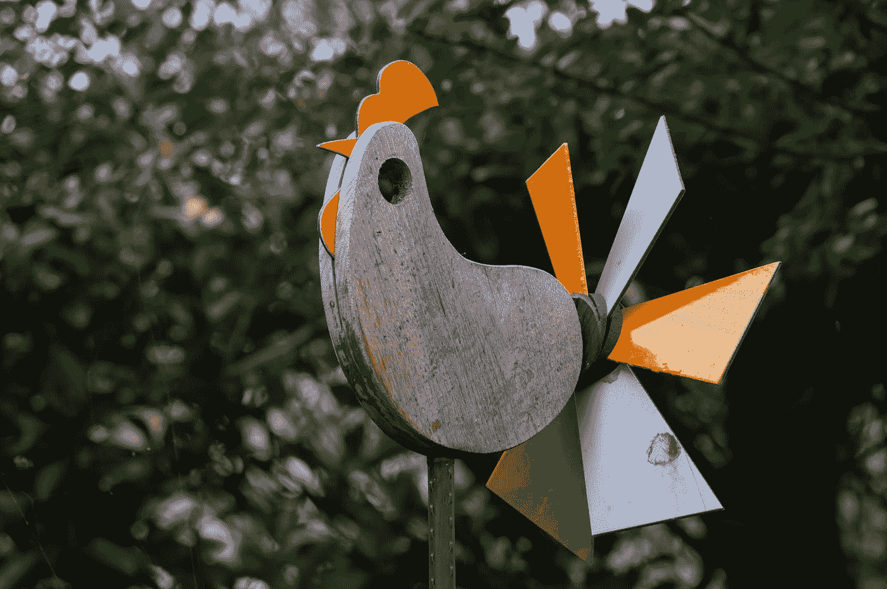

# 用 React 和 JavaScript 创建一个打地鼠游戏

> 原文：<https://javascript.plainenglish.io/create-a-whack-a-mole-game-with-react-and-javascript-4e4743e034af?source=collection_archive---------4----------------------->



Photo by [Al Soot](https://unsplash.com/@anspchee?utm_source=medium&utm_medium=referral) on [Unsplash](https://unsplash.com?utm_source=medium&utm_medium=referral)

React 是一个易于使用的 JavaScript 框架，让我们可以创建前端应用程序。

在本文中，我们将看看如何用 React 和 JavaScript 创建一个打地鼠游戏。

# 创建项目

我们可以用 Create React App 创建 React 项目。

要安装它，我们运行:

```
npx create-react-app whack-a-mole
```

和 NPM 一起创建我们的 React 项目。

# 创建一个打地鼠游戏

为了创建打地鼠游戏，我们编写:

```
import React, { useState } from "react";export default function App() {
  const [index, setIndex] = useState(0);
  const [score, setScore] = useState(0);
  const [timer, setTimer] = useState(); const generateIndex = () => {
    setIndex(Math.floor(Math.random() * 6));
  }; const startGame = () => {
    const timer = setInterval(generateIndex, 2000);
    setTimer(timer);
  }; const endGame = () => {
    clearInterval(timer);
    setScore(0);
    setIndex(0);
  }; const onClick = (n) => {
    if (index === n) {
      setScore((score) => score + 1);
    }
  }; return (
    <div>
      <style>
        {`
        .hole {
          width: 50px;
          height: 50px;
          border: 1px solid black;
          border-radius: 50%;
        }

        .container {
          display: inline-block;
        }

        img {
          width: 50px;
          height: 50px;
        }
      `}
      </style>
      <button onClick={startGame}>start game</button>
      <button onClick={endGame}>end game</button>
      <p>score: {score}</p>
      <div>
        {Array(6)
          .fill()
          .map((_, n) => {
            if (index === n) {
              return (
                <div className="container">
                   onClick(n)}
                  />
                </div>
              );
            } else {
              return (
                <div className="container">
                  <div className="hole"></div>
                </div>
              );
            }
          })}
      </div>
    </div>
  );
}
```

我们创建了`index`、`score`和`timer`状态。

`index`是显示鼹鼠的 div 的索引。

在那下面，我们有`generateIndex`函数来生成显示模型的索引。

`startGame`调用`setInterval`启动定时器。

我们调用`setTimer`来设置返回的`timer`。

`endGame`函数调用`clearInterval`来清除定时器。

它还调用`setScore`和`setIndex`将`score`和`index`的值重置为 0。

此外，我们还有`onClick`功能来检查`index`是否与`n`相同。

`n`是我们点击的 div 的索引。

如果它们相同，那么我们通过回调调用`setScore`来增加分数，以返回现有的`score`加 1。

在那之下，我们有一些样式来使 div 变圆。

我们用`border-radius`轮着他们。

在那下面，我们有按钮，点击它们分别调用`startGame`和`endGame`。

然后我们添加`score`显示。

最后，我们将一个包含 6 个插槽的数组渲染到 div 中。

如果`index`与`n`相同，我们显示鼹鼠图像。

否则，我们显示一个空洞。

`img`元素有一个`onClick`处理程序，它调用`onClick`来检查所单击的是否是显示鼹鼠图像的地方。

# 结论

我们可以用 React 和 JavaScript 轻松创建一个打地鼠游戏。

*更多内容请看*[***plain English . io***](http://plainenglish.io)