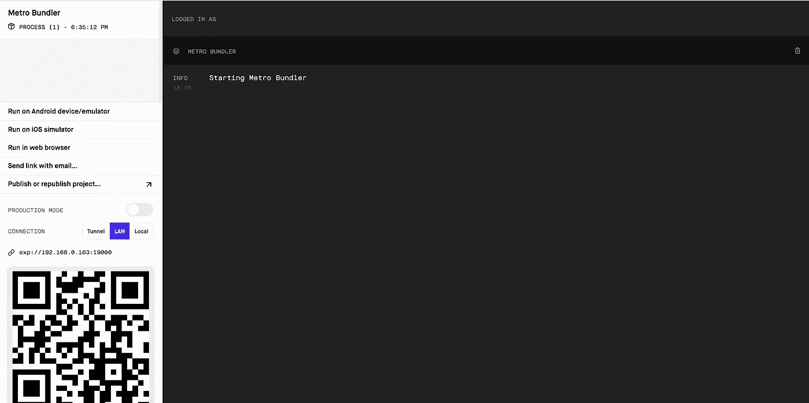
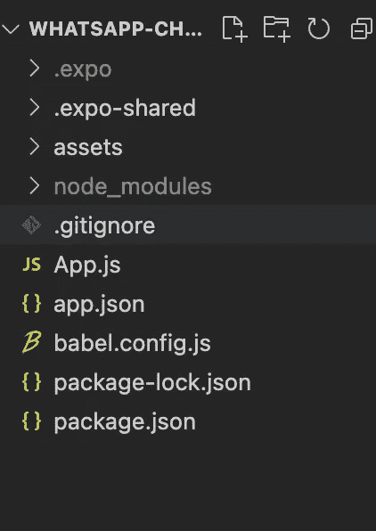
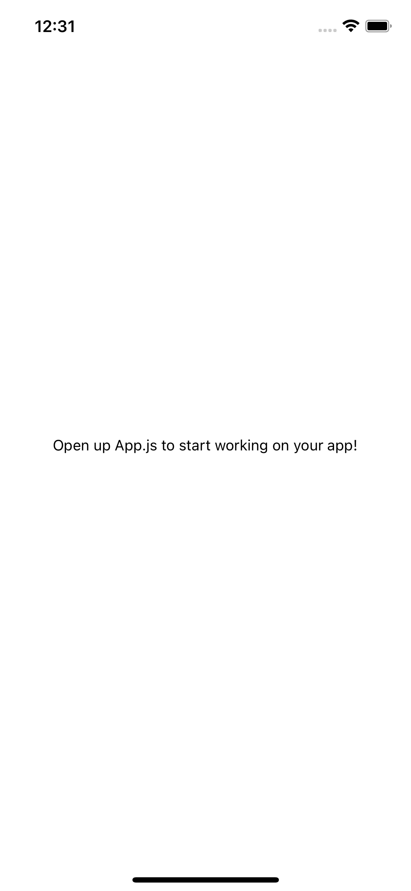
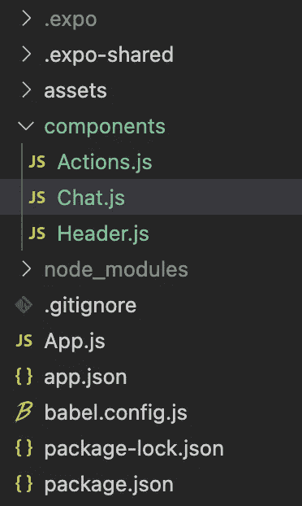
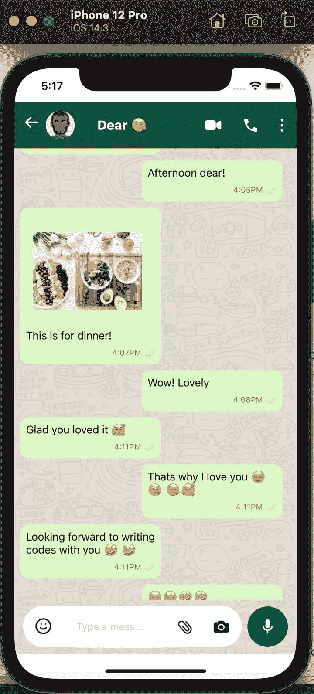

# 使用 Tailwind CSS 在 React Native 中创建一个 WhatsApp 聊天页面

> 原文：<https://javascript.plainenglish.io/create-a-whatsapp-chat-page-in-react-native-using-tailwind-css-6b985389ac57?source=collection_archive---------10----------------------->


Photo by [Christian Wiediger](https://unsplash.com/@christianw?utm_source=medium&utm_medium=referral) on [Unsplash](https://unsplash.com?utm_source=medium&utm_medium=referral)

Tailwind CSS 改进了我们对 web 组件样式的思考方式，并被业界人士、公司和开发人员广泛采用。

> 在本文中，我将展示如何在我们最喜欢的跨平台移动框架中使用 Tailwind CSS:React Native！我们将通过重新创建 WhatsApp 聊天用户界面来实现这一点。

我很兴奋，我知道你是，所以让我们不要浪费时间，开始吧！

# 先决条件

在我们开始之前，我希望你有以下设置:

1.  节点. js
2.  Npm
3.  Expo 在您的移动设备或我们可以测试的模拟器上

# 装置

我不会讨论如何最好地建立一个 react 原生项目，因为这对本文并不重要。这是一种方式，我们将使用 expo 来设置我们的项目。


Photo by [Al Elmes](https://unsplash.com/@alelmes?utm_source=medium&utm_medium=referral) on [Unsplash](https://unsplash.com?utm_source=medium&utm_medium=referral)

[*Expo*](https://expo.dev/) 是一个跨平台工具，我们可以用它来构建、测试和部署我们的 React 原生应用。它有很多功能，你可以去他们的网站了解更多我们可以用它做什么。

我们现在通过 CLI 安装 expo:

```
npm install -g expo-cli 
```

接下来，我们使用 expo 建立一个新项目，使新项目目录成为我们的新目录。之后，我们启动应用程序:

```
expo init whatsapp-chat-uicd whatsapp-chat-ui
npm start
```

如果您操作顺利，您的默认浏览器应该会打开，您应该会看到类似下面的内容:



Expo Devtool

您可以选择任何方法来预览开发中的应用程序。

# 代码结构

在我们选择了预览应用程序的方法之后，当我们等待应用程序打开时，让我们来看看如何构建我们的应用程序。如果您做得很好，您当前的代码结构应该如下所示:



移动应用程序的登录页面应该类似于下图:



# 安装附加依赖项

因为在本文中，我们将主要关注使用 ***Tailwind CSS*** ，我们将继续安装使我们更容易将 Tailwind CSS 与 React Native 集成的包。

此外，我们将安装其他软件包，我们将需要完成这个项目，如图标等。所以让我们从我们需要的东西开始:

A. **Tailwind:** 将 Tailwind CSS 引入 Web 已经真正改变了我们设计网页的方式，难怪在这种情况下，人们强烈要求将其集成到 mobile，React Native 中，因为它允许我们使用现有的 React 知识。

我们可以使用一些有用的包来将 Tailwind 引入 React Native，在 Google 上快速搜索就可以找到。然而，我们将使用[*tailwind-react-native-class names*](https://www.npmjs.com/package/tailwind-react-native-classnames)*。*

B. **Icons:** Icons 为移动应用程序带来了独特的便捷性，为了将 Icons 包含到我们的应用程序中，我们将使用[***react-native-elements***](https://www.npmjs.com/package/react-native-elements)因为我们使用 ***expo*** 来设置项目，将运行一些额外的命令来使一切正常工作，请随意阅读关于这个包的更多信息[这里](https://reactnativeelements.com/docs)并遵循最适合您的安装指南！

```
npm i tailwind-react-native-classnames react-native-elementsnpx react-native link react-native-vector-iconsnpm install react-native-safe-area-contextreact-native link react-native-safe-area-context
```

现在我们可以开始有趣的部分了，写一些代码！！

# 构建应用程序

我们将在项目的根目录下创建一个名为 components 的新文件夹，我们将使用它来存储屏幕的一些基本组件。我们将把聊天界面分成三个部分，即:

1.  标题组件:这是我们有后退按钮，头像，用户名和视频通话，音频通话，和更多的图标。
2.  聊天组件:这是我们显示聊天消息的地方
3.  动作组件:我们也可以将其视为聊天应用的页脚，这是我们拥有文本输入字段、表情符号、摄像头和录制图标的地方。

创建这个文件夹后，创建三个文件:H *eader.js* ，C *hat.js* ，A*actions . js*，来表示上面列出的这些组件:你的新文件夹结构应该是这样的:



## 用 App.js 设置基数

现在，我们将在 App.js 文件中设置应用程序的基本结构。我们导入组件和 Tailwind CSS 进行样式化:

```
import { StatusBar } from 'expo-status-bar';
import React from 'react';
import {ImageBackground,SafeAreaView } from 'react-native';
import { SafeAreaProvider } from 'react-native-safe-area-context';
import tw from 'tailwind-react-native-classnames'
import Header from './components/Header'
import Chat from './components/Chat'
import Actions from './components/Actions'; 
```

我给资产文件夹添加了一个名为*background.png*的背景图片。现在，我们继续设置视图:

```
export default function App() {  
return (    
<SafeAreaProvider>    
<SafeAreaView style={tw`flex-1 text-black`}>      
  <Header />      
  <ImageBackground style={{ flex: 1 }} source={require('./assets/background.png')}  resizeMode="cover"> 
  <Chat />
  <Actions />      
  </ImageBackground>     
  <StatusBar animated={true} backgroundColor="green" />    
</SafeAreaView>    
</SafeAreaProvider>  
);
}
```

## Header.js

接下来，我们将在 Header.js 文件中添加一些代码。我们导入 ***顺风 C SS*** 和 ***图标*** :

```
import React from 'react'
import { Text, View, Image } from 'react-native'
import { Icon } from 'react-native-elements'
import tw from 'tailwind-react-native-classnames'
```

然后，我们创建视图，添加图标，并使用 Tailwind CSS 样式化页面，使用以下格式:

```
<View style={[tw`flex flex-row justify-between items-center h-16 p-2 w-full bg-green-900 `,{ position: "absolute" }]}>
```

在这里，我们可以看到如何将 ***Tailwind CSS*** 与 React 原生元素集成在一起，并包含其他样式。

具有完整样式的最终文件是:

Header.js

## Actions.js

正如前面所解释的，动作将包含在我们聊天界面末尾的按钮和文本。我们无法使用 Tailwind CSS 包实现所有的样式，因此仍然需要使用样式表。

```
<TextInput style={styles.input}  placeholder="Type a mess..."           underlineColorAndroid="transparent" />const styles = StyleSheet.create({  
input: {      
  width: 120,      
  paddingTop: 10,      
  paddingRight: 10,      
  paddingBottom: 10,      
  paddingLeft: 0,      
  backgroundColor: '#fff',      
  color: '#424242',  
 },
});
```

以下是完成样式的最终文件:

Actions.js

## 聊天. js

在我们继续之前，我们将在项目的根目录下创建一个名为 ***data*** 的文件夹，然后在该文件夹中，我们将创建一个名为 ***chat.js 的新文件(*** 检查最终源代码以查看该文件的内容) ***，*** 我们将使用该文件来存储我们的聊天，在实际场景中，我们将从 API 获取我们的聊天。

此外，我添加了另一个名为*store.jpeg 的图片到资产文件夹。*

在这个组件中，我们将通过使用 React Native***scroll view 来实现可滚动特性。*** 我们用 ***ScrollView*** 组件包装我们的组件。

```
<ScrollView  style={[{  flex: 1,  marginBottom: 75,}]} }      scrollEnabled={true}>
```

以下是完成样式的最终文件:

Chat.js

# 决赛成绩

这是页面的最终结果，很酷吧？



# 结论

就是这样！

我们不仅学习了如何无缝集成 Tailwind CSS 和 React Native，还进一步设计了最流行的实时消息平台聊天 UI 的克隆版本: **WhatsApp** 。你可以在这里找到完整的代码。

我迫不及待地想看看你使用 Tailwind CSS 在 React Native 中构建了什么！

*更多内容请看*[***plain English . io***](http://plainenglish.io/)