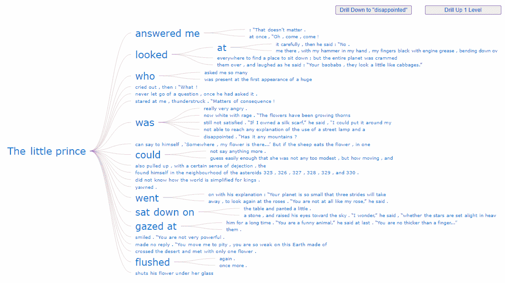
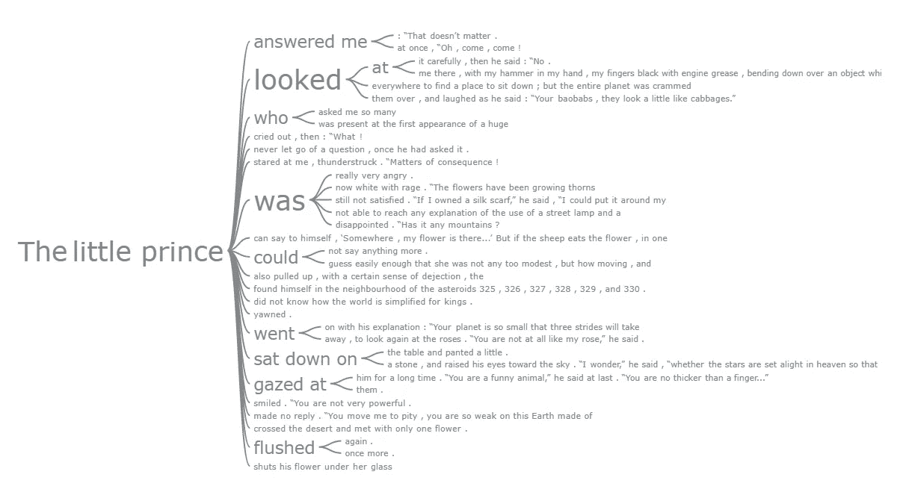
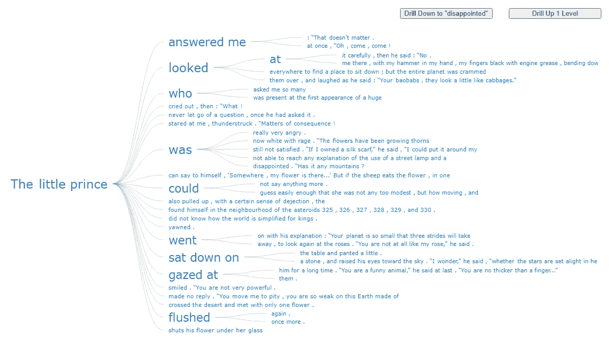

# 用 JavaScript 创建单词树图表

> 原文：<https://javascript.plainenglish.io/create-a-word-tree-chart-with-javascript-bca353a51fad?source=collection_archive---------13----------------------->


Interactive JavaScript Word Tree of The Little Prince

[数据可视化](https://hackernoon.com/what-is-data-visualization-definition-history-and-examples-e51ded6e444a)不仅有助于交流见解，也有助于数据探索。有许多不同的图表类型被广泛用于识别数据中的模式。较少使用的图表类型之一是**单词树**。这是一种非常有趣的可视化形式，在分析文本时非常有效。现在，我将教你如何使用 JavaScript 快速创建漂亮的交互式单词树图表。

单词树显示一组选定的单词如何通过分支布局连接到文本数据中的其他单词。这些图表类似于[单词云](https://datavizcatalogue.com/methods/wordcloud.html)，出现频率更高的单词显示得更大。但它们的不同之处在于，单词树也显示单词之间的联系，这增加了上下文并有助于找到模式。

在本教程中，我将从法国飞行员兼作家安托万·德·圣·埃克苏佩里的名著《小王子》中创建一个可爱的单词树。看看下面最终图表的演示，并继续阅读，了解如何轻松构建这个和任何其他交互式 JS 单词树。



# 制作一个基本的 JavaScript 单词树

一个交互式的 JS 单词树图可能看起来很复杂。但是请跟随学习如何通过四个非常简单的步骤来构建它。

*   创建一个 HTML 页面。
*   包括所需的 JavaScript 文件。
*   准备数据。
*   为图表添加一些 JS 代码。

## 1.创建 HTML 页面

第一步是创建一个包含图表的 HTML 页面。在页面中，添加一个`<div>`元素，其 id 将在以后被引用。

```
<html>
  <head>
    <title>JavaScript Word Tree Chart</title>
    <style type="text/css">      
      html, body, #container { 
        width: 100%; height: 100%; margin: 0; padding: 0; 
      } 
    </style>
  </head>
  <body>
    <div id="container"></div>
  </body>
</html>
```

要使单词树占据整个页面，请将宽度和高度参数指定为 100%。这可以根据您项目的要求进行调整。

## 2.包括所需的 JavaScript 文件

使用 [JavaScript 图表库](https://hackernoon.com/10-javascript-charting-libraries-data-visualization-b77523d23372rd-tree-chart-with-javascript-xb9s35ur)创建单词树非常方便。使用此类库的最佳之处在于，无需高级技术技能即可快速制作现成的图表。在本教程中，我将基于[词树文档](https://docs.anychart.com/Basic_Charts/Word_Tree)使用 [AnyChart](https://www.anychart.com/) 。这是免费的非商业用途，但无论如何，这只是一个例子。对于所有的 JS 图表库，数据可视化的逻辑仍然非常相似。因此，基本上，你可以使用这一学习来创建图表与其他人有预先建立的单词树，太多。

我会把 AnyChart 的 CDN 中所需的 JS 文件包含在 HTML 页面的`<head>`部分。对于单词树图，我需要添加两个脚本:[核心模块](https://docs.anychart.com/Quick_Start/Modules#core)和[单词树模块](https://docs.anychart.com/Quick_Start/Modules#word_tree)。

```
<html>
  <head>
    <title>JavaScript Word Tree Chart</title>
    <script src="https://cdn.anychart.com/releases/8.10.0/js/anychart-core.min.js"></script>
    <script src="https://cdn.anychart.com/releases/8.10.0/js/anychart-wordtree.min.js"></script>
    <style type="text/css">      
      html, body, #container { 
        width: 100%; height: 100%; margin: 0; padding: 0; 
      } 
    </style>
  </head>
  <body>  
    <div id="container"></div>
    <script>
 ***// All the code for the JS word tree chart will come here***    </script>
  </body>
</html>
```

## 3.准备数据

我从[在线图书馆](https://books-library.net/files/books-library.online-12201041Ti6B3.pdf)下载了安托万·德·圣·埃克苏佩里的名著*小王子*的文本，创建了一个数据文件，可以在这里[下载](https://gist.githubusercontent.com/shacheeswadia/ccbccc482b1fb691405e07772c0fbfa0/raw/fb7b5972838b4212f4551c4cc9d5fc026fc2e8c3/littleprince.txt)。

要访问数据文件，我需要 jQuery，因此在代码中包含它的脚本。

```
<script src="https://code.jquery.com/jquery-latest.min.js"></script>
```

现在，所有的初步步骤都已完成，让我们进入主要部分。你一定会喜欢用这么少的 JavaScript 代码就能快速制作出一个实用的交互式单词树图表。

## 4.为图表添加一些 JS 代码

在编写任何代码之前，我要做的第一件事是添加一个封闭函数，该函数仅在页面准备就绪后执行其中的代码，然后使用 Ajax 加载数据文件。

```
anychart.onDocumentReady(function () {
  $.ajax(
"https://gist.githubusercontent.com/shacheeswadia/ccbccc482b1fb691405e07772c0fbfa0/raw/fb7b5972838b4212f4551c4cc9d5fc026fc2e8c3/littleprince.txt"
  ).done(function (text) {
  });
});
```

接下来，我使用 JS 库的`wordtree()`函数创建图表。

```
var chart = anychart.wordtree(text);
```

在单词树中，一个重要的部分是定义延伸到文本中的各种句子的根单词。在这里，我将“The”定义为根的开始，并向下钻取到“prince”作为根的结束，因此合并的根单词成为“小王子”。

```
***// set the root word*** chart.word("The");***// drill down to the next word in the tree*** chart.drillTo("prince");
```

最后，我只需要设置容器并绘制图表。

```
***// set container id for the chart*** chart.container("container");***// initiate chart drawing*** chart.draw();
```

瞧，这就是我在网页上实现交互式单词树的全部工作！

> **你可以用下面的代码或者在** [**CodePen**](https://codepen.io/shacheeswadia/pen/mdmpxeK) **【或者在** [**AnyChart 操场**](https://playground.anychart.com/8PmjouFW/) **】上查看这个 JS 单词树图的初始版本。**



```
<html>
  <head>
    <title>JavaScript Word Tree Chart</title>
    <script src="https://cdn.anychart.com/releases/8.10.0/js/anychart-core.min.js"></script>
    <script src="https://cdn.anychart.com/releases/8.10.0/js/anychart-wordtree.min.js"></script>
    <script src="https://code.jquery.com/jquery-latest.min.js"></script>
    <style type="text/css">      
      html, body, #container { 
        width: 100%; height: 100%; margin: 0; padding: 0; 
      } 
    </style>
  </head>
  <body>  
    <div id="container"></div>
    <script>
      anychart.onDocumentReady(function () {
        $.ajax(
"https://gist.githubusercontent.com/shacheeswadia/ccbccc482b1fb691405e07772c0fbfa0/raw/fb7b5972838b4212f4551c4cc9d5fc026fc2e8c3/littleprince.txt"
        ).done(function (text) {

 ***// create word-tree chart***          var chart = anychart.wordtree(text); ***// set the root word***          chart.word("The"); ***// drill down to the next word in the tree***          chart.drillTo("prince"); ***// set container id for the chart***          chart.container("container"); ***// initiate chart drawing***          chart.draw(); });
      });
    </script>
  </body>
</html>
```

这看起来很棒，但还有很多事情可以做，让单词树看起来更漂亮，我会告诉你怎么做。

# 自定义 JS 单词树图表

JS 图表库非常棒，可以非常快地准备好基本的可视化，然后有大量的选项来定制图表。我来给你演示一下如何让这个单词树更漂亮，更有个性。

## 1.格式化连接器

我们的单词树的分支看起来有点挤，所以让我们修改它们，使树看起来更间隔。有一个选项，使直线连接器，我会尝试，也改变中风的设置。

```
***// configure the connectors*** var connectors = chart.connectors();
connectors.length(100);
connectors.offset(10);
connectors.curveFactor(0);
connectors.stroke("0.5 #96a6a6");
```

这一切都很简单，这是我们的单词树经过这些改变后的样子。


> **互动版在**[**CodePen**](https://codepen.io/shacheeswadia/pen/KKmZoVP?ref=hackernoon.com)**【和** [**AnyChart 游乐场**](https://playground.anychart.com/MegbT1wY/) **】上有，在那里还可以找到它的完整代码。**

老实说，我更喜欢弯曲的连接器，所以我继续恢复它们。

## 2.配置字体大小和颜色

我简单地修改了字体大小和颜色，使图表更加个性化。同样，它非常简单，只需要几行代码。

```
***// configure the font*** chart.fontColor("#1976d2");***// set chart's font size minimum and maximum*** chart.minFontSize(8);
chart.maxFontSize(24);
```

## 3.添加自定义向下钻取和向上钻取按钮

你注意到单词树中默认的上下钻取有多棒了吗？只需点击一个单词，图表就会自动缩放到那个级别。

内置的功能是超级的，但在需要的情况下，我将在这里向您展示如何添加一个按钮来深入到一个特定的单词，以及一个按钮来一次向上钻取一个级别。

我在 HTML 中创建了一个容器，并在其中添加了两个按钮——一个用于向下钻取我选择的单词“失望”,另一个用于向上钻取。当然，您可以选择树中存在的任何单词。

```
<div id="buttons">
  <button onclick="drillToItem()">Drill Down to "disappointed"</button>
  <button onclick="drillUpALevel()">Drill Up 1 Level</button>
</div>
```

我还添加了按钮的样式。

```
<style type="text/css">
  html,
  body,
  #container {
    width: 100%;
    height: 100%;
    margin: 0;
    padding: 0;
  }#buttons {
    display: flex;
    flex-direction: row;
    justify-content: flex-end;
  }button {
    width: 15vw;
    margin: 1rem;
  }
</style>
```

接下来，我添加两个函数，一个处理向下钻取到指定单词的操作，另一个处理向上钻取到树的一级。

```
***// drill down to a data item*** function drillToItem() {
 ***// locate an item in the data tree and get it as an object***  var item = chart.data().search("value", "disappointed");
 ***// drill down to the item***  chart.drillTo(item);
}***// drill up a level*** function drillUpALevel() {
  chart.drillUp();
}
```



> **在这里或者在** [**CodePen**](https://codepen.io/shacheeswadia/pen/bGWaKBL) **【或者在** [**AnyChart 游乐场**](https://playground.anychart.com/CltVnYXE/) **】上看看这个牛逼的最终 JavaScript 单词树图的全部代码。**

```
<html>
  <head>
    <title>JavaScript Word Tree Chart</title>
    <script src="https://cdn.anychart.com/releases/8.10.0/js/anychart-core.min.js"></script>
    <script src="https://cdn.anychart.com/releases/8.10.0/js/anychart-wordtree.min.js"></script>
    <script src="https://code.jquery.com/jquery-latest.min.js"></script>
    <style type="text/css">      
      html, body, #container { 
        width: 100%; height: 100%; margin: 0; padding: 0; 
      }
      #buttons{
        display: flex;
        flex-direction: row;
        justify-content: flex-end;
      }
      button {
        width: 15vw;
        margin: 1rem;
      }
    </style>
  </head>
  <body>  
    <div id="buttons">
      <button onclick="drillToItem()">Drill Down to "disappointed"</button>
      <button onclick="drillUpALevel()">Drill Up 1 Level</button>
    </div>
    <div id="container"></div>
    <script>
      anychart.onDocumentReady(function () {
        $.ajax(
"https://gist.githubusercontent.com/shacheeswadia/ccbccc482b1fb691405e07772c0fbfa0/raw/fb7b5972838b4212f4551c4cc9d5fc026fc2e8c3/littleprince.txt"
        ).done(function (text) {

 ***// create word-tree chart***          var chart = anychart.wordtree(text); ***// set the root word***          chart.word("The"); ***// drill down to the next word in the tree***          chart.drillTo("prince"); ***// configure the connectors***          var connectors = chart.connectors();
          connectors.length(100);
          connectors.offset(10);
          connectors.stroke("0.5 #96a6a6"); ***// configure the font***          chart.fontColor("#1976d2"); ***// set chart's font size minimum and maximum***          chart.minFontSize(8);
          chart.maxFontSize(24); ***// set container id for the chart***          chart.container("container"); ***// initiate chart drawing***          chart.draw(); });
      }); var chart; ***// drill down to a data item***      function drillToItem() {
 ***// locate an item in the data tree and get it as an object***        var item = chart.data().search("value", "disappointed");
 ***// drill down to the item***        chart.drillTo(item);
      } ***// drill up a level***      function drillUpALevel() {
        chart.drillUp();
      } </script>
  </body>
</html>
```

# 结论

那么，让我们诚实一点。这真的很容易建造，而且很酷，不是吗？

如果您想继续学习和使用这种可视化，请参见[单词树文档](https://docs.anychart.com/Basic_Charts/Word_Tree)并从这些[示例](https://www.anychart.com/products/anychart/gallery/Word_Tree/)中获得一些灵感。或者选择另一个 [JS 图表库](https://en.wikipedia.org/wiki/Comparison_of_JavaScript_charting_libraries)并基于相同的技术尝试使用它。

*小王子*给了我们深刻的智慧。JavaScript 非常适合创建交互式图表。所以，让我们两者并用，做出一些惊人的可视化效果！

***经沙奇·斯瓦迪亚许可出版。原载于 2021 年 9 月 2 日*** [***黑客正午***](https://hackernoon.com/creating-an-interactive-word-tree-chart-with-javascript-xb9s35ur) ***标题为“用 JavaScript 创建交互式单词树图”。***

***在***[***Chartopedia***](https://www.anychart.com/chartopedia/chart-type/word-tree/)***上了解更多关于单词树图表的信息，并查看我们博客上的其他***[***JavaScript 图表教程***](https://www.anychart.com/blog/category/javascript-chart-tutorials/) ***。***

***得到了一个牛逼的客座博文创意？*** [***取得联系！***](https://www.anychart.com/support/)

*原载于 2021 年 10 月 4 日*[*【https://www.anychart.com】*](https://www.anychart.com/blog/2021/10/04/javascript-word-tree-chart/)*。*

*更多内容请看*[***plain English . io***](http://plainenglish.io/)