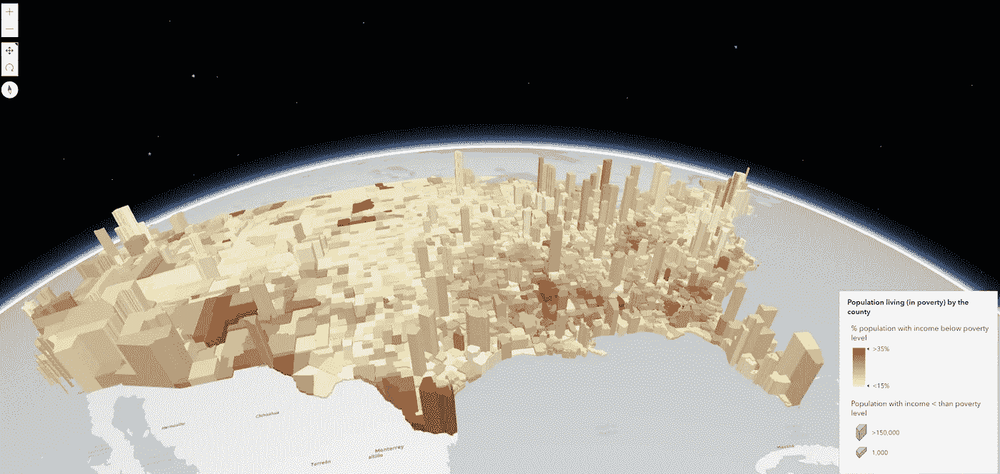

# 使用 ArcGIS API for JavaScript 创建令人惊叹的 GIS 数据驱动地图

> 原文：<https://javascript.plainenglish.io/create-amazing-gis-data-driven-maps-using-arcgis-api-for-javascript-9eef97688ae8?source=collection_archive---------17----------------------->

## 如何利用挤出数据绘制贫困水平图？

Map of United States showing population living in poverty by county

# 目的

在上一个教程中，我已经解释了如何使用 ArcGIS 显示具有盛开效果的火山。

 [## 如何轻松使用 JavaScript 和 ArcGIS 创建精美丰富的地图

### 在本文中，我们将探索 GIS，还将看到一个可以快速加载动态地图的 JavaScript 示例。

javascript.plainenglish.io](/how-to-easily-use-javascript-and-arcgis-to-create-beautiful-rich-maps-94e9354e387b) 

在本教程中，我将展示如何通过 ArcGIS API for JavaScript 使用拉伸功能。

# 发展链接

如果您还没有查看，您可以前往 Esri 的[开发网站](https://developers.arcgis.com/documentation/)，那里有您可以测试和演示的完整示例。最好的是，它们都是免费的！

# 工作示例

我从他们的开发者门户中选择了这个[示例](https://developers.arcgis.com/javascript/latest/sample-code/visualization-vv-extrusion/)来展示如何应用一个采用数值的大小可视变量。

在这个特别的例子中，你会看到来自生活在贫困线以下的县的挤出效应。

下面的代码是在 index.html 的**文件中制作的实际例子。**

# 1.设置它

首先，您将创建一个 HTML 容器，该容器将显示地图，解释拉伸意味着什么。

# 2.创建配置

接下来，你需要设置**渲染**，如下所示:

注意，我们将符号的类型设置为 **polygon-3d** 。

此外，我们已经在 **stops** 属性中设置了阈值。这里我们说的是，如果贫困在 1000 以下，那就挤出 10000。任何大于 150，000 的，则挤出 300，000。

# 3.设置要素图层

接下来是设置**特征图层**。更多信息和定义可在[这里](https://developers.arcgis.com/javascript/latest/api-reference/esri-layers-FeatureLayer.html)找到。

本质上，这个 FeatureLayer 是用期望的标题和内容标签设置弹出模板。定义的 URL 是 ArcGIS 提供的**要素服务**。更多关于特色服务的信息可以在[这里](https://enterprise.arcgis.com/en/server/latest/publish-services/windows/what-is-a-feature-service-.htm)找到。

# 4.最后实现地图、视图和图例

最后一块直接定义了**地图**、**视图**和**图例**。如前所述，**图例**显示在右下角，并且**视图**设置有 GPS 坐标。

# 在 index.html 把所有东西放在一起

既然已经创建了设置、配置和函数，我们只需将所有的 JavaScript 复制到**index.html 中。**

如果需要，可以随意将 JavaScript 函数放在一个单独的文件中！

# 运行您的地图

只需在浏览器中打开你的**index.html**文件，就能看到显示的地图。

随意切换菜单来围绕地图旋转。

> **注意**:如果您点击每个县，将显示一个弹出窗口，显示县名以及贫困线的统计数据！

我希望您喜欢这篇文章，并对 ArcGIS 通过其 JavaScript API 提供的功能有所了解。

干杯！

[*更多内容尽在 plainenglish.io*](http://plainenglish.io/)