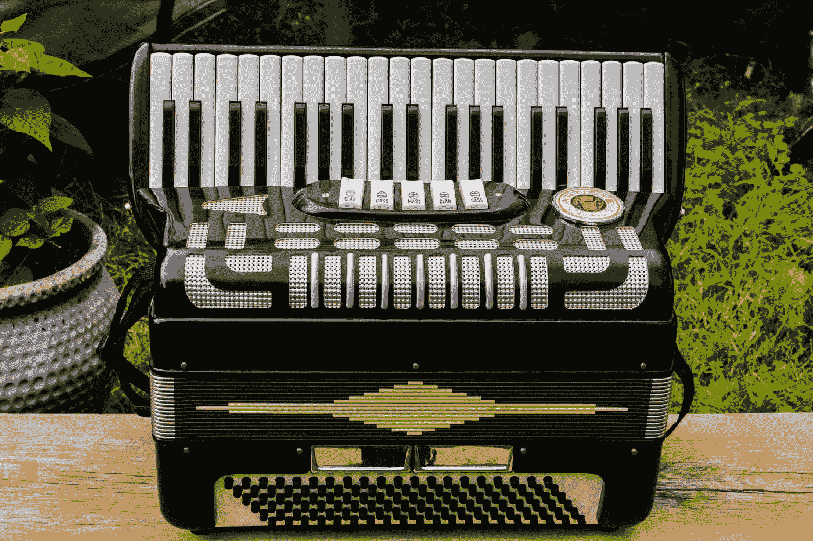

# 用 Vue 3 和 JavaScript 创建一个手风琴组件

> 原文：<https://javascript.plainenglish.io/create-an-accordion-component-with-vue-3-and-javascript-5b386ec54258?source=collection_archive---------5----------------------->



Photo by [Vito Natale](https://unsplash.com/@otiv345?utm_source=medium&utm_medium=referral) on [Unsplash](https://unsplash.com?utm_source=medium&utm_medium=referral)

Vue 3 是易于使用的 Vue JavaScript 框架的最新版本，让我们可以创建前端应用程序。

在本文中，我们将看看如何用 Vue 3 和 JavaScript 创建一个 accordion 组件。

# 创建项目

我们可以用 Vue CLI 创建 Vue 项目。

要安装它，我们运行:

```
npm install -g @vue/cli
```

与 NPM 或:

```
yarn global add @vue/cli
```

用纱线。

然后我们运行:

```
vue create accordion-component
```

并选择所有默认选项来创建项目。

# 创建折叠组件

为了创建 accordion 组件，我们编写:

```
<template>
  <div v-for="c of contents" :key="c.title">
    <div class="title" @click="c.expanded = !c.expanded">
      <div>
        <b>{{ c.title }}</b>
      </div>
      <div>
        <span v-if="c.expanded">&#x2191;</span>
        <span v-else>&#x2193;</span>
      </div>
    </div>
    <div class="description" v-if="c.expanded">
      {{ c.description }}
    </div>
  </div>
</template><script>
const contents = Array(10)
  .fill()
  .map((_, i) => {
    return {
      title: `title ${i}`,
      description: `description ${i}`,
      expanded: false,
    };
  });export default {
  name: "App",
  data() {
    return {
      contents,
    };
  },
};
</script><style scoped>
.title {
  cursor: pointer;
  display: flex;
  justify-content: space-between;
}.title,
.description {
  border: 1px solid black;
  padding: 5px;
}
</style>
```

我们首先在 templaye 中添加手风琴元素。

我们使用`v-for`指令将`contents`数组呈现为手风琴状。

将`key`设置为`c.title`属性，该属性是唯一的。

在内部 div 中，我们用`@click`指令附加了一个点击监听器。

点击监听器切换`expanded`属性。

在它里面，我们呈现了`c.title`属性，如果它没有展开，就显示向下的箭头，这是在`c.expanded`是`false`的时候

当`c.expanded`为`true`时，我们显示向上的箭头。

`c.description`呈现在标题 div 下面的 div 中。

只显示了`c.expanded`是`true`。

在那下面，我们有`contents`数组来添加一些要显示的内容。

在`data`方法中，我们返回一个具有从`contents`数组创建的`contents`反应属性的对象。

在`style`标签中，我们将`title`类选择器的样式设置为`cursor: pointer`来设置手形光标。

`display`设置为`flex`启用灵活布局。

这让我们使用设置为`space-between`的`justify-content`来显示标题 div 左右两端的 2 个 div。

最后，我们用`title`和`description`类样式在 div 上设置`border`和`padding`。

我们给这些 div 添加边框和填充。

现在，当我们点击标题 divs，我们看到描述 divs 切换开和关。

# 结论

我们可以用 Vue 3 和 JavaScript 轻松创建一个手风琴组件。

喜欢这篇文章吗？如果有，通过 [**订阅我们的 YouTube 频道**](https://www.youtube.com/channel/UCtipWUghju290NWcn8jhyAw?sub_confirmation=true) **获取更多类似内容！**

*更多内容请看*[***plain English . io***](https://plainenglish.io/)