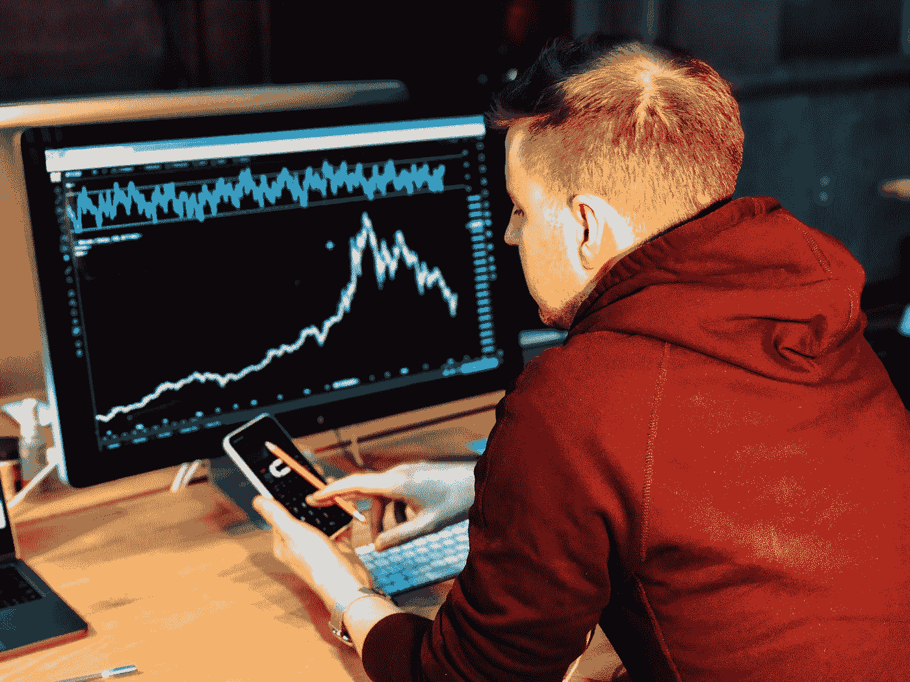

# 创建一个类似 Uniswap 的应用程序，以分散的方式执行交易

> 原文：<https://javascript.plainenglish.io/create-an-app-like-uniswap-and-execute-trades-in-a-decentralized-manner-bf9d9a532554?source=collection_archive---------14----------------------->

全世界都在寻求财务自由。政府和中央集权当局牢牢控制着人民的资金。有可行的替代方案吗？没错，就是去中心化。投资者可以在不与任何中介交易的情况下发起买入、卖出和限价单。哪个平台是这方面的先锋？这是 Uniswap。基于以太坊的分散交易所(DEX)提供了各种选项，如互换、流动性池和决策权。你是那个渴望在 Web 3.0 世界中获得牵引力的企业家吗？立即创建 Uniswap 克隆应用程序。

Photo by [Ferhat Deniz Fors](https://unsplash.com/@ferhat?utm_source=medium&utm_medium=referral) on [Unsplash](https://unsplash.com?utm_source=medium&utm_medium=referral)

# **分析 Uniswap 与币安的合作将会带来哪些益处？**

UNI 是 Uniswap 的本机令牌。这些数字资产的持有者可以对不同的提案进行投票，并用加密代币、DeFi 代币和 stablecoins 交换加密货币。

除此之外，像 Uniswap 这样的 [**app，支持跨桥，多平台兼容。因此，投资者可以无缝地使用著名的加密交易所、DeFi 平台和 NFT 市场。**](https://www.appdupe.com/uniswap-clone)

最终，这导致了开源金融市场的创建。散户、机构投资者和流动性提供者(LP)可以全天候交易。因此，他们可以控制自己的资金，有效地管理自己的投资组合。

同样，币安在加密时代也是一个响当当的名字。它有自己的加密交易所、加密硬币(BNB)、稳定硬币(BUSD)和 NFT 市场。此外，用户可以访问许多金融服务，如衍生品交易、期货交易、保证金交易、即时加密贷款、投资流动性池的奖励和流动性养殖。

同样，两大巨头 Uniswap 和币安的合作将极大地帮助全球密码产业。自 2020 年 9 月 17 日以来，总部位于开曼群岛的交易所已将 UNI 列入其加密交易所。

用户可以用比特币(BTC)、币安币(BNB)、币安美元(stablecoins)以及像 Tether (USDT)这样的稳定币来交易这种流行的代币。重要的是，币安将 UNI 的上市费用保持在零 BNB。这大大提高了币安的交易量和流动性。

此外，机构和散户交易者将获得有用的数据。它包括图形和图表，描绘了交易量的变化，价格趋势，以及各种交易对的涨跌。此外，投资者可以通过输入限额和金额等详细信息来进行现货交易。他们可以根据自己的要求选择 3 个选项:限价、市价和止损限价。

除此之外，交易者可以点击其他面板，如未结订单、订单历史、交易历史和基金。对这些历史信息的分析将有助于他们在未来做出正确的投资决策。

Photo by [Chris Liverani](https://unsplash.com/@chrisliverani?utm_source=medium&utm_medium=referral) on [Unsplash](https://unsplash.com?utm_source=medium&utm_medium=referral)

# 投资者如何使用 Uniswap 这样的应用程序管理他们的代币清单？

*   交易员需要在 Uniswap 克隆应用上注册。用户必须有一些以太坊(ETH)和 UNI (UNI)令牌。之后，他们应该同步他们的数字钱包，如比特币基地钱包、Fortmatic、MetaMask、Portis，以及 WalletConnect 开源协议支持的其他钱包。
*   之后，投资者必须选择掉期期权。他们必须选择共同的基地。交易者要按以太币，包裹以太币(WETH)，包裹比特币(BTC)，还有美元币()，系绳()，戴(DAI)之类的稳定币。
*   此外，投资者还可以通过选择热门平台的 DeFi 令牌来管理他们的资金。它包括 1Inch、Aave、Aragon、Balancer、BAND Protocol、Compound、金恩、Gemini、Kyber Network、Maker 和 earning . finance
*   之后，他们可以通过选择两个选项来管理他们的投资:列表和代币。他们可以打开或关闭列表部分。例如，他们可以创建 Compound、CoinGecko、Gemini、CoinMarketCap、Wrapped Tokens 等的列表。
*   此外，投资者可以密切关注投资组合，因为像 DEX 这样的 Uniswap 托管在星际文件系统(IPFS)和以太坊名称服务(ENS)上。
*   此外，交易者可以创建自定义令牌，并将其列在一个类似 Uniswap 的应用程序上。详细信息将存储在他们使用的网络浏览器中。此外，自动做市商(AMM)机制将提供诸如开源参与、抵制交易审查和多层安全措施等优势。
*   当然，交易对是 Uniswap 的支柱。到目前为止，它已经见证了 6.62 亿美元的交易量。迄今为止，用户已经处理了 8100 万笔买卖订单。此外，4400 名社区代表正在塑造 DeFi 协议的未来。
*   像 Uniswap 这样的 [**应用也允许个人创建交易对。此外，他们成为流动性提供者(LP)。这是因为准备金被存入流动性池。从长远来看，它确保了分散式交换机(DEX)的不间断运行。**](https://www.appdupe.com/uniswap-clone)
*   之后，投资者必须接受“了解你的客户”( KYC)验证。他们可以添加 ERC-20 令牌的合同地址。重要的是，令牌必须在以太坊主网上可用。
*   用户应点击确认按钮，并处理所需费用(燃气费和交易费用)。重要的是，收费根据能源消耗水平、众多投资者的需求以及所提供的流动性数量而有所不同。
*   如果有人事先添加了令牌怎么办？投资者可以点击互换选项。他们将获得有关流动性提供商费用、最低和最高金额以及价格影响百分比的数据。
*   此外，投资者的钱包里必须有足够数量的代币。他们的代币在分散交易所(DEX)正式上市。他们将收到通知，买家和卖家可以开始把他们的钱投入其中。

Photo by [Shubham Dhage](https://unsplash.com/@theshubhamdhage?utm_source=medium&utm_medium=referral) on [Unsplash](https://unsplash.com?utm_source=medium&utm_medium=referral)

# **uni swap 的新特性，如分散式交换(DEX)是**

**非永久性损失—** 流动性提供者(LP)将处理非永久性损失的风险。这将保护投资者的权利，尤其是在市场崩盘的时候。因此，即使加密令牌和加密货币的价格上涨，他们也不会损失收入。此外，订单价差是战略性地管理自动做市商(AMM)机制。

**多种费用等级—** 有限合伙人可以通过使用多种费用等级来保护自己。他们可以对用户收取不同的费用。它根据数字货币的类型(稳定币、加密币、加密令牌、DeFi 令牌)以及它是相关还是不相关而变化。

# **包装完毕**

敦促改革金融体系的运作？与 DeFi 平台创建企业合作，揭示您的业务目标，并尽快开始 Uniswap 克隆应用程序开发。

*更多内容请看**[***说白了. io***](http://plainenglish.io/) ***。*** *报名参加我们的* [***免费每周简讯这里***](http://newsletter.plainenglish.io/) ***。****