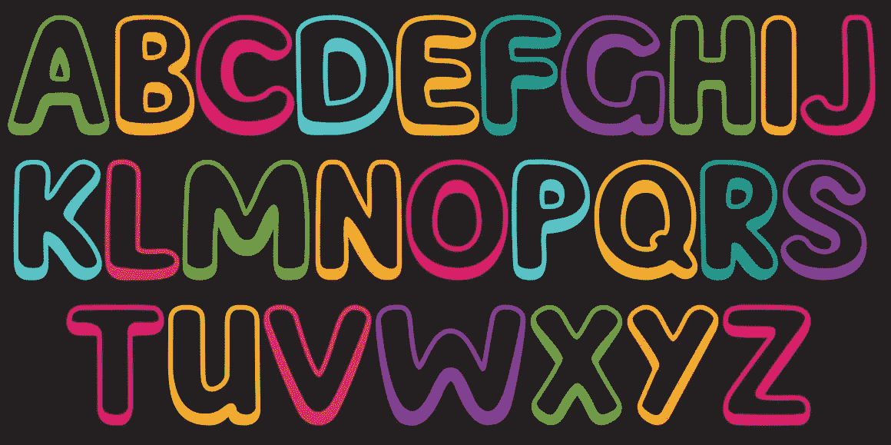

# 用这个简单的技巧在 JavaScript 中创建一个字母表字符数组

> 原文：<https://javascript.plainenglish.io/create-an-array-of-alphabet-characters-in-javascript-with-this-simple-trick-930033079dd3?source=collection_archive---------0----------------------->



初始化一个数组是一个简单的概念，但是把它变成字母表是两码事。也许对许多人来说，这篇文章是无用的。但是，我还没看到有人写这篇文章。所以我写了这个。第一个概念是，我们需要初始化一个数组，这个数组用整数来表示。这可以通过下面的方法来完成。

## ES6

```
Array.from(Array(10).keys())
//=> [0, 1, 2, 3, 4, 5, 6, 7, 8, 9]
```

## 扩散算子

```
[...Array(10).keys()]
//=> [0, 1, 2, 3, 4, 5, 6, 7, 8, 9]
```

## 映射函数

```
Array.from({length: 10}, (_, i) => i + 1)
//=> [1, 2, 3, 4, 5, 6, 7, 8, 9, 10]
```

从这个角度来看，我们的目的是制作一个由所有字母表字符组成的数组。而不是写像这样需要太多时间的东西

```
const alphabet = ["A","B","C","D","E","F","G","H","I","J","K","L","M","N","O","P","Q","R","S","T","U","V","W","X","Y","Z"];
```

我有办法在不写下所有角色的情况下制作这个东西。这个概念和制作一个上面用整数表示的数组是一样的。这里我也使用地图功能。

正如您所看到的，我声明了一个名为 alpha 的数组，并用一个整数来实现它，该整数表示字符串中的 charCode，并用 26 的长度填充它。然后，在第二行，通过使用 map 函数，我将 alpha 中每个元素的所有数字都变成字符串，并保存到变量名字母表中。其输出是这样的。

```
[ 'A', 'B', 'C', 'D', 'E', 'F', 'G', 'H', 'I', 'J', 'K', 'L',
  'M', 'N', 'O', 'P', 'Q', 'R',  'S', 'T', 'U', 'V', 'W', 'X',
  'Y', 'Z' ]
```

有多容易不是吗？我希望你喜欢这篇文章。

谢谢