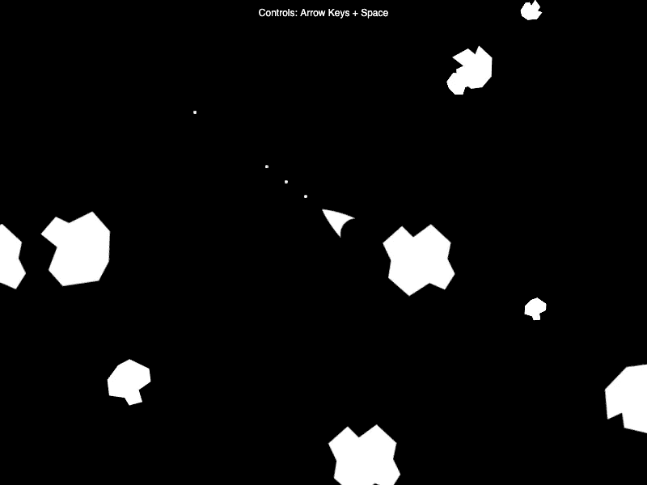

# 用 p5.js 创建一个小行星游戏

> 原文：<https://javascript.plainenglish.io/create-an-asteroids-game-with-p5-js-5734b554f731?source=collection_archive---------4----------------------->

本文将介绍如何从 [p5 创建一个小行星克隆体。播放示例](https://b.remarkabl.org/2YS6LZz)。玩[游戏](https://b.remarkabl.org/36ONQU6)或观看 [YouTube 视频](https://youtu.be/q-p5lZsv3LQ?list=PLVgOtoUBG2mdLpj6qT5DXfg5_pGPTDrJZ):

# 密码

在`[preload()](https://p5js.org/reference/#/p5/preload)`中加载带有`[loadImage()](https://p5js.org/reference/#/p5/loadImage)`的[图像](https://github.com/remarkablegames/asteroids/tree/gh-pages/assets):

使用`[createCanvas()](https://p5js.org/reference/#/p5/createCanvas)`在`[setup()](https://p5js.org/reference/#/p5/setup)`中创建一个 800 像素宽 600 像素高的画布:

使用`[createSprite()](https://molleindustria.github.io/p5.play/docs/classes/p5.play.html#method-createSprite)`创建飞船精灵:

将`[addImage()](https://molleindustria.github.io/p5.play/docs/classes/Sprite.html#method-addImage)`和`[addAnimation()](https://molleindustria.github.io/p5.play/docs/classes/Sprite.html#method-addAnimation)`的标签标识替换为常量:

在`[draw()](https://p5js.org/reference/#/p5/draw)`中，将`[background()](https://p5js.org/reference/#/p5/background)`设为黑色，用`[drawSprites()](https://molleindustria.github.io/p5.play/docs/classes/p5.play.html#method-drawSprites)`画船:

用`[LEFT_ARROW](https://p5js.org/reference/#/p5/LEFT_ARROW)`和`[RIGHT_ARROW](https://p5js.org/reference/#/p5/RIGHT_ARROW)`键旋转`[keyDown()](https://molleindustria.github.io/p5.play/docs/classes/p5.play.html#method-keyDown)`上的船；

将船向前移动，将`keyDown()`上的动画改为`[UP_ARROW](https://p5js.org/reference/#/p5/UP_ARROW)`键；

当`x`键的`[keyWentDown()](https://molleindustria.github.io/p5.play/docs/classes/p5.play.html#method-keyWentDown)`被触发时发射子弹:

当玩家死亡时阻止子弹发射:

> *`*keyDown()*`*和* `*keyWentDown()*` *的区别在于，前者可以保持(舰船连续移动)，而后者只能触发一次(子弹在释放和按压过程中发射)。**

*属性确保子弹在一定时间后被移除。*

*为子弹和小行星创建[组](https://molleindustria.github.io/p5.play/docs/classes/Group.html):*

*将项目符号添加到项目符号组:*

*添加创建小行星的辅助函数:*

*图像被随机化并且属性被设置。自定义属性`type`跟踪大(3)、中(2)和小(1)小行星的大小。`[setCollider()](https://molleindustria.github.io/p5.play/docs/classes/Sprite.html#method-setCollider)`设置碰撞检测的边界框或圆。*

*在画布视图之外的随机位置创建 8 个小行星:*

*要让小行星显示出来，当它们出界时重置精灵的位置:*

*这确保了所有精灵都保留在画布视图中(例如，如果一艘船在向上移动时出界，位置会重置到底部)。*

*小行星和飞船/子弹之间的手柄`[overlap()](https://molleindustria.github.io/p5.play/docs/classes/Sprite.html#method-overlap)`:*

*当小行星被船只或子弹击中时产生粒子:*

*显示播放器控件的文本说明:*

> **最后渲染文字说明，这样图层就在背景和精灵的前面。**

*要调试精灵之间的冲突，请启用精灵属性`[debug](https://molleindustria.github.io/p5.play/docs/classes/Sprite.html#prop-debug)`:*

*这讲述了如何从 p5.play 制作小行星游戏。你可以做进一步的改进，如在屏幕上添加标题和游戏，以及改进物理和力学。*

# *链接*

*   *[Repl.it](https://b.remarkabl.org/36ONQU6)*
*   *[储存库](https://github.com/remarkablegames/asteroids)*
*   *[博文](https://b.remarkabl.org/3oZnN2L)*
*   *[p5.play](https://b.remarkabl.org/p5play)*

*[*本文原载于 2021 年 1 月 31 日《remarkablegames.org》。*](https://b.remarkabl.org/3oZnN2L)*