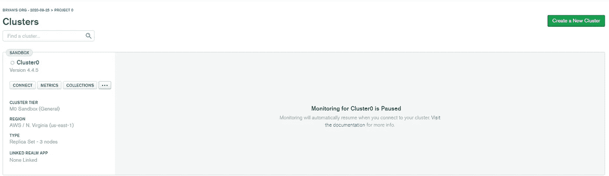

# 使用 Node.js、Express、MongoDB 和 JWT 创建一个认证 API

> 原文：<https://javascript.plainenglish.io/create-an-authentication-api-using-node-js-express-mongodb-and-jwt-1d52124d402e?source=collection_archive---------1----------------------->

## 编程|网络开发

## 如何使用 Node.js、Express、MongoDB 和 JWT 创建一个可靠的 Auth API


Photo by [Ferenc Almasi](https://unsplash.com/@flowforfrank?utm_source=medium&utm_medium=referral) on [Unsplash](https://unsplash.com?utm_source=medium&utm_medium=referral)

JSON Web 令牌在 Web 开发场景中越来越常见。您可以在应用程序中使用它们进行身份验证。服务器将通过在本地保存会话信息并在发出请求时将其转发给服务器进行验证，来信任客户端是注册用户。

让我们进入有趣的部分，编码。

# 要求

你需要开始做一些事情。这里有一个列表:

*   [Node.js](https://nodejs.org/en/) (推荐 14.16.1 版本)
*   [NPM](https://www.npmjs.com/)
*   [Visual Studio 代码/或任何其他代码编辑器。](https://visualstudio.microsoft.com/)
*   [一个 MongoDB 图集云账号](https://account.mongodb.com/account/login?n=%2Fv2%2F5f6e504f1bbd9176a32daf34&nextHash=%23metrics%2FreplicaSet%2F60197510b404491ea030b603%2Fexplorer%2FPasswordManager)
*   [邮递员](https://www.postman.com/)

为了让您的项目做好准备，我们首先启动我们的命令提示符或终端，在我们希望我们的项目所在的文件夹中输入以下命令来初始化我们的项目。

```
> npm init -y
```

这将创建一个包含以下内容的`package.json`文件:

# 安装必要的软件包

要使用 [Express Framework](https://expressjs.com/) ，我们首先需要通过输入这个命令来安装它:`> npm i express`。

我们还需要一些其他的包:

```
> npm i @hapi/joi bcryptjs dotenv jsonwebtoken mongoose nodemon
```

当我们开始使用这些包时，我会解释它们的用途。

# 创建基本的 Web 应用程序

为了确保一切工作正常，我们创建了一个基本/示例 web 应用程序来检查。

我们创建一个`index.js`文件，并放入下面的代码来创建一个工作的 web 应用程序。

在`package.json`文件中，我们更改了以下内容

```
"test": "echo \"Error: no test specified\" && exit 1"
```

到

```
"start": "nodemon index.js"
```

Nodemon 允许我们无中断地运行我们的应用程序。因此，当我们编辑并保存我们的项目时，它会“实时重新加载”

因此，运行`> npm start`来启动我们的项目，如果一切正常，它应该显示以下行:

```
[nodemon] restarting due to changes...
[nodemon] starting `node index.js`
Running server on port: 5000
```

# 设置我们的路线

让我们关注我们的路线，创建一个`routes`文件夹和一个`AuthRoutes.js`文件:

这是路由器最基本的变体，我们需要将这个文件添加到我们的`index.js`:

如您所见，在输入我们的`AuthRoutes`之前，我们需要使用`/api/user`前缀。

# 设置我们的数据库连接

为了连接到数据库，我们使用`Mongoose`和`dotenv`。我们将使用云版本的 [MongoDB](https://www.mongodb.com/) ，你必须创建一个免费帐户。当您登录并选择您的免费软件包时，您应该会看到以下内容:



Image by Author

点击连接并选择`Connect your application`复制连接字符串。您必须将它粘贴到一个新文件中:`.env`:

在您的`index.js`文件中添加以下导入:

```
const dotenv = require("dotenv");
const mongoose = require("mongoose");
```

这就是你如何配置它:

```
dotenv.config();
```

现在我们可以使用`Mongoose`连接到我们的数据库:

当您查看终端时，它应该会显示:

```
> Connected to DB
```

# 建立我们的用户模型

现在是我们建立模型的时候了，我们将使用该模型在数据库中存储我们的用户数据。我们将为我们的模型创建一个单独的文件夹:`Models`并创建一个名为`UserModel.js`的文件。看起来是这样的:

我们使用一个[mongose](https://mongoosejs.com/)方案来创建一个模型，我们希望在我们的数据库中有一个名字、一个电子邮件、一个密码和一个日期。正如您在属性中看到的，它们都是必需的，并且有最小和最大长度。

现在让我们把这个放进我们的数据库。

# 创建注册和登录路由

为了将我们的数据放入数据库，我们需要用户信息，这些信息通过路由提供给应用程序，所以让我们在`AuthRoutes.js:`中创建两个新的信息

要使用我们的模型，我们需要导入它:

```
const User = require("../models/User");
```

我们还需要一个包来验证/确认用户的输入，还需要一个包来加密我们的密码:

```
const bcrypt = require("bcryptjs");
const Joi = require("@hapi/joi");
```

## 让我们验证一下

我们使用 Joi 来验证数据，如下所示:

## 创建用户实例

让我们一步一步地引导您完成这一过程:

这将检查错误:

这将散列密码:

```
const salt = await bcrypt.genSalt(10);  
const hashPassword = await bcrypt.hash(req.body.password, salt);
```

这将创建一个新用户，并将其存储在数据库中:

因此，完整的注册路由如下所示:

## 创建登录路径

现在，我们可以创建一个用户，我们也想登录，我们将使用它。让我们先导入它:

```
const jwt = require("jsonwebtoken");
```

就像注册部分一样，我会指导您完成整个过程。

这将检查错误，如果用户存在:

这将检查密码是否正确:

这将创建一个 JWT 令牌并将其发送到浏览器:

因此完整的登录路径如下所示:

# 完成我们的项目

为了完成我们的项目，我们将需要添加一些东西到我们的`index.js`中，使它看起来像这样:

# 结论

我们使用了一些技术和概念来创建身份验证应用程序 API。你可以用 [Postman](https://www.postman.com/) 来测试你的 app。我希望你从这篇教程中学到了一些东西，我也很想看看你的结果。

**如果你喜欢我的文章，你可以在这里注册我的** [**免费邮箱。**](https://bryandijkh.substack.com/)

[](https://bryandijkh.medium.com/membership) [## 通过我的推荐链接加入媒体——布莱恩·迪克伊岑

### 阅读布莱恩·迪克伊岑(以及媒体上成千上万的其他作家)的每一个故事。您的会员费直接…

bryandijkh.medium.com](https://bryandijkh.medium.com/membership)