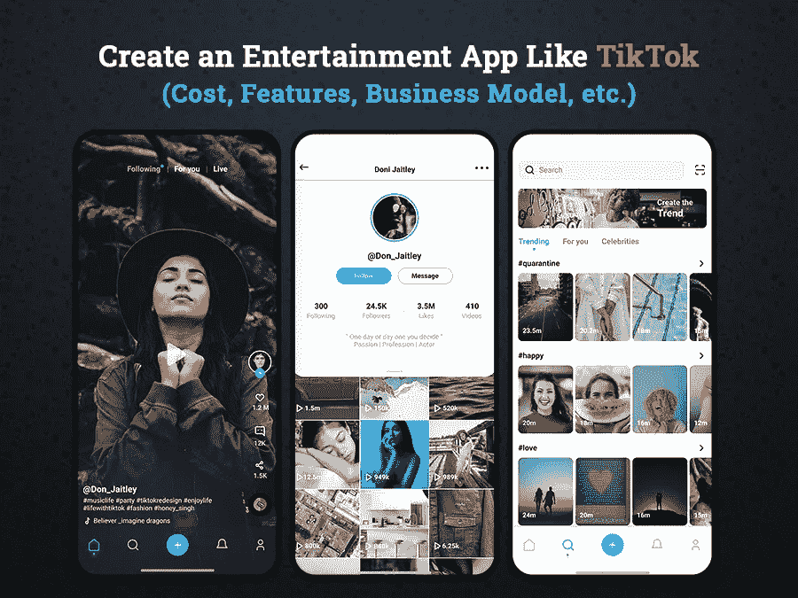
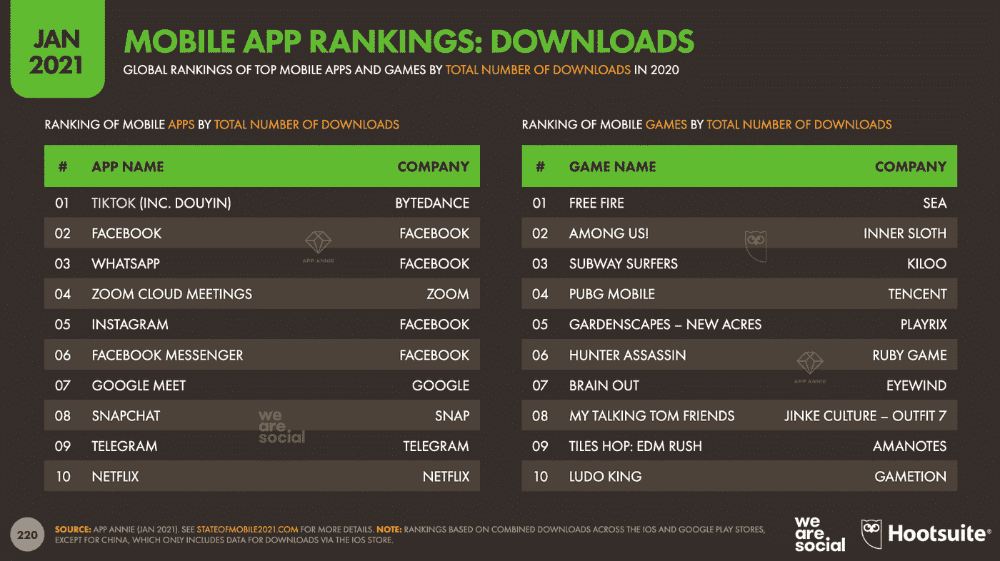
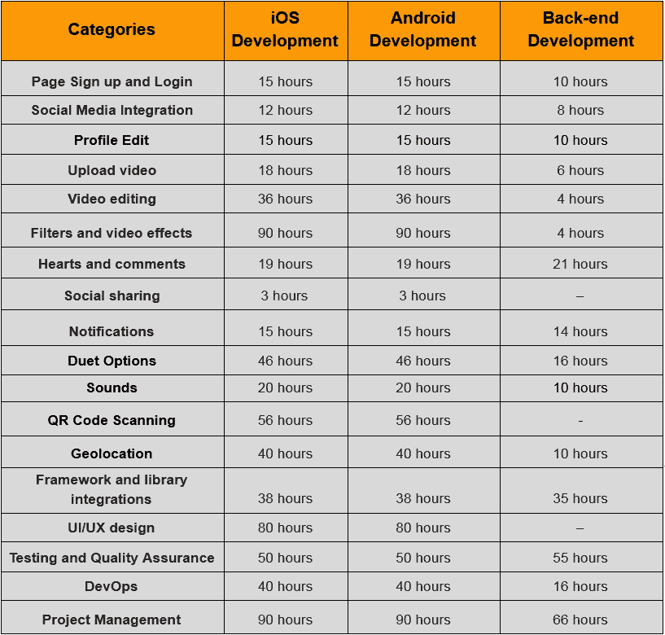

# 2022 年打造一个像抖音这样的 App 需要多少钱

> 原文：<https://javascript.plainenglish.io/create-an-entertainment-app-like-tiktok-30bda100aa47?source=collection_archive---------4----------------------->

## 创建一个像抖音一样的娱乐应用程序(功能、商业模式、成本等)。)

Image Source: Author

移动和应用商店中有 550 万个应用程序，移动应用程序像抖音一样获得巨大成功是罕见的。正如 Spotify 因音乐而受欢迎，Snapchat 因最令人惊叹的照片滤镜而闻名，抖音也以同样的方式进入了娱乐市场，并让数百万用户持续关注它数小时。

抖音是一款于 2017 年发布的视频分享应用程序，随后 musical.ly 风靡全球，最近变得格外受欢迎。这款应用易于使用的界面已经迅速传播开来，并开始受到每个人的关注，包括普通用户、企业、博客、名人和其他人。

在抖音之前，社交媒体应用被认为是青少年和成年人最常见的娱乐选择之一。社交媒体应用程序的概念变得如此流行，以至于它吸引了世界各地的企业，并鼓励他们创建一个类似的应用程序，以吸引全球数百万用户。

如果你能感同身受，你会发现抖音在短时间内成为潮流引领者，并作为新兴企业开始创收的最具潜力的平台而脱颖而出。

有很多人找到谷歌，询问如何建立一个像抖音这样的应用程序。但是，你登陆这个博客的原因是你没有找到这个问题的合适答案。不要担心，这个博客将让你更近距离地了解视频应用程序的开发过程，它的成功因素和使它在企业中如此苛刻的特性。

> 以下是这篇博客的几个亮点:

*   *市场分析报告:抖音背后的理念和魅力*
*   *像抖音这样的应用程序是如何工作的？*
*   *如何制作像抖音一样的应用程序:需要考虑的特性和技术*
*   *打造一个像抖音这样的 App 需要多少成本:影响最终成本的因素？*
*   *如何像抖音一样从你的应用中赚钱？*
*   *结论:下一步何去何从？*

*让我们深入了解每一点，以便更好地理解:*

## 市场分析报告:抖音背后的理念和魅力

在进入应用程序开发过程之前，有必要了解一下抖音到底是什么？给你一个简短的介绍，抖音对一个组织的目标是，“它帮助你直接从手机上捕捉和呈现最珍贵而又充满乐趣的时刻。所以[**雇佣一个移动应用开发者**](https://www.xicom.ae/services/mobile-app-developers/) 来帮助你建立一个现代的视频分享应用。凭借抖音最令人惊叹的特性和功能，每个人都变成了创作者，并通过视频推动他们发挥自己的激情和创造性表达。随着用户群的持续增长，抖音已经开始与 YouTube、Instagram 和脸书等行业巨头竞争。

但现在的问题是，是什么让抖音在竞争中脱颖而出，成为一个更具娱乐性的平台？这个应用程序最迷人的一面是，由于它简单易用的界面，它实际上给了任何人成为内容提供商的机会。如果你还在怀疑世界上有多少内容创作者在使用抖音，为什么他们的企业在探索通过这种商业模式赚钱的方式，那么你需要看看关于抖音的这 10 个令人印象深刻的数据。

*   根据研究，抖音将在 2020 年 8 月达到 20 亿次全球下载的里程碑。

[Image Source](https://www.hootsuite.com/pages/digital-trends-2021)

*   凭借 6.89 亿的[全球活跃用户](https://www.hootsuite.com/pages/digital-trends-2021)，抖音成为继 Youtube、脸书、WhatsApp、Instagram、Messenger 和微信之后全球第七大社交网络。

[Image Source](https://www.hootsuite.com/pages/digital-trends-2021)

*   [根据 Statista](https://www.statista.com/statistics/1115136/tiktok-user-engagement-monthly-usa/#:~:text=From%20October%202019%20to%20March,on%20the%20social%20video%20platform.) 的数据，抖音用户每月在应用上花费超过 850 分钟，抖音的应用用户参与度更高。
*   结合 Tik Tok 或抖音的搜索词，它已经成为 YouTube 上最常见的搜索查询，抖音现在可以在 200 多个国家使用。
*   抖音老板字节跳动的估值高达 1000 亿美元，是世界上最有价值的初创公司。
*   抖音在 150 个市场有 75 种语言版本。
*   抖音的移动应用在谷歌 Play 商店和应用商店总共被下载了 15 亿次。

> **除了这些数据之外，以下是抖音的独特卖点:**

**简单、轻松、快速地创建内容:**抖音最吸引人的地方在于，它在一个地方提供了所有重要而强大的视频捕捉和编辑工具，并允许用户直接通过手机轻松创建内容。抖音是一个超级容易、快速和简单的访问平台，为内容创作者提供最好的视频制作工具。

**目标受众:**当你构建一个社交媒体应用时，你可以选择针对多个年龄段的用户范围。但抖音在这里有点不同，因为它主要针对 16-24 岁的用户，所以有必要与 [**移动应用开发公司**](https://www.xicom.ae/services/mobile-app-development/) 合作。大多数企业都没有意识到这一事实，但抖音只针对那些不怕或不犹豫地站在镜头前，以令人印象深刻的方式展示自己才华的观众。此外，同年龄组的用户更倾向于检查他们的手机和应用程序，以跟踪每一次更新。

**你的应用赚钱的潜力:**抖音提供了一系列选项来赚钱，并不断激励用户上传越来越多的内容。例如，拥有 1000 多名粉丝的最受欢迎的账户可以利用直播功能。此外，用户可以用这笔钱购买虚拟礼物或发送它们作为感谢的象征。此外，用户可以将这些礼物兑换成现金。

**完美的品牌和营销平台:**据观察，抖音的平均参与度高于其他平台，如 Instagram 或 Twitter，因此，行业最领先的品牌如 Myntra 和可口可乐选择抖音进行品牌、营销和广告宣传。事实上，甚至名人也开始使用抖音制作短视频。

总而言之，总结这些数字和事实，预测像抖音这样的应用有一个光明的未来是不足为奇的。因此，无论你是想建立一个像抖音一样的应用程序，还是想将其集成到你的社交媒体平台上，这两种方式都是发挥这种应用程序潜力的好方法。

# 像抖音这样的应用程序是如何工作的？

毫无疑问，凭借 2018 年 10 亿月活跃用户，抖音已经占据了娱乐行业的中心舞台。但是你们中的许多人都进退两难，不知道它到底是如何工作的，这个应用程序的成功秘诀是什么？

> 下面就来揭秘一下吧！

抖音是一个视频分享平台，允许用户在线创建和分享视频，并让他们的用户长时间粘在上面。随着时间的推移，抖音似乎成了一个完美的平台，可以展示才华，以最有影响力的方式与广泛的受众分享知识。但是这个平台突然流行背后的原因是它的算法。

抖音使用一种独特的算法来决定显示什么样的内容，以符合用户的兴趣。通过利用算法的力量，抖音揭示了你应该创建什么类型的内容以及建议栏的所有细节。我们来详细了解一下..

> 开发像抖音这样的应用程序实际上需要对算法有详细的了解。那么，抖音是如何创建“为你”页面的呢？

为了帮助您构建一个完美的页面，系统会分析各种因素，如用户交互、视频信息、设备和帐户设置。基于这些信息，抖音向每个内容用户提供了一个独特的建议，告诉他们在为你建立页面时应该记住哪些重要提示。

考虑到这些建议，用户可以找到更多个性化抖音内容的方法，并能够以更好的方式瞄准观众。在使用该应用程序之前，用户需要选择他们感兴趣的类别。万一用户跳过选择类别，然后抖音开始向你展示最热门的视频。

要建立一个像抖音一样成功的视频分享应用，确保你限制用户选择感兴趣的区域，这样你平台上的内容创建者就能更好地了解他们应该创建什么类型的内容。

> 现在的问题是如何建立一个像抖音一样的应用程序，你应该利用什么技术来弥合你的应用程序想法和成功之间的差距…

# 如何制作一个像抖音一样的应用程序:需要考虑的功能和技术

既然有这么多流行的应用程序可以效仿，那就没有必要重新发明一个轮子。这里你所需要的是给你的应用添加独特性来抓住用户的注意力，并在你的平台上为他们提供一些新的创新的东西。因此，在你 [**雇佣一个应用程序开发人员**](https://www.xicom.ae/solutions/hire-developers/) 来创建一个像抖音一样的应用程序之前，你需要计划如何用技术的完美结合来改造这个应用程序，并确定为你的业务增加巨大价值的关键特性。

> 让我们从您需要集成到视频共享应用程序中的基本功能开始:

**页面注册和登录:**与其他应用一样，这是视频分享应用最基本的功能，只需添加登录和注册的主要功能，就可以访问该平台。但是要确保通过提供简单快捷的注册表单来获取用户的最大信息。保持简短快速的填充，这样用户就不会被吓跑。

**社交媒体整合:**为了让您的注册过程更加简单快捷，您还可以允许用户直接链接到社交媒体账户，包括脸书、Instagram、Twitter 等。理想情况下，注册该应用程序最简单的方式是通过电子邮件和联系电话。

**编辑个人资料:**添加通过更改个人资料图片或用户名、简历等来编辑用户个人资料的功能。添加概要文件定制特性总是一个好的选择。

**上传视频:**如果无法上传到你的个人资料上，那么捕捉视频有什么用？因此，有必要为用户提供一种简单快捷的方式来上传视频，并允许他们与目标观众分享。

**视频版:**和抖音一样，你也可以让用户在应用程序上编辑视频。添加一些基本的编辑选项，如翻转、加速或减慢视频、缩短视频长度等。此外，还有一种可能性是添加美颜模式，使用户的皮肤看起来光滑。

**使用滤镜和效果:**为了让您的内容更吸引人，这是一种在视频内容中提供多种滤镜和效果选择的好方法。因此，您可以让他们使用独特的过滤器，制作有吸引力的内容。

**喜欢、心和评论:**与 Instagram 类似，抖音也允许用户对他们最喜欢的视频投下一颗心或发表评论。

**视频分享:**为了增加用户群，你可以在脸书、Instagram、Twitter 等社交媒体平台上提供视频分享选项。此外，抖音还提供将用户资料连接到其他社交网络的服务。

**通知:**为了让用户随时了解所有的评论、喜欢和视频分享，有必要在你的应用程序上添加推送通知功能。

**管理面板:**管理面板充当应用程序的主控，它管理用户并提供用户的所有分析。

> 大多数应用程序开发公司提出，建立一个具有这些功能集的应用程序的平均成本将在 15，000 美元到 18，000 美元之间。但是，其他应用程序已经提供了所有这些基本功能，那么你如何让你的应用程序在竞争中脱颖而出呢？

> 以下是为您的应用增加竞争优势的高级功能集！

# 视频分享应用需要考虑的高级功能

**Duet Options:** TikTokers 正在广泛使用这一功能，并不断扩大其用途。用户可以用对口型创建一个音乐视频，添加一个#duetwithme 标签，并要求其他用户与他们对唱。

**声音:**将这一现代功能添加到您的应用程序中，并允许用户通过从内置的应用程序库中添加喜爱的歌曲作为背景音乐来创建短视频，并应用唇形同步功能。

**二维码扫描:**用户可以通过扫描唯一的二维码订阅其他音乐视频 app 用户。由于在应用程序中添加这一功能涉及到一个复杂的过程，因此最好将其留给 [**移动应用程序开发公司**](https://www.xicom.ae/services/mobile-app-development/) 。

**地理定位:**使用应用程序的地理定位功能将允许它显示附近的活跃博主，他们不断地创建短视频和广播流。

构建一个具有高级功能的应用程序的平均成本将为 20，000 美元到 25，000 美元以上，但我们的建议是使用现代应用程序，因为它有助于为用户提供独特性。

> **接下来，让我们来关注制作像抖音这样的移动应用程序所需的技术**

抖音是一个巨大的应用程序，结合了各种技术。为了为用户过滤和个性化数据，必须使用人工智能。为了更好地使用和理解算法，可以使用机器学习。

如果你有兴趣 [**构建一个像抖音**](https://www.xicom.ae/services/mobile-app-development/) 这样的应用，那么你需要明白，这个应用广泛利用人工智能，通过使用对象和图像识别来自动添加标签。

> **其他需要的技术有:**

*   亚马逊 S3 或 Azure 服务器的云存储
*   内容交付网络
*   视频/音频代码转换
*   编程生产力 GWT
*   MailChimp，Cassandra 数据库，MongoDB，PostgreSQL 等数据库集成。

如果你想开发一个与 Android 平台兼容的本地应用，那么你必须利用 Kotlin 和 Java。而对于 iOS 开发，使用 Swift 或 Objective C。但最好的选择是借助 Flutter、React Native、Xamarin 等跨平台应用程序。

## 建立一个像抖音一样的应用程序需要多少成本:影响最终成本的因素？

在我们向你透露确定开发一个像抖音这样的应用程序的实际成本之前，我相信你已经在谷歌上做了很多研究，但不确定的是，你会找到答案，它将在 20，000 美元到 50，000 美元之间。

> 希望，我就在这里！

但我问你，这些是真实的统计数据吗？不要！因为视频分享应用程序开发没有成本标准。具有不同需求的企业总是在寻找一种能紧密满足其特定需求的解决方案。一个标准的解决方案并不适用于所有人！

因此，要了解像抖音这样的应用程序将花费你多少钱，你需要深入挖掘那些极大地影响应用程序开发成本的因素。

> **让我们快速了解一下影响 app 开发成本的因素:**

**操作平台:**你可以选择在 Android、iOS 或两者上运行你的应用。但是，当投入巨大的精力来构建一个像抖音这样的应用程序时，建议在两个平台上发布你的应用程序，以瞄准大量的用户群。

在单一本地平台上发布应用的平均成本在 20，000 美元到 25，000 美元之间，而跨平台应用的成本相同，但你可以在多个平台上使用。

**UX/UI 设计:** App 设计是极大贡献 App 开发成本的主要因素之一。由于用户对愉悦的用户体验要求更高，因此雇佣一名应用设计师来帮助你建立稳固的第一印象是有意义的。对于 iOS 和 Android 系统，设计一个应用程序的成本大约在 5000 美元到 5500 美元之间。

**应用程序开发团队:**应用程序开发成本会因你选择为开发项目雇佣的团队而有很大差异。你们中的许多人认为，内部开发团队会让你花费更少，并为你提供实时更新、响应，使沟通更容易。但残酷的事实是，你需要在 IT 基础设施、工资、租金等方面进行投资。鉴于此，外包 [**移动应用开发公司**](https://www.xicom.ae/services/mobile-app-development/) 会让你接触到高技能、有经验、有才华的应用开发人员，而你的成本比内部团队低。最棒的是，他们总是茁壮成长，以交付质量和满足项目期限。

但是应用开发者的成本在地理上有所不同。在美国和欧洲，应用程序开发人员的时薪从每小时 100 美元到 150 美元以上不等，似乎是雇佣技术专家最昂贵的地区。而印度和阿联酋是雇佣软件开发人员最便宜的地区，起薪在每小时 15 美元到 20 美元以上。其余定价可以超出这些每小时成本，以维护专业知识、技能和技术知识。

**该应用程序的特点和复杂性:**上面讨论的特点和功能已经解释了粗略的价格估计。您可以根据应用程序的复杂程度来选择特性和集成功能。

*   **基本应用程序结构**:带有管理面板的基本功能将花费 15，000 美元到 20，000 美元以上。
*   **中等应用程序结构:**具有更多功能和管理面板的附加功能将花费 18，000 美元至 20，000 美元以上。
*   **复杂的应用程序结构:**带有超级管理面板的现代功能的高级特性将花费 25，000 美元到 30，000 美元以上。

> 让我们用这张信息图粗略估计一下创建一个像抖音这样的应用程序的总成本。

*现在你已经准备好将最好的特性集成到你的应用中并构建它，但是主要的问题还没有答案。你将如何从抖音这样的应用程序中赚钱？*

## 如何像抖音一样从你的应用程序中赚钱？

现在你已经知道了开发一个应用程序的最佳功能和成本，但对企业来说最重要的问题仍然没有答案:如何从你的应用程序中赚钱？有各种方法可以让你的应用程序赚钱，但在这里我们揭示了从你的视频分享应用程序赚钱的最有效的方法。

*   *应用内购买*
*   *筹款*
*   *每次点击成本*
*   *广告*
*   *每项行动的成本*

> **除此之外，你还可以借助这些策略:**

*   **内容营销:**为博客、视频和信息图表创建高质量的新鲜内容，这些内容将与您的目标受众更加相关。
*   **付费广告:**允许第三方商家进行营销活动，从 PPC 中赚取你的收入。

# 结论:对 App 开发有想法？

社交媒体应用是世界上最吸引人的应用，但抖音是那些成功的娱乐应用之一，在推出的同一年就赢得了数百万用户的心，并激励全球企业投资这种应用模式。因此，如果你是那些打算像抖音一样制作应用程序的人之一，那么你需要聘请一家 [**移动应用程序开发公司**](https://www.xicom.ae/services/mobile-app-development/) ，它可以将你的应用程序创意转化为一款能让你盈利的应用程序。

一个专业的应用程序开发团队并没有像抖音一样制作类似的应用程序，而是提出了更好但创新的解决方案，这些方案可能会给市场带来巨大冲击。所以看完这篇博客后，如果你有任何疑问，请在下面留言。

*更多内容请看*[*plain English . io*](http://plainenglish.io/)