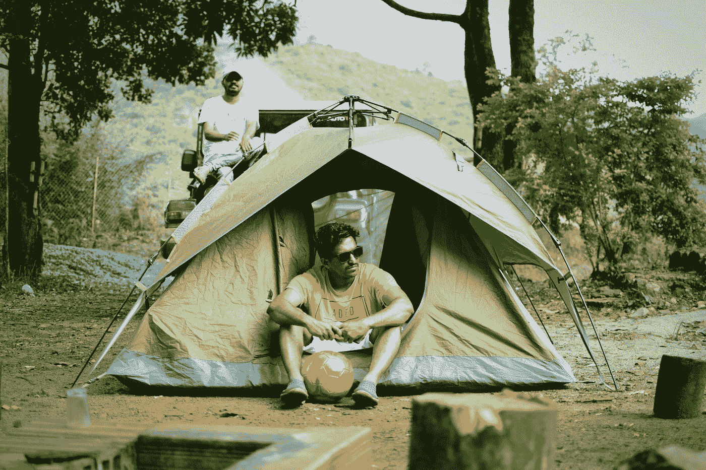

# 使用 Vue 3 和 JavaScript 创建图像模式

> 原文：<https://javascript.plainenglish.io/create-an-image-modal-with-vue-3-and-javascript-620d2da55a1c?source=collection_archive---------13----------------------->



Photo by [rafzin p](https://unsplash.com/@rafzin?utm_source=medium&utm_medium=referral) on [Unsplash](https://unsplash.com?utm_source=medium&utm_medium=referral)

Vue 3 是易于使用的 Vue JavaScript 框架的最新版本，它允许我们创建前端应用程序。

在本文中，我们将了解如何使用 Vue 3 和 JavaScript 创建一个图像模式。

# 创建项目

我们可以使用 Vue CLI 创建 Vue 项目。

要安装它，我们运行:

```
npm install -g @vue/cli
```

与 NPM 或:

```
yarn global add @vue/cli
```

纱线与。

然后我们运行:

```
vue create image-modal
```

并选择所有默认选项以创建项目。

# 创建图像模式

为了创建图像模态，我们写道:

```
<template>
  <div>
    <button @click.stop="displayModal = true">open modal</button>
    <div id="modal" v-if="displayModal">
      <button @click="displayModal = false">x</button>
      <div>
        <button @click="prev">&lt;</button>
        
        <button @click="next">&gt;</button>
      </div>
    </div>
  </div>
</template>
<script>
const images = [
  "https://images.dog.ceo/breeds/pomeranian/n02112018_5091.jpg",
  "https://images.dog.ceo/breeds/mountain-swiss/n02107574_753.jpg",
  "https://images.dog.ceo/breeds/leonberg/n02111129_3028.jpg",
];
export default {
  name: "App",
  data() {
    return { index: 0, image: images[0], displayModal: false };
  },
  methods: {
    next() {
      this.index = (this.index + 1) % images.length;
      this.image = images[this.index];
    },
    prev() {
      this.index = (this.index - 1) % images.length;
      this.image = images[this.index];
    },
    onClickOutsode(e) {
      if (e.target.localName !== "button") {
        this.displayModal = false;
      }
    },
  },
  mounted() {
    window.addEventListener("click", this.onClickOutsode);
  },
};
</script><style scoped>
img {
  width: 200px;
  height: 200px;
}#modal {
  position: absolute;
  top: 20px;
  left: 20px;
  border: 1px solid gray;
  background-color: white;
}
</style>
```

打开模式按钮将`displayModal`设置为`true`，以便我们打开模式。

我们添加了`stop`修饰词，这样点击事件就不会冒泡到祖先元素，这样就不会在它们上面触发点击事件。

ID 为`modal`的 div 将`v-if`设置为`displayModal`，让我们仅在`displayModal`为`true`时显示。

在它里面，我们有一个 x 按钮来设置`displayModal`到`false`来关闭模态。

然后我们有 2 个更多的按钮分别移动到上一个和下一个图像。

`img`将`src`设置为`image`以显示当前图像。

在 component 对象中，我们有`next`方法，通过将 1 加到`this.index`来获得下一个图像的索引，当除以`images.length`时，获得下一个图像的索引的剩余部分。

类似地，我们有`prev`方法，通过从`this.index`中减去 1 来获得前一个图像，以获得前一个图像的索引。

`onClickOutside`方法由`window`的`click`收听者使用，以检测来自浏览器屏幕内的一切的点击。

我们确认`localName`不是`'button'`。

如果不是，则我们将`this.displayModal`设置为`false`以关闭模态。

这确保了我们的代码中除了“x”按钮之外的所有按钮都不会关闭模式，但是当我们单击模式之外的按钮时，模式就会关闭。

然后在`mounted`挂钩中，我们将`click`监听程序添加到`addEventListener`以监听点击。

当所有元素都被加载时,`mounted`钩子就会运行，所以这是添加点击监听器的合适钩子。

然后在`style`标签中，我们通过将`position`设置为`absolute`使 ID 为`modal`的 div 成为模态的，使其位于打开模态按钮之上。

然后我们用`top`和`left`属性改变它的位置。

给模态 div 添加一个边框，这样我们就可以看到模态。

`background-color`设置为`white`，这样就没有透明背景了。

# 结论

我们可以使用 Vue 3 在我们的应用程序中轻松创建自己的模型。

喜欢这篇文章吗？如果有，在[**plain English . io**](https://plainenglish.io/)获取更多类似内容