# 创建和部署带角度的 PWA:分步指南

> 原文：<https://javascript.plainenglish.io/create-and-deploy-a-pwa-with-angular-step-by-step-guide-cab2e471288d?source=collection_archive---------7----------------------->

## 如何创建和部署角度 PWA 并使用 Bit 创建可重用组件

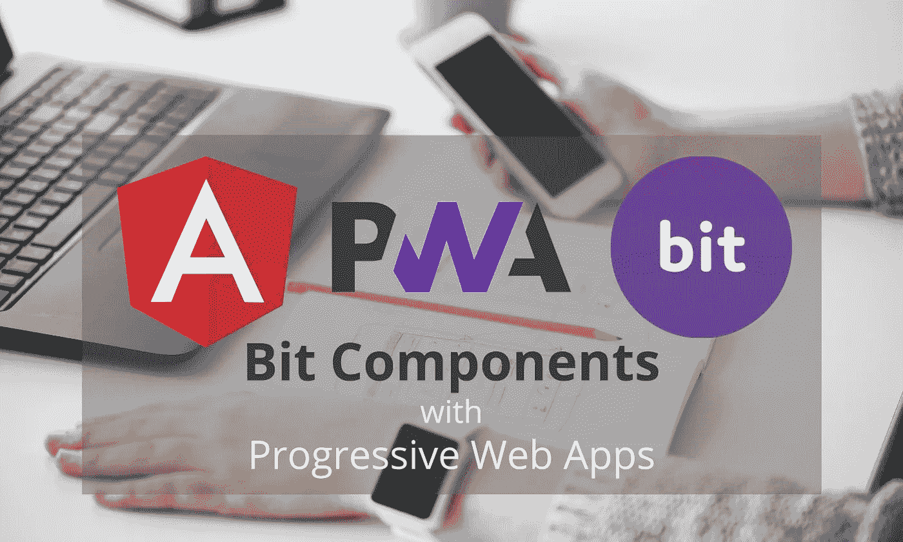

> 本教程使用 Bit 的稳定版本。比特的最新测试版(“比特和谐”)已经发生了巨大的变化。在文档[中了解更多信息，请点击](https://harmony-docs.bit.dev/)。

渐进式网络应用是一项令人兴奋的技术，有可能改变我们开发网络和移动应用的方式。今天，我们可以看到 pwa 的增加，离线支持和背景同步等功能是它成功的主要原因。

最近我遇到了[位](https://bit.dev/)，在那里我可以找到社区建造的[角构件](https://bit.dev/components?q=angular)包含在我的项目中。所以，我尝试在我的 PWA 应用程序中使用 Bit 组件。

本文将分享我使用 Angular PWA 框架、 [**Bit**](https://bit.dev/) **、**和 Netlify 开发、构建和部署 PWA 的经验。

# 从 PWA 开始

首先，选择角度 PWA 框架没有特别的原因。您可以使用任何支持 PWA 的库或框架，如 React PWA 库、Vue PWA 框架等。

## 第 1 步:安装 Angular CLI 并创建一个新项目

让我们从安装 Angular 10 CLI 并创建一个全新的 Angular 项目开始:

```
npm install -g @angular/cli@10
ng new pwabit
```

`ng new`命令提示您输入要包含在初始应用项目中的功能信息。通过按回车键或回车键接受默认值。

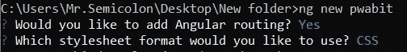

Angular CLI: accept the defaults

该命令在`pwabit`目录内创建一个角度应用程序。接下来，我们可以导航到新创建的目录，并在代码编辑器中打开它。

```
cd pwabit
code .
```

## 第 2 步:安装 Angular PWA NPM 图书馆

现在我们可以打开目录里面的终端，添加`@angular/pwa`包了。

```
ng add @angular/pwa
```

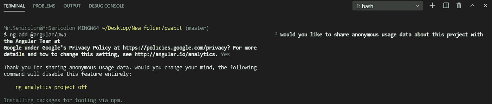

Add angular/pwa package

出于配置目的，增加了`ngsw-config.json` 和`manifest.webmanifest`。同时修改`angular.json`、`package.json`、`index.html`、`app.module.ts`，在`assets`目录下增加不同分辨率的 png 文件。

```
ng build --prod
```

命令构建了项目，现在我们准备使用 Angular service worker。但是`ng serve`不支持服务人员，您必须使用单独的 HTTP 服务器在本地测试您的项目。

## 步骤 3:安装支持服务人员的 HTTP 服务器

```
npm install --global http-server
```

要使用`http-server`提供包含您的 web 文件的目录，请运行以下命令:

```
http-server -p 8080 -c-1 dist/pwabit
```

现在，您可以通过 [http://localhost:8080](http://localhost:8080) 在浏览器中打开您的应用程序，从您的网络选项卡中，您可以看到您的服务人员`ngsw-worker.js`处于活动状态。

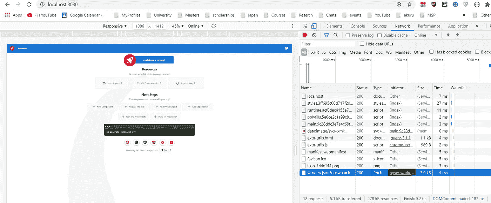

Verifying PWA installation

然后我们可以通过在 Chrome 开发者工具中将在线模式改为离线来模拟一个网络问题。

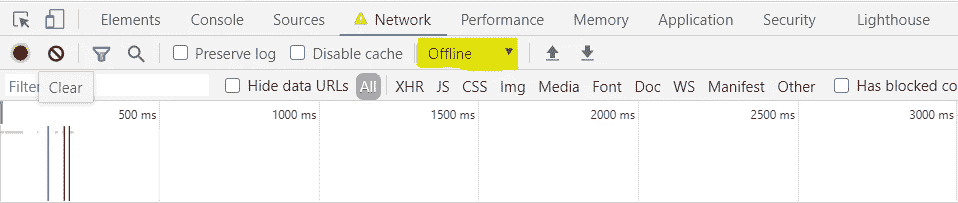

Check the offline box in Chrome Dev Tools

现在，应用程序无法访问网络，并且不使用 Angular 服务工作器。现在刷新会显示 Chrome 的互联网断开页面，上面写着:“没有互联网连接。”但是在我们的例子中，即使网络断开，应用程序也是从服务人员加载的。(不从互联网加载)

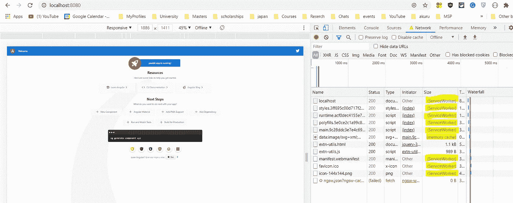

Application is loading from the service worker while offline.

# 让我们用比特变点魔法吧

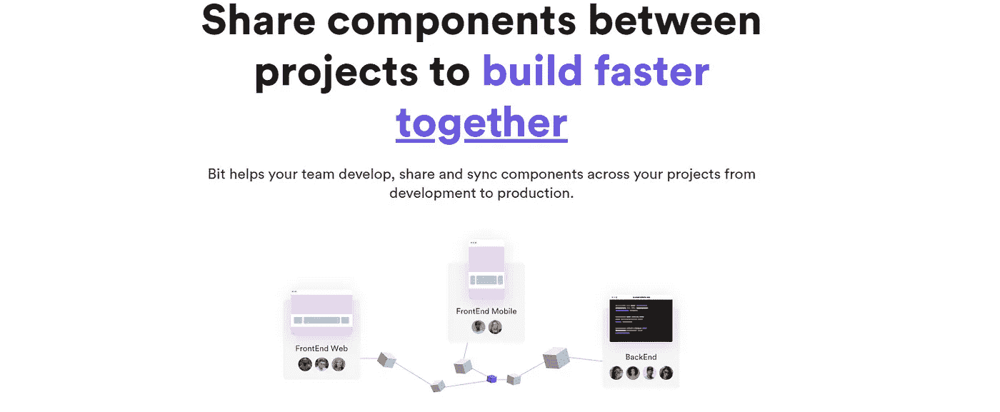

Source: [https://bit.dev/](https://bit.dev/)

正如我前面提到的，Bit 已经有数千个由全球开发者开发和发布的组件。让我们看看如何在项目中使用它们。

## 步骤 1:安装位 NPM

```
npm install bit-bin --global
bit init
```

如上所示，我们可以使用 npm 或 yarn 全局安装 Bit，然后重用 Bit repository 组件。我们需要通过`bit init.`初始化我们项目中的位

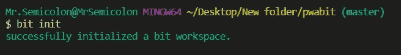

Initialize Bit workspace

## 步骤 2:导入位组件

现在假设我想使用一个来自 Bit 组件库中的按钮组件。我可以将按钮作为 NPM 包安装，或者*导入*带有源代码和其他位配置的按钮组件。

```
bit import austinhenderson19.mobile-components/btn
```

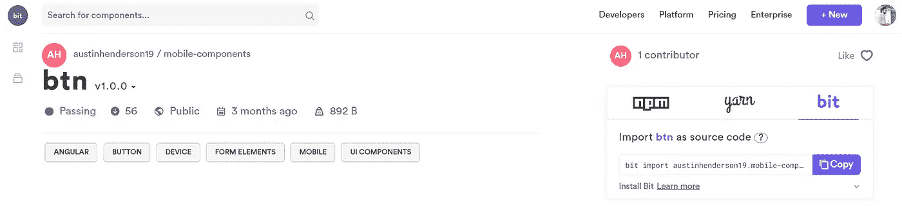

button component by [austinhenderson19](https://bit.dev/austinhenderson19) on [Bit.dev](https://bit.dev/)

大多数情况下，我更喜欢 import ( `bit import`)，因为它使我们能够容易地修改我们自己项目中的组件，使它适合我们自己的需要。

如果一个组件是由我们或我们的团队/组织创作的，它也可以用新版本*导出*回它的远程集合——使我们不仅是那个组件的消费者，也是维护者。

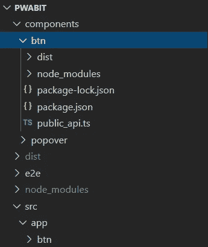

Drag btn component and paste it inside src -> app folder

现在在组件目录中找到下载的组件。

将其向下拖动并粘贴到 src-> app 文件夹中，以便在您的项目中使用`btn` 组件。

最后，让我们在`app.module.ts`中导入并声明`BtnComponent`，并在`app.component.html`中使用它

就是这样！现在我们可以通过`http-server -p 8080 -c -l dist/pwabit`运行我们的 PWA 项目

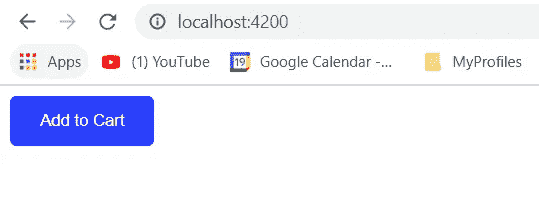

ng serve builds and serves your app in 4200 port

> **附加说明:**由于我们之前已经使用`http-server`运行了 PWA 项目，因此很有可能从本地缓存中加载相同的页面。出于测试目的，我们可以通过`ng serve`命令在没有 PWA 的情况下运行它，它将在 4200 端口运行项目。

# 部署到网络

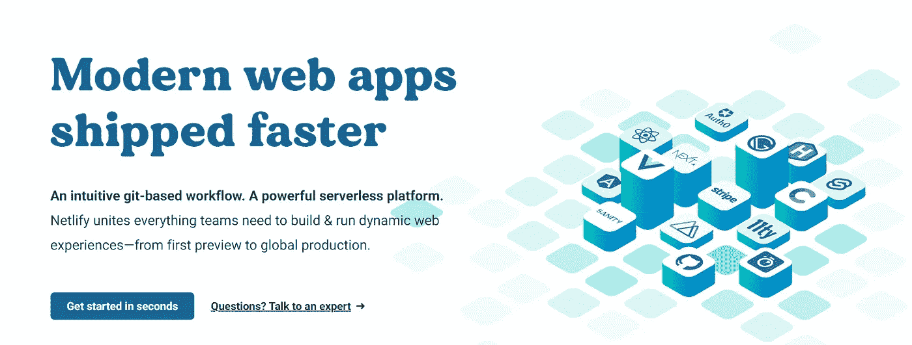

Source: [https://www.netlify.com/](https://www.netlify.com/)

最终，我们需要部署我们的 PWA 应用程序，使其可公开访问。因为这是一个示例应用程序，所以我选择了 Netlify，它提供了一个慷慨的免费层。

Netlify 允许开发人员使用 Git 托管他们的应用程序，并免费将它们部署在他们的云上。

## 步骤 1:创建一个 Git 存储库并推送代码

首先，创建一个 [GitHub](https://github.com/) (在这个例子中我使用的是 GitHub)， [Gitlab](https://about.gitlab.com/) ，或者 [Bitbucket](https://bitbucket.org/product) ，并把你的代码放在那里。

第二步是在 GitHub 上创建一个新的资源库，并将`push`我们的项目放入这个资源库。为此，我在这里创建了一个名为`bitpwa`的存储库，并遵循以下步骤:

1.  打开 Windows 命令提示符。
2.  在命令提示符下，切换到源代码所在的目录。
3.  `git init`
4.  `git add .`
5.  `git commit -m "adding files"`
6.  `git remote add origin [https://github.com/Semicolon10/pwabit](https://github.com/Semicolon10/pwabit)`
7.  `git push origin master`

## 步骤 2:配置 Netlify 来构建和发布代码

下一步是从您的 Netlify 帐户配置部署。所以让我们转移到 https://www.netlify.com/的[并遵循下面的步骤，](https://www.netlify.com/)

1.  点击->从 Git 新建站点。
2.  选择您的 Git 提供商并授权->在我的例子中是 GitHub
3.  在 Search 选项卡中搜索您的存储库，并选择->在我的情况下，选择`pwabit`。
4.  在下一个窗口中，选择分支为`master`，然后发出构建命令为`ng build --prod`，发布目录应该为`dist/pwabit`

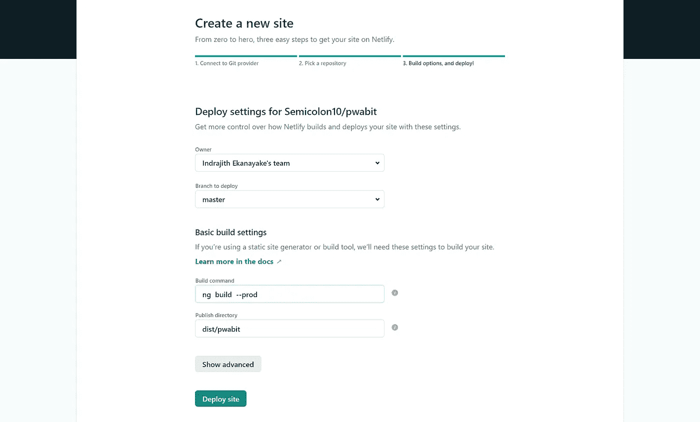

Set Netlify build configurations

然后需要几分钟来构建和部署您的应用程序。一旦部署完成，我们就可以使用给定的 URL 公开访问应用程序。

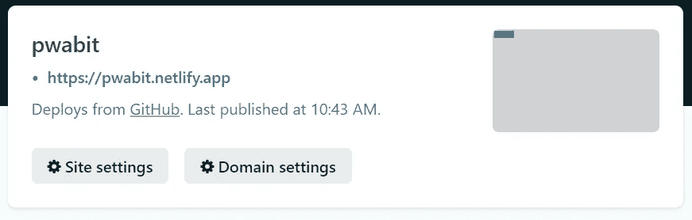

Deployment Successful

我们现在正在直播。请访问[https://pwabit.netlify.app/](https://pwabit.netlify.app/)查看此演示 PWA 应用程序

> **补充说明:**你只会在下面的链接中看到按钮和 PWA 安装选项，因为这只是我试用的概念证明。

*更多内容尽在*[***plain English . io***](https://plainenglish.io/)