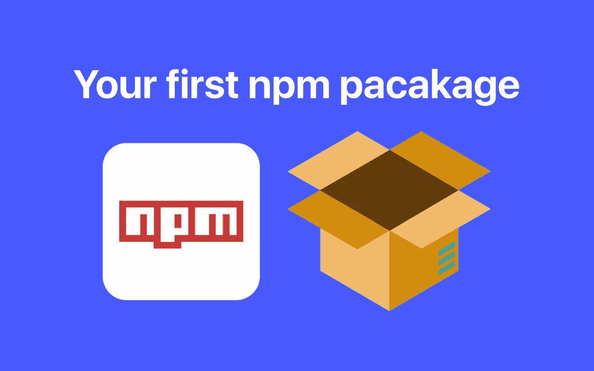
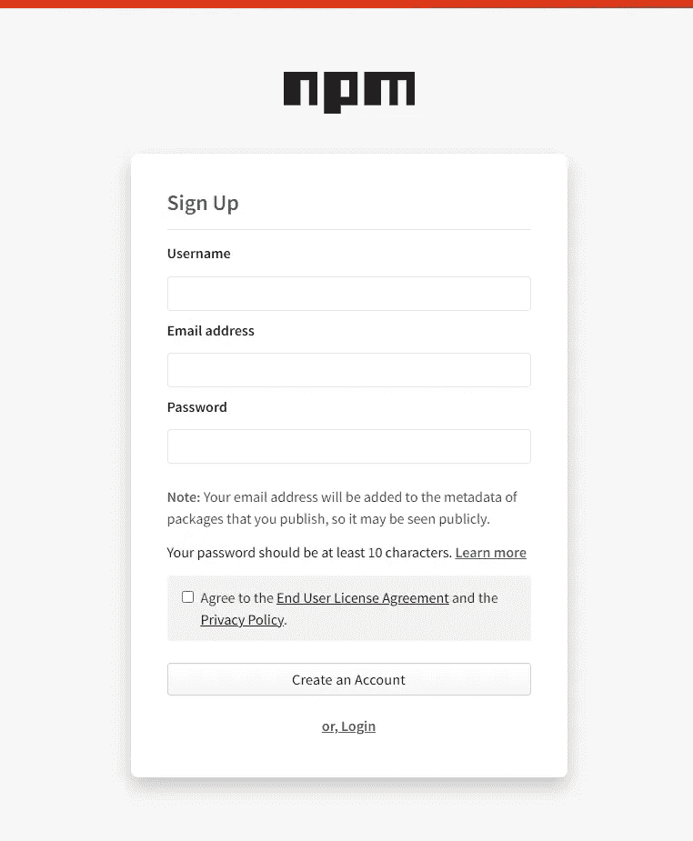
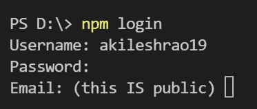
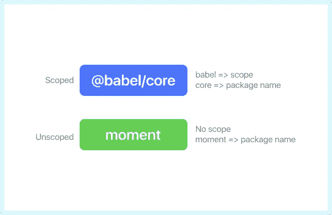
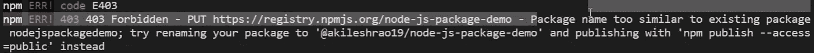
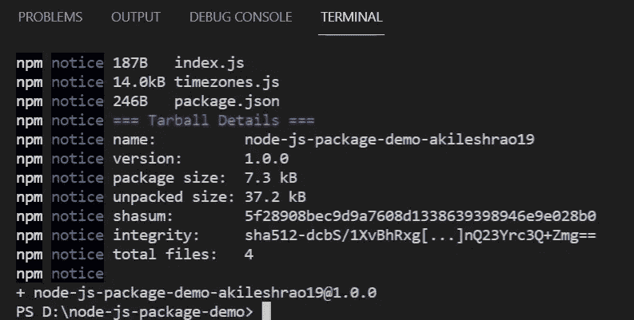
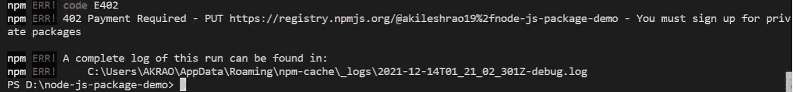

# 创建并发布您自己的 NPM 模块

> 原文：<https://javascript.plainenglish.io/create-and-publish-your-own-npm-module-216bffe82dc5?source=collection_archive---------9----------------------->



老实说，复制代码很糟糕。这是一个冗长费时的过程，它暂时解决了问题，但从长远来看却是一个负担。您可以创建函数并在您的项目中重用它们，但是，通常情况下，您会发现自己在其他项目中需要相同的函数。这就是你应该考虑将这个函数捆绑到一个包中，然后在你未来的项目中重用它的地方。

在这篇博文中，我们将使用 Node.js 做同样的事情，并最终将其发布到 npm 商店。

> 我在 youtube 上也有这个教程的视频版本。

## 1.创建 NPM 帐户



npm signup page

在创建图书馆之前，你首先需要在 NPM 的网站上注册。跟随[这个链接](https://www.npmjs.com/signup)并创建一个账户。一个链接也将发送到你的电子邮件地址，你应该通过它来验证你的帐户。一旦完成，你就可以走了。

打开 VSCode(任何代码编辑器)并在其终端中键入“ **npm 登录**”。



npm login

它会要求您输入您刚刚创建的 npm 帐户的**用户名、电子邮件、**和**密码**。填写这些值后，您将成功登录到您的帐户。

## 2.项目设置

要创建一个节点项目，在 VSCode 终端中键入" **npm init -y"** 。这将用一个 **package.json** 文件为您初始化一个节点项目。

创建一个 **index.js** 文件。这个文件将成为您的包的入口点。因此，从这个文件中**导出**的任何内容，对于将要在他们的项目中安装这个包的用户来说都是可以访问的。将这段代码复制到 index.js 文件中。

```
const {countryCodes} = require("./countrycodes")
const {timeZones} = require("./timezones")exports.getTimeZones = () => timeZones
exports.getCountryCodes = () => countryCodes
```

> 这个基本包将做的是导出一组时区和国家代码。因此，任何想在自己的用例中使用这些数据集的人都可以安装这个包。

index.js 文件实际上是从它们各自的文件中导入两个数据集，并将它们添加到 exports 对象中。您可以从 [**Github repo**](https://github.com/AkileshRao/custom-node-package) 下载 [**国家代码**](https://github.com/AkileshRao/custom-node-package/blob/master/countryCodes.js) 和 [**时区**](https://github.com/AkileshRao/custom-node-package/blob/master/timeZones.js) 。我们现在可以将这个包发布到 npm 商店，但在此之前，让我们快速浏览一下包的基本类型。

## 3.了解限定范围和未限定范围的包。



Scoped vs unscoped package

因此，当您使用 npm init 初始化项目时，会用一组预定义的值创建一个 package.json 文件。该文件中的" **name"** 属性通常被设置为**文件夹，在该文件夹中您初始化了您的项目**。因此，如果您当前位于一个名为“**moment”**的文件夹中，并且您在该文件夹中初始化了您的 npm 项目，那么 package.json 文件中的 **name 键**将被设置为 **moment** 。

现在，我告诉你这个的原因是，如果我们试图发布这个名称设置为“ **moment** 的项目，npm 会给我们一个错误，说这个包名已经被占用了。npm 存储中不能有两个同名的包。这可以通过使用**示波器**来解决。

根据 npm，“作用域是将相关包组合在一起的一种方式”。所以任何时候你看到一个以“ **@** ”开头并且名字中有“ **/** ”的包，它就是一个作用域包。所以 **@babel/core** 是一个作用域包，以 **core** 为包名，**babel**为**作用域**。现在使用这个作用域，可以将相关的包组合在一起。此外，如果您想为您的包使用一个特定的名称，但是它已经被其他人使用了，您可以在开始时添加一个作用域来解决这个问题。

通常你的**用户名**或者**组织**名称被设置为包的范围。例如，如果我正在创建一个名为" **maps** "的作用域包，我的用户名是" **john123"** ，那么这个包的名字将被命名为" **@john123/maps** "。将用户名设置为作用域可以确保永远不会与其他包发生命名冲突，因为用户名本质上是唯一的。

如果你确信你的包名是唯一的，你就不需要担心作用域。你可以简单地按原样发布它。

在创建作用域包时，你需要记住的一件事是，它们在默认情况下是私有的，不像未作用域包，每个人都可以使用。当创建作用域包时，您需要手动添加一个标志**，使它们对公众可用。我们稍后会看一下这个。**

## 4.发布您的包

现在我们知道了什么是作用域，我们将首先创建一个非作用域包。在我的例子中，由于我使用的包名与其他一些预先存在的包相似，所以我得到了一个错误。



这个错误告诉我，我的包的名称(" **node-js-package-demo"** )与已经创建的包(" **nodejspackagedemo"** )相似。它也给了我一个建议，将我的用户名作为一个作用域添加到这个包中来解决这个问题。如果我们仍然想创建一个未分类的包，我们可以只在开头或结尾添加我们的用户名。虽然这仍然会造成命名冲突，但在大多数情况下应该是可行的。所以在我的例子中，包名应该看起来像"**node-js-package-demo-akileshro 19**"。现在，如果我尝试发布它，我会收到一条消息，说我的包已经成功创建。



如果我去 npm 商店并登录到我的帐户，在包部分我将能够找到我新创建的包。

现在转到您的 package.json 文件。删除包名末尾的用户名，并将其添加为一个作用域。所以在我的例子中，由于我的用户名是**akileshro 19**，包名是 **node-js-package-demo** ，新的包名应该类似于**@ akileshro 19/node-js-package-demo**。如果你现在试图发布这个包，你会再次得到一个错误。



如前所述，作用域包在默认情况下是私有的，要在 npm 上创建私有包，您需要每月支付费用。相反，我们要做的是传入一个标志，这个标志将**创建一个公共范围的包**。因此，除了 npm 发布，尝试

```
npm publish --access=public
```

现在应该可以了，你可以在 npm 门户的 packages 部分找到你新创建的，**范围的包**。

## 5.使用软件包

现在，在一个单独的 nodeJS 项目中，尝试安装您的任何一个 npm 包，就像您通常安装任何第三方包一样。然后，您可以导入我们从包中导出的两个方法，即项目中的 **getTimeZones()** 和 **getCountryCodes()** 。

## 结论

这基本上就是你通常如何创建和发布你自己的 npm 包的要点。在这篇文章中，我还没有涉及到其他一些方面。你通常会想要一个**好的、描述性的 readme 部分**，你可以通过一个 **README.md** 文件或者在你的 package.json 文件的**描述关键字**中添加它。另外，每当您对您的包进行更改并希望将其重新发布到 npm 存储时，您将需要**更新 package.json 文件中的版本号**。如果您尝试在不更新版本的情况下向包中添加更改并发布它，Npm 将抛出错误。

我的 youtube 频道上有一个视频版本。

您可以从[这个库](https://github.com/AkileshRao/custom-node-package)中访问项目文件。

如果你有任何疑问或建议，你可以在评论中提出，或者通过下面提到的任何一个社交网站与我联系。干杯！

[YouTube](https://www.youtube.com/channel/UCaktnqx_IENyT5T2lJ3F09w)
[LinkedIn](https://www.linkedin.com/in/akilesh-rao-610357137/)
[Twitter](https://twitter.com/themangalorian)
[GitHub](https://github.com/AkileshRao)

*更多内容请看*[***plain English . io***](http://plainenglish.io/)***。*** *报名参加我们的* [***免费每周简讯这里***](http://newsletter.plainenglish.io/) ***。***