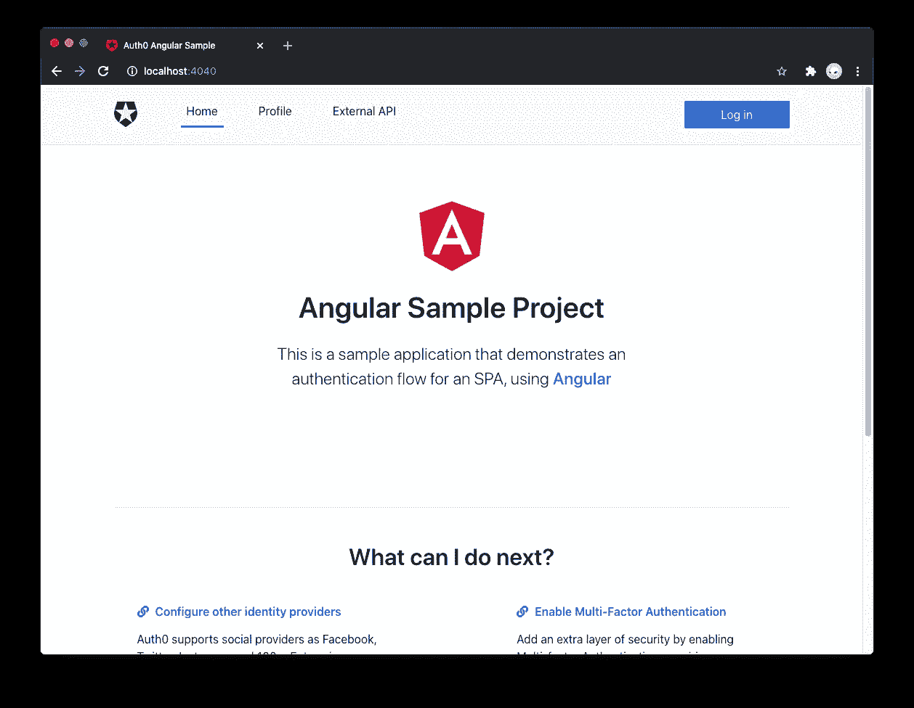
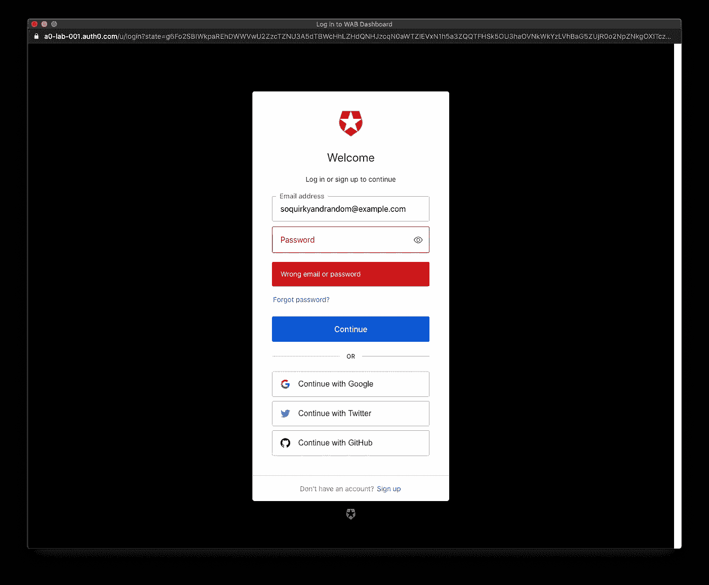
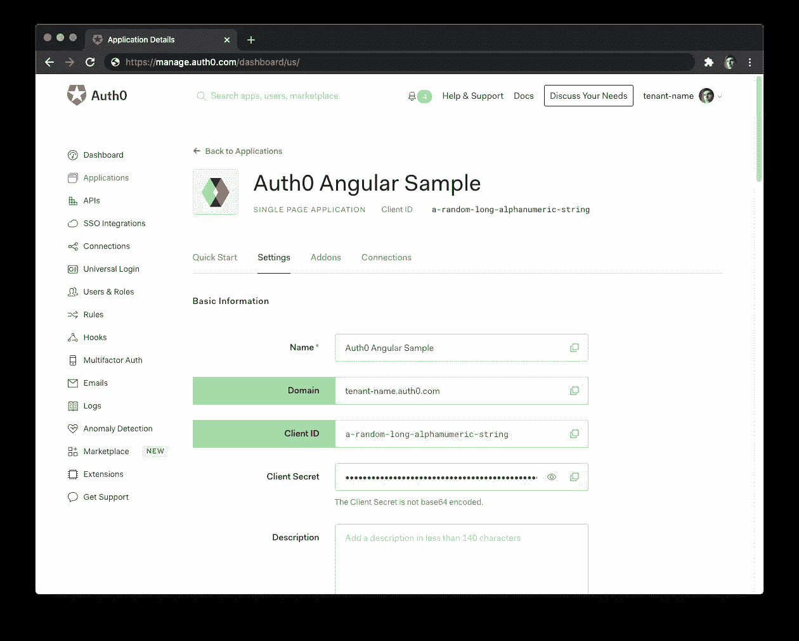
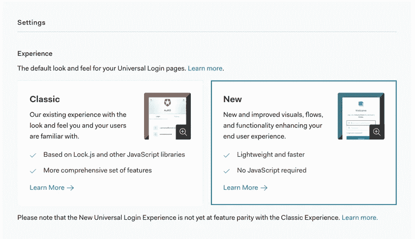
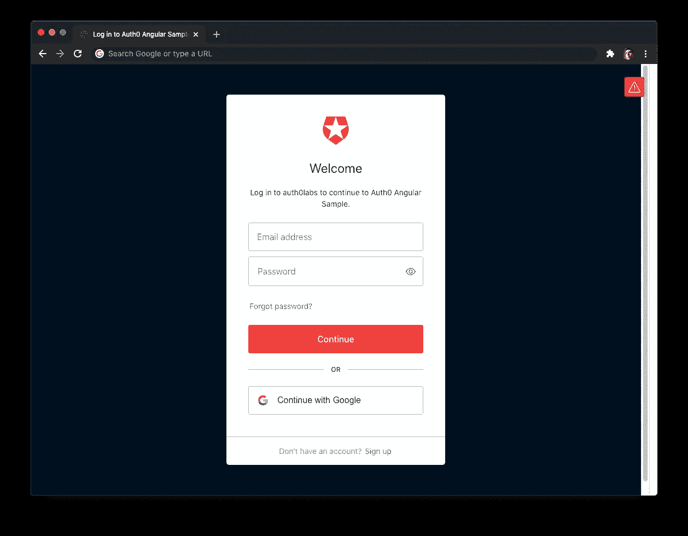
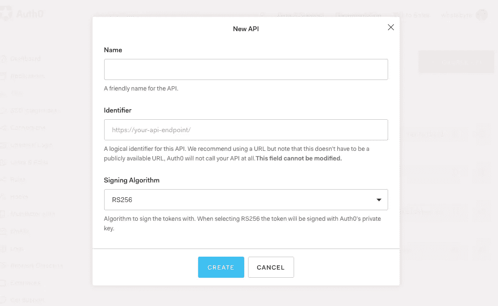
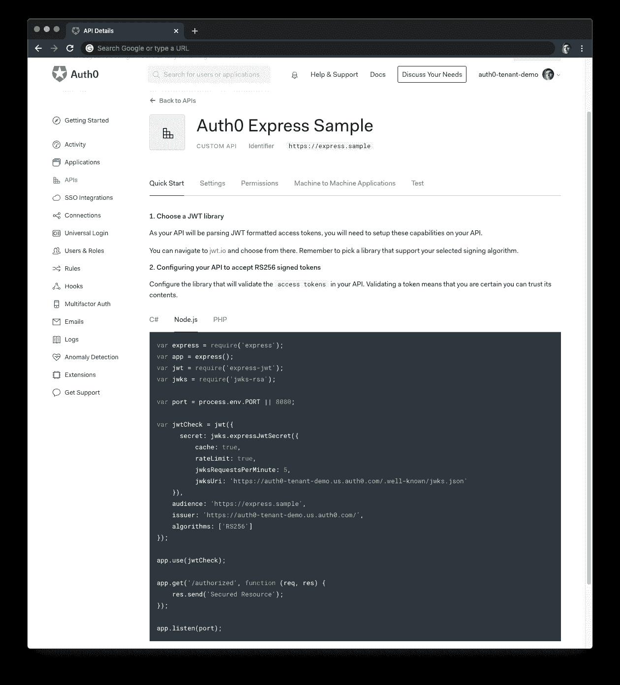

# 使用 Auth0 创建角度 Web 应用程序身份验证

> 原文：<https://javascript.plainenglish.io/create-angular-web-application-authentication-with-auth0-e09e15a06a09?source=collection_archive---------5----------------------->

## 使用 Auth0 的角度用户身份验证指南


## 了解如何使用观察器和 HTTP 拦截器向 Angular 添加用户身份验证

本指南的重点是帮助开发人员了解如何通过实现用户身份验证来保护 Angular 应用程序。您将增强 Angular starter 应用程序，以练习以下安全概念:

*   添加用户登录和注销。
*   检索用户配置文件信息。
*   保护应用程序路由。
*   调用具有受保护端点的 API。

本教程使用 [Auth0 Angular SDK](https://github.com/auth0/auth0-angular) 来保护 Angular 应用程序。SDK 抽象了许多身份验证实现细节，以帮助您使用惯用的 Angular 方法遵循安全最佳实践，同时编写更少的代码。您不需要成为 [OAuth 2.0](https://auth0.com/docs/protocols/protocol-oauth2) 或 [OpenID Connect](https://auth0.com/docs/protocols/openid-connect-protocol) 的专家，就能了解如何保护您的 web 应用程序堆栈。



# 获取初学者应用程序

> *如果你想在关注构建步骤的同时浏览内容，寻找🛠️️表情符号。*

Angular 已经使用 [Angular CLI](https://cli.angular.io/) 创建了一个初学者项目，通过动手实践帮助您学习 Angular 安全概念。启动项目使用自定义的[引导](https://getbootstrap.com/)主题来设置应用程序的样式和布局，这样您就可以专注于构建和布线角度组件。

因此，🛠在其`starter`分支上克隆`auth0-angular-sample`存储库以开始:

```
git clone -b starter git@github.com:auth0-blog/auth0-angular-sample.git
```

🛠一旦你克隆了回购，使`auth0-angular-sample`成为你当前的目录:

```
cd auth0-angular-sample
```

🛠着手安装角向项目依赖:

```
npm install
```

🛠最后，运行了角度应用程序:

```
npm start
```

# 将 Angular 与 Auth0 连接


为什么要使用 Auth0 而不是从头开始构建您自己的用户身份验证？

在过去，聪明的人警告说，“你不应该卷你自己的密码”。如今，明智的人建议[“您不需要构建自己的身份验证”](https://auth0.com/resources/webinars/build-or-buy-a-customer-identity-platform)。

从头开始构建一个全面的身份验证和授权系统非常复杂。Auth0 是一个[身份即服务(IDaaS)](https://auth0.com/blog/what-is-idaas/) 平台，它允许您集中所有应用程序的用户身份验证和 API 授权，以降低复杂性。

Auth0 提供开箱即用的强大安全功能。可定制的登录页面、社交登录、[、多因素身份认证(MFA)](https://auth0.com/learn/get-started-with-mfa/) 和高级用户管理让您能够在创纪录的时间内上线。也许最重要的功能是[异常检测](https://auth0.com/resources/videos/anomaly-detection-video)，它可以帮助你对抗凭证攻击。

> *在 Auth0，凭据填充攻击平均占使用我们平台的所有登录尝试的近一半。阅读更多关于这种关键攻击载体的详细信息:* [*凭据填充攻击:它们是什么以及如何打击它们*](https://auth0.com/resources/whitepapers/credential-stuffing-attacks) *。*

Auth0 是如何工作的？

*   首先将 Auth0 与 Angular 应用程序集成在一起。
*   当您的用户需要登录时，您的 Angular 应用程序触发一个身份验证事件，它通过将用户重定向到一个可定制的 Auth0 登录页面来处理该事件。
*   一旦您的用户成功登录，Auth0 会将他们重定向回您的 Angular 应用程序，返回带有他们的身份验证和用户信息的令牌。
*   此外，您可以用 Auth0 保护您的 API，这样您就可以使用访问令牌从您的 Angular 应用程序向您的受保护 API 端点发出请求。

入门有多容易？

非常容易！只需遵循以下步骤:

# 配置 Auth0 应用程序


🛠如果你还没有，[注册一个免费的 Auth0 帐户](https://auth0.com/signup)，它可以为你提供:

*   7000 个[免费活跃用户和无限登录](https://auth0.com/pricing/)。
*   一个集中的、现成的网页登录页面, iOS&Android。
*   多达 2 个[社交身份提供商](https://auth0.com/docs/connections/identity-providers-social)如谷歌和脸书登录。
*   无限制的[无服务器规则](https://auth0.com/docs/rules/current)来定制和扩展 Auth0 的功能。

在注册过程中，您创建了一个名为 [Auth0 租户](https://auth0.com/docs/getting-started/the-basics#account-and-tenants)的东西，Auth0 使用这个容器来隔离存储您的身份服务配置和您的用户。其他 Auth0 客户无法窥视或访问您的租户。

🛠一旦你登录，Auth0 会带你到[仪表盘](https://manage.auth0.com/)，在那里你可以管理和配置你的身份服务。在左侧边栏菜单中，点击[“应用”](https://manage.auth0.com/#/applications)。

🛠然后，点击“创建应用程序”按钮。模式打开时会显示一个表单，为应用程序提供一个名称并选择其类型。

*   名称:

```
Auth0 Angular Sample
```

*   应用程序类型:

```
Single Page Web Applications
```

🛠点击“创建”按钮完成该过程。您的 Auth0 应用程序页面将加载。

在下一步中，您将学习如何使用该页面中的配置数据来帮助 Angular 和 Auth0 进行通信——先不要关闭它。

Auth0 租户和 Auth0 应用是什么关系？

# 在 Angular 和 Auth0 之间建立沟通桥梁

当您使用 Auth0 时，没有必要构建登录表单。Auth0 提供了一个[通用登录](https://auth0.com/docs/hosted-pages/login)页面来减少添加和管理认证的开销。

需要强调的是，Auth0 提供的表单(Auth0 通用登录)降低了用户名和密码枚举的风险。Auth0 通用登录正确实现认证错误消息[遵循 OWASP(开放 Web 应用安全项目)](https://cheatsheetseries.owasp.org/cheatsheets/Authentication_Cheat_Sheet.html#authentication-and-error-messages)的建议:说足够帮助正在登录的用户但不要说太多帮助试图闯入的攻击者。



[通用登录如何工作](https://auth0.com/docs/hosted-pages/login#how-does-universal-login-work)？

每当用户触发身份验证请求时，您的 Angular 应用程序都会将用户重定向到 Auth0。Auth0 将向他们展示通用登录页面。一旦他们登录，Auth0 会将他们重定向到您的应用程序。为了安全地进行重定向，您必须在 Auth0 应用程序设置中指定在 Auth0 对用户进行身份验证后，auth 0 可以将用户重定向到的 URL。

观看关于 Auth0 通用登录如何工作的视频。

🛠同样，点击你的 Auth0 应用程序页面的“设置”选项卡，并填写以下值:

🛠允许的回拨 URL

```
[http://localhost:4040](http://localhost:4040)
```

在您的用户成功登录后，Auth0 只能将他们重定向到您在此列出的任何 URL。

🛠允许的注销 URL

```
[http://localhost:4040](http://localhost:4040)
```

在您的用户注销后，Auth0 只能将他们重定向到您在此列出的任何 URL。

🛠允许网络起源

```
[http://localhost:4040](http://localhost:4040)
```

使用 Auth0 Angular SDK，您的 Angular 应用程序将向 Auth0 URL 发出请求，以处理身份验证请求。因此，您需要添加您的 Angular 应用程序[源 URL](https://developer.mozilla.org/en-US/docs/Web/HTTP/Headers/Origin) ，以避免[跨源资源共享(CORS)](https://auth0.com/blog/cors-tutorial-a-guide-to-cross-origin-resource-sharing/) 问题。

🛠向下滚动并点击“保存更改”按钮。

🛠:先不要关闭这一页，因为在下一节中你会需要它的一些信息。

# 将 Auth0 配置变量添加到 Angular

在 Auth0 应用程序设置页面中，您需要 Auth0 域和客户端 ID 值，以允许您的 Angular 应用程序使用您刚刚创建的通信桥:

什么是 Auth0 域和 Auth0 客户端 ID？

🛠打开 Angular starter 项目`auth0-angular-sample`，在项目目录下创建一个`auth_config.json`文件:

*   macOS/Linux:

```
touch auth_config.json
```

*   Windows Powershell:

```
ni auth_config.json
```

🛠填充`auth_config.json`如下:

```
{
  "domain": "YOUR_AUTH0_DOMAIN",
  "clientId": "YOUR_AUTH0_CLIENT_ID"
}
```

🛠`domain`的值是来自“设置”的“域”值。

🛠`clientId`的值是来自“设置”的“客户端 ID”值。



这些变量让您的 Angular 应用程序将自己标识为授权方，以便与 Auth0 身份验证服务器交互来执行身份验证过程。您正在将 Angular 应用程序映射到 Auth0 应用程序。

为了在您的角度应用中使用这些变量，您将利用角度`environment`模块。

🛠将`src/environments/environment.ts`的内容替换为以下内容:

```
// src/environments/environment.tsimport { domain, clientId } from '../../auth_config.json';export const environment = {
  production: false,
  auth: {
    domain,
    clientId,
    redirectUri: window.location.origin,
  },
};
```

如何在 Angular 模块中导入 JSON 文件？starter 项目有一个`tsconfig.base.json`文件，它将`resolveJsonModule`设置为`true`，这允许您从`.json`文件中导入和提取类型。

# Auth0 和角度连接集

您已经完成了您的 Angular 应用程序可以使用的身份验证服务的设置。剩下的工作就是在本教程中通过添加安全组件和特性来继续构建 starter 项目。

请随意深入阅读 [Auth0 文档](https://auth0.com/docs/getting-started)，了解更多关于 Auth0 如何帮助您节省实现和管理身份的时间。

# 设置 Auth0 Angular SDK

🛠你需要按照这些步骤将 Auth0 Angular SDK 与你的 Angular 应用程序集成。

# 安装 Auth0 Angular SDK

🛠执行以下命令:

```
ng add @auth0/auth0-angular
```

Auth0 Angular SDK 公开了几个方法、变量和类型，帮助您将 Auth0 与 Angular 应用程序结合起来，包括一个身份验证模块和服务。

# 注册并配置身份验证模块

SDK 导出一个模块，其中包含执行用户身份验证所需的组件和服务。将该模块导入到`AppModule`中，通过 [Angular 的依赖注入框架](https://angular.io/guide/dependency-injection)进行访问。

🛠导入`src/app/app.module.ts`中`@NgModule`定义正上方的`AuthModule`和`environment`如下:

```
// src/app/app.module.ts// Other imports...import { AuthModule } from '@auth0/auth0-angular';
import { environment as env } from '../environments/environment';@NgModule({...})
export class AppModule {}
```

🛠然后，将`AuthModule`添加到`AppModule`导入并初始化它:

```
// src/app/app.module.ts// All imports...@NgModule({
  declarations: [...],
  imports: [
    BrowserModule,
    AppRoutingModule,
    HttpClientModule,
    FontAwesomeModule,
    // 👇 add and initialize AuthModule
    AuthModule.forRoot({
      ...env.auth,
    }),
  ],
  bootstrap: [...],
})
export class AppModule {}
```

您使用`[forRoot()](https://angular.io/guide/singleton-services#the-forroot-pattern)` [模式](https://angular.io/guide/singleton-services#the-forroot-pattern)来配置`AuthModule`，它接受一个具有`domain`和`clientId`属性的对象。您通过展开`env.auth`对象来创建配置对象。

用户身份验证是一种机制，用于监控谁在访问您的应用程序并控制他们可以做什么。例如，您可以阻止尚未登录的用户访问您的应用程序的某些部分。在这种情况下，Auth0 可以充当您的*应用程序保镖*。


Photo by [Zachary Lisko](https://unsplash.com/@liskozac?utm_source=medium&utm_medium=referral) on [Unsplash](https://unsplash.com?utm_source=medium&utm_medium=referral)

> *保镖* [*保镖*](https://www.lexico.com/en/definition/bouncer) *是受雇于夜总会或类似机构的人，他们的任务是阻止闹事者进入或把他们驱逐出去。棱角分明的保安和夜店保安没有太大区别。*

如果用户想从您的应用程序输入一个受保护的路由，Auth0 会阻止他们，并要求他们出示凭据。如果 Auth0 可以验证他们是谁以及他们应该进入那里，Auth0 就会让他们进入。否则，Auth0 会将它们带回公共应用程序路径。

现在，重要的是重申身份验证过程不会发生在您的应用程序层中。您的 Angular 应用程序会将您的用户重定向到 [Auth0 通用登录](https://auth0.com/docs/universal-login)页面，在这里 Auth0 会询问凭证，并将用户重定向回您的应用程序，并显示认证过程的结果。

Auth0 Angular SDK 已全部设置完毕。您已经准备好创建组件来实现下一节中的身份验证流。

# 添加用户验证

Auth0 Angular SDK 为您提供了在 Angular 组件中触发身份验证事件的方法:登录、注销和注册。

# 创建登录按钮

🛠使用 Angular CLI 在`src/components/`目录下创建一个`LoginButtonComponent`:

```
ng generate component components/login-button --inlineStyle --skipTests
```

🛠将`login-button.component.ts`文件填充到`src/app/components/login-button/`目录中，如下所示:

```
// src/app/components/login-button/login-button.component.tsimport { Component, OnInit } from '@angular/core';
import { AuthService } from '@auth0/auth0-angular';@Component({
  selector: 'app-login-button',
  templateUrl: './login-button.component.html',
  styles: [],
})
export class LoginButtonComponent implements OnInit {
  constructor(public auth: AuthService) {}ngOnInit(): void {}loginWithRedirect(): void {
    this.auth.loginWithRedirect();
  }
}
```

🛠接下来，像这样填充`src/app/components/login-button/`目录中的`login-button.component.html`模板文件:

```
<!-- src/app/components/login-button/login-button.component.html --><button class="btn btn-primary btn-block" (click)="loginWithRedirect()">
  Log in
</button>
```

在`LoginButtonComponent`定义中，`[auth.loginWithRedirect()](https://auth0.github.io/auth0-angular/classes/authservice.html#loginwithredirect)`是由`AuthService`公开的方法。该方法提示用户进行身份验证并确认同意，这意味着授权您的 Angular 应用程序代表用户访问某些数据。在您当前的上下文中，这意味着您的 Angular 应用程序将用户重定向到 Auth0 通用登录页面来执行身份验证过程。在接下来的部分中，您将看到这一点。

您可以通过将一个配置对象作为参数传递给`loginWithRedirect()`来定制登录体验。例如，您可以向`loginWithRedirect()`传递选项，将用户重定向到一个 Auth0 通用登录页面，该页面为注册 Angular 应用程序而优化。有关这些选项的更多详情，请参见`[RedirectLoginOptions](https://auth0.github.io/auth0-login/interfaces/redirectloginoptions.html)`。

# 创建注册按钮

通过在`auth.loginWithRedirect()`的配置对象中添加`screen_hint`属性，可以让用户[直接登陆注册页面](https://auth0.com/docs/universal-login/new#signup)而不是登录页面:

```
{
  screen_hint: "signup",
}
```

🛠使用 Angular CLI 在`src/components/`目录下创建一个`SignupButtonComponent`:

```
ng generate component components/signup-button --inlineStyle --skipTests
```

🛠将`signup-button.component.ts`文件填充到`src/app/components/signup-button/`中，如下所示:

```
// src/app/components/signup-button/signup-button.component.tsimport { Component, OnInit } from '@angular/core';import { AuthService } from '@auth0/auth0-angular';@Component({
  selector: 'app-signup-button',
  templateUrl: './signup-button.component.html',
})
export class SignupButtonComponent implements OnInit {
  constructor(public auth: AuthService) {}ngOnInit(): void {}loginWithRedirect(): void {
    this.auth.loginWithRedirect({ screen_hint: 'signup' });
  }
}
```

🛠在`src/app/components/signup-button/`中填充`signup-button.component.html`模板文件，如下所示:

```
<button class="btn btn-primary btn-block" (click)="loginWithRedirect()">
  Sign Up
</button>
```

注册功能要求您在租户中启用 [Auth0 新通用登录体验](https://auth0.com/docs/universal-login/new)。

🛠打开 Auth0 仪表板的[通用登录部分](https://manage.auth0.com/#/login_settings)，选择“体验”子部分下的“新建”选项。



🛠向下滚动并点击“保存更改”按钮。

一旦您将这些组件集成到您的 Angular 应用程序中，并看到它们的运行，那么`LoginButtonComponent`和`SignupButtonComponent`用户体验之间的差异将会更加明显。您将在接下来的部分中做到这一点。

# 创建注销按钮

🛠在`src/components/`目录下创建一个`LogoutButtonComponent`如下:

```
ng generate component components/logout-button --inlineStyle --skipTests
```

🛠用以下代码填充`src/app/components/logout-button/`中的`logout-button.component.ts`文件:

```
// src/app/components/logout-button/logout-button.component.tsimport { Component, Inject, OnInit } from '@angular/core';
import { AuthService } from '@auth0/auth0-angular';
import { DOCUMENT } from '@angular/common';@Component({
  selector: 'app-logout-button',
  templateUrl: './logout-button.component.html',
  styles: [],
})
export class LogoutButtonComponent implements OnInit {
  constructor(
    public auth: AuthService,
    @Inject(DOCUMENT) private doc: Document
  ) {}ngOnInit(): void {}logout(): void {
    this.auth.logout({ returnTo: this.doc.location.origin });
  }
}
```

您正在定义一个触发注销事件的`logout()`方法。您向它传递一个可选的配置对象，告诉 Auth0 在注销用户后将他们带到哪里。

🛠接下来，在`src/app/components/logout-button/`目录中填充`logout-button.component.html`模板文件，如下所示:

```
<!--src/app/components/logout-button/logout-button.component.html--><button class="btn btn-danger btn-block" (click)="logout()">
  Log out
</button>
```

由`AuthService`公开的`auth.logout()`方法清除应用程序会话，并重定向到 Auth0 `/v2/logout`端点以清除 Auth0 会话。与登录方法一样，您可以向`logout()`传递一个配置对象来定义`/v2/logout`调用的参数。这个过程对用户来说是相当不可见的。更多详情见`[LogoutOptions](https://auth0.github.io/auth0-spa-js/interfaces/logoutoptions.html)`。

这里，您将`returnTo`属性添加到配置对象中，以指定用户注销后 Auth0 应该重定向到的 URL。现在，您正在本地工作，您的 Auth0 应用程序的“允许的注销 URL”指向`[http://localhost:4040](http://localhost:4040.)` [。](http://localhost:4040.)

然而，如果您要将您的 Angular 应用程序部署到生产中，您需要将生产注销 URL 添加到“允许的注销 URL”列表中，并确保 Auth0 将您的用户重定向到该生产 URL，而不是`localhost`。将`returnTo`设置为`this.doc.location.origin`将会做到这一点。

角度组件不能直接访问`document`对象。但是，您可以将`@Inject`常量作为`AuthenticationButtonComponent`的依赖项。`this.doc`与浏览器中的 [DOM 文档](https://developer.mozilla.org/en-US/docs/Web/API/Document)相同。`this.doc.location`返回一个`[Location](https://developer.mozilla.org/en-US/docs/Web/API/Location)`对象，其`[origin](https://developer.mozilla.org/en-US/docs/Web/API/Location/origin)`属性是应用程序的来源。

# 集成登录和注销按钮

让我们将`LoginButtonComponent`和`LogoutButtonComponent`封装在一个组件中，该组件具有根据用户的身份验证状态决定呈现哪个按钮的逻辑。

🛠在`src/app/components/`目录下创建一个`AuthenticationButtonComponent`:

```
ng g c components/authentication-button --inlineStyle --skipTests
```

> *您正在使用简写* `*g*` *(* `*generate*` *)和* `*c*` *(* `*component*` *)来使命令更短。*

🛠将`authentication-button.component.ts`文件填充到`src/app/components/authentication-button/`目录中，如下所示:

```
// src/app/components/authentication-button/authentication-button.component.tsimport { Component, OnInit } from '@angular/core';
import { AuthService } from '@auth0/auth0-angular';@Component({
  selector: 'app-authentication-button',
  templateUrl: './authentication-button.component.html',
  styles: [],
})
export class AuthenticationButtonComponent implements OnInit {
  constructor(public auth: AuthService) {}ngOnInit(): void {}
}
```

🛠将`authentication-button.component.html`文件填充到`src/app/components/authentication-button/`目录中，如下所示:

```
<!--
src/app/components/authentication-button/
  authentication-button.component.html
--><app-login-button *ngIf="(auth.isAuthenticated$ | async) === false">
</app-login-button><app-logout-button *ngIf="auth.isAuthenticated$ | async">
</app-logout-button>
```

让我们从理解模板中发生的事情开始。`auth.isAuthenticated$`是由`AuthService`公开的一个`Observable`，发出一个布尔值。当 Auth0 已经认证了用户时，它的值是`true`,当没有认证时，它的值是`false`。

值得注意的是，在引擎盖下，`auth.isAuthenticated$`仅在 Auth0 Angular SDK 完成加载后才开始发送值。当`AuthService.isLoading$`发出`false`时，则`auth.isAuthenticated$`发出其值。这种操作管道有助于防止与用户的认证状态相关的误报。这也会导致`AuthenticationButtonComponent`的渲染有一点延迟，但是你很快就会修复这个问题。

使用这个`AuthenticationButtonComponent`组件包装器有一些好处:

您可以构建灵活的接口。`AuthenticationButtonComponent`用作“登录/注销”开关，您可以将它放在任何需要开关功能的地方。然而，当你需要它们的独立功能时，你仍然有单独的`LoginButtonComponent`和`LogoutButtonComponent`。例如，您可能在页面上有一个只有经过身份验证的用户才能看到的注销按钮。

您可以构建可扩展的接口。您可以轻松地将`LoginButtonComponent`与`AuthenticationButtonComponent`中的`SignupButtonComponent`互换，创建一个“注册/注销”开关。如果你愿意，你也可以把“注册/退出”开关包在一个`NewAuthenticationButtonComponent`里。

您可以构建声明性接口。例如，使用 AuthenticationButton，您可以向`NavBarComponent`添加登录和注销功能，而无需考虑身份验证开关如何工作的实现细节。

考虑到这一点，🛠在`src/components/`目录下创建了一个`AuthNavComponent`:

```
ng g c components/auth-nav --inlineStyle --skipTests
```

🛠将`auth-nav.component.html`文件填充到`src/app/components/auth-nav/`目录中，如下所示:

```
<!--src/app/components/auth-nav/auth-nav.component.html--><div class="navbar-nav ml-auto">
  <app-authentication-button></app-authentication-button>
</div>
```

🛠最后，打开`src/app/components/nav-bar/`目录下的`nav-bar.component.html`模板文件，更新如下:

```
<!--src/app/components/nav-bar/nav-bar.component.html--><div class="nav-container mb-3">
  <nav class="navbar navbar-expand-md navbar-light bg-light">
    <div class="container">
      <div class="navbar-brand logo"></div>
      <app-main-nav></app-main-nav>
      <app-auth-nav></app-auth-nav>
    </div>
  </nav>
</div>
```

通过拥有不同类型的导航子组件，您可以根据需要扩展每个导航栏，而无需重新打开和修改`MainNavComponent`。

🛠继续并尝试登录。您的 Angular 应用程序将您重定向到 Auth0 通用登录页面。您可以使用一个表单，通过用户名和密码或像 Google 这样的社交身份提供商登录。请注意，这个登录页面还为您提供了注册选项。



实验:使用`SignupButtonComponent`

> *您可以* [*自定义新通用登录页面的外观*](https://auth0.com/docs/universal-login/customization-new) *。您还可以使用* [*文本定制 API*](https://auth0.com/docs/universal-login/text-customization) *覆盖新体验中的任何文本。*

请注意，当您完成登录，Auth0 将您重定向到 Angular 应用程序时，用户界面会出现一个闪烁的空白屏幕。

用户界面闪烁是因为你的 Angular 应用正在加载它的服务。在加载时，Angular 不知道 Auth0 是否已经验证了用户。在 Auth0 Angular SDK 加载后，您的应用将知道用户身份验证状态。

🛠为了修复 UI 闪烁，使用由`AuthService`公开的`auth.isLoading$`可观察对象，一旦 Angular SDK 完成加载，它就会发出一个布尔值来呈现`AppComponent`。

🛠打开`src/app/app.component.ts`，更新如下:

```
// src/app/app.component.tsimport { Component } from '@angular/core';import { AuthService } from '@auth0/auth0-angular';@Component({
  selector: 'app-root',
  templateUrl: './app.component.html',
})
export class AppComponent {
  constructor(public auth: AuthService) {}
}
```

🛠打开`src/app/app.component.html`，更新是这样的:

```
<!--src/app/app.component.html--><div id="app" class="d-flex flex-column h-100">
  <div class="container" *ngIf="auth.isLoading$ | async; else loaded">
    <app-loading></app-loading>
  </div><ng-template #loaded>
    <app-nav-bar></app-nav-bar><div class="container flex-grow-1">
      <div class="mt-5">
        <router-outlet></router-outlet>
      </div>
    </div><app-footer></app-footer>
  </ng-template>
</div>
```

当 SDK 加载时，`LoadingComponent`渲染，有一个很酷的动画。

# 正在检索用户信息

用户成功登录后，Auth0 会向您的 Angular 应用程序发送一个 ID 令牌。Auth0 等认证系统使用[基于令牌的认证](https://auth0.com/learn/token-based-authentication-made-easy/)中的 [ID 令牌](https://auth0.com/docs/tokens/concepts/id-tokens)来缓存用户配置文件信息，并将其提供给客户端应用程序。ID 标记的缓存有助于提高 Angular 应用程序的性能和响应能力。

您可以使用来自 ID 令牌的数据来个性化您的 Angular 应用程序的用户界面。Auth0 Angular SDK 对 ID 令牌进行解码，并通过`AuthService`暴露的`auth.user$`可观察对象发出其数据。一些 ID 标记信息包括登录用户的姓名、昵称、图片和电子邮件。

如何使用 ID 标记为用户创建配置文件页面？

🛠在`src/app/pages/profile/profile.component.ts`中更新`ProfileComponent`如下:

```
// src/app/pages/profile/profile.component.tsimport { Component, OnInit } from '@angular/core';
import { AuthService } from '@auth0/auth0-angular';@Component({
  selector: 'app-profile',
  templateUrl: './profile.component.html',
})
export class ProfileComponent implements OnInit {
  profileJson: string = null;constructor(public auth: AuthService) {}ngOnInit(): void {
    this.auth.user$.subscribe(
      (profile) => (this.profileJson = JSON.stringify(profile, null, 2))
    );
  }
}
```

🛠更新`src/app/pages/profile/profile.component.html`中`ProfileComponent`的模板如下:

```
<!--src/app/pages/profile/profile.component.html--><div *ngIf="auth.user$ | async as user">
  <div class="row align-items-center profile-header">
    <div class="col-md-2 mb-3">
      
    </div>
    <div class="col-md text-center text-md-left">
      <h2>{{ user.name }}</h2>
      <p class="lead text-muted">{{ user.email }}</p>
    </div>
  </div><div class="row" *ngIf="profileJson">
    <pre class="col-12 text-light bg-dark p-4">{{ profileJson }}</pre>
  </div>
</div>
```

在`ProfileComponent`组件中发生了什么？

`ngOnInit()`是初始化角度分量数据的最佳位置。因此，您订阅了`ProfileComponent`中的`this.auth.user$`可观察值。一旦`this.auth.user$`发出用户配置文件对象，您使用`JSON.stringify`格式化该对象并将其分配给`this.profileJson`。接下来，您使用`[*ngIf](https://angular.io/api/common/NgIf)` [指令](https://angular.io/api/common/NgIf)来基于`profileJson`的值呈现带有用户概要 JSON 对象的代码框。

`ProfileComponent`呈现您认为受保护的用户信息。另外，如果没有登录用户，`user`属性是`null`。所以不管怎样，这个组件应该只在 Auth0 对用户进行了身份验证的情况下才呈现。

因此，您应该保护呈现该组件的路径，`[http://localhost:4040/profile](http://localhost:4040/profile)`。在下一节中，您将学习如何做到这一点。

# 保护路线

在本指南的所有章节中，由于[角状刳刨机](https://angular.io/guide/router)的坚固性，这一节是最容易实现的。Auth0 Angular SDK 公开了一个可以用来保护路线的`[AuthGuard](https://auth0.github.io/auth0-angular/classes/authguard.html)`。

🛠打开`src/app/app-routing.module.ts`，更新如下:

```
// src/app/app-routing.module.tsimport { NgModule } from '@angular/core';
import { Routes, RouterModule } from '@angular/router';
import { HomeComponent } from 'src/app/pages/home/home.component';
import { ProfileComponent } from 'src/app/pages/profile/profile.component';
import { ExternalApiComponent } from 'src/app/pages/external-api/external-api.component';import { AuthGuard } from '@auth0/auth0-angular';const routes: Routes = [
  {
    path: '',
    component: HomeComponent,
    pathMatch: 'full',
  },
  {
    path: 'profile',
    component: ProfileComponent,
    canActivate: [AuthGuard],
  },
  {
    path: 'external-api',
    component: ExternalApiComponent,
    canActivate: [AuthGuard],
  },
];@NgModule({
  imports: [RouterModule.forRoot(routes)],
  exports: [RouterModule],
})
export class AppRoutingModule {}
```

要求用户登录来访问路由很简单:只需在路由定义中包含`canActivate`属性并添加`AuthGuard`作为它的值。当没有登录的用户访问该路线时，您的 Angular 应用程序会将他们重定向到登录页面。用户登录后，Auth0 会将用户重定向到您的 Angular 应用程序，`AuthService`会将用户带到他们登录前想要访问的页面。

🛠:您现在可以测试这两条路径，`/profile`和`/external-api`，要求用户在访问它们之前进行身份验证。注销并尝试访问[配置文件](http://localhost:4040/profile)或[外部 API](http://localhost:4040/external-api) 选项卡。如果成功的话，Angular 会重定向你使用 Auth0 登录。

客户端防护提高了 Angular 应用程序的用户体验，而不是它的安全性。

# 调用 API

本节主要向您展示如何在 Angular 应用程序中获取访问令牌，以及如何使用它进行安全的 API 调用。

当您使用 Auth0 时，您将身份验证过程委托给一个集中式服务。Auth0 为您提供了从 Angular 应用程序中登录和注销用户的功能。但是，您的应用程序可能需要从安全的 API 访问资源。

你也可以用 Auth0 保护一个 API。Auth0 提供[多个 Auth0 API 快速入门](https://auth0.com/docs/quickstart/backend)来帮助你将 Auth0 与你的后端平台集成。

当您使用 Auth0 *来保护您的 API* 时，您将授权过程委托给一个集中式服务，该服务确保只有经过批准的应用程序才能访问受保护的资源。您的 Angular 应用程序对用户进行身份验证，然后[从 Auth0](https://auth0.com/docs/tokens/concepts/access-tokens) 接收一个访问令牌。

然后，应用程序可以将该访问令牌作为凭证传递给 API。反过来，您的 API 可以使用 Auth0 库来验证它从调用应用程序接收到的访问令牌，并发出包含所需数据的响应。

您将使用为您准备的 demo Express API，而不是创建一个演示 API 来测试客户机-服务器连接。

# 获取演示 Express API

🛠打开一个新的终端窗口，在你系统的某个地方克隆`auth0-express-sample`回购。确保在 Angular 项目目录之外克隆它。

```
git clone git@github.com:auth0-blog/auth0-express-js-sample.git
```

🛠:一旦你克隆了这个 repo，把`auth0-express-js-sample`目录作为你当前的目录:

```
cd auth0-express-js-sample
```

🛠安装 Node.js 项目依赖关系:

```
npm install
```

# 用 Auth0 连接 Express API

## 在 Express 和 Auth0 之间建立沟通桥梁

这个过程类似于你如何用 Auth0 连接 Angular。

🛠转到 Auth0 仪表板中的 API 部分，点击“创建 API”按钮。

🛠接着以 Auth0 显示的形式:

*   为您的 API 添加一个名称:

```
Auth0 Express Sample
```

*   设置其标识符值:

```
[https://express.sample](https://express.sample)
```

*   将签名算法保留为`RS256`,因为从安全角度来看，这是最好的选择。



标识符是帮助 Auth0 区分不同 API 的唯一字符串。我建议使用 URL 来创建可预见的唯一标识符；但是，Auth0 从不调用这些 URL。

🛠把这些值准备好，点击“创建”按钮。

## 添加 Auth0 配置变量来表示

🛠:现在，点击你的 Auth0 API 页面的“快速启动”标签。本页介绍如何设置不同的 API。从“代码”框中，选择“Node.js”。保持此页打开，因为接下来您将使用这些值。



🛠在`auth0-express-sample`目录下为 API 服务器创建一个`.env`文件:

```
touch .env
```

🛠如下填充这个`auth0-express-sample/.env`文件:

```
SERVER_PORT=6060
CLIENT_ORIGIN_URL=http://localhost:4040
AUTH0_AUDIENCE=
AUTH0_ISSUER_URL=
```

🛠从 Auth0 API“快速入门”页面返回到“Node.js”代码片段。找到`jwtCheck`的定义:

```
var jwtCheck = jwt({
  secret: jwks.expressJwtSecret({
    cache: true,
    rateLimit: true,
    jwksRequestsPerMinute: 5,
    jwksUri: "https://<TENANT-NAME>.auth0.com/.well-known/jwks.json",
  }),
  audience: "https://express.sample", // 👈 AUTH0_AUDIENCE value
  issuer: "https://<TENANT-NAME>.auth0.com/", // 👈 AUTH0_ISSUER_URL value
  algorithms: ["RS256"],
});
```

🛠查看`jwt`函数作为参数的对象，并使用以下属性来完成`.env`文件的值:

🛠`AUTH0_AUDIENCE`的值就是其`audience`属性的值。

🛠`AUTH0_ISSUER`的值就是它的`issuer`属性的值。

> *不包括引号，只包括字符串值。*

设置了`.env`配置值的🛠，通过发出以下命令运行 API 服务器:

```
npm start
```

# 配置 Angular 以连接 Express API

🛠回到存储你的 Angular 应用程序的`auth0-angular-sample`项目目录。

🛠找到`auth_config.json`文件，并向其中添加一个受众和一个服务器 URL 值:

```
{
  "domain": "YOUR_AUTH0_DOMAIN",
  "clientId": "YOUR_AUTH0_CLIENT_ID",
  "audience": "https://express.sample",
  "serverUrl": "http://localhost:6060"
}
```

🛠`audience`的值与`auth0-express-sample/.env`中的`AUTH0_AUDIENCE`相同。

🛠找到`src/environments/environment.ts`文件并更新如下:

```
// src/environments/environment.tsimport { domain, clientId, audience, serverUrl } from '../../auth_config.json';export const environment = {
  production: false,
  auth: {
    domain,
    clientId,
    redirectUri: window.location.origin,
    audience,
  },
  dev: {
    serverUrl,
  },
};
```

当 Angular 应用程序调用目标 API 来访问受保护的资源时，它需要传递一个访问令牌。

Auth0 Angular SDK 提供了一个`HttpInjector`，当使用内置 Angular `HttpClient`模块时，它会自动将访问令牌附加到传出的请求上。但是，您必须将注入器配置为知道它需要向哪些请求附加访问令牌。

🛠从导入`HTTP_INTERCEPTORS`令牌和`src/app/app.module.ts`文件中`@NgModule`定义正上方的`AuthHttpInterceptor`开始:

```
// src/app/app.module.ts// Other imports...import { HTTP_INTERCEPTORS } from '@angular/common/http';
import { AuthHttpInterceptor } from '@auth0/auth0-angular';@NgModule({...})
export class AppModule {}
```

你正在从`@auth0/auth0-angular`进口`AuthHttpInterceptor`，同时从`@angular/common/http`进口`HTTP_INTERCEPTORS`。`[HTTP_INTERCEPTORS](https://angular.io/api/common/http/HTTP_INTERCEPTORS)`是一个多提供者令牌，表示已注册的`HttpInterceptor`对象的数组。

🛠接下来，将`providers`属性添加到`AppModule`的配置对象中，如下所示，以将`AuthHttpInterceptor`注入器注册为提供者:

```
// src/app/app.module.ts// All imports...@NgModule({
  declarations: [...],
  imports: [...],
  providers: [
    {
      provide: HTTP_INTERCEPTORS,
      useClass: AuthHttpInterceptor,
      multi: true,
    },
  ],
  bootstrap: [AppComponent],
})
export class AppModule {}
```

这就完成了连接`AuthHttpInterceptor`与您的角度应用请求周期所需的接线。

现在，您需要通过进一步配置`AuthModule.forRoot()`来告诉 SDK 哪些请求要附加访问令牌。基于这个配置，Angular 会将您使用`HttpClient`发出的任何请求的 URL 与允许的 URL 列表进行匹配。

如果匹配，Angular 会在请求的授权头中附加一个访问令牌。您可以使用字符串或正则表达式进行 URL 匹配。现在，您将允许 Angular 将一个访问令牌附加到它向`[http://localhost:6060/api/messages/protected-message](http://localhost:6060/api/messages/protected-message.)` [发出的请求上。](http://localhost:6060/api/messages/protected-message.)

🛠更新`AppModule`的模块`imports`中的`AuthModule`的配置，如下所示:

```
// src/app/app.module.ts// All imports...@NgModule({
  declarations: [...],
  imports: [
    BrowserModule,
    AppRoutingModule,
    HttpClientModule,
    FontAwesomeModule,
    // 👇 update AuthModule
    AuthModule.forRoot({
      ...env.auth,
      httpInterceptor: {
        allowedList: [`${env.dev.serverUrl}/api/messages/protected-message`],
      },
    }),
  ],
  providers: [...],
  bootstrap: [...],
})
export class AppModule {}
```

假设您使用`HttpClient`进行 HTTP 调用，但是在`AuthHttpInterceptor`中没有与该 URL 匹配的 URL。在这种情况下，Angular 绕过拦截器，在没有在`Authorization`头中附加令牌的情况下进行调用。

> *注意:在授权头中明确哪些 API 请求需要一个访问令牌，可以防止令牌被附加到发给非预期接收者的请求上，这是一个严重的安全问题。然后，这些接收者可以使用该令牌调用 API，就好像它是您的应用程序一样。*

最后，使用`HttpClient`进行 API 调用，因为`HttpClientModule`已经被导入到 starter 项目中。

🛠更新`src/app/pages/external-api/external-api.component.ts`如下:

```
// src/app/pages/external-api/external-api.component.tsimport { Component, OnInit } from '@angular/core';
import { HttpClient } from '@angular/common/http';import { environment as env } from '../../../environments/environment';interface Message {
  message: string;
}@Component({
  selector: 'app-external-api',
  templateUrl: './external-api.component.html',
})
export class ExternalApiComponent implements OnInit {
  message: string = null;constructor(private http: HttpClient) {}ngOnInit(): void {}callApi(): void {
    this.http
      .get(`${env.dev.serverUrl}/api/messages/public-message`)
      .subscribe((result: Message) => {
        this.message = result.message;
      });
  }callSecureApi(): void {
    this.http
      .get(`${env.dev.serverUrl}/api/messages/protected-message`)
      .subscribe((result: Message) => {
        this.message = result.message;
      });
  }
}
```

⚠️检查你使用`HttpClient`调用的 URL 是否与你在`httpInterceptor`配置中得到的规则相匹配。注意尾随斜线。

🛠更新`src/app/pages/external-api/external-api.component.html`如下:

```
<!--src/app/pages/external-api/external-api.component.html--><div>
  <h1>External API</h1>
  <p>
    Use these buttons to call an external API. The protected API call has an
    access token in its authorization header. The API server will validate the
    access token using the Auth0 Audience value.
  </p>
  <div
    class="btn-group mt-5"
    role="group"
    aria-label="External API Requests Examples"
  >
    <button (click)="callApi()" type="button" class="btn btn-primary">
      Get Public Message
    </button>
    <button (click)="callSecureApi()" type="button" class="btn btn-primary">
      Get Protected Message
    </button>
  </div><div *ngIf="message" class="mt-5">
    <h6 class="muted">Result</h6>
    <div class="container-fluid">
      <div class="row">
        <code class="col-12 text-light bg-dark p-4">
          {{ message }}
        </code>
      </div>
    </div>
  </div>
</div>
```

在`ExternalApi`组件中现在发生了什么？

添加一个执行公共 API 请求的`callApi()`方法和一个执行安全 API 请求的`callSecureApi()`方法。每个方法的实现看起来都是一样的。然而，在引擎盖下，Angular 在`AuthHttpInterceptor`的`allowedList`中找到了`${env.dev.apiUrl}/api/messages/protected-message`的对手。

然后，Angular 使用 Auth0 SDK 从 Auth0 获取访问令牌，并将该访问令牌作为承载凭证附加到请求的授权头中。

然后将成功请求的结果分配给`this.message`，使用代码框在用户界面中呈现。

为什么客户端和服务器应用程序的 Auth0 受众值相同？

Auth0 使用`audience`属性的值来确定用户授权您的 Angular 应用程序访问哪个资源服务器(API)。

您的 Angular 应用程序可以在 API 上执行的操作取决于您的访问令牌包含的[范围](https://auth0.com/docs/scopes/current)。您可以在`httpInterceptor.allowedList`条目的`[tokenOptions](https://auth0.github.io/auth0-angular/interfaces/httpinterceptorrouteconfig.html#tokenoptions)`中定义作用域的值。

还记得你第一次用 Auth0 登录时看到的屏幕，询问你是否允许访问你的个人资料信息吗？您的 Angular 应用程序将请求用户授权访问所请求的范围，用户将批准或拒绝该请求。该屏幕被称为同意对话框。你可能以前在使用 GitHub、谷歌或脸书登录或与第三方分享你的电子邮件联系人时见过这种情况。

当您没有将一个`scope`属性传递给`tokenOptions`时，Angular SDK 默认为 [OpenID 连接范围](https://openid.net/specs/openid-connect-basic-1_0.html#Scopes) : `openid profile email`。

*   `openid`:这个作用域通知 Auth0 授权服务器，客户端正在发出 [OpenID Connect (OIDC)](https://auth0.com/docs/protocols/oidc) 请求来验证用户的身份。OpenID Connect 是一种身份验证协议。
*   `profile`:该范围值请求访问用户的默认配置文件信息，如`name`、`nickname`和`picture`。
*   `email`:该范围值请求访问`email`和`email_verified`信息。

OpenID 连接范围的细节放在 ID 标记中。

对于您的 API，您将定义自定义的 [API 作用域](https://auth0.com/docs/scopes/current/api-scopes)来实现访问控制，并且您将在您的客户端应用程序对该 API 的调用中识别它们。Auth0 将 API 作用域作为 `[scope](https://auth0.com/docs/tokens/guides/validate-access-tokens#custom-api-access-tokens)` [声明](https://auth0.com/docs/tokens/guides/validate-access-tokens#custom-api-access-tokens)包含在[访问令牌中。](https://auth0.com/docs/tokens/guides/validate-access-tokens#custom-api-access-tokens)

您之前的登录请求不包含受众参数。因此，Angular SDK 没有在内存中存储访问令牌。

您不应该在`[localStorage](https://developer.mozilla.org/en-US/docs/Web/API/Window/localStorage)`中存储令牌。为什么？

🛠注销并重新登录，以从 Auth0 获取包含受众信息的新访问令牌。

🛠访问`[http://localhost:4040/external-api](http://localhost:4040/external-api)`并点击外部 API 页面上的任意按钮来测试响应。

获取公共消息:

```
The API doesn't require an access token to share this message.
```

获取受保护的邮件:

```
The API successfully validated your access token.
```

# 摘要


您已经在 Angular 中实现了用户身份验证，以识别您的用户，获取用户配置文件信息，并控制您的用户可以访问的内容。您还了解了如何在受 Auth0 保护的堆栈的客户机和服务器之间进行安全的 API 调用。

本教程涵盖了 React 应用程序最常见的身份验证用例:简单的登录和注销。然而，Auth0 是一个可扩展的灵活平台，可以帮助您实现更多。如果您有一个更复杂的用例，请查看 [Auth0 架构场景](https://auth0.com/docs/architecture-scenarios)以了解在与客户合作实现 Auth0 时发现的典型架构场景的更多信息。

请在下面的评论中告诉我你是如何喜欢这个教程的。感谢你阅读这篇文章，请继续关注。再见！

*更多内容尽在*[*plain English . io*](http://plainenglish.io/)