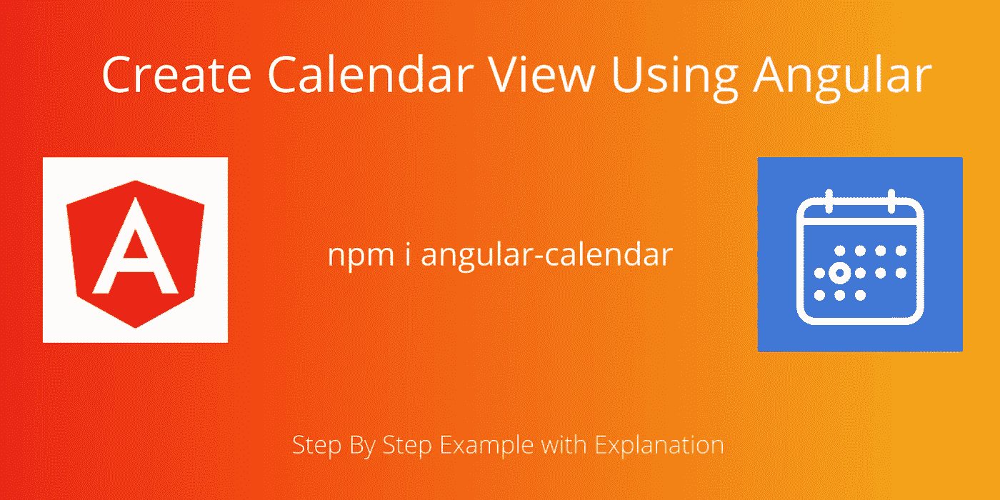
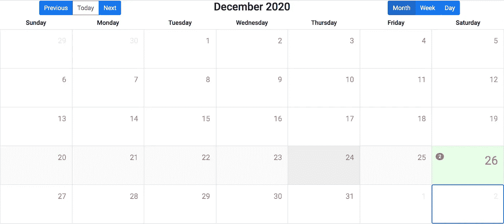
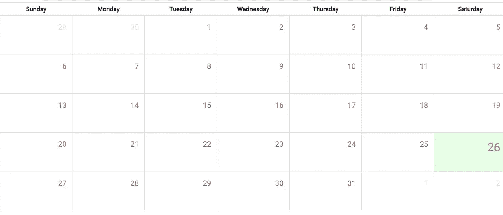
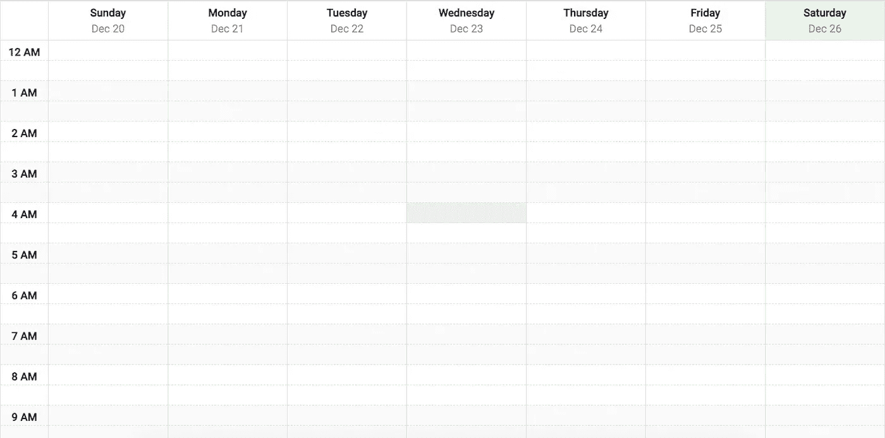
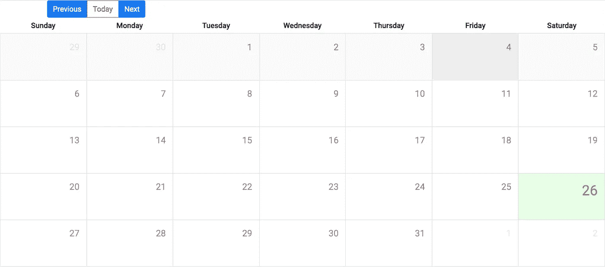
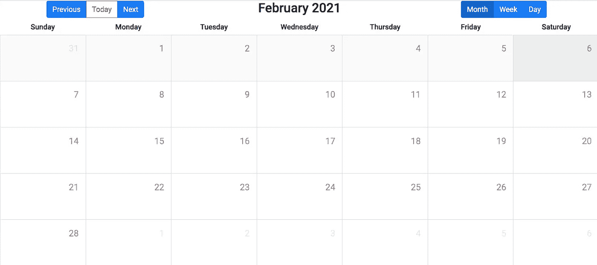
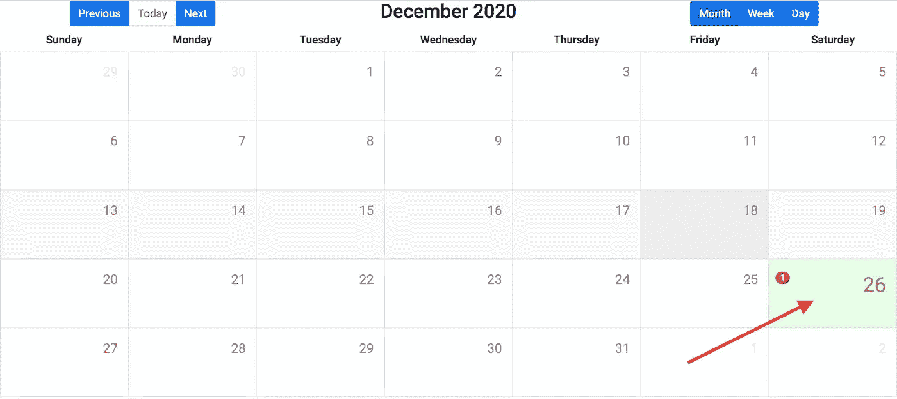
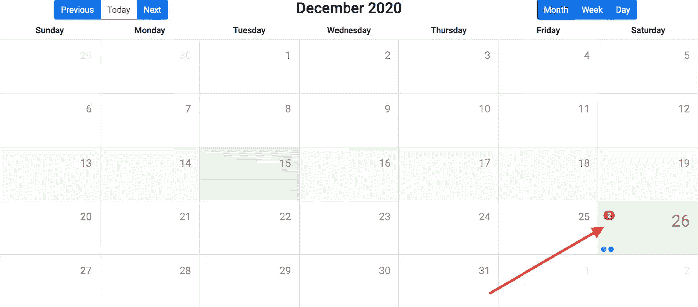

# 使用角度和引导创建日历

> 原文：<https://javascript.plainenglish.io/create-calendar-using-angular-and-bootstrap-monthly-weekly-and-daily-calendar-c441f1cb8b18?source=collection_archive---------0----------------------->

## 每月、每周和每日日历



**日历视图**对很多人来说都很有用。例如，商业、医院、物流、学校、学院等。，需要在日历模式下查看数据。大部分时间首选月历。最近，我的客户向我提出了一个在**医院管理系统**中查看日历的要求。所以我想和你们分享这个。

在本教程中，你将学习如何使用**实现日历视图**。实现日历视图非常容易。只需安装软件包并将其包含在您的 ts 文件和 HTML 文件中，它就可以正常工作。在这里，我们将看到一些额外的东西，如如何显示徽章计数和如何查看特定日期的信息。****

****样本输出屏幕。****

****

**不浪费时间，我们直接进入正题。我们将在一个分步示例中看到它们。**

# ****1。创建角度项目****

**打开你的命令提示符或终端，输入下面的命令，创建一个新的 **Angular 项目**。**

```
ng new angular-calendar-example
```

**上面的命令将为您创建一个项目。下一步是安装所需的库。所以在 **VS 代码编辑器**中打开新创建的 Angular 项目。我正在使用 VS 代码编辑器。您可以使用任何其他编辑器。但是与其他编辑器相比，VS 代码编辑器有更多的功能。**

# ****2。安装角度日历库****

**默认情况下， **Angular Calenda** r 包依赖于**Bootstrap**CSS 框架。然而，它有一个单独的 CSS 库来显示日历视图。您可以使用相同的 CSS 框架。或者你可以使用你想要的 CSS 框架。简单解释一下，我将使用引导框架。但是在我的项目中，我是用 Angular Material CSS 框架实现的。所以工作并不难。但是，如果您使用的是其他 CSS 框架，则需要处理元素的放置。**

**所以让我们首先使用下面的命令安装**引导** CSS。**

```
npm install --save bootstrap
```

**并将安装的引导库包含到 **style.scss** 文件中**

```
[@import](http://twitter.com/import) "../node_modules/bootstrap/dist/css/bootstrap.min.css";
```

**现在使用下面的命令安装角度日历包。**

```
npm install --save angular-calendar date-fns
```

**接下来，将日历 CSS 文件导入到 **style.scss** 文件中。**

```
[@import](http://twitter.com/import) "../node_modules/angular-calendar/css/angular-calendar.css";
```

**如果不执行此步骤，日历视图将不会呈现。**

**现在将 **CalendarModule、DateAdapter、adapterFactory** 导入到 **app.module.ts** 文件中。**

**并将上述模块包含在 **app.module.ts** 文件的导入部分，如下图所示。**

**现在，我们在 Angular 项目中安装并配置了必要的库。下一步是呈现日历视图。**

# ****3。呈现日历视图****

**角日历套装内置三个组件。下面列出了它们。**

1.  **mwl-日历-月-视图-月历**
2.  **mwl-日历-周-视图-周日历**
3.  **mwl-日历-日-视图-日日历**

****3.1 .渲染月历****

**因此，在 app.component.html 的**文件中添加以下代码来呈现每月视图。****

**这里我们需要传递一个重要的输入。**

1.  **viewDate —这是一个简单的 JavaScript 日期对象。用来代表今天或你想要的日期。**

**因此，在您的 **app.component.ts** 文件中创建一个名为 viewDate 的新变量。**

****月视图输出****

****

****3.2 .渲染周历****

**使用下面的代码来呈现**app.component.html**文件中的周视图。**

****周视图****

****

****3.3 .渲染日历****

**使用下面的代码渲染**app.component.html**文件中的日视图。**

# ****4。上一次，下一次，今天****

**Angular Calendar 软件包提供了内置功能，可以导航到上一个、下一个和今天。这些是 HTML 标签属性。**

1.  **mwlCalendarPreviousView 导航到上一个**
2.  **mwlCalendarToday 导航到今天**
3.  **mwlCalendarNextView 导航至下一步**

**导航基于当前的日历视图。比如说，如果你有一个月历视图，那么**下一个**将显示下个月。而**前**会显示上个月。**

**如果您有周日历视图，那么下一个将显示下一周，上一个将显示上一周。同样的概念也适用于日视图。**

**我将在按钮元素中使用这些属性。我们需要绑定日历视图来使用上一个和下一个。因此，我们需要将 CalendarView 导入到您的 **app.component.ts** 文件中，并创建如下所示的视图。**

**默认情况下，我将其指定为每月视图。您可以将其更改为每周或每天。**

**现在将下面的代码添加到你的**app.component.html**文件中，以导航所需的查看日期。**

****

**这里我们附加了带有视图属性的日历视图。如果您单击“上一个”按钮，将显示上一个月的日历。如果您单击“下一步”按钮，将会显示下个月的日历。**

# ****5。切换日历视图****

**现在我们有了一个静态的日历视图(只有每月、每周或每天)。我们可以通过使用角度开关来改变这一点。我们将使用开关修改现有代码。按钮点击事件将切换日历视图。用点击事件创建三个按钮来改变你的**app.component.html**文件中的视图。**

**然后在 ts 文件上创建一个 setView()函数。**

**我们还需要进一步修改 HTML 文件。这意味着我们还没有实现开关的情况。因此，在你的 HTML 文件中实现一个类似下面的切换用例。**

****

**如果你点击月或周或日，那么它会显示相应的视图。**

# ****6。显示活动徽章数量****

**到目前为止，我们只做了要求做的事情。仅视图部分。现在的主要问题是如何将事件添加到日历或如何在日历上显示事件计数。在我的客户要求，他们需要看到有多少约会是在一天内预订(一天内所有约会的计数)，当点击特定的一天，它已经显示所有预订的约会。**

**在 modal 中显示所有预订的数据非常容易。这是一个简单的点击事件。现在棘手的问题是如何在日期中显示计数。我们必须使用事件属性。为此我们需要导入 **CalendarEvent** 类。并创建一个事件对象，如下所示。**

**将上述代码粘贴到您的 app.component.ts 文件中。这个事件不需要什么重要的参数。下面列出了它们。**

1.  **开始—日期或时间对象。命令的**
2.  **结束—日期或时间对象。可选择的**
3.  **标题—您的信息。命令的**

**并将事件添加到日历视图中的**app.component.html**文件中。**

****

**它将显示您当前日期的徽章计数 1。如果您想在同一天显示另一个事件，那么在 ts 文件中再添加一个事件。**

****

**现在它会在同一天显示两个计数。这里的问题是，它将显示基于计数的点。如果你有 100 个事件，那么它会显示 100 个点。如果你不想显示圆点，那么就在你的 style.scss 文件中使用这段代码。**

```
.cal-events {
    display: none !important;
}
```

**如果您想从 db 中获取数据，那么传递开始日期或时间参数，并使用 CalendarEvent 对象给出一个标题值。使用 for 循环迭代数据，如下所示。**

# ****7。日点击事件****

**当用户从每月视图中单击一个日期时，它必须以一种模式显示特定日期的所有约会信息。为了实现这一点，
在月历视图中，我们有了 **dayClicked** 事件。如下图所示，将日点击事件添加到您的月视图中。**

**然后创建一个 dayClicked()函数你的 ts 文件如下。**

**这里我展示了一个演示代码。您可以实现一个模式来显示基于用户点击日期的数据。**

# ****总结****

**在本教程中，我们学习了各种东西。从基本安装到将事件添加到日历。这里有一个快速列表。**

1.  ****如何创建月历****
2.  ****如何创建周日历****
3.  ****如何创建日历****
4.  ****下一天/前一周/前一月怎么走****
5.  ****如何动态切换到日/周/月视图。****
6.  ****如何将事件添加到特定日期****
7.  ****日点击事件****

**仅此而已。希望你喜欢这个教程。**

**如果你有任何疑问，然后评论它。**

****获取 GitHub 中的完整源代码。****

```
[https://github.com/bharathirajatut/angular-examples/tree/master/angular-calendar-example](https://github.com/bharathirajatut/angular-examples/tree/master/angular-calendar-example)
```

****演示链接****

**[https://angular-calendar.com/#/kitchen-sink](https://angular-calendar.com/#/kitchen-sink)**

****角度日历包链接****

**[https://www.npmjs.com/package/angular-calendar](https://www.npmjs.com/package/angular-calendar)**