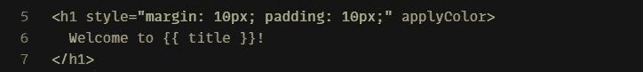
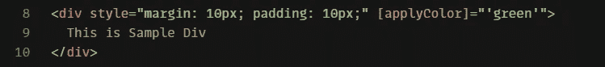

# Angular 中的自定义属性指令

> 原文：<https://javascript.plainenglish.io/create-custom-attribute-directive-in-angular-b1338911a3ef?source=collection_archive---------4----------------------->

## 自定义属性指令在 5 分钟内实现

Working with Custom Attribute in Angular

Technofunnel 展示了另一篇关于如何在 Angular 中创建**自定义属性指令的文章。**这些指令就像可以附加到元素上的任何其他属性一样，比如“id”、“class”和“name”。一旦在元素上应用了指令，指令中的功能就会应用于该元素。

## 自定义属性指令的好处

*   可以创建应用于多个元素的通用功能
*   可以操纵组件的外观和行为
*   它可以操作元素的 DOM 属性
*   元素可以在特定条件下隐藏或飞行

## 创建简单的属性指令

在上面的例子中，我们将创建一个自定义属性指令，将组件的颜色更新为“绿色”。我们将这个自定义属性命名为“applyColor”。

[https://gist.github.com/Mayankgupta688/8040eacbf771392a17c91b7040420506](https://gist.github.com/Mayankgupta688/8040eacbf771392a17c91b7040420506)

在上面的代码中，我们创建了一个自定义属性指令“applyColor”。自定义指令更新应用它的元素的 backgroundColor 属性。我们已经将该指令应用于 2 个元素“h1”和“div”。

一旦指令被应用到一个组件，我们就可以使用“ **el: ElementRef** ”来访问组件的 DOM 元素。一旦 DOM 元素可访问，我们就可以使用" **this.el.nativeElement** "来更新任何 DOM 属性。

“nativeElement”表示相同的 DOM 元素。我们现在可以将所有可用的属性最小化。

Working with Custom Attribute in Angular

在上面的代码中，我们已经指定了这个属性的工作方式。

在上面的例子中，我们可以看到显示指定颜色的组件。

## 将参数传递给自定义属性指令

上面给出的例子给元素分配了一个静态颜色。现在，我们希望进一步扩展功能，以便我们可以为组件分配自定义颜色。除了指令之外，我们还想指定应该应用的颜色。

[https://gist.github.com/Mayankgupta688/afd1b00c9765301f8bbeb7b4885a211c](https://gist.github.com/Mayankgupta688/afd1b00c9765301f8bbeb7b4885a211c)

在上面的代码中，我们添加了一个输入属性“applyColor”。用户可以在使用“applyColor”指令时输入颜色。该值将可用于输入属性，并且可以进一步使用。

然后，我们可以按以下方式使用该指令:

Working with Custom Attribute in Angular

下面是沙盒代码来尝试这个功能。

[https://codesandbox.io/s/amazing-water-c4dkd?file=/src/app/directives/applyColor.directive.ts](https://codesandbox.io/s/amazing-water-c4dkd?file=/src/app/directives/applyColor.directive.ts)

请通过以下方式联系我们:

 [## 技术漏斗

### 我们专注于学习不同的技术，如 React、Angular、机器学习、Python、Golang 和 AWS…

medium.com](https://medium.com/technofunnel)  [## 技术漏斗

### 欢迎来到 TechnoFunnel。在这个渠道中，我们将重点学习不同的前端和后端技术，如…

www.youtube.com](https://www.youtube.com/channel/UCo-h1M-5M6Y5D4Lgut8ge4w) 

*更多内容请看*[*plain English . io*](http://plainenglish.io/)