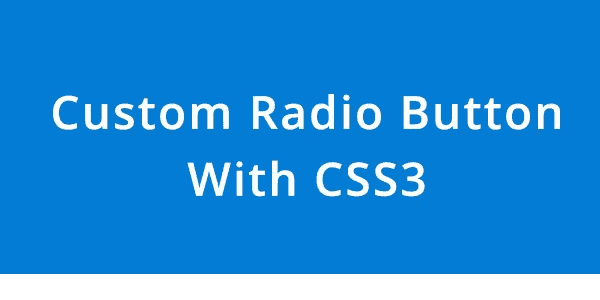
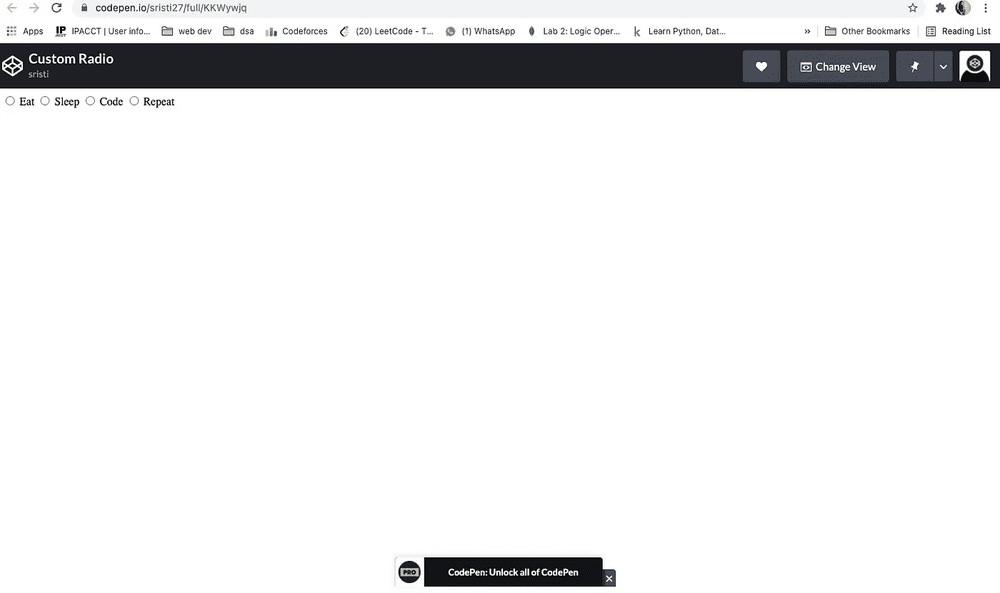
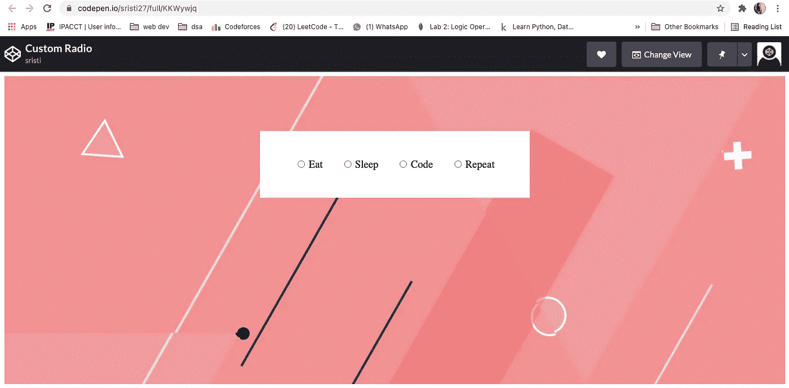
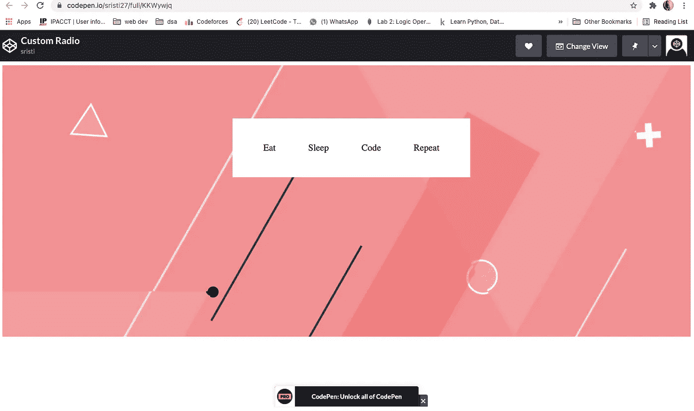
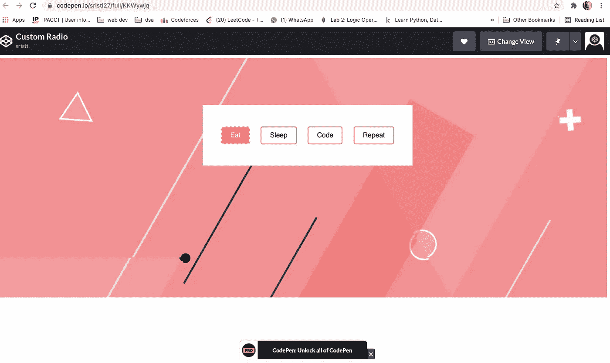

# 创建自定义 CSS 单选按钮

> 原文：<https://javascript.plainenglish.io/create-custom-css-radio-buttons-e8f9ca0bf1f0?source=collection_archive---------7----------------------->

## 把你的单选按钮变成吸引人的标签



我在这篇文章中的目标是创建具有 CSS 单选按钮相同功能的吸引人的标签。

所以，和我一起设计单选按钮吧！

让我们从 HTML 文件的创建开始~**index.html。**

将这段代码粘贴到 HTML 文件的 body 部分。

```
<body>
<div class="content">
  <div class="radio-toolbar">

<input type="radio" id="eat" name="val" value="Eat" checked/>
<label for="eat">Eat</label><input type="radio" id="sleep" name="val" value="Sleep"/>
<label for="sleep">Sleep</label><input type="radio" id="code" name="val" value="Code"/>
<label for="code">Code</label><input type="radio" id="repeat"  name="val" value="Repeat"/>
<label for="repeat">Repeat</label> 
  </div>
</div>
</body>
```



This is how the radio buttons currently look!

让我们给这些添加一些创造性的魔法，让它们看起来更有吸引力。

首先，让我们给背景添加一些颜色。为此，我将使用谷歌的基本背景图片。

在这里找到图像[。](https://dm0qx8t0i9gc9.cloudfront.net/thumbnails/video/rN0W64K4ipau8gxv/videoblocks-simple-graphic-background-in-pastel-shades_bihmovigu_thumbnail-1080_01.png)



Some basic styling added

## 下面是 CSS 代码

将它添加到您的样式表中，您将看到上面的结果！

```
.content
{
  background:url('[https://dm0qx8t0i9gc9.cloudfront.net/thumbnails/video/rN0W64K4ipau8gxv/videoblocks-simple-graphic-background-in-pastel-shades_bihmovigu_thumbnail-1080_01.png'](https://dm0qx8t0i9gc9.cloudfront.net/thumbnails/video/rN0W64K4ipau8gxv/videoblocks-simple-graphic-background-in-pastel-shades_bihmovigu_thumbnail-1080_01.png'));
  height:50vh;
  padding:100px;
  background-size:cover
}.radio-toolbar
{
  background-color:white;
  width:30vw;
  padding:50px 30px;
  position:absolute;
  left:50%;
  transform:translateX(-50%);
  display:flex;
  justify-content:space-evenly;
}.radio-toolbar label
{
  font-size:1.2em;
}
```

***我在这里的目标是创造一些能提升外观的东西。此外，我想保持单选按钮的功能完整，但我不想要圆形。相反，我希望标签可以帮助我选择特定的单选按钮值。***

首先要隐藏圆圈输入，我们需要添加下面这段代码。

```
.radio-toolbar input[type="radio"] {
    visibility: hidden;
    display: none;
  }
```



No circular buttons beside the labels can be seen!

## 万岁！我们已经完成了一半的目标！

要设计标签以获得更好的用户体验，您可以添加以下代码。

```
.radio-toolbar label {
      display: inline-block;
      background-color: white;
      padding: 10px 20px;
      font-family: sans-serif, Arial;
      font-size: 16px;
      border: 2px solid rgb(235, 119, 98);
      border-radius: 5px;
      cursor: pointer;
  }

  .radio-toolbar label:hover {
    background-color:rgb(235, 119, 98);
    color:white
  } .radio-toolbar input[type="radio"]:checked + label {
      background-color:rgb(250, 119, 98);
      color:white;
      border:2px dashed white;
  }
```



This is what it currently looks like after the styling.

这为标签添加了一些基本的样式，使它们看起来更像按钮，同时也改变了悬停和选择它们时的布局。

现在，如果您希望知道或获得您所选择的按钮的值，我们需要添加下面这段 JavaScript 和 jQuery:

```
$(document).ready(function(){
        $("input[type='radio']").click(function(){
            var radioValue = $("input[name='val']:checked").val();
            if(radioValue){
                alert("Your have selected " + radioValue);
            }
        });
    });
```

## 看到最后的结果在这里~

查看上面的笔，了解完整的工作解决方案。

另外，你可以访问下面我的 Github 简介。如有任何机会或合作，请随时在 LinkedIn 上联系我。

[](https://github.com/Sristi27) [## srist 27-概述

### 网页开发者和设计师。Sristi27 有 56 个可用的存储库。在 GitHub 上关注他们的代码。

github.com](https://github.com/Sristi27) 

希望这篇文章对你们真的有帮助。

# **感谢阅读！**

*更多内容请看*[*plain English . io*](http://plainenglish.io/)