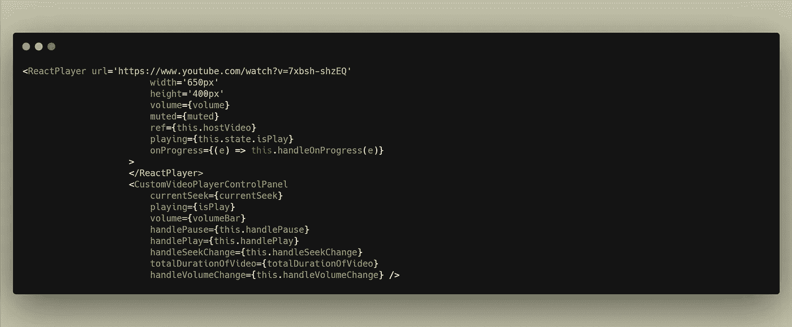

# 使用 ReactPlayer 创建自定义视频控制器

> 原文：<https://javascript.plainenglish.io/create-custom-video-controller-using-react-player-7a3d7ed8850a?source=collection_archive---------1----------------------->

我当时在做一个项目，项目的要求是实现一个可以播放 YouTube 视频的视频播放器。我想你们都知道 YouTube 视频可以通过使用 iframe 来播放，但通过使用它，处理控件会更加困难。所以我们决定使用一个名为“ ***react-player*** ”的播放器库。

 [## 反应型玩家

### 一个 React 组件，用于播放各种 URL，包括文件路径、YouTube、脸书、Twitch、SoundCloud…

www.npmjs.com](https://www.npmjs.com/package/react-player) 

但是在使用这个库的时候，我们发现他们没有音量控制功能。所以我们决定通过使用玩家预先定义的方法为他们创建一个自定义的控制面板。

Player component (states screenshot)

这是我的组件状态。

1.  ***isPlay:*** 处理视频是正在播放还是处于暂停状态。
2.  ***currentSeek:*** 用于显示实时视频渲染 Seek，比如视频在哪个时间点播放。
3.  ***音量条:*** 用于向用户显示音量状态，像进度条形式的 0 到 1。
4.  ***音量:*** 设置播放器当前的视频音量。
5.  ***totalDurationOfVideo:***获取视频的总时间。
6.  ***静音:*** 处理视频是否静音。

Custom functions (Screen Shot)

***handleVolumeChange***:该功能将处理视频的音量，并在用户从音量范围栏改变音量时进行设置。它将从范围栏中获取当前值，并将其设置为视频的音量(I **已将音量栏的值设置为最小值 0 和最大值 100，*音量*用于设置视频的音量，因为视频可以有 0 到 1 的音量范围。这就是为什么我把这个值除以 100，使其浮动，而“ *volumeBar* ”代表输入范围，这样它就可以在 UI 中显示用户当前的音量状态。**)

***手柄暂停*** :该功能将暂停视频。

***handlePlay*** :该功能将播放视频；此外，视频第一次播放时，它将获得视频的总时长，并将其设置在一个状态变量中。

*****handleSeekChnage***:当用户试图向前或向后移动视频时，将调用该函数。它将获取用户想要播放视频的当前视频时间，并将其设置为 currentSeek 状态，以将视频移动到用户所需的时间。**

****

**Video Player**

**一旦你安装了 ***React-Player*** 包，这里有一些我正在使用的道具:**

> ****【URL】**为视频链接，***width/height***t 为播放器离职， ***视频的音量*** ， ***静音*** ，为视频静音状态， ***ref*** ， ***onProgress*** 获取视频实时搜索的方法。 ***播放*** 设置视频播放/暂停状态。**

**对于自定义控制面板，我们正在发送一些道具。**

> *****currentSeek*** 为实时视频寻道更新 UI， ***Playing*** 为显示使用中的视频正在播放或暂停 UI。 ***音量*** 更新音量条 UI、 ***手柄播放*** 播放视频、 ***手柄暂停*** 暂停视频等等。**

****

**Custom Control panel (screen shoot)**

**我们在控制面板中有 3 个部分。1.对于 ***播放/暂停*** UI 图标。2. ***音量*** 图标和音量进度条。3.视频实时 ***求*** 求进度条**

*****道具.播放*** 会处理视频是播放还是暂停；它将分别显示图标。**

*****props.volume*** 是在音量图标处于高/中或静音状态时，在 UI 中显示视频音量状态。并在进度条上显示。**

*****props . current Seek***是处理实时视频 seek。**

*****on input***卷和寻道栏的方法将执行各自的功能。**

********

**我也有一个 YouTube 频道，我在上面报道了一些关于 React/node . js/MongoDB/React Native/Flutter 的话题。去看看。**

# **编程技术编码器**

**回购链接:[https://github . com/zainbinfurqan/custom-video-player-control-panel/tree/main](https://github.com/zainbinfurqan/custom-video-player-contorl-panel/tree/main)**

***更多内容看* [*说白了. io*](http://plainenglish.io/) *。报名参加我们的* [*免费每周简讯*](http://newsletter.plainenglish.io/) *。在我们的* [*社区*](https://discord.gg/GtDtUAvyhW) *获得独家写作机会和建议。***