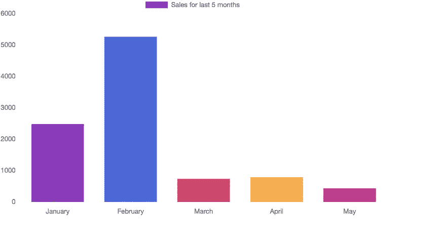
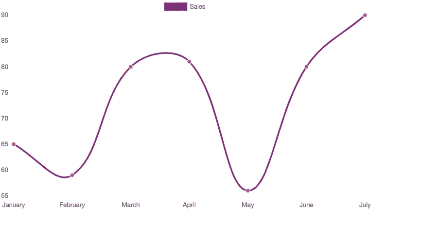
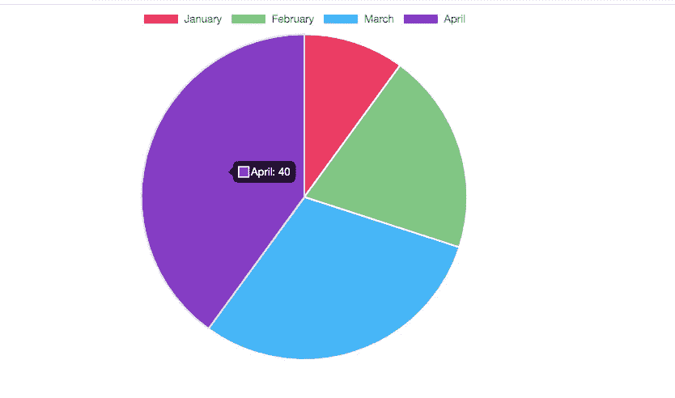
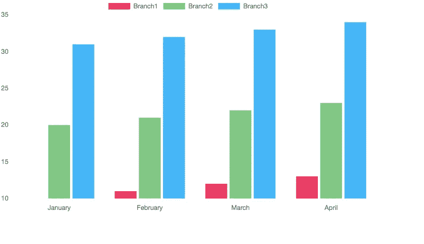
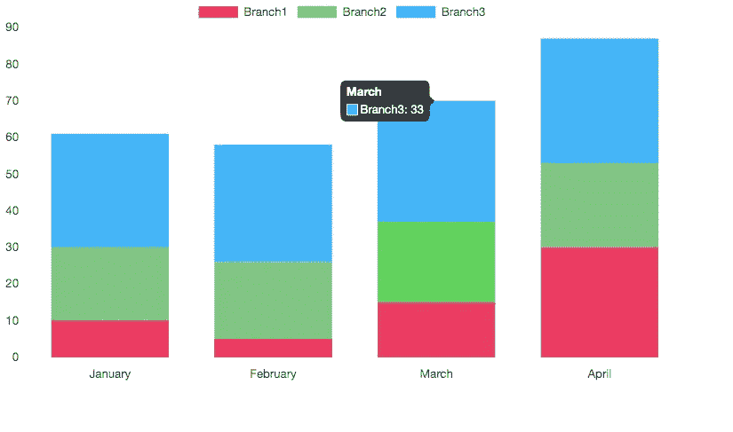
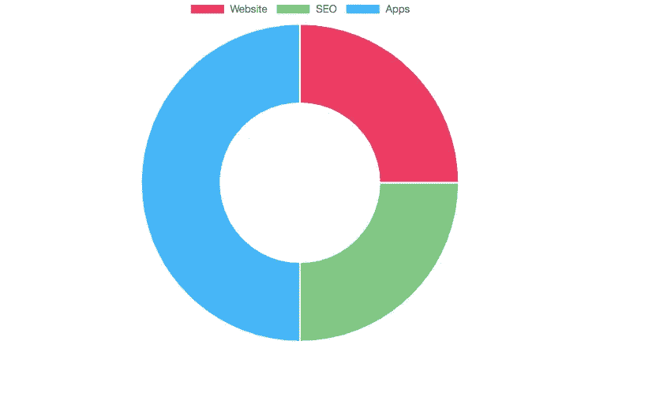
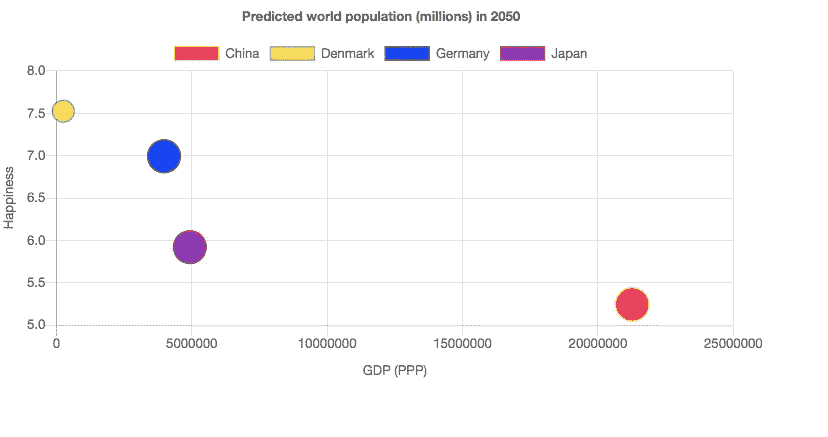
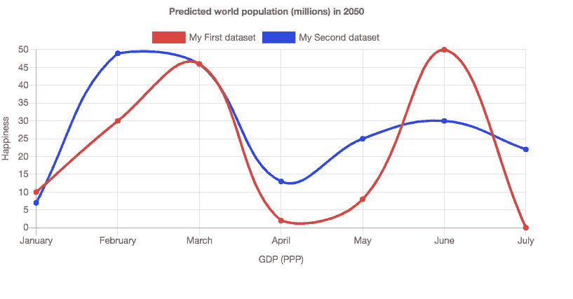
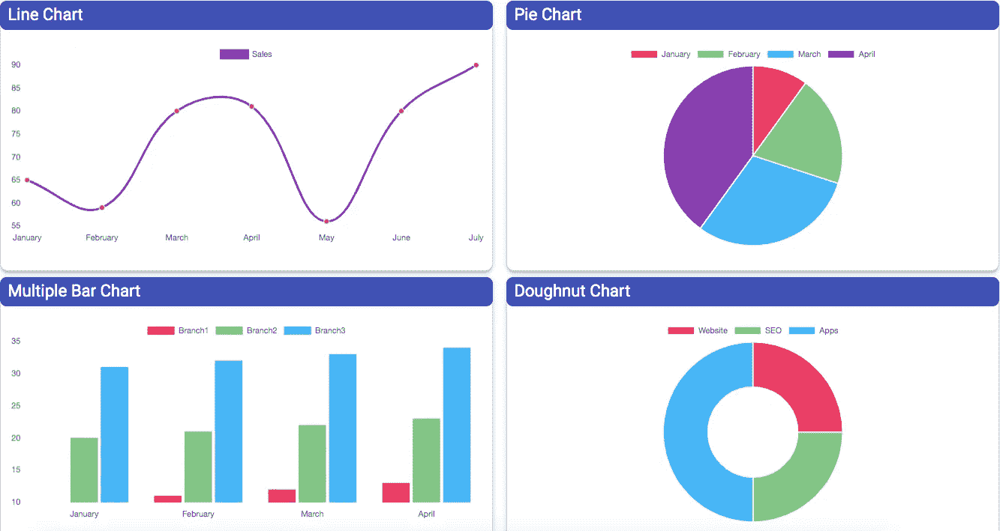
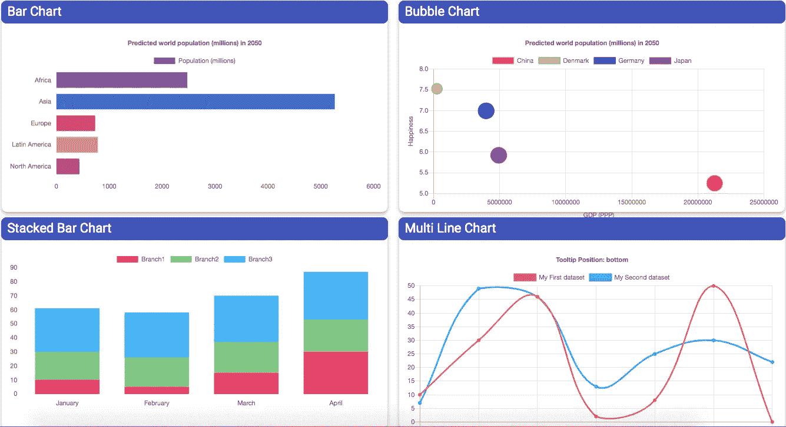

# 使用图表和角度创建仪表板

> 原文：<https://javascript.plainenglish.io/create-dashboard-using-chartjs-and-angular-13e7df06d899?source=collection_archive---------0----------------------->

安装 ChartJS，使用 ChartJS 和 Angular 创建各种图表和仪表板。


Photo by [Luke Chesser](https://unsplash.com/@lukechesser?utm_source=unsplash&utm_medium=referral&utm_content=creditCopyText) on [Unsplash](https://unsplash.com/?utm_source=unsplash&utm_medium=referral&utm_content=creditCopyText)

分析在商业决策中扮演着非常重要的角色。宇宙中的所有组织都在尝试许多商业智能工具来使用数据创建报告和图表。图表比查看原始数据更有助于业务人员理解数据。

每当我们开发 CRM、ERP 等应用程序时。用户(客户)总是要求我们使用各种 KPI(***关键绩效指标*** )创建一个仪表板。KPI 是分析人员使用的技术术语。KPI 用于定义如何创建图表(外观)、图表类型以及在图表中使用的指标(数据)。

在本教程中，我们将看到如何使用 **Angular** 和 **Chartjs** 库创建基本图表，以及如何使用图表创建类似仪表板的外观。

让我们看看如何使用**chartj**创建一个基本图表。然后我们将组合所有的图表，在 **Angular** 中创建一个仪表板。在本教程中，我们将使用 Chartjs 来涵盖以下图表。

1.  条形图
2.  折线图
3.  圆形分格统计图表
4.  分组条形图
5.  堆积条形图
6.  圆环图
7.  泡泡图
8.  多线图

# **安装 Chartjs 库:**

首先，我们需要为 Angular 安装 Chartjs 库。要安装 Chartjs，请在 Angular 项目中使用下面的命令。

```
npm install angular2-chartjs
```

获取角度图表库链接。

[](https://github.com/emn178/angular2-chartjs) [## emn178/angular2-chartjs

### Angular2+的 Chart.js 组件可以使用 npm 安装 angular2-chartjs。npm 安装 angular2-chartjs 添加…

github.com](https://github.com/emn178/angular2-chartjs) 

# **导入图表**

我们成功安装了 Chartjs 库。现在我们需要将 Chartjs 模块导入到 **app.module.ts** 文件中。

因此，使用 app.module.ts 文件中的以下代码导入 ChartModule。

```
import { ChartModule } from 'angular2-chartjs';
```

然后在 **app.module.ts** 文件的 imports 部分包含 **ChartModule** 。

仅此而已。我们配置了图表。现在我们将看到，如何创建图表使用 Chartjs 和 Angular 一个接一个。

# **条形图**

在 Chartjs 中创建图表非常容易。我们将在 ts 文件中做两件事。

1.  更改图表类型值。
2.  更改相应图表类型的数据。

所有图表的 HTML 代码保持不变。因此，首先我们将创建 HTML 组件，然后我们将在 ts 文件中添加其他内容。

创建一个 **div** 并在**home.component.html**文件中定义 div 的宽度和高度。

然后使用 **<图表>** 标签，使用**home.component.html**文件中的 Chartjs 渲染图表。

1.  **【type】= " type "**=>这里 type 是图表类型的占位符。我们可以使用 **home.component.ts** 文件来定义这个值。
2.  **【数据】=【数据】** = >用于传递相应图表的数据。
3.  **[options]= " options "**=>它用于使用各种内置选项修改图表的外观。
4.  **class="dashchart"** = >专门用来定义图表的高度。为什么？因为默认情况下，图表会占据 div 的整个宽度。但是它不考虑 div 的高度。所以我用这个类来给出图表的高度。将下面的样式代码放到 **home.component.scss** 文件中。

现在 HTML 代码已经准备好呈现条形图了。我们需要使用 ts 文件来传递数据和图表类型。

*请注意。对于所有其他图表，此 HTML 代码保持不变。*

现在将下面的代码粘贴到 **home.component.ts** 文件中，以呈现条形图。

**Line1:** 用于定义条形图。我们总是为不同类型的图表更改该值。

**第 3 行:**x 轴标签。

第 6 行:这个图表的标题。

**第 8 行:**所有条形的背景色。您可以为所有条形定义单一颜色。

**Line9:** 是 bar 中使用的数据。假设它是每个月的总销售额。基于该值，创建条形。

第 16 行:显示标题。

**Line22:** 显示 x 轴标签。

**Line29:** 显示 y 轴标签。

**Line24:** 禁用 x 轴的网格线。

**Line31:** 禁用 y 轴的网格线。

**条形图代码的输出:**



这些是条形图的配置。您可以使用 Chartjs 官方网站找到更多选项。同样，大多数 ts 代码在所有图表中保持不变。我们将修改数据和图表类型来呈现各种图表。接下来，我们将看到其他图表。我将解释我们必须在 ts 文件中更改哪些值。

# **折线图**

将以下代码复制粘贴到 home.component.ts 文件中，使用 Chartjs 和 Angular 呈现折线图。

**Line1:** 定义折线图。

**第三行:** x 轴标签。

**Line6:** 线条颜色。

**Line12:** 折线图数据。

**输出**:



# 饼图

将以下代码复制粘贴到 home.component.ts 文件中，使用 Chartjs 和 Angular 呈现饼图。

**Line1:** 定义饼图。

**第 4 行:** x 轴标签。

**第 9 行:**饼图颜色。

**Line12:** 饼状图数据。

**输出:**



# 分组条形图

将以下代码复制粘贴到 home.component.ts 文件中，使用 Chartjs 和 Angular 呈现分组条形图。

它与条形图相同。然而，这里我们传递三个不同的数据集来创建一个分组条形图。

**输出**:



# 堆积条形图

将以下代码复制粘贴到 home.component.ts 文件中，使用 Chartjs 和 Angular 呈现堆积条形图。

它与堆积条形图相同。但是为了实现堆叠，我们在第 34 和 41 行提到它是 stacked:true。

**输出**:



# 圆环图

将以下代码复制粘贴到 home.component.ts 文件中，使用 Chartjs 和 Angular 呈现圆环图。

与饼图相同。但这里我们将图表类型更改为圆环图。

**输出**:



# 气泡图

将以下代码复制粘贴到 home.component.ts 文件中，使用 Chartjs 和 Angular 呈现气泡图。

**输出**:



# 多线图表

将下面的代码复制粘贴到 home.component.ts 文件中，使用 Chartjs 和 Angular 呈现多折线图。

**输出**:



# **创建仪表板**

现在，我们将结合上述所有图表，创建一个仪表板。为了正确对齐图表，我将使用 materialize CSS 库和 Angular Material CSS 库。

所以将 materialize.css 文件包含在 **style.scss** 文件中。

```
@import "m-modified.css";
```

使用下面的链接获取 materialize.css 文件。

```
[https://github.com/bharathirajatut/angular-examples/blob/master/chartjs-example/src/m-modified.css](https://github.com/bharathirajatut/angular-examples/blob/master/chartjs-example/src/m-modified.css)
```

使用以下命令安装角形材料 CSS。

```
ng add @angular/material
```

然后在 **style.scss** 文件中添加下面的 CSS 代码来更好地对齐图表。

将下面链接中给出的代码复制粘贴到**home.component.html**文件中。

```
[https://github.com/bharathirajatut/angular-examples/blob/master/chartjs-example/src/app/charts/charts.component.html](https://github.com/bharathirajatut/angular-examples/blob/master/chartjs-example/src/app/charts/charts.component.html)
```

将下面链接中给出的代码复制粘贴到 **home.component.ts** 文件中。

```
[https://github.com/bharathirajatut/angular-examples/blob/master/chartjs-example/src/app/charts/charts.component.ts](https://github.com/bharathirajatut/angular-examples/blob/master/chartjs-example/src/app/charts/charts.component.ts)
```

**输出**:



**完整源代码链接:**

[](https://github.com/bharathirajatut/angular-examples/tree/master/chartjs-example/src) [## bharathirajatu/angular-示例

### 角度示例源代码。为 bharathirajatu/angular-examples 的发展作出贡献

github.com](https://github.com/bharathirajatut/angular-examples/tree/master/chartjs-example/src) 

# **总结**

**Chartjs** 对于以简单易行的方式创建图表非常有用。尤其是这个 **angular-chartjs** 库让我们的工作变得非常轻松。为什么呢？因为我们不能直接用角坐标图。我们需要对 Chartjs 库进行一些包装，以便在 Angular 应用程序中使用它。这个包装是由 angular-chartjs 库完成的。在本教程中，您学习了以下主题。

1.  如何为 Angular 安装 Chartjs 库
2.  如何使用 Chartjs 创建条形图
3.  如何使用 Chartjs 创建折线图
4.  如何使用 Chartjs 创建饼图
5.  如何使用 Chartjs 创建分组条形图
6.  如何使用 Chartjs 创建堆积条形图
7.  如何使用 Chartjs 创建圆环图
8.  如何使用 Chartjs 创建多线图表
9.  如何使用 Chartjs 创建仪表板

希望这个教程对你很有用。

仅此而已。感谢您阅读本教程。

敬请关注更多文章。