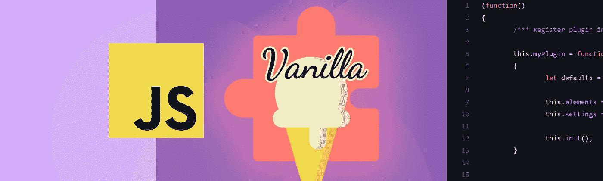

# 用这个简单的模板系统创建快速的普通 JavaScript 插件

> 原文：<https://javascript.plainenglish.io/create-fast-vanilla-javascript-plugins-with-this-easy-template-system-bc30b5a0b095?source=collection_archive---------1----------------------->

## 在本文中，我将向您展示如何使用我的样板文件用普通 JavaScript 开发插件和组件。



在我 20 年的开发经验中，我从来不喜欢使用非自己编写的 JavaScript 插件和组件。于是在 2015 年，我开始编写自己的插件库。从那时起，我对我的插件使用相同的样板概念。

## 自写插件的优势显而易见

*   我知道密码
*   我控制发生了什么
*   插件/组件做了它应该做的事情
*   我不使用由于浏览器更新而在某个时间点不再有效的黑客

# 需要的文件

我的插件样板文件中有三个文件:

*   index.html
*   我的插件. js
*   project.js

> 在本文的结尾，您会找到一个到 Github 的链接，在那里可以下载所有的项目文件。

# 实际的插件(myPlugin.js)

代码清单显示了 JavaScript 插件的完整框架。在所有引用代码段中，插件都被称为`myPlugin`。

因为变量的作用域，我用[**life**](https://en.wikipedia.org/wiki/Immediately-invoked_function_expression)(立即调用的函数表达式)。创建后立即执行。

我的插件模板有三个部分:

*   在*窗口中`register myPlugin`对象并定义其核心变量*
*   `public methods`
*   `private methods`

在接下来的步骤中，我将向您展示在这些部分中会发生什么。

# 第 1 部分:在全局窗口中注册插件

在第一部分，我在窗口对象中注册了名为`myPlugin`的插件。我还在*第 5 行*中将所有默认设置定义为一个对象。

`this.elements`是一个可选的容器，用于存储插件所应用的 DOM 元素。

`this.settings`存储插件设置，无论是*第 5 行*中设置的默认值，还是通过调用骨架列表中显示的**第 40 行的*私有方法【extendDefaults()*** 覆盖的默认值。

`this.init()`调用公共方法 ***init()*** 来启动插件。

# 第 2 节:定义公共方法

公共方法可以在插件外部调用。我通常用它们来更新插件的大小。下面是一个从外部调用插件方法的例子。

因此，由于方法是公共的，它们必须被定义为*原型*。

```
myPlugin.prototype.methodName = function() { ... }
```

❕在*第七行*你看我怎么调用私有方法:

```
build.call(this);
```

# 第 3 节:定义私有方法

私有方法只是我们函数内部的函数。

在每个插件中，我都有这两个公共函数

*   `build()`被 ***调用 init()*** 来设置 DOM 中的一切，事件等。
*   在窗口对象中注册插件时使用`extendDefaults(defaults,properties)`。

# 用 JavaScript 初始化插件(project.js)

下面的代码展示了我如何在我的标准项目文件中初始化插件。

*   我在第 3 行*的窗口对象中注册了一个全局变量‘elements’。*
*   在事件监听器 DOMContentLoaded 中，我初始化了第 7 行上的插件。
*   在事件监听器 resize 中，我调用了第 15 行上的公共函数`update()`。

# 用 HTML 实现(index.html)

下面的代码展示了我如何在一个 HTML 站点中实现插件。

顺便说一下，如果你有兴趣优化你的 HTML 代码以获得更好的 SEO 结果和机器可读性，请阅读我的文章。

[](https://levelup.gitconnected.com/semantics-how-i-structure-html-without-divitis-dd0d376f193) [## 我如何构建 HTML 以获得更好的搜索引擎优化结果

### 这篇文章展示了我如何使用语义 HTML 标签优化网站，为更好的机器准备内容…

levelup.gitconnected.com](https://levelup.gitconnected.com/semantics-how-i-structure-html-without-divitis-dd0d376f193) 

# Github 链接

[https://github . com/Stephan-rom hart/Javascript-Plugin-Boilerplate](https://github.com/stephan-romhart/Javascript-Plugin-Boilerplate)

# 结论

我仍然记得我使用一些古怪的 jQuery 插件的日子，我不得不改变它们的功能或纠正它们的古怪之处。太烦人了。

用提交的 JavaScript 插件样板文件，我为我的日常工作构建了大约 20 个可重用的易于风格化的插件。我在生产中使用它，直到现在都没有问题。它结构清晰，易于使用。我很满意，❤️.

**感谢阅读。** 期待您的反馈。😍

请评论、书签或关注我，支持我的频道。


如果你想让我写第二篇文章，介绍一个使用我提供的样板文件的示例 JavaScript 插件，请告诉我！

如果你心中有一个特定的主题，你会希望我写下来，让我在推特上知道:[https://www.twitter.com/@stephan_romhart](https://www.twitter.com/@stephan_romhart)

*更多内容请看*[***plain English . io***](http://plainenglish.io/)