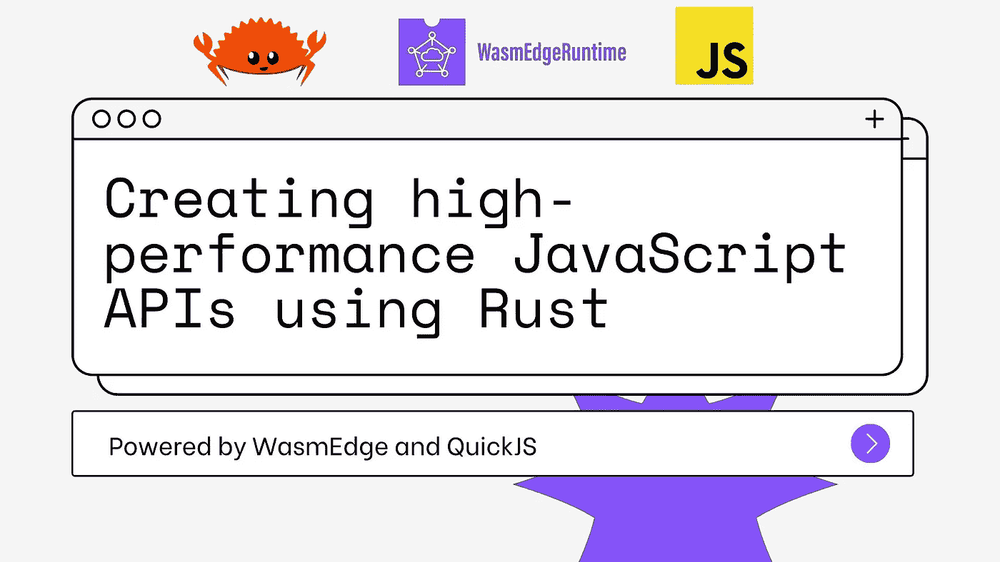

# 使用 Rust 创建高性能的 JavaScript APIs

> 原文：<https://javascript.plainenglish.io/create-high-performance-javascript-apis-using-rust-89fced9a924b?source=collection_archive---------4----------------------->

[*WasmEdge*](https://github.com/WasmEdge/WasmEdge) *融合了 Rust 的性能和 JavaScript 的易用性*


Photo by [Kevin Ku](https://unsplash.com/@ikukevk?utm_source=medium&utm_medium=referral) on [Unsplash](https://unsplash.com?utm_source=medium&utm_medium=referral)

在我之前的文章中，我讨论了如何将 JavaScript 代码嵌入到 Rust 程序中。然而，对于 JavaScript 开发人员来说，需求往往是相反的——将 Rust 函数合并到 JavaScript APIs 中。这使得开发人员能够用“纯 JavaScript”编写程序，同时还能利用高性能的 Rust 函数。使用 [WasmEdge 运行时](https://github.com/WasmEdge/WasmEdge)，您可以做到这一点。

接下来，我们来看几个例子。查看[wasmedge-quick js](https://github.com/second-state/wasmedge-quickjs/)Github repo，并转到`examples/embed_js`文件夹继续跟进。

```
$ git clone https://github.com/second-state/wasmedge-quickjs
$ cd examples/embed_js
```

您必须安装 [Rust](https://www.rust-lang.org/tools/install) 和 [WasmEdge](https://github.com/WasmEdge/WasmEdge/blob/master/docs/install.md) 来构建和运行本文中的示例。

`embed_js`演示展示了如何在 Rust 中嵌入 JavaScript 的几个不同例子。您可以构建并运行所有示例，如下所示。

```
$ cargo build --target wasm32-wasi --release
$ wasmedge --dir .:. target/wasm32-wasi/release/embed_js.wasm
```



# 创建一个 JavaScript 函数 API

下面的代码片段定义了一个 Rust 函数，它可以作为 API 集成到 JavaScript 解释器中。

```
fn run_rust_function(ctx: &mut Context) { struct HelloFn;
    impl JsFn for HelloFn {
        fn call(_ctx: &mut Context, _this_val: JsValue, argv: &[JsValue]) -> JsValue {
            println!("hello from rust");
            println!("argv={:?}", argv);
            JsValue::UnDefined
        }
    }

    ...
}
```

下面的代码片段展示了如何将这个 Rust 函数添加到 JavaScript 解释器中，给出一个名字`hi()`作为它的 JavaScript API，然后从 JavaScript 代码中调用它。

```
fn run_rust_function(ctx: &mut Context) {
    ...

    let f = ctx.new_function::<HelloFn>("hello");
    ctx.get_global().set("hi", f.into());
    let code = r#"hi(1,2,3)"#;
    let r = ctx.eval_global_str(code);
    println!("return value:{:?}", r);
}
```

执行结果如下。

```
hello from rust
argv=[Int(1), Int(2), Int(3)]
return value:UnDefined
```

使用这种方法，您可以创建一个带有定制 API 函数的 JavaScript 解释器。解释器在 WasmEdge 内部运行，可以执行 JavaScript 代码，从 CLI 或网络调用这样的 API 函数。

# 创建 JavaScript 对象 API

在 JavaScript API 设计中，我们有时需要提供一个封装了数据和函数的对象。在下面的例子中，我们为 JavaScript API 定义了一个 Rust 函数。

```
fn rust_new_object_and_js_call(ctx: &mut Context) { struct ObjectFn;
    impl JsFn for ObjectFn {
        fn call(_ctx: &mut Context, this_val: JsValue, argv: &[JsValue]) -> JsValue {
            println!("hello from rust");
            println!("argv={:?}", argv);
            if let JsValue::Object(obj) = this_val {
                let obj_map = obj.to_map();
                println!("this={:#?}", obj_map);
            }
            JsValue::UnDefined
        }
    }
```

然后，我们在 Rust 端创建一个“对象”，设置它的数据字段，然后将 Rust 函数注册为与对象相关联的 JavaScript 函数。

```
let mut obj = ctx.new_object();
    obj.set("a", 1.into());
    obj.set("b", ctx.new_string("abc").into());

    let f = ctx.new_function::<ObjectFn>("anything");
    obj.set("f", f.into());
```

接下来，我们让 Rust“object”在 JavaScript 解释器中作为 JavaScript 对象`test_obj`可用。

```
ctx.get_global().set("test_obj", obj.into());
```

在 JavaScript 代码中，你现在可以直接使用`test_obj`作为 API 的一部分。

```
let code = r#"
      print('test_obj keys=',Object.keys(test_obj))
      print('test_obj.a=',test_obj.a)
      print('test_obj.b=',test_obj.b)
      test_obj.f(1,2,3,"hi")
    "#; ctx.eval_global_str(code);
}
```

执行结果如下。

```
test_obj keys= a,b,f
test_obj.a= 1
test_obj.b= abc
hello from rust
argv=[Int(1), Int(2), Int(3), String(JsString(hi))]
this=Ok(
    {
        "a": Int(
            1,
        ),
        "b": String(
            JsString(
                abc,
            ),
        ),
        "f": Function(
            JsFunction(
                function anything() {
                    [native code]
                },
            ),
        ),
    },
)
```

# 一个完整的 JavaScript 对象 API

在前面的例子中，我们演示了从 Rust 创建 JavaScript APIs 的简单例子。在这个例子中，我们将创建一个完整的 Rust 模块，并使它作为一个 JavaScript 对象 API 可用。该项目位于[examples/embed _ rust _ module](https://github.com/second-state/wasmedge-quickjs/tree/main/examples/embed_rust_module)文件夹中。您可以在 WasmEdge 中将它作为标准 Rust 应用程序来构建和运行。

```
$ cargo build --target wasm32-wasi --release
$ wasmedge --dir .:. target/wasm32-wasi/release/embed_rust_module.wasm
```

对象的 Rust 实现是一个模块，如下所示。它有数据字段、构造函数、getters 和 setters 以及函数。

```
mod point {
    use wasmedge_quickjs::*; #[derive(Debug)]
    struct Point(i32, i32); struct PointDef; impl JsClassDef<Point> for PointDef {
        const CLASS_NAME: &'static str = "Point\0";
        const CONSTRUCTOR_ARGC: u8 = 2; fn constructor(_: &mut Context, argv: &[JsValue]) -> Option<Point> {
            println!("rust-> new Point {:?}", argv);
            let x = argv.get(0);
            let y = argv.get(1);
            if let ((Some(JsValue::Int(ref x)), Some(JsValue::Int(ref y)))) = (x, y) {
                Some(Point(*x, *y))
            } else {
                None
            }
        } fn proto_init(p: &mut JsClassProto<Point, PointDef>) {
            struct X;
            impl JsClassGetterSetter<Point> for X {
                const NAME: &'static str = "x\0"; fn getter(_: &mut Context, this_val: &mut Point) -> JsValue {
                    println!("rust-> get x");
                    this_val.0.into()
                } fn setter(_: &mut Context, this_val: &mut Point, val: JsValue) {
                    println!("rust-> set x:{:?}", val);
                    if let JsValue::Int(x) = val {
                        this_val.0 = x
                    }
                }
            } struct Y;
            impl JsClassGetterSetter<Point> for Y {
                const NAME: &'static str = "y\0"; fn getter(_: &mut Context, this_val: &mut Point) -> JsValue {
                    println!("rust-> get y");
                    this_val.1.into()
                } fn setter(_: &mut Context, this_val: &mut Point, val: JsValue) {
                    println!("rust-> set y:{:?}", val);
                    if let JsValue::Int(y) = val {
                        this_val.1 = y
                    }
                }
            } struct FnPrint;
            impl JsMethod<Point> for FnPrint {
                const NAME: &'static str = "pprint\0";
                const LEN: u8 = 0; fn call(_: &mut Context, this_val: &mut Point, _argv: &[JsValue]) -> JsValue {
                    println!("rust-> pprint: {:?}", this_val);
                    JsValue::Int(1)
                }
            } p.add_getter_setter(X);
            p.add_getter_setter(Y);
            p.add_function(FnPrint);
        }
    } struct PointModule;
    impl ModuleInit for PointModule {
        fn init_module(ctx: &mut Context, m: &mut JsModuleDef) {
            m.add_export("Point\0", PointDef::class_value(ctx));
        }
    } pub fn init_point_module(ctx: &mut Context) {
        ctx.register_class(PointDef);
        ctx.register_module("point\0", PointModule, &["Point\0"]);
    }
}
```

在解释器实现中，我们首先调用`point::init_point_module`向 JavaScript 上下文注册 Rust 模块，然后我们可以运行一个简单使用`point`对象的 JavaScript 程序。

```
use wasmedge_quickjs::*;
fn main() {
    let mut ctx = Context::new();
    point::init_point_module(&mut ctx); let code = r#"
      import('point').then((point)=>{
        let p0 = new point.Point(1,2)
        print("js->",p0.x,p0.y)
        p0.pprint()
        try{
            let p = new point.Point()
            print("js-> p:",p)
            print("js->",p.x,p.y)
            p.x=2
            p.pprint()
        } catch(e) {
            print("An error has been caught");
            print(e)
        }    
      })
    "#; ctx.eval_global_str(code);
    ctx.promise_loop_poll();
}
```

上述应用程序的执行结果如下。

```
rust-> new Point [Int(1), Int(2)]
rust-> get x
rust-> get y
js-> 1 2
rust-> pprint: Point(1, 2)
rust-> new Point []
js-> p: undefined
An error has been caught
TypeError: cannot read property 'x' of undefined
```

# 下一步是什么

使用 Rust 函数和模块来实现 JavaScript API 是一个强大的想法。它允许 WasmEdge 运行时显著提高 JavaScript 应用程序的性能。然而，那些 Rust 函数仍然需要编译成 WebAssembly 字节码。对于一些函数，比如 AI 推理，直接从 WasmEdge 调用原生 C 库函数效率更高。在[的下一篇文章](https://www.secondstate.io/articles/call-native-functions-from-javascript/)中，我将讨论如何对 WasmEdge 进行检测以支持 C 原生函数，然后将这些函数公开为 Rust 和 JavaScript API。

本系列文章:

*   [使用 WasmEdge 在 WebAssembly 中运行 JavaScript](https://www.secondstate.io/articles/run-javascript-in-webassembly-with-wasmedge/)
*   [将 JavaScript 整合到 Rust 应用中](https://www.secondstate.io/articles/embed-javascript-in-rust/)
*   [使用 Rust 创建高性能 JavaScript API](https://www.secondstate.io/articles/embed-rust-in-javascript/)
*   [从 JavaScript 调用本地函数](https://www.secondstate.io/articles/call-native-functions-from-javascript/)

云原生 WebAssembly 中的 JavaScript 仍然是下一代云和边缘计算基础设施中的新兴领域。我们才刚刚开始！如果您有兴趣，请加入我们的 [WasmEdge](https://github.com/WasmEdge/WasmEdge) 项目(或者通过提出功能请求问题告诉我们您想要什么)。

*更多内容看*[***plain English . io***](http://plainenglish.io/)