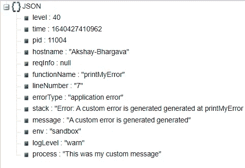

# 使用 Pino 为 Node.js 创建行业标准记录器

> 原文：<https://javascript.plainenglish.io/create-industry-standard-logger-for-node-js-using-pino-4819d6b22bc3?source=collection_archive---------1----------------------->

## 使用 Pino 为 Node.js 创建行业标准记录器的指南。

本文将介绍 Pino 库的使用。Pino 是一个行业标准的日志库，可以帮助您以更有意义的格式打印日志。这些日志可以包含与您的单个日志相关联的多个其他选项。这些信息包括但不限于:

*   HTTP 请求信息包括方法类型和查询参数
*   当前登录的用户
*   数据库错误和服务器时间戳
*   原始错误消息类型和附加信息
*   日志严重性

遵循这些步骤并实现这个库可以删除不太强大的`console.log()`(但不是无能为力的)。通过这种设置，可以更容易地调试包含更多附加信息的日志，还可以与 Prometheus 和 Grafana 一起使用，它们都是服务器监控工具。


Photo by [Fotis Fotopoulos](https://unsplash.com/@ffstop?utm_source=medium&utm_medium=referral) on [Unsplash](https://unsplash.com?utm_source=medium&utm_medium=referral)

让我们通过 Pino 提供的最简单的日志来看看它的效用。日志属于以下类型:

*   找到；查出
*   调试
*   信息
*   警告
*   错误

执行以下步骤的代码片段:

上述代码将导致:


深入研究 Pino，让我们假设我们需要一个控制台日志语句，详细信息如下:

> JSON 格式
> 
> Http 请求方法、主体、查询、参数
> 
> 当前登录的用户详细信息
> 
> 服务器时间戳和 IP 地址
> 
> 产生错误的函数名
> 
> 行号
> 
> 日志级别
> 
> 错误详细信息

为了构建该功能，我们需要通过使用 Pino 来扩展其用途并创建一个定制的记录器。创造一个”。js "文件 logger.js，内容如下:

我广泛地使用了文件中的注释，所以我将把它留给您个人使用、理解和实现。上面的注释提供了从代码角度来看你需要的所有信息。我构建的要打印的 json 并不局限于上面的实现。您可以删除您个人不需要的不必要的值。

为了使用上面的日志记录器，让我们更新我们的主文件，从这里我们可以看到实际的日志记录。


打印的日志是 JSON 格式的，可以在任何 JSON 查看器上在线查看(暂时)。在观看时，它给出以下视觉效果:



因为我没有使用全局变量，所以 req 对象是空的，它没有打印 HTTP、服务器和用户信息。这可以根据项目需要进行更新。为了美化日志，你可以使用 pino-pretty 库。但是这种方法的缺点是它停止以 JSON 格式打印日志。设置 pino-pretty 只需用以下配置初始化日志:

```
const log = pino({ transport: { target: 'pino-pretty', options: { colorize: true, }, },});
```

这是一个设置基本日志机制的示例，可以根据您的项目需求进行修改。要了解实际生产应用程序日志的外观，请参见下图:


重要的是您对 Pino 初始化对象使用的配置。当您在多个环境中运行应用程序时，比如开发/登台/生产，您还可以有一个场景，您希望在开发中使用 pino-pretty，在生产中使用 JSON 日志。这也取决于配置对象，在配置对象中可以有一个测试子句来检查节点环境，然后应用适当的过滤器。为了使这篇文章简明扼要，我就讲到这里。此外，您可以在此处找到文章代码库:

[](https://github.com/akshay271703/node-pino-logger) [## GitHub-akshay 271703/node-Pino-logger

### 此时您不能执行该操作。您已使用另一个标签页或窗口登录。您已在另一个选项卡中注销，或者…

github.com](https://github.com/akshay271703/node-pino-logger) 

其他有用的链接:

皮诺

[](https://www.npmjs.com/package/pino) [## 皮诺

### 开销非常低的 Node.js 记录器。$ npm 安装 pino 如果您想安装 pino v6，请参阅…

www.npmjs.com](https://www.npmjs.com/package/pino) 

皮诺-漂亮

[](https://www.npmjs.com/package/pino-pretty) [## 皮诺-漂亮

### 这个模块提供了一个基本的 ndjson 格式化程序。如果传入的行看起来像是来自 ndjson 的日志行…

www.npmjs.com](https://www.npmjs.com/package/pino-pretty) 

现在你知道了。感谢您的阅读。

*更多内容看* [*说白了。报名参加我们的*](http://plainenglish.io/) [*免费每周简讯*](http://newsletter.plainenglish.io/) *。在我们的* [*社区*](https://discord.gg/GtDtUAvyhW) *获得独家写作机会和建议。*