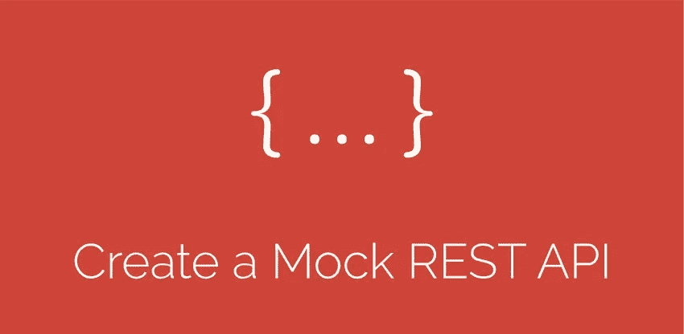
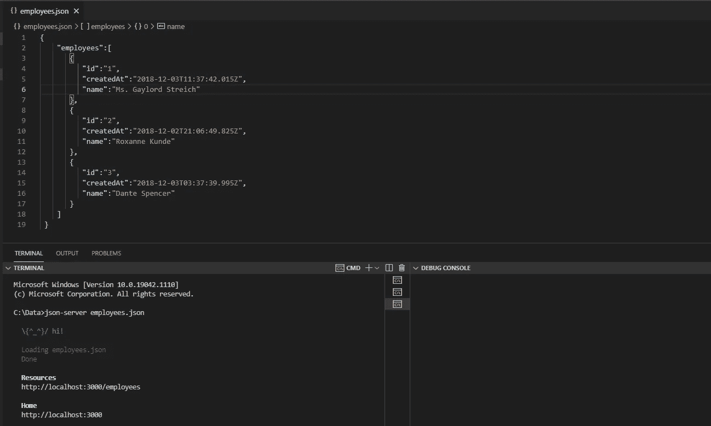
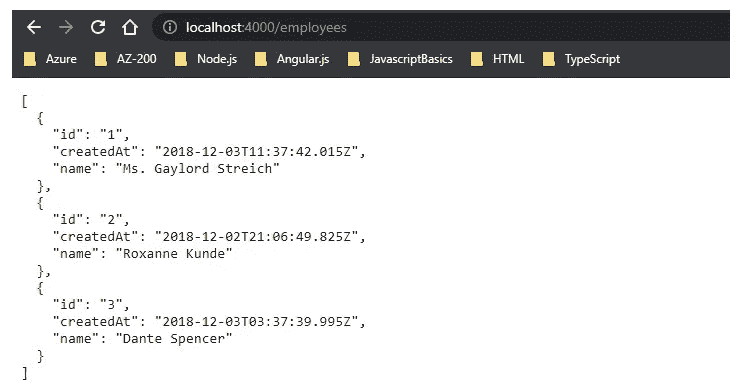
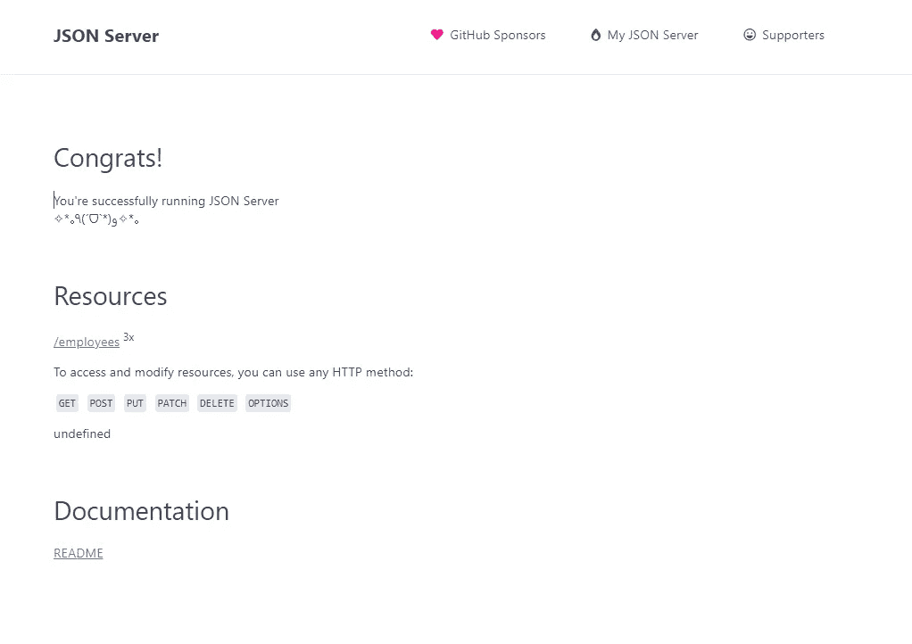

# 在几分钟内为应用程序创建 JSON 模拟 API

> 原文：<https://javascript.plainenglish.io/create-json-mock-apis-for-application-in-minutes-c177a7d4a64d?source=collection_archive---------21----------------------->

## 启动和运行模拟 API 的简单指南。

TechnoFunnel 发表了另一篇文章，这次是关于在几分钟内创建模拟 API。对于不同的开发工作，我们确实需要模拟 API。本文将讨论可以立即部署 API 的节点模块。



Creating Mock APIs for Frontend Application

# 在系统中安装“json-server”模块

我们需要安装一个新的**节点模块，名为“JSON-server”**。我们可以使用以下命令在本地系统中安装该模块:

```
**npm install -g json-server**
```

“json-server”现在安装在本地系统中，并且可以通过系统访问，因为它是使用“-g”全局安装的。如果我们不希望它安装在全局位置，我们可以简单地省略"-g "标志，并将其限制在调用该命令的位置。我们可以使用以下方法:

```
**npm install json-server**
```

# 为所需的 API 创建 JSON 文件

一旦安装了“json-server ”,就创建一个包含模拟 API 所需数据的“json-file”。假设我在为某个员工管理应用程序工作，该应用程序需要员工的详细信息。下面是我为 JSON-SERVER 创建的示例 JSON

上面的 JSON 包含一个 4 名员工的列表。我想为 Get、Put、Post、Delete 请求创建一个模拟 API。我命令建立和运行 API。在保存该文件的位置打开命令提示符，并运行以下命令:

```
**json-server employees.json**
```

其中“employees.json”是存储 json 的文件名。



Running Mock Data Server

我们还可以使用以下命令更新运行 API 的端口:

```
**json-server employees.json — port=4000**
```

现在，应用程序将在端口 4000 启动并运行



现在，我们可以在端口 4000 上运行的模拟服务器上执行所有操作



这是启动和运行模拟 API 的最简单的方法之一。我们甚至可以使用 json-server 创建更复杂的 API。

*更多内容尽在*[***plain English . io***](http://plainenglish.io/)