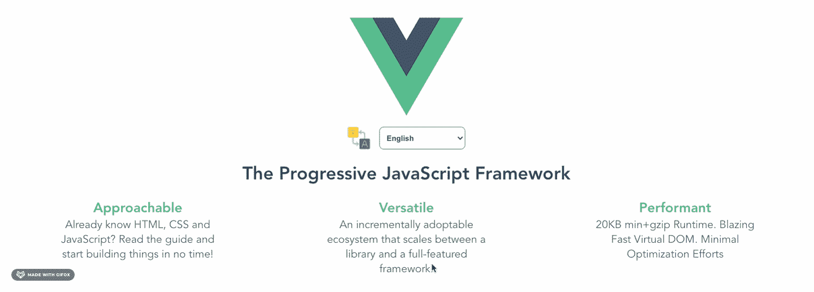

# 使用 Vue I18n 创建多语言 Vue 应用程序

> 原文：<https://javascript.plainenglish.io/create-multi-language-vue-applications-with-vue-i18n-60a0e3595193?source=collection_archive---------13----------------------->

## 在您的 Vue 应用程序中安装和使用 Vue I18n 的分步示例。


Photo by [Kyle Glenn](https://unsplash.com/@kylejglenn) on [Unsplash](https://unsplash.com/photos/nXt5HtLmlgE)

## 介绍

本文将探索为您的 [Vue 应用](https://vuejs.org/)创建多语言的最佳实践。这篇文章是基于 [Vue-I18n 官方文档](https://kazupon.github.io/vue-i18n/)，我的工作经验和互联网文档，并从中获得灵感。

对于本文的其余部分，让我们假设我们正在使用 Vue-I18n 库构建一个简单的 Vue 应用程序，它将显示 Vue 核心功能，就像官方文档中的可用语言一样，包括英语、印度尼西亚语、中文和日语。



[My Github demo example](https://github.com/hanssagita/vue-i18n-example)

## 如何初始化 Vue-I18n


Vue I18n step by step initialization

首先你需要安装 Vue-I18n 库。

对于 Npm 用户

```
npm install vue-i18n
```

对于纱线用户

```
yarn add vue-i18n
```

成功地将库安装到你的 Vue 应用程序后，我建议用这个模板在你的 src 中创建一个新文件夹，使它简单干净。可以选择上方推荐，也可以选择下方推荐。对于这个演示，我个人使用第一个文件夹模板。

```
📂 localization
  └ id.js
  └ en.js
  └ cn.js
  └ jp.js
  └ *index*.jsOR📂 localization
  └📁 lang
    └ id.js
    └ en.js
    └ cn.js
    └ jp.js
  └ *index*.js
```

这是一个语言文件的例子，它是 en.js 文件。我们只需要返回一个对象。我推荐的键名是**节位置**或**节上下文**。字段的值是您希望在 UI 中显示的语言。

```
*export default* {
  welcomeMessage: 'The Progressive JavaScript Framework',
  highlights: {
    approachable: 'Approachable'
  }
}
```

在创建了所有其他语言之后，我们需要将它们打包到一个文件中，这个文件位于我们的 index.js 文件中。

```
import VueI18n from 'vue-i18n'

Vue.use(VueI18n)// import all the language we have been define
import ID from './id'
import EN from './en'
import JP from './jp'
import CN from './cn'

export default new VueI18n({
  locale: 'EN', *// set default* languagemessages:{
    ID,
    EN,
    JP,
    CN
  } *// feed all the messages with the tall* language})
```

一些额外的提示，我们也可以在 localStorage 的帮助下更早地保存和读取用户的偏好。下面是一个例子，如何从 localStorage 中读取默认语言，并将其设置为默认语言。

```
const DEFAULT_LANGUAGE_LOCAL_STORAGE_KEY =
'defaultLanguageVuei18nExample'
const defaultLang = localStorage(DEFAULT_LANGUAGE_LOCAL_STORAGE_KEY)export default new VueI18n({
  locale: defaultLang, *......* })
```

在将它们打包成一个文件后，最后我们需要将它添加到 main.js 中，并在创建新的 Vue 时放置它。

```
import Vue from 'vue'
import App from './App.vue'
import i18n from '@/localization'new Vue({
  render: h => h(App),
  i18n
}).$mount('#app')
```

## 深潜显示 Vue 中的语言

在模板中，我们只需要把它放在双花括号中，就好像我们在访问一个 JavaScript 变量或方法一样。我们添加$t 并写入对象键。

```
<template>
  <div>
    {{ $t('welcomeMessage') }}
    {{ $t('highlights.approachable') }}
  </div>
</template>
```

从 JavaScript 来看，它有点类似于模板中的，但是我们需要在访问 **$t** 时添加它。

```
computed: {
  welcomeMessage () {
    *return this*.$t('welcomeMessage')
  },
  firstCoreFeature () {
    *return this*.$t('highlights.approachable')
  }
}
```

## 改变语言的深度潜水

```
*//* override *the $i18n.locale value**this*.$i18n.locale = selectedLanguage
```

在这个例子中，我将选择选项中的 v-model 与 Vue watch 结合在一起。它将监视 v-model 值，因此当用户更改 selectedLangunage 时，它将自动触发一些代码来更改$i18n.locale 的值。您也可以将它与 [@click](http://twitter.com/click) 和方法结合使用。

```
data () {
  *return* {
    selectedLanguage: 'EN'
  }
},
watch: {
  selectedLanguage (payload) {
    *this*.$i18n.locale = payload
  }
}
```

如果你想和方法一起使用。

```
methods: {
  changeLanguage (payload) {
    *this*.$i18n.local = payload
  }
}
```

正如我前面提到的，我们可以保存用户对他们语言的偏好，这里有一些保存到本地存储的技巧。

```
const DEFAULT_LANGUAGE_LOCAL_STORAGE_KEY =
'defaultLanguageVuei18nExample'methods: {
  changeLanguage (payload) {
    *this*.$i18n.local = payload
    localStorage.setItem(
DEFAULT_LANGUAGE_LOCAL_STORAGE_KEY, payload)
  }
}
```

## **额外提示:使用一些变量访问语言**

Vue I18n 为我们提供了一个有趣的功能，那就是你还可以在你的语言文本中添加一个变量。这里有一个在你的语言中使用变量并访问它的例子。

```
*export default* {
  welcomeMessage: 'Hello, Mr. {name}',
}
```

从 Vue 模板访问

```
<template>
  <div>
    {{ $t('welcomeMessage', { name: 'hans' }) }}
  </div>
</template>
```

从 JavaScript 访问

```
computed: {
  welcomeMessage () {
    *return this*.$t('welcomeMessage', { name: 'hans' })
  },
}
```

您还可以在 [Github Repo](https://github.com/hanssagita/vue-i18n-example) 中探索更多我的代码示例。

# 结论

从最初的网站上你可以探索更多的东西。这里有一些最佳实践和简单的提示，可以帮助你开始实现创建多语言 Vue 应用的旅程。

就这样，如果你觉得这篇文章有帮助，请在评论中告诉我们。你也可以在 Medium 和 LinkedIn 上关注我。

*更多内容尽在*[***plain English . io***](https://plainenglish.io/)