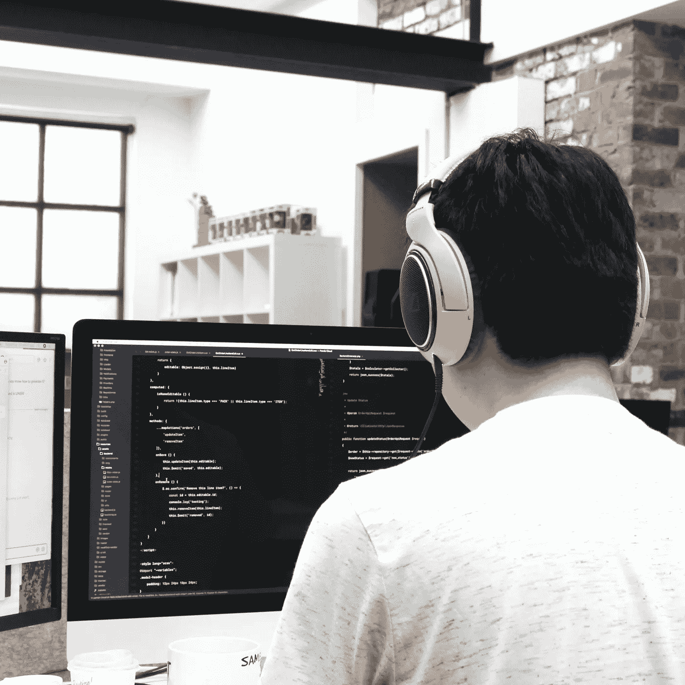

# 带有示例的 HTML 中的本机模式

> 原文：<https://javascript.plainenglish.io/create-native-modals-in-html-with-example-242b465be938?source=collection_archive---------12----------------------->

## 第 2 部分:模式和主按钮的样式。

Photo by [@trueagency](https://unsplash.com/@trueagency) on: Unsplash

在本文的第一部分，关于本机模态或 Html 中的<dialog>元素，我们已经讨论了模态的定义，它们的潜在用途，以及它们如何属于警报，而不是我们在第一时间想到的通知。</dialog>

之后，我们使用 HTML 中的对话元素构建了一个简单的模式。如果你一直跟着我到文章的最后，你会注意到我提到了这个模式(我们已经建立的模式)是多么的丑陋，需要被设计。所以在本文中，我们将尝试对我们的模式进行风格化，因此我们将做一些 CSS 的工作。

您可以通过以下链接查看本文的第一部分:

 [## 带有示例的 HTML 中的本机模式

### 第 1 部分:对话框元素简介。

javascript.plainenglish.io](/native-modals-in-html-with-example-e280a91d3d3a) 

# 设置主按钮的样式

当涉及到代码时，我们在第一部分中开始的第一件事是触发模态打开的按钮，让我们通过首先对这个按钮进行样式化来打包我们的工作，并且大部分工作将会是对模态进行样式化。

嗯，上面的这个按钮很难看，对吗？让我们从定义一些变量开始，简而言之，CSS 自定义属性，我们将使用它们来存储一些将被反复使用的样式的值，我们将全局使用这些变量，所以我们最好将它们放在根伪类下。

现在让我们使用这些变量。

我们现在还没有做任何有趣的事情，让我们改变按钮的内容，然后我们会对它应用一些有趣的东西。

进行这些更改后，我们将看到类似以下内容:

浅紫色的背景，里面有文字和表情符号的小按钮，这还不够，让我们使用一些魔法..

现在我们的按钮应该是这样的:

对于我们的风格声明，除了我们使用的单位和框阴影属性之外，一切都很清楚。我们使用`rem`单位作为字体大小，所以每次我们改变它的值时，其他有`em`单位的属性，比如填充，也会随之调整。

您在边框右侧看到的白色曲线是使用 box-shadow 属性指定的，该属性最多包含五个值:[水平偏移]，[垂直偏移]，[模糊半径]，[扩散半径]，[颜色]。在 CSS 声明中，我们只指定了水平偏移量和颜色。

方块阴影的水平偏移量将根据其值的符号而变化。如果是负的，阴影会在左边，如果是正的，它会在右边。

对于盒子的颜色，我们给了它一个白色，基于这些 CSS 声明，我们的按钮将会有一个切换行为。

为了获得这种切换行为，当我们将鼠标悬停在按钮上时，需要在按钮上添加一些最后的触摸。

上面的样式将我们的按钮移动到右边，也就是通过增加按钮的左边距，然后我们将覆盖框阴影。

# 设置对话框的样式

点击最后一个例子中的按钮将触发模态的打开，我们将得到下图中这样的结果。

我对对话框的标记做了一点修改，但是仍然很难看！！让我们再给这个等式加点魔法。

这里你唯一要注意的是:*:背景伪选择器*，它会给我们能力来为模态设计背景。

最后，我们将添加一些样式来设计对话框中的按钮。

上面的样式复制了我们在第一个按钮中使用的 CSS 声明，但是我们改变了一些值，并且去掉了 box-shadow 属性。最终的结果会是这样的:

# 浏览器支持

在撰写本文时，只有 Chrome 完全支持对话框元素，Firefox 和 Opera 等浏览器支持 flag，您可以查看下面的链接了解更多信息:

https://caniuse.com/?search=dialog

# 结论

我们还没有对我们的模态做太多，在一个真实的项目中，你将使用模态或对话框元素从使用输入表单的用户那里获得有用的信息，或者询问他关于像 cookies 这样与隐私有关的事情。

## 资源

在 Codepen 中构建模态的完整示例:【https://codepen.io/yahyajamaldine/pen/KKWwQqK 

盒子阴影属性解释:[https://css-tricks.com/almanac/properties/b/box-shadow/](https://css-tricks.com/almanac/properties/b/box-shadow/)

*更多内容请看*[***plain English . io***](http://plainenglish.io)