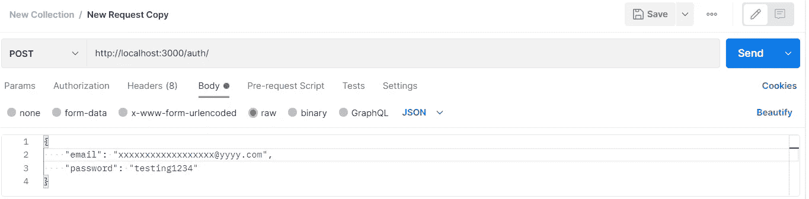

# 使用 Node.js 创建一个基于 OTP 的用户注册

> 原文：<https://javascript.plainenglish.io/create-otp-based-user-sign-up-using-node-js-cc4defc54123?source=collection_archive---------0----------------------->

Photo by [Desola Lanre-Ologun](https://unsplash.com/@desola?utm_source=medium&utm_medium=referral) on [Unsplash](https://unsplash.com?utm_source=medium&utm_medium=referral)

这篇文章是关于创建一个 OTP 风格的用户注册系统。我将路线图分成几个部分，这样您就可以直接看到您实际需要的部分。

第 1 部分:在 Express JS 中设置后端。第 2 部分:创建 OTP 服务。
第 3 部分:创建电子邮件服务。
第 4 节:数据库持久性。
第 5 部分:用路由和控制器组装服务。

# 第 1 部分:设置后端

因为您需要提交的表单数据，这是您需要做的第一步。在这一部分中，我们

> 创建基本快速应用程序。
> 创建处理端点的路线。
> 不创建控制器，因为这是一个简单的过程，不需要多个路线/控制器

## 第 1 部分:创建基本 Express 应用程序

## 第 2 节:创建 OTP 服务

我们在 npm 上有多个可用的 OTP 生成器。我为这个特定的应用程序选择了 **otp 生成器。**

我们创建了一个名为 services 的目录，存放我们的邮件服务和 OTP 服务。

在服务目录中，我创建了一个文件 otp.js，它实现了 otp 生成工具。

> 要了解更多关于图书馆的信息，你可以浏览 https://www.npmjs.com/package/otp-generator.的文献

Photo by [Brett Jordan](https://unsplash.com/@brett_jordan?utm_source=medium&utm_medium=referral) on [Unsplash](https://unsplash.com?utm_source=medium&utm_medium=referral)

## 第 3 部分:创建电子邮件服务

在这一部分，我想提一下，我们有多种选择来创建电子邮件服务。我会选择的主要选择是—

*   AWS SES
*   发送网格
*   NPM 邮件地址

> 我将使用 nodemailer npm 包来简化在这里发送电子邮件的过程。对于 Sendgrid 来说，这个过程相当长，你需要进行大量的注册。对于 AWS SES，您需要首先让您的帐户退出沙盒模式，这需要提供大量的详细信息。由于这是一篇演示设计模式的文章，为了简单起见，我不打算深入研究 sendgrid 和 aws ses。

要开始使用 nodemailer，您需要确定邮件服务。就我而言，我使用 GMAIL 服务发送邮件。另一种方法是使用带有 SMTP 信息的域电子邮件。我假设大多数人不使用域名邮件和 SMTP，GMAIL 是这里最好的演示服务。

在启动 nodemailer 之前，需要在 Gmail 帐户上配置一项设置。**要从您的 Gmail 帐户发送电子邮件，您需要启用“不太安全的应用程序”设置。**这是一个重要的设置，缺少它会导致发送邮件失败。请确保启用该功能。也除了以上一点。**安全性较低的应用程序无法与具有多因素身份验证(MFA)的帐户配合使用**。我建议你只发送带有服务账户或单独账户的电子邮件，这些账户仅用于邮寄目的。**出于安全考虑，不建议使用 Gmail 和 nodemailer 发送电子邮件，即使在 nodemailer 文档中也是如此**

启用“不太安全的应用程序”设置后。下面是需要做的事情。

您可以从 env 文件中提供您的“GMAIL 电子邮件和密码”。该文件将初始化 transporter 对象，然后可以从适当的控制器使用 **sendMail** wrapper。

## 第 4 节:数据库持久性

在这一节中，我将设置 auth 控制器，生成 OTP 和 user 并将它们关联起来。

现在我的 auth.route.js 看起来像

/ route 处理用户和 OTP 的创建。

/ verify 路由处理 OTP 的验证。

注意:为了处理逻辑，您可以使用相同的路径，但是为了简化，我使用了不同的路径。

我设计的 MongoDB 模型是:

> 编辑-我将创建的属性类型更改为日期

活动状态决定了用户是否通过验证。只要用户登录或执行某些应用程序逻辑，就可以使用最后一个活动状态。otp 存储生成的 OTP。

控制器文件是一个有趣的文件，所有的逻辑都在这里定义。

当用户注册时。我们首先检查它是否已经存在。如果存在，我们可以在这个场景中执行自定义逻辑。否则，我们用散列密码创建一个新用户。我用 bcrypt 散列密码，你可以用任何。

总结上述代码

> 当用户首次注册时

*   检查电子邮件/用户是否存在
*   如果存在，可以执行自定义逻辑并返回
*   如果没有，通过散列密码和生成 OTP 来创建一个新用户

> 验证动态口令

*   我们向控制器发送电子邮件和动态口令
*   如果电子邮件不存在，抛出一个错误
*   如果电子邮件已经存在，而动态口令不正确，则抛出一个错误
*   如果没有一个检查失败，那么将 active 更新为 true 并返回

## 第 5 部分:组装路线图

这里剩下的最后一部分是当用户尝试注册时发送邮件。我们将我们的邮件服务集成到我们的控制器中，以执行剩下的最后一步。然后我们的控制器看起来像

注意:错误处理可以在整个过程中得到极大的改善。本文只关注设计数据流的路线图的重要方面。

用邮递员发送请求

nodemailer 发送的邮件

我将为所有代码的集中化添加一个到 GitHub 库的链接。谢谢你的时间。如果您有任何问题/建议，请在评论区留言或留下您的评论。

> 编辑— Github 存储库链接

 [## GitHub-akshay 271703/Node-otp-email-auth:用于基于 OTP 和电子邮件的注册的节点应用程序

### 此时您不能执行该操作。您已使用另一个标签页或窗口登录。您已在另一个选项卡中注销，或者…

github.com](https://github.com/akshay271703/node-otp-email-auth) 

> 编辑-NestJs/Typescript/AWS SES 中的项目

 [## GitHub-akshay 271703/nest-email-OTP

### npm install #用于运行应用程序 NPM I PM2-g # development $ NPM run start:PM2 确保安装 pm2…

github.com](https://github.com/akshay271703/nest-email-otp)