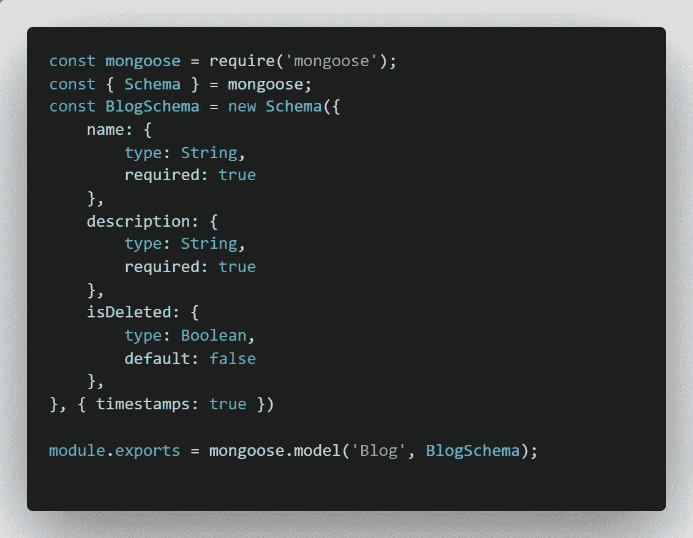
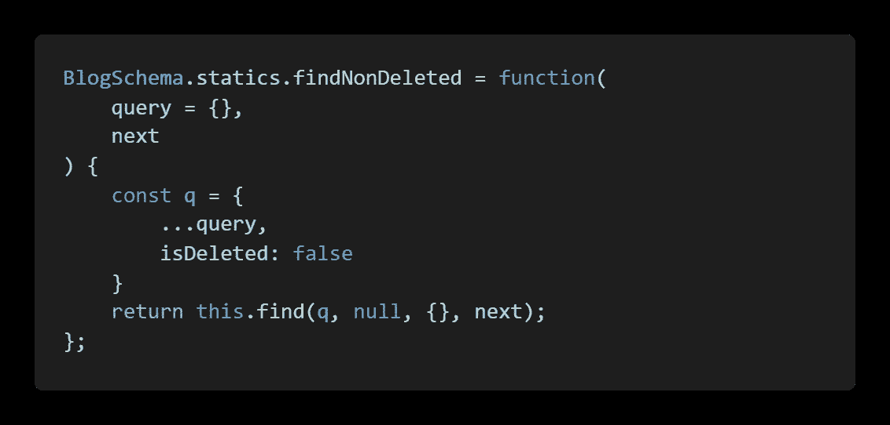
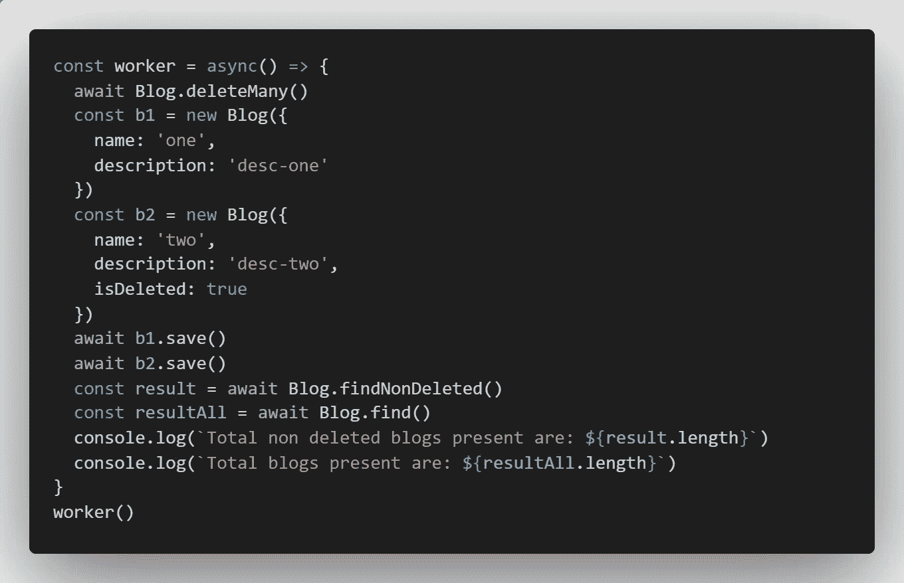
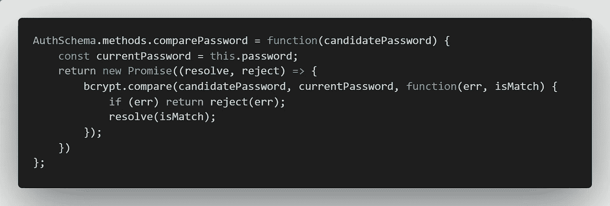
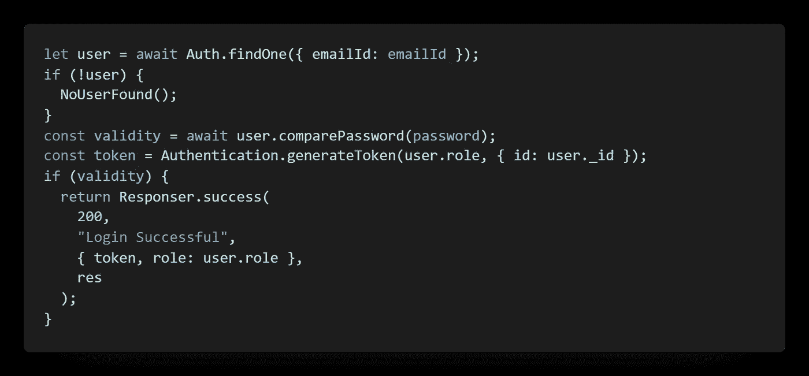
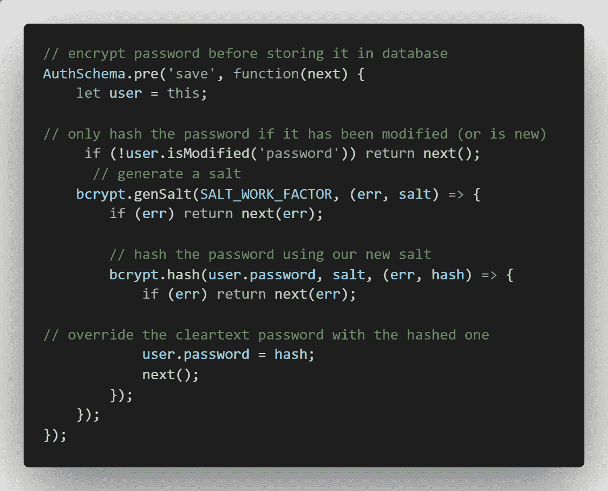

# 如何使用 Mongoose 创建一个方法

> 原文：<https://javascript.plainenglish.io/create-own-method-in-mongoose-model-5fefa7975b9d?source=collection_archive---------6----------------------->

## 使用 Mongoose 创建比较密码或获取已删除记录的方法指南。


Photo by [Clément Hélardot](https://unsplash.com/@clemhlrdt?utm_source=medium&utm_medium=referral) on [Unsplash](https://unsplash.com?utm_source=medium&utm_medium=referral)

如果您熟悉 MVC 设计模式，那么您可能从标题本身就知道这篇文章。

对于那些不知道我所指的是**的人来说，所有与数据库相关的操作都将是模型文件本身的一部分，并有助于在控制逻辑和数据库逻辑之间进行分离。**

举个例子，

*   获取记录
*   仅提取未删除的记录
*   在将密码/受保护的密钥保存到数据库之前，对其进行哈希运算
*   在其他集合中创建可靠的条目(多用于非 SQL)

现在您对这种方法的重要性有了一个基本的概念，让我们转到它的实现上来

# 履行

对于本文，我假设您已经对 Mongoose 及其方法有了基本的了解。

所以让我们开始吧。

## 模型文件

我有一个博客模型文件，它只包含几个字段。这是它的模型文件



Blog.js

现在我们有了这个简单的方法，我想创建一个只返回未删除字段的方法。为了让它工作，让我们回到模型文件，创建一个名为`findNonDeleted`的新静态方法。此方法将返回集合中的所有条目

```
// syntax
Schema.static.methodName = function (...) {
  isDeleted: false
}
```

## 添加新方法

要创建一个方法，我们需要像这样使用模式中的静态属性



the static method named findNonDeleted

> 不要使用箭头方法，因为箭头方法不会绑定您的关键字

要使用这种方法，我们可以遵循 file 命令



一个脚本，将首先删除所有的博客，然后再创建 2 个博客，其中一个被删除，看看输出是否相同。下面将分别返回 1 和 2 的输出

## 如果你不想要一个静态方法而是一个对象呢

可能会有这样的变化，你不想用类方法，但对象方法和案例可以像

*   比较密码
*   测试特定记录是否满足某些条件

或类似的

要创建对象方法，可以遵循以下语法

```
Schema.methods.methodName= function(parameters) { ... }
```

为了测试这一点，您可以在 Auth 模型中添加`comparePassword`方法，如下所示



comparePassword method to see if a password is matched without encrypting it

比较将解密密码的模型上的密码方法，并查看当前密码是否与现有密码相同

## 如何使用对象方法

要使用对象方法，您需要模型实例并将方法附加到它，如下所示



use compare password

使用和创建这些方法确实很简单，但是在某些情况下，你可能想要使用任何方法的`pre`和`post`回调，比如`save, find or findOne`

看看这些作品是如何跟随下一个标题的

## 如何在模式上使用前置和后置

下面的语法是

```
Schema.pre('save', function(next) { ... }
```

您可以像使用`pre`一样使用`post`，并且可以用任何现有的方法替换 save

以下是如何使用它的示例:



pre-event of auth schema to hash and save the password

用户的 save 方法的预事件，以生成密码的散列并将其存储在数据库中。

# 结论

有大量的用例，您可以用刚刚获得的知识来覆盖它们，并使您的项目成为镇上最好的项目之一。

> 不要使用箭头方法，因为箭头方法不会绑定您的关键字

如果你喜欢我的内容，也可以考虑订阅我的 substack 账户[这里](https://piyushdubey.substack.com/?r=omfzc&utm_campaign=pub&utm_medium=web&utm_source=)。

希望你学到了新的东西。感谢您的阅读。

*更多内容看* [***说白了. io***](http://plainenglish.io/) ***。*** *报名参加我们的* [***免费每周简讯这里***](http://newsletter.plainenglish.io/) ***。***