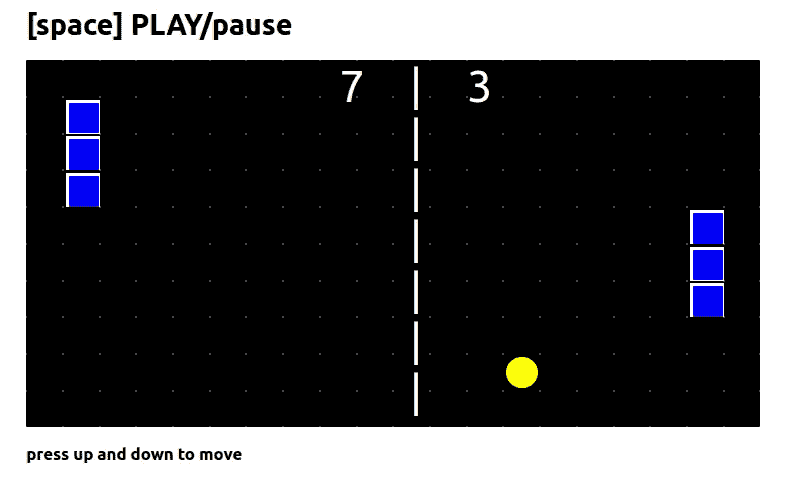
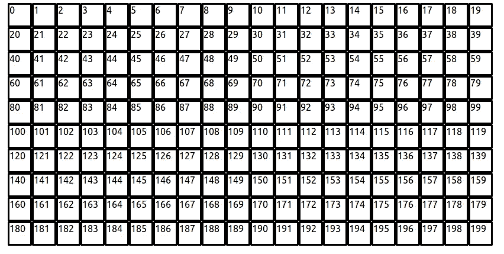
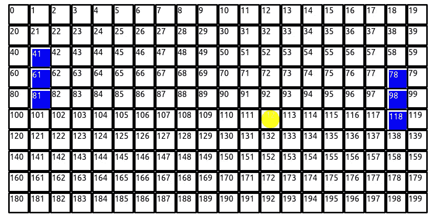
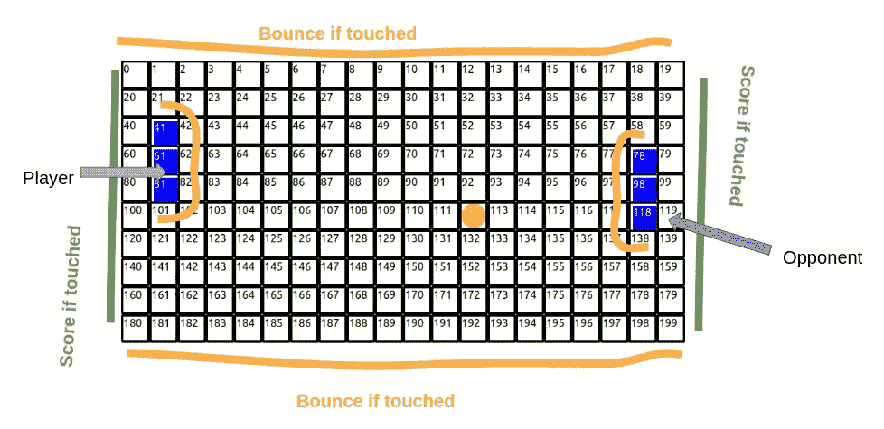
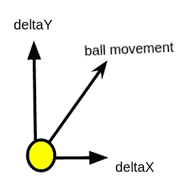
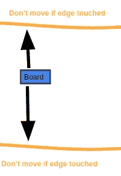

# 使用 React 创建一个乒乓球游戏

> 原文：<https://javascript.plainenglish.io/create-ping-pong-game-using-react-2d78c8e1cd9b?source=collection_archive---------0----------------------->

## 使用 React 制作乒乓球游戏的快速指南。



乒乓球是一种简单的类似网球的游戏。球在坐在棋盘对面的两名球员之间传递。对手每错过一次传球，球员就得一分。在本文中，我们将使用 react 来创建游戏。如果您在任何地方遇到困难，那么请参考此处的[获取源代码。让我们从创建 react 应用程序开始:](https://github.com/umangshrestha/ping-pong)

```
$ npx create-react-app ping-pong
```

# 模板

我们将在应用程序中使用的模板。我们将在文章中自然地定义这些函数。

# 状态

我们将为我们的状态使用以下参数。

给我们游戏的默认状态。它由两个可以由玩家控制的桨组成。每个桨的长度都是`PADDLE_BOARD_SIZE`并且远离边缘`PADDLE_EDGE_SPACE`。

```
**const** PADDLE_BOARD_SIZE = 3;
**const** PADDLE_EDGE_SPACE = 1;
```

球的状态是动态的。在每个`ballSpeed`持续时间后，`deltaX`和`deltaY`位置的变化。球的当前位置是球。

我们还有一个状态来存储玩家和对手的分数。

当游戏被重置时，我们将把球带回中心。

# 板

棋盘是一个由`ROW_SIZE`和`COL_SIZE`组成的二维数组，将被表示为一个 JSON 数组。

```
**const** ROW_SIZE = 10
**const** COL_SIZE = 20
**const** board = [...Array(ROW_SIZE * COL_SIZE)]
```



How array will be displayed

使用下面的 CSS 使 1d 数组看起来像 2d 网格。

JSON 数组中的每个元素将被表示为一个棋盘。让我们为它创建一个 JSX。

```
$ mkdir src/components
$ touch src/components/box.js
```

该框将根据数组中给定位置的值来表示背景、球员和球。

box component

这里，我们为 box 取一个参数名，它可以是`BACKGROUND`、`PADDLE`或`BALL`。

get style

因为我们将元素封装在背景中，所以不需要为`background`发送额外的样式。这里，`playerStyle`、`ballStyle`分别是代表球员和球的 CSS。

css

当我们渲染图像时，我们需要将类型分配给盒子。



inner 的 CSS 是:

# 冲突检出

球的位置决定了状态变量。请参考下图:



如果球碰到顶部和底部边缘或碰到对手或球员的棋盘，球应该会反弹。

如果球碰到左右边缘，游戏就结束了

# 拍球



ball movement

球的新状态是`current state + deltaX + deltaY`。

*   如果球接触到边缘,`deltaY`会改变。
*   如果球接触到棋盘，则`deltaX`发生变化。
*   如果球碰到左右边缘，游戏就结束了。然后我们重置棋盘，给玩家加一分。

现在让球不断改变方向。

# 移动桨



该桨将基于用户输入。桨的新状态是`current state + deltaY`。

*   如果木板碰到了边缘，不要动。
*   如果木板碰到了边缘，不要动。
*   如果球在移动中碰到了棋盘，改变球的方向。

如果位置可以改变，上面的函数返回一个数组。否则它将返回 false。因为拨片的状态取决于用户，所以我们需要一个函数来处理用户的输入。

现在将函数绑定到键输入。

现在，您可以使用以下代码运行代码:

```
$ npm start
```

# 参考

创建乒乓球游戏的教程到此结束。希望你觉得有用。有关更多相关信息，请参考以下链接。

1.  演示:[https://umangshrestha.github.io/ping-pong/](https://umangshrestha.github.io/ping-pong/)
2.  源代码:[https://github.com/umangshrestha/ping-pong](https://github.com/umangshrestha/ping-pong)

关于类似的文章，请参考:

1.  [使用 React](https://medium.com/geekculture/create-tic-tac-toe-in-react-js-and-host-it-in-github-bb0bbec4867b) 创建井字游戏
2.  [使用 React 创建贪吃蛇游戏](/create-snake-game-in-react-10d7ddbff52f?source=your_stories_page----------------------------------------)
3.  [使用 React 创建俄罗斯方块](/create-snake-game-in-react-10d7ddbff52f?source=your_stories_page----------------------------------------)
4.  [使用 React 创建乒乓球游戏](https://umangshrestha09.medium.com/create-ping-pong-game-using-react-2d78c8e1cd9b)

*更多内容看* [***说白了就是***](http://plainenglish.io/) ***。*** *报名参加我们的* [***免费每周简讯这里***](http://newsletter.plainenglish.io/) ***。***