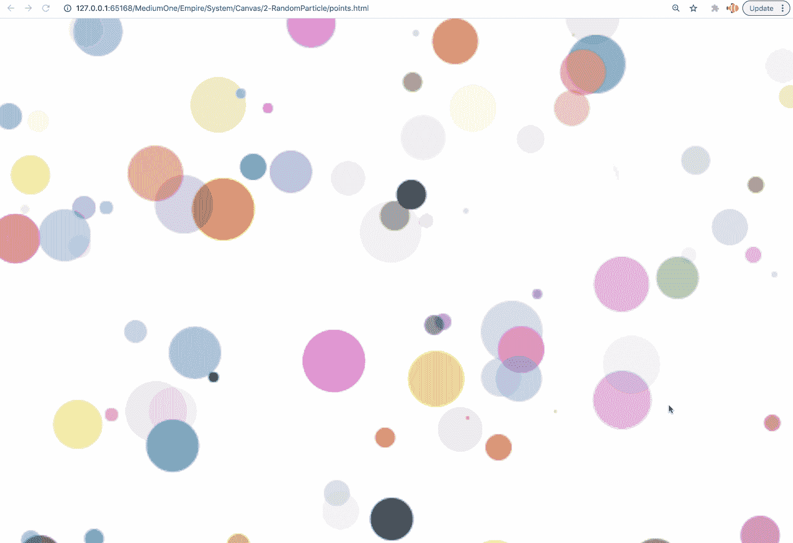
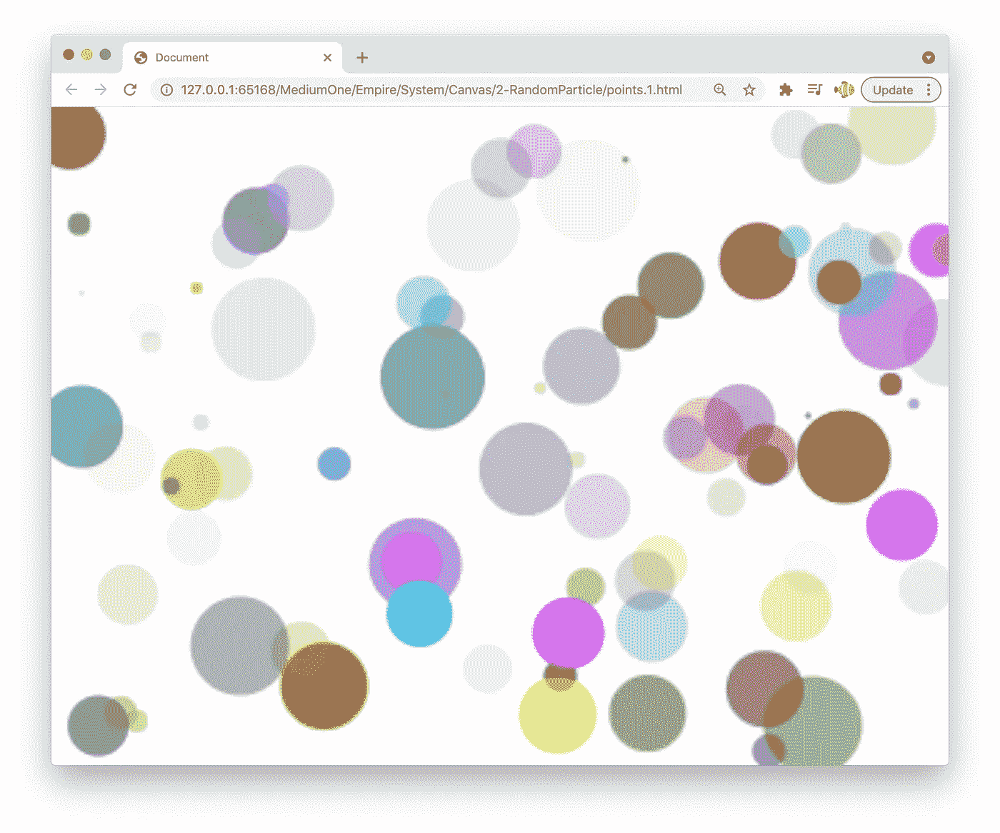
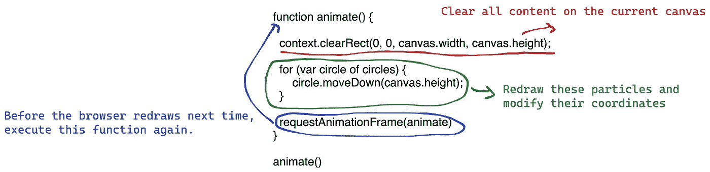

# 用画布创建随机粒子效果

> 原文：<https://javascript.plainenglish.io/create-random-particle-effects-with-canvas-bbb8a67d494?source=collection_archive---------8----------------------->

## 有趣的演示。

[在之前的文章](https://medium.com/p/97818823ae7e)中，我们做了一些静态图形。在这篇文章中，我们将学习如何制作动画。

这是最终产品:



# 动画原理

在制作动画效果之前，我们需要了解制作动画的原理。你知道动画效果是如何产生的吗？

下面是一个搞笑的视频:

这个视频生动地展示了动画是如何制作的:如果将一个个逻辑上相关的静态画面按顺序展示给观众，那么在观众的视角中，画面会有移动的感觉。

所以如果我们想制作随机粒子特效，我们只需要:

1.  在画布上随机绘制一些粒子
2.  擦除这些粒子，然后将每个粒子向上移动一个单位，然后重新绘制这些粒子
3.  不断重复第二步

这样就可以产生上图 gif 所示的效果。

# 绘制随机粒子

好了，我们开始写代码吧。

第一步，我们应该在页面上绘制一些随机粒子。

因为后面要画很多粒子，所以可以专门创建一个类来生成随机粒子。

代码显示如下:

在 RandomParticle 构造函数中，参数`x`是粒子的横坐标，参数`y`是粒子的纵坐标，`this.r`是粒子的半径，`this.color`是粒子的颜色。

因为我们在创建这个对象的时候，并不知道我们的画布有多大，所以我们的 RandonParticle 无法正确生成随机坐标，所以我们需要外部传递一个随机坐标。

粒子的半径和颜色可以在构造函数中直接随机生成。相关代码如下:

```
this.r = Math.floor(Math.random() * maxRadius)this.color = this.generateRandomRGBAColor()
```

`generateRandomRGBAColor`是一种生成随机颜色的方法，代码比较简单，你可以自己阅读。

之后还有一个 draw 方法，在画布上画自己。

好，现在让我们在画布上生成 100 个随机粒子:

这是结果:



# 制作动画

现在我们开始制作动画。让粒子运动，需要我们不断修改粒子的坐标，重新绘制。所以我们需要为 RandomParticle 类添加一个可以修改自己坐标的方法。

这里我们让粒子不断向上移动，移动到画布顶部后，回到底部继续向上移动。所以我们的方法可以写成这样:

简要解释这段代码:

*   每次调用这个方法，这个质点的 y 坐标减 1，这样这个质点就会上移
*   如果 `this.y <= (0-this.r)`的结果为真，则意味着粒子已经移动到画布的顶部，消失了。这时，我们希望粒子跳到画布的底部，然后继续向上移动。

接下来，我们将继续执行这些粒子的`moveDown`方法。可以写这样的代码:

这个函数做三件事:



`[requestAnimationFrame](https://developer.mozilla.org/en-US/docs/Web/API/window/requestAnimationFrame)`功能是浏览器自带的 API，专门用于处理动画。这个方法使用一个回调函数作为参数，这个回调函数将在浏览器重绘之前被调用。

那么我们的代码就完成了。你可以执行上面的代码来看看效果。

以下是完整的代码:

## 简单的测试

如果我们希望粒子运动得更快，应该修改哪个参数？

*更多内容尽在*[***plain English . io***](http://plainenglish.io/)