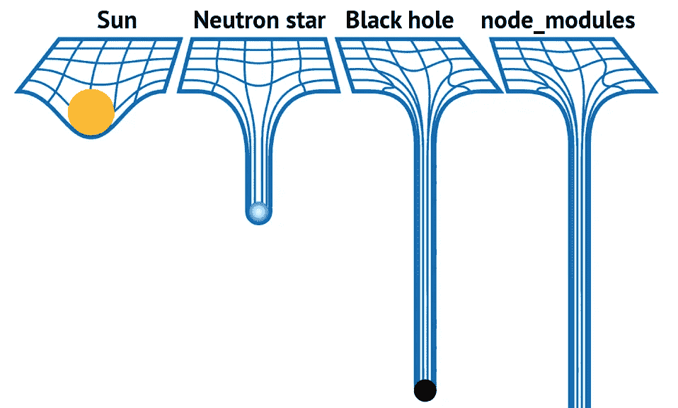

# 使用 NestJS 创建 REST API 第 4 部分——快速添加一个缩减了图像大小的 Dockerfile 文件

> 原文：<https://javascript.plainenglish.io/create-reduced-docker-images-in-your-nestjs-application-b25ab32a840d?source=collection_archive---------7----------------------->

在本文中，我们将扩展当前的 NestJS 项目，快速添加一个 Dockerfile 的实际工作示例，作为容器运行。


NestJS / Part 05

本文将主要关注一个常见的 NestJS 问题:如果不做一些处理，基本图像可能会变得非常大。我们将专注于为我们的 NestJS REST 应用程序创建一个缩小的图像大小！

如果您只对 Dockerfile 部分感兴趣，只需跳过快速介绍，继续前进。

如果你不知道我的文章系列，你可以从第**篇第**篇[这里](https://makinhs.medium.com/creating-a-rest-api-series-with-nestjs-part-01-scaffolding-and-basic-cli-usage-30ace19c5bb8)开始。

我们正在使用 NestJS 构建一个 REST API，但是在我使用 NestJS(但是使用 GraphQL)的前几周，我在几个项目中遇到了一个共同的问题:Dockerfile。如果你知道使用 docker 的基本知识，你可以去 Google 看看如何构建 docker 映像，对于大多数简单的后端搭建或类似的东西，你可以找到一些超级相似的东西:

```
FROM node:14.15.0-alpine3.10

USER 2000
RUN mkdir -p /home/node/app/node_modules && chown -R 2000:2000 /home/node/app

WORKDIR /home/node/app
COPY --chown=2000:2000 . /home/node/appRUN yarn installRUN yarn build

EXPOSE 3000

ENTRYPOINT ["node"]
CMD ["/home/node/app/dist/main.js"]
```

太棒了，效果很好。你可以做一个快速的谷歌来理解为什么我们要设置一个用户而不是使用一个根用户(你应该这样做)。

这里隐藏的问题是，如果您在一个 NestJS 项目中运行它，最终的映像(只有一个基本的 Rest API 和 Express，甚至没有 GraphQL 模块)将超过 900MB！

要自己看到这一点，拿我以前的[文章](https://makinhs.medium.com/creating-a-rest-api-with-nestjs-part-03-services-postgresql-and-typeorm-81ccc2640006)中的这个[样本](https://github.com/makinhs/nestjs-api-tutorial/tree/003)库。在你的计算机中有了代码之后，在根目录下添加一个名为 **Dockerfile** 的文件，并粘贴上面的代码。然后不要忘记**添加一个. dockerignore 文件，并在那里添加 node_modules/现在，您可以开始运行了:**

```
docker build -t nestjs-api .
```

这将创建您的构建，然后您可以使用(我使用的是 Mac)检查图像的大小:

```
docker images | grep nestjs-api
```

在我写这篇文章的时候，你会发现它的大小大约是 927MB。对于 Node.js 来说，project this**太大**。最重要的但不仅仅是:



From another [article](https://medium.com/front-end-weekly/journey-to-the-center-of-node-modules-372bff7193b6)

那怎么解决呢？第一件事是始终检查你实际使用的图像。我通常使用阿尔卑斯山图片，你可以在 [docker](https://hub.docker.com/_/node) 中找到 node alpine 官方图片。在本文中，我使用的是**节点:14.15.0-alpine3.10** ，因为版本 16 刚刚发布，一些安全模块可能无法使用它(针对您自己的场景进行测试)。但即使使用它，我们仍然有这个大小的问题。

使用前不要忘记扫描图像:

```
docker scan node:14.15.0-alpine3.10
```

只需将**节点:14 . 15 . 0-输卵管 3.10** 更改为您正在使用的图像，并保持愉快。

下一步是用[节点删除](https://github.com/tj/node-prune)来删除您的文件，不要忘记锁定您的纱线文件，并从已安装/更新的 **apk** 中删除缓存。

```
FROM node:14.15.0-alpine3.10

RUN apk update && apk add yarn curl bash make && rm -rf /var/cache/apk/*

RUN curl -sfL https://install.goreleaser.com/github.com/tj/node-prune.sh | bash -s -- -b /usr/local/bin

USER 1000
RUN mkdir -p /home/node/app/node_modules && chown -R 1000:1000 /home/node/app

WORKDIR /home/node/app

RUN yarn --frozen-lockfileCOPY . .RUN yarn installRUN yarn build

RUN npm prune --production

RUN /usr/local/bin/node-prune

EXPOSE 3000

ENTRYPOINT ["node"]
CMD ["/home/node/app/dist/main.js"]
```

使用更新的 Dockerfile 将安装一些必要的模块来添加节点。经过新的构建后，您可以看到图像大小现在减小到~411MB。

```
docker images | grep nestjs-api
nestjs-api     ... 411MB
```

进步很大，对吧？在受到这篇[好文章](https://medium.com/trendyol-tech/how-we-reduce-node-docker-image-size-in-3-steps-ff2762b51d5a)的启发后，让我们把它分成两张图片，一张用来构建我们需要的东西，另一张用来复制实际需要的东西。

```
FROM node:14.16.1-alpine3.10 AS *BUILD_IMAGE* RUN apk update && apk add yarn curl bash make && rm -rf /var/cache/apk/*

RUN curl -sfL https://install.goreleaser.com/github.com/tj/node-prune.sh | bash -s -- -b /usr/local/bin

WORKDIR /usr/src/app

# install dependencies
RUN yarn --frozen-lockfile

COPY . .RUN yarn installRUN yarn build

RUN npm prune --production

RUN /usr/local/bin/node-prune

FROM node:14.16.1-alpine3.10

USER 1000
RUN mkdir -p /home/node/app/
RUN mkdir -p /home/node/app/node_modules
RUN mkdir -p /home/node/app/dist

RUN chown -R 1000:1000 /home/node/app
RUN chown -R 1000:1000 /home/node/app/node_modules
RUN chown -R 1000:1000 /home/node/app/dist

WORKDIR /home/node/app

COPY --from=*BUILD_IMAGE* /usr/src/app/dist /home/node/app/dist
COPY --from=*BUILD_IMAGE* /usr/src/app/node_modules /home/node/app/node_modules

EXPOSE 3000
ENTRYPOINT ["node"]
CMD ["/home/node/app/dist/main.js"]
```

运行此更新的 docker 后，您可以再次检查图像大小，您会发现这令人难以置信:

```
docker images | grep nestjs-api
nestjs-api       ... 162MB
```

162MB 相对于~900MB。那是一个超级缩小的图像！

我们现在可以使用最新的 node 16 alpine:

```
FROM node:16-alpine3.11 AS *BUILD_IMAGE* RUN apk update && apk add yarn curl bash make && rm -rf /var/cache/apk/*

RUN curl -sfL https://install.goreleaser.com/github.com/tj/node-prune.sh | bash -s -- -b /usr/local/bin

WORKDIR /usr/src/app

# install dependencies
RUN yarn --frozen-lockfile

COPY . .

RUN yarn install
RUN yarn build

RUN npm prune --production

RUN /usr/local/bin/node-prune

FROM node:16-alpine3.11

USER 1000
RUN mkdir -p /home/node/app/
RUN mkdir -p /home/node/app/node_modules
RUN mkdir -p /home/node/app/dist

RUN chown -R 1000:1000 /home/node/app
RUN chown -R 1000:1000 /home/node/app/node_modules
RUN chown -R 1000:1000 /home/node/app/dist

WORKDIR /home/node/app

COPY --from=*BUILD_IMAGE* /usr/src/app/dist /home/node/app/dist
COPY --from=*BUILD_IMAGE* /usr/src/app/node_modules /home/node/app/node_modules

EXPOSE 3000
ENTRYPOINT ["node"]
CMD ["/home/node/app/dist/main.js"]
```

最终结果将为~156MB。

另外一件要记住的事情是使用 [docker build kit](https://brianchristner.io/what-is-docker-buildkit/) 来提高性能。要使用它，只需运行以下命令:

```
time DOCKER_BUILDKIT=1 docker build -t nestjs-api .
```

在本文中，我分享了一些关于如何减少 NestJS 映像构建的技巧。这可能不是最终的解决方案，但它确实会在构建后减小您的图像大小。最后几点想法:

*   每个项目都有其特定的需求。确保满足您的所有需求，而不仅仅是将文件复制并粘贴到其他任何地方。
*   务必使用 **docker 扫描扫描您的图像。**
*   不要忘记查看 node-alpine 版本中的更新，或者您可能喜欢使用的另一个常用图像。
*   如果你在你的 NestJS 项目中使用 GraphQL，图像大小将会增加到 100MB 左右，这是由于它自身的要求(虽然应该不是问题)。
*   您可以在这里找到一个工作的源样本[..](https://github.com/makinhs/nestjs-api-tutorial/tree/003-docker)
*   特别感谢[**Soner kmen**](https://medium.com/@scokmen)**他的文章极大地鼓舞了我。**

***更多内容参见* [*简明英语. io*](http://plainenglish.io/)**