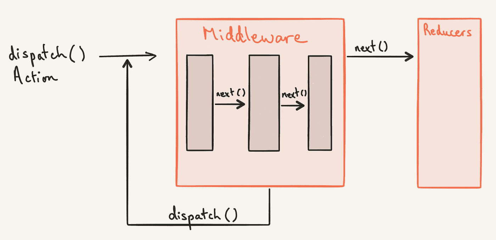

# 在 React 中为 useReducer 创建类似 Redux 的中间件

> 原文：<https://javascript.plainenglish.io/create-redux-like-middleware-for-usereducer-in-react-786a0a28545c?source=collection_archive---------6----------------------->



如果你以前用过 Redux，你会知道中间件的概念。既然 useReducer 已经成为一个常用的 react 钩子，我们可能也想为 useReducer 钩子复制中间件的思想。

如果您不了解中间件，中间件是在 reducer 发生状态转换之前或之后运行的函数。它使我们能够选择日志记录、崩溃报告、异步 API 请求等功能。

在本帖中，我们将为 useReducer react hook 创建一个中间件。如果你想了解更多关于钩子和减速器的信息，请参考我们之前关于 [useReducer React 钩子](https://www.wisdomgeek.com/development/web-development/react/understanding-the-usereducer-hook-in-react/)的帖子。

# 为用户创建中间件的可能方法

我们可以用两种方式之一来实现中间件功能:

1.写一个类似 redux 的 applyMiddleware 函数。这个函数将第一个参数作为缩减器，我们将中间件作为数组传递给第二个参数。
这看起来像这样:

```
const useMyReducer = applyMiddleware(useReducer, [logging, thunks, ...]);
```

你可以在本期 GitHub[T4 中读到更多关于这种方法的内容。最终实现可以在](https://github.com/streamich/react-use/issues/164)[这里](https://github.com/streamich/react-use/blob/master/src/createReducer.ts)找到。

2.我们可以创建一个[自定义的 react 钩子](https://www.wisdomgeek.com/development/web-development/react/how-to-write-your-own-custom-react-hooks/)，它在内部实现 useReducer，并为我们提供作为参数传入中间件的功能。

我们将在这篇博文中讨论第二种方法。第一种方法也是可以接受的。但是我的观点是，如果我们从钩子的角度来考虑，我们应该在钩子方面向前迈进，而不是抓住重复模式不放。

# 面向用户的单一中间件用户

让我们首先定义我们将要构建的这个自定义 react 挂钩的外观。我们将从单个中间件开始。稍后，我们将通过使我们的实现通用化来逐步实现多个中间件。

我们的 useReducer 中间件将接受一个 Reducer 作为参数，以及初始状态。它还将中间件作为另一个参数。因此，我们的钩子将具有如下形式:

```
const useReducerWithMiddleware = (reducer,
  initialState,
  middleware,
) => {
  const [state, dispatch] = useReducer(reducer, initialState);
  // TODO: middleware logic 
  return [state, dispatch];
};
```

对于中间件函数的调用，在 useReducer 声明之后在钩子内部调用它是不够的。我们希望每次调用 dispatch 时都调用中间件函数。所以我们需要返回一个修改过的函数，而不是直接返回 dispatch。

我们可以用高阶函数来解决这个问题。我们将通过围绕它创建一个高阶函数来增强调度函数。然后我们将从钩子返回高阶函数。

```
const useReducerWithMiddleware = (reducer,
  initialState,
  middleware,
) => {
  const [state, dispatch] = useReducer(reducer, initialState);
  **const dispatchUsingMiddleware = (action) => {
    middleware(action);
    dispatch(action);
  }**
  return [state, dispatchUsingMiddleware];
};
```

因为我们从我们的定制钩子返回扩展的分派函数，所以我们确保每当调用者为 useReducer 钩子调用我们的定制中间件时，中间件都会被调用。

我们甚至可以将状态等其他信息添加到中间件调用中。

```
const useReducerWithMiddleware = (reducer,
  initialState,
  middleware,
) => {
  const [state, dispatch] = useReducer(reducer, initialState);
  const dispatchUsingMiddleware = (action) => {
   ** middleware(action, state);**
    dispatch(action);
  }
  return [state, dispatchUsingMiddleware];
};
```

# 用户的多个中间件

让我们扩展一下我们之前为 useReducer 实现的中间件，以接受多个中间件功能作为一个数组。

因为所有的中间件功能都应该在调用 dispatch 之前被调用，所以我们将遍历它们。然后，我们会呼叫调度。

```
const useReducerWithMiddleware = (reducer,
  initialState,
  middlewares,
) => {
  const [state, dispatch] = useReducer(reducer, initialState);
  const dispatchUsingMiddleware = (action) => {
    **middlewares.map((middleware) => middleware(action, state));**
    dispatch(action);
  }
  return [state, dispatchUsingMiddleware];
};
```

如果我们在做一些异步中间件，我们必须修改这个逻辑来使用 async/await。但是我们将这部分排除在这篇文章的讨论范围之外。

但是，如果我们希望中间件在状态转换之后执行，也就是在调度调用之后执行，该怎么办呢？

# 状态改变后的中间件

如果您认为我们会为中间件创建另一个输入数组以便在分派后执行，那么您绝对是正确的！

但是，如果您考虑在调度调用后立即调用这些函数，比如:

```
const useReducerWithMiddleware = (reducer,
  initialState,
  middlewares,
  afterDispatchMiddleWares
) => {
  const [state, dispatch] = useReducer(reducer, initialState);
  const dispatchUsingMiddleware = (action) => {
    middlewares.map((middleware) => middleware(action, state));
    dispatch(action);
    afterDispatchMiddleWares.map((middleware) => middleware(action, state));
  }
  return [state, dispatchUsingMiddleware];
};
```

不幸的是，这是行不通的。

你能想出原因吗？

这是因为调度异步更新状态。

可以做些什么来代替呢？

我们可以等待状态更新，然后用回调函数来处理这个问题。我们可以使用 [useEffect 钩子](https://www.wisdomgeek.com/development/web-development/react/react-hooks-and-local-storage-lets-build-a-todo-app/)来实现这一点。

```
const useReducerWithMiddleware = (reducer,
  initialState,
  middlewares,
  afterDispatchMiddleWares
) => {
  const [state, dispatch] = useReducer(reducer, initialState);
 ** useEffect(() => {
    afterDispatchMiddleWares.map((middleware) => middleware(action, state));
  }, [afterDispatchMiddleWares]);** const dispatchUsingMiddleware = (action) => {
    middlewares.map((middleware) => middleware(action, state));
    dispatch(action);
  }
  return [state, dispatchUsingMiddleware];
};
```

但是我们再也不能访问 useEffect 中的动作了。因此，我们需要通过使用 useRef 钩子来使用 ref 实例变量。在调用 dispatch 之前，我们将把动作的值写入 ref 变量。然后它的值将在效果中对我们可用。

```
const useReducerWithMiddleware = (reducer,
  initialState,
  middlewares,
  afterDispatchMiddleWares
) => {
  const [state, dispatch] = useReducer(reducer, initialState);
  **const currentRef = React.useRef();**
  **useEffect(() => {
    if (!currentRef.current) return;
    afterDispatchMiddleWares.map((middleware) => middleware(currentRef.current, state));
  }, [afterDispatchMiddleWares, state]);** const dispatchUsingMiddleware = (action) => {
    middlewares.map((middleware) => middleware(action, state));
    currentRef.current = action;
    dispatch(action);
  }
  return [state, dispatchUsingMiddleware];
};
```

# 结论

这就完成了我们使用 useReducer 应用中间件的实现。我们现在可以在 React 钩子发生状态转换之前和之后运行中间件。如果你有任何疑问，请在评论中告诉我们。

*原载于 2021 年 1 月 14 日*[*【https://www.wisdomgeek.com】*](https://www.wisdomgeek.com/development/web-development/react/use-redux-like-middleware-for-usereducer-in-react/)*。*