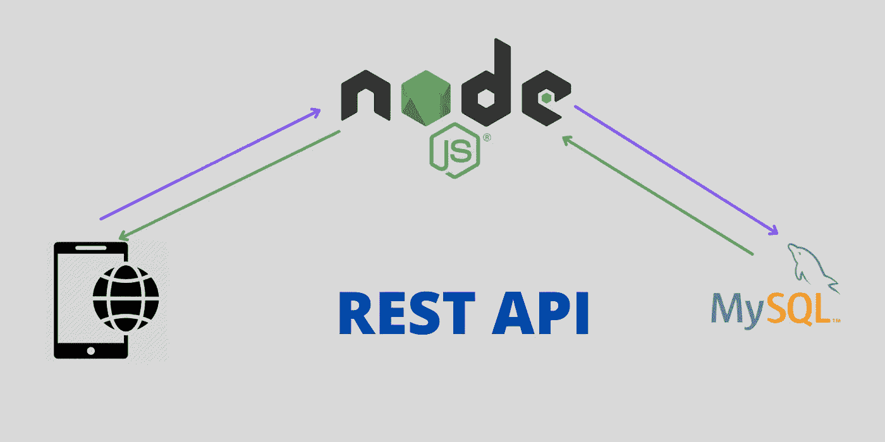
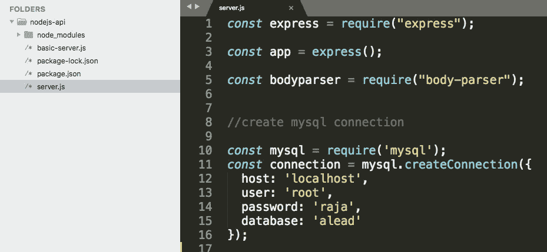

# 使用 Node.js 和 MySQL 从头开始创建 REST API

> 原文：<https://javascript.plainenglish.io/create-rest-api-using-nodejs-and-mysql-from-scratch-d1844601e21?source=collection_archive---------3----------------------->

## 从头开始使用 MySQL 的 CRUD 示例



NodeJS REST API

在本教程中，我们将看到如何使用 **Node.js** 和 **MySQL** 创建一个 REST-API。NodeJS 旨在构建可伸缩的网络应用程序。有许多语言可以用来创建 REST-API。NodeJS 在 **JavaScript** 开发者中非常受欢迎。网上有很多关于**为什么是 Node.js 的讨论？**。我不想谈这个。但是我选择 NodeJS 用于**实时**数据获取。Node.js 非常适合 Socket IO。因此，首先，我们将了解如何创建 API，然后我们将在另一个教程中学习如何获取实时数据。

Node.js 是一个 JavaScript 运行时环境。Node.js 在聊天相关的应用程序和实时数据获取活动中表现良好。所以如果想做实时数据抓取，学习 Node.js rest api 是非常有用的。您可以轻松地将它与任何其他编程(PHP、Java、Python 等)集成在一起。).我用 **Angular、PHP 和 MySQL** 开发了一个 web 应用。为了显示实时数据，我使用了 **Node.js Socket IO** 。这减轻了我的工作。为什么因为 PHP 没有那么多对 Socket IO 的支持(仅是我的观点)。

# **联系人列表应用**

本教程的目标是用 **Node.js** 和 **MySQL** 制作一个简单的 REST-API。对于这个例子，我计划为联系人列表应用程序(移动电话联系人列表)创建一个 REST-API。在**联系人列表应用**中，我们将存储联系人的三个信息，例如。

1.  名字
2.  手机号码
3.  电子邮件

如果你想把它保存在 MySQL 中，你可以添加任意多的字段/列。我们将在联系人列表应用程序中执行以下操作。

1.  如何保存联系方式？。
2.  如何更新联系方式？。
3.  怎么删除联系方式？。
4.  如何获取所有联系人？。
5.  如何获取个人联系方式？。
6.  如何搜索联系人列表？。

**安装需要的软件:**

使用下面的链接下载并安装 Node.js。

```
[https://nodejs.org/en/download/](https://nodejs.org/en/download/)
```

使用下面的链接下载并安装 MySQL 服务器。

```
[https://dev.mysql.com/downloads/mysql/](https://dev.mysql.com/downloads/mysql/)
```

**设置项目文件夹:**

现在为 REST API 创建一个文件夹。我们将只在文件夹中存储所有代码。我正在创建一个名为 **contact-api** 的**文件夹**。

然后在 contact-api 文件夹中创建一个 **package.json** 文件来存储所有的依赖项。要创建 package.json 文件，请在终端上使用 contact-api 文件夹中的命令。

```
npm init
```

**安装 Express.js:**

接下来，安装 **Express.js** ，作为 Node.js 的 web 框架。

```
npm install express --save
```

在命令提示符(Windows)或终端(Mac 和 Linux)的 contact-api 文件夹中执行上述命令。Express.js 用于**创建路线**。我们将使用 ExpressJS 创建 GET 和 POST 方法。

**项目结构:**



注意:这里我使用 nodejs-api 作为文件夹名。你可以用任何名字

**创建一个基本的 API:**

在 contact-api 文件夹下创建一个名为 **server.js** 的文件。并将下面的代码粘贴到文件中。

**第 1 行:**导入 Express JS 库。

**第 3 行:**使用 Express JS 创建应用程序。

**第 6 行**:定义运行应用程序的端口。

**第 8 行:**从 app 调用 **get()** 函数，创建路线。这里我使用了被定义为根页面的**“/”**。 **(req，res)** 用于处理请求和响应。

**第 10 行**:函数 **res.json()** 用于返回 json 格式的数据。

**第 15 行**:调用 **listen()** 函数，通过端口运行应用。

现在保存文件并使用下面的命令执行它。

```
node server.js
or
npm start
```

这将在端口 3000 上运行服务器。所以你可以使用下面的网址访问它。

```
[http://localhost:3000/](http://localhost:3000/)
```

**获取方法示例:**

我们总是用两种不同的方法将数据传递给服务器。它们是 GET 和 POST 方法。

GET 方法的示例:

发送数据的重要方面是在服务器上捕捉数据。每个开发人员只需要这个。如何捕捉数据？。我们可以使用来自请求的**查询**对象来获取请求数据。

```
const q=req.query;
```

使用捕获参数

```
q.name // Assume name is passed in the URL
```

从 **URL** 中捕获**名称**参数的示例。

测试 URL。

```
[http://localhost:3000/get-data1?name=raja](http://localhost:3000/get-data1?name=raja)
```

**发布方法示例:**

大多数时候，我们总是只使用 POST 方法将数据发送到服务器。要捕捉 POST 数据，您可以使用请求中的**主体**对象。

```
const q=req.body
```

使用下面的代码捕获 POST 数据。

```
q.name // Assume name is passed in the URL
```

捕捉 POST 方法中的 name 参数的示例。

你不能在浏览器上测试文章的网址。您可以使用**邮递员**工具来检查 POST 方法。

**安装节点守护程序:**

Nodemon 是一个实用程序，它将监视源代码中的任何变化，并自动重启服务器。非常适合开发。每当我们改变 server.js 文件中的代码时，我们需要**重启服务器**。Nodemon 通过自动重启来缓解这个问题。使用 npm 安装它。

```
npm install --save-dev nodemon
```

并在 package.json 文件中包含`*nodemon server*`进行如下配置。

```
{
  "name": "nodejs-api",
  "version": "1.0.0",
  "description": "",
  "main": "index.js",
  "scripts": {
    "test": "echo \"Error: no test specified\" && exit 1",
    "start": "nodemon server"
  }
```

然后使用下面的命令启动服务器。

```
npm start
```

如果您在 server.js 文件中做了任何更改，那么它将自动重新加载这些更改。无需反复重启服务器。这种方法仅推荐用于开发。不是为了生产。

**在 MySQL 中创建表格:**

现在我们学习了如何创建一个 REST-API。我们的目标是创建联系人列表应用程序。因此，使用下面的 SQL 查询在 MySQL 中创建一个表。

**安装 MySQL 客户端包:**

我们需要为 NodeJS 安装 MySQL 驱动程序/客户端包，以便与 MySQL 服务器通信。

```
npm install mysql --save
```

**创建 MySQL 连接:**

在 server.js 文件中添加以下代码。

**第 2 行**:导入 MySQL 库。
**第 3 行**:用 MySQL 的用户名、密码、数据库名创建到 MySQL 的连接。

在创建列表页面时，我们总是做以下六项工作。他们是。

1.  插入数据
2.  更新数据
3.  删除数据
4.  获取所有数据
5.  获取个人数据
6.  搜索数据

它适用于大多数概念/模块。比如说，

1.  产品列表
2.  账单列表
3.  订单
4.  员工列表
5.  等等。

所以我们总是做六个活动。所以让我们一个一个来看。

**插入查询示例:**

**query()** 函数用于传递 SQL 查询和数据。

将以下代码复制粘贴到 server.js 文件中。

**第 3 行**:捕捉 get 请求参数。

**第 4 行:**创建插入查询。这个查询不同于标准的 MySQL insert 查询。其他查询与 MySQL 查询相同。这里我们没有使用**值()。**相反，我们使用**设定？。**问号(？)用于传递列名和值。参考**第 6 行**，我们在这里传递列名和值。

第 5 行:我们不能将 MySQL 函数作为字符串传递。对于使用其他语言的开发人员来说，这有点困难。为什么，因为在其他语言驱动中，我们可以将完整的 SQL 查询作为字符串传递。为了传递 MySQL 函数，我们必须使用 **raw()** 函数。

**第 7 行:**传递 SQL 查询和 **query()** 函数中的值。

**第 10 行:**从结果变量中，我们可以得到受影响的行数和插入的行 id。并将值作为 JSON 返回。

**更新查询示例:**

将下面的代码复制粘贴到 server.js 文件中，用于更新查询。

这里，我们根据姓名更新手机号码。但是总是使用 id 值更新这些值。出于示例目的，我使用了名称。

**删除查询示例:**

将以下代码复制粘贴到用于删除查询的 server.js 文件中。

这里我们使用名称删除数据。同样，总是使用 id 值删除这些值。为什么因为名字会重复几次。

**获取个人数据示例:**

将下面的代码复制粘贴到 server.js 文件中，从数据库中获取单个记录。

在这里，我使用联系人姓名获取记录。

**获取所有数据示例:**

将下面的代码复制粘贴到 server.js 文件中，从数据库中获取所有记录。

在这里，我从表格中提取所有数据。然而，在实时应用中，总是在第一次请求时使用 **limit** 关键字获取少量数据，并为另一次请求获取剩余数据。为什么，因为如果你拉所有的记录，浏览器不能处理所有的记录，如果没有记录是高的。

**搜索查询示例:**

每个人都需要搜索。我们总是在寻找。为什么因为不想一直看到所有的数据。我们总是搜索并选择联系人来打电话或发短信等。

这里我使用 raw()函数来传递 MySQL like 查询。无论用户键入什么，该搜索都将在“姓名”和“手机”列中查找匹配项。

**从 Github 获取完整代码**

```
[https://github.com/bharathirajatut/angular-examples/tree/master/nodejs-rest-api](https://github.com/bharathirajatut/angular-examples/tree/master/nodejs-rest-api)
```

## **总结**

在本教程中，您学习了如何使用 NodeJS 和 MySQL 创建 REST API。创建 REST API 非常简单。NodeJS 学习起来非常简单。不需要争论为什么我们需要学习 NodeJS？。趋势总是会变的。今天你可以学习一种语言。第二年，你可能会被分配到其他语言。

为了在 IT 行业生存，你必须学习新技术。我在复杂的项目中使用了多种语言。我们总是使用能减轻我们工作负担的语言。在一个项目中融合多种技术将创造出创新的产品。要获取实时数据，NodeJS 是首选(纯粹是我的选择)。

感谢阅读本教程。希望你喜欢这个。