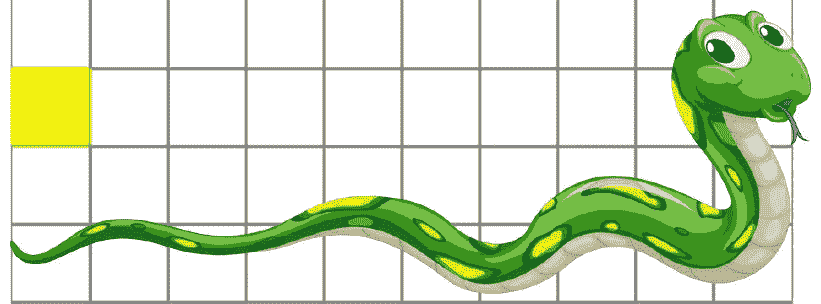

# 在 React 中创建一个贪吃蛇游戏

> 原文：<https://javascript.plainenglish.io/create-snake-game-in-react-10d7ddbff52f?source=collection_archive---------0----------------------->

使用 React 库创建您自己的经典贪吃蛇游戏。



source: [https://stock.adobe.com/search?k=snake+cartoon](https://stock.adobe.com/search?k=snake+cartoon)

贪吃蛇游戏很经典。我有在诺基亚手机的小液晶屏幕上播放它的美好回忆。很久以前就一直想做一个贪吃蛇游戏。我一直推迟它，因为我认为它会很复杂。幸运的是，我错了。我能做出一个普通的贪吃蛇游戏。

让我们从创建一个 React 应用程序开始:

```
$ npx create-react-app snake-game
```

React 类中贪吃蛇游戏的基本结构如下所示:

structure of the code

随着需求的出现，我们还将实现其他的助手功能。这里，`initialState`存储状态相关变量。

initial values

我们将在自然遇到这些变量时讨论它们。现在，我们将为演示添加 CSS。我的 CSS 技能几乎不存在。我将无法使我们的项目 UI/UX 友好。我们为蛇棋盘、棋盘中的每个元素、蛇和食物使用了不同的 CSS。

# 板

initialState 中的`**rows**`是代表棋盘的二维数组。它的尺寸是`HEIGHT X WIDTH`。

creating empty rows.

网格中的每个元素都用 x 和 y 分量表示。我们已经将数组中所有元素的默认值设置为 grid-item。board 元素中的值表示演示中使用的 CSS 类。

rendering the board

我们的蛇和食物从一个随机的位置开始。

get random position

# **蛇**

`**snake**` 是表示蛇的一维数组。从我们的角度来看，这条蛇可以向左、向右、向上或向下走。

mapping keyword to variables

我们已经将键盘上的箭头键映射到 React API 中的键码。我们还为暂停/取消暂停游戏的空格键添加了键码。

从蛇的参照物来看，它可以向前、向左或向右移动。没有向后运动。

changing direction of snake based on keyboard input

该功能甚至需要连接到`onKeydown`。

component on mount

[componentidmount](https://reactjs.org/docs/react-component.html#componentdidmount)适用于定义订阅。当 HTML 树中的所有组件都被挂载时，它被调用。更多信息请参考这里:[https://projects . wojtekmaj . pl/react-life cycle-methods-diagram/](https://projects.wojtekmaj.pl/react-lifecycle-methods-diagram/)。精明的人应该已经注意到了`moveSnake`函数，所以让我们来定义它。

defining movement of snake

蛇是一个队列。数据从名为 head 的数组末尾输入。并且该元件从前面被推出。无论蛇向哪个方向移动，它都会不断地移动。当它到达棋盘的边缘时，蛇将回到初始位置。抱歉，地球扁平者。每当蛇移动的时候，棋盘就必须更新以显示蛇和食物的位置。

如果蛇头碰到蛇身，游戏就结束了。请注意，由于网格的结构，如果蛇的大小至少为 4，它只能触摸自己。

check if collapsed

一旦身体被碰到，游戏就结束了。然后我们显示分数并重置游戏。

# 食物

`**food**` 是棋盘上的一个特殊位置，如果被头部碰到，蛇就会变大。头部接触食物的过程将被称为`eating`。一旦食物被`eaten`，它就会在棋盘上的任意位置弹出。

每吃一次食物，蛇的`**speed**`就增加一次。它根据下面的代码增加。

increase speed

上面的代码确保蛇移动到另一个网格所用的时间总是低于 10 毫秒。该代码相当于:

```
if (speed > 10) {
    speed -= 10
} 
```

每次更新蛇板的时候，我们都需要检查蛇是吃了食物还是游戏结束了。

[componentDidUpdate](https://reactjs.org/docs/react-component.html#componentdidupdate) 是一个特殊的函数，每次更新时都会被调用。这是 React 生命周期的一部分。更多信息请参考[这里的](https://projects.wojtekmaj.pl/react-lifecycle-methods-diagram/)。

# 最终代码

现在，最终的代码如下所示:

你可以让`**$ npm start**`运行游戏并开始游戏。

我希望这篇文章对你有用。如有任何疑问，请留言。如果你有兴趣创建更多的小游戏来锻炼你的 React 技能，我有一篇关于在 React-js 中创建井字游戏的小文章，并把它放在 GitHub 上。

# 参考

1.  演示[这里](https://umangshrestha.github.io/snake-game/)
2.  源代码[此处](https://github.com/umangshrestha/snake-game)

*更多内容请看*[***plain English . io***](http://plainenglish.io/)