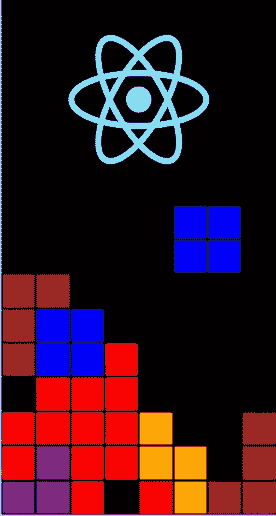
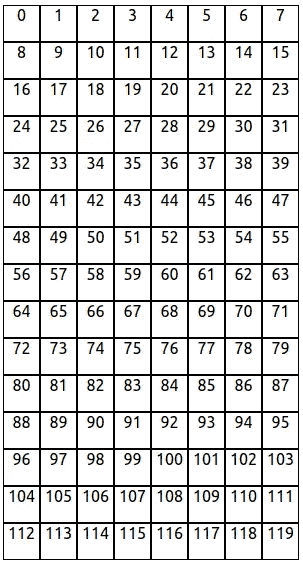
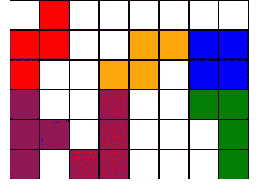
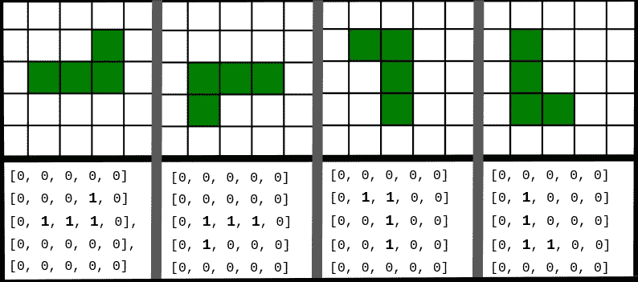

# 使用 React 创建俄罗斯方块

> 原文：<https://javascript.plainenglish.io/create-tetris-using-react-8d3fc28329d3?source=collection_archive---------2----------------------->

## 使用 React 创建简单的俄罗斯方块游戏

说到复古游戏，俄罗斯方块被认为是经典。对于一款 1984 年推出的游戏来说，它仍然能够独挡一面。它的销量已经超过 1.5 亿份，成为有史以来最畅销的游戏之一。在本文中，我们将尝试制作自己的俄罗斯方块游戏，以帮助我们理解和欣赏内在机制。作为参考，可以参考 GitHub [这里](https://github.com/umangshrestha/tetris)。



Tetris using React

# 装置

我们将从使用 npx 创建包开始。

```
$ npx create-react-app tetris
$ cd tetris
$ npm start
```

# 创建电路板



grid matching corresponding position in board array

我们的板子会是一维数组，数组大小等于`*ROW_SIZE*` 和`*COL_SIZE*`。该数组将用默认值-1 初始化，此后称为`DEFAULT_VALUE`。

使用二维数组会使代码简单很多。但我最终选择了一维数组。

棋盘上的每个数值将由一个正方形表示。这是我们游戏中不连续的单元。方块的颜色将由棋盘上相应位置的值来表示。

棋盘上的数值会改变相应方块的颜色。我将它映射如下:

value to color mapping

我们将在下一节回到形状。

## 一.广场

让我们从创建一个组件文件夹开始。

```
$ mkdir src/components
```

我们的正方形将是一个简单的正方形 div，它接受一个整数参数`color`，基于这个参数我们从`COLOR_MAP`中选择颜色。

square.jsx

现在，我们必须组合成一个正方形。

## 二。板

正如我们所说的，我们将用`DEFAULT_VALUE`初始化一个大小为`ROW_SIZE * COL_SIZE`的 1D 数组。

creating empty board

现在让我们编辑`**app.js**`文件，这样我们可以看到我们到目前为止做了什么。

app.js

为了给它一个网格形状，我使用了样式:

style for board

# 创建形状



Tetrominos

我们之前已经用颜色绘制了形状。现在我们需要标出位置。我们将对该形状及其所有可能的旋转进行硬编码。

俄罗斯方块有多个几何形状，称为[俄罗斯方块](https://en.wikipedia.org/wiki/Tetromino)，从顶部向下排列。这是一个 4 平方的正交方块。为了简单起见，从现在开始我将称它们为形状或块。



visualizing grid as array

类似地，可以对所有其他形状进行上述过程。我们可以用一个 4*4 的矩阵来表示任何形状。在上图中，我保留了 5* 5 作为填充。在我的代码中，我最初打算只保留 4*4，但后来决定不添加任何超出我需要的东西。因此，我选择了紧凑但低效的数组，如下所示。

shape representation

现在我们需要一种方法来塑造形体。由此，我将使用以下指针:

```
**shapePos** : pointers to show which type of shape we are using
**rotatePos**:pointer to represent which rotation of shape we are using
**xPos**     : position of current shape in x direction (top left)
**yPos**     : postion of current shape in y direction (top left)
```

根据以上参数，我们可以得到当前形状的准确位置，如下所示:

get shape

我们将在游戏中随机选择形状。为了实现它，我们将使用数学库中的 random 返回我们`shapePos`。

getting random shape

根据用户输入，我们需要旋转形状。我们可以实现另一个简单的函数来返回我们`randomPos`。

rotating the shape

# 状态

我们已经讨论了一些状态，如`board`、`shapePos`、`xPos`等。现在我们将正式列出我们将使用的所有形状。注意，我们可以根据需要添加更多的状态变量。我使它成为最低限度，并将只使用下面的状态。

当形状下降时，我们希望它从最上面的角落一次下降一个街区。由于形状的最大尺寸可以是 3，我们将保持`yPos`的初始值为-3。我们将从列的中间开始块，这就是为什么`xPos`是行大小的一半。

# 按键绑定

我们将使用键盘与游戏互动。我们需要做的几件事是左右移动积木。顺时针和逆时针旋转该块。我们还可以添加命令来更快地放下方块或暂停游戏。这是留给用户的一个练习。

key binding

现在我们将讨论与键绑定相关的函数

**一、更新板**

我们只为当前形状更新纸板。在我们更新之前，我们需要通过检查值是否不等于`DEFAULT_VALUE`来确保值是形状的一部分。

update

当我们想要清除形状时，我们可以使用`this.updateBoard({shapePos: DEFAULT_VALUE})`。

**二。向左或向右移动块**

在我们转变之前，我们需要验证以下几点:

```
1\. Verify the shape is not going out of the edge. 
2\. Verify the shape is not going to overlap another shape.
```

只有当我们确保没有冲突时，我们才能移动区块。

shift left

**三。旋转形状**

用同样的逻辑，我们也可以实现旋转。

rotating

现在我们需要走下街区。砖块会下降，直到接触到边界。之后，我们需要检查游戏是否结束，并开始下一个区块。

decending block

我们已经将下降持续时间硬编码为 500。我们可以实现另一种状态，随着阻塞的继续减少持续时间。这是留给读者的一个练习。现在我们将实现与降序相关的函数。

## 动词 （verb 的缩写）放下形状

降档时，我们需要检查:

```
* Verify the shape is not touching the edge,
* Verify the shape is not touching a block below.
* Verify game is not over
```

shift down

如果游戏结束了，我们将重置游戏。如果游戏没有结束，我们将检查填充的行并删除它们。然后上面的块被向下拖动。最后，我们将创建一个新块

# 额外的

*   *当我们给* `*componentDidMount*` *添加降档功能时，当您使用* `*keyCode*` *和* `*setInterval*` *更新来改变状态时，将会有一个竞态条件，要移除它，您可能需要使用* `*mutex*` *。在我的代码中，我使用了*`[*await-mutex*](https://www.npmjs.com/package/await-mutex)`[](https://www.npmjs.com/package/await-mutex)**作为同步的依赖项。要安装它:**
*   **bug#1:触摸右边缘时形状不旋转。如果边缘情况被删除，块重叠另一个形状。**
*   *谈到 CSS，我一点技巧都没有。所以，如果你对我糟糕的设计选择感到厌恶，请原谅我。*

# *参考*

1.  *[源代码](https://github.com/umangshrestha/tetris)*
2.  *[演示](https://umangshrestha.github.io/tetris/)*
3.  *[在 React 中创建贪吃蛇游戏](/create-snake-game-in-react-10d7ddbff52f)*
4.  *[在反应中创建井字游戏](https://medium.com/geekculture/create-tic-tac-toe-in-react-js-and-host-it-in-github-bb0bbec4867b)*

**更多内容请看*[***plain English . io***](http://plainenglish.io/)*